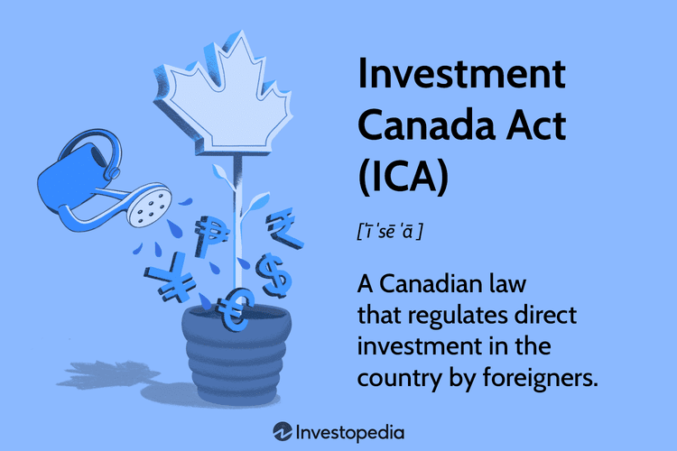

Canada has been recognized as a significant hub for foreign investment due to its robust and vibrant economy, which serves as a magnet for international investors. A key regulatory framework governing these foreign investments is the Investment Canada Act (ICA). Enacted to oversee and ensure that foreign investments benefit the Canadian economy, the ICA plays a pivotal role in maintaining economic stability and fostering growth. It outlines the necessary procedures for foreign entities looking to invest significantly within the country, ensuring these investments align with national interests and security.

Simultaneously, Canada is witnessing an increase in the application of algorithmic trading, often known as algo trading, which brings a technological paradigm shift to investment strategies. Algo trading leverages complex algorithms and powerful computing to automate and optimize investment decisions, providing enhanced speed, precision, and efficiency. This technological advancement is becoming increasingly relevant in the Canadian investment landscape, offering a new dimension to domestic and foreign investment practices.

This article provides an in-depth analysis of foreign investment in Canada, highlighting the regulatory framework under the ICA and examining the growing impact of algorithmic trading. By exploring these areas, readers will gain insights into how international investments are controlled within Canada and the ways in which algorithmic trading is being integrated into these practices. Understanding these components is crucial for navigating Canada's investment environment effectively, revealing how traditional regulatory measures and innovative technological approaches coexist and shape the future of investments in the country.

## Table of Contents

## Understanding the Investment Canada Act (ICA)

The Investment Canada Act (ICA) was established in 1985 to guide and regulate foreign investments in Canada, ensuring that such investments contribute positively to the national economy. At its core, the ICA necessitates that foreign investors submit a formal notification or application when making significant investments in Canadian businesses. This requirement is vital for maintaining transparency and control over foreign influence in critical sectors of the economy.

Key features of the ICA include a structured review process that evaluates potential investments based on their economic implications. The Act has undergone several updates, reflecting Canada's commitment to fostering an open environment for foreign direct investment (FDI). These updates are designed to boost economic growth and create job opportunities, demonstrating Canada's proactive approach to engaging with international investors while safeguarding its economic interests.

A notable provision within the ICA pertains to national security reviews. Given the evolving global landscape and the increasing complexity of geopolitical tensions, the ICA includes mechanisms to assess foreign investments for potential risks to national security. This provision is crucial for protecting sensitive industries, such as telecommunications, energy, and defense, from foreign acquisition or influence that could compromise national safety and sovereignty.

By balancing openness with prudence, the ICA plays a pivotal role in shaping a secure and vibrant economic future for Canada. It ensures that foreign investments align with national interests while capitalizing on the benefits of globalization and international trade.

## Investment Thresholds and Regulations

Foreign direct investments (FDI) in Canada are regulated under the Investment Canada Act (ICA), and these investments are subject to specific thresholds that determine the nature of the review process. The thresholds serve as benchmarks to assess whether a particular foreign investment in Canada merits a detailed governmental review.

### Value Thresholds

The principal method to evaluate investments under the ICA is through the assessment of "enterprise value" and "asset value." These values are crucial metrics that define the significance of the investment:

- **Enterprise Value**: This is typically calculated using the formula:

$$
\text{Enterprise Value} = \text{Market Capitalization} + \text{Debt} - \text{Cash and Cash Equivalents}
$$

This value gives an indication of the total value of a business, including cash and equivalents and shareholder equity minus debt. It serves as an effective measure for larger and publicly traded companies.

- **Asset Value**: This is simply the total book value of the assets possessed by the Canadian business in question. This measure is more frequently applied to smaller and privately held businesses where enterprise value is less applicable.

### Sector-Specific and Origin-Based Thresholds

The ICA applies different thresholds depending on the origin of the investor and the sector in which the target business operates. Particularly in cultural industries, which are viewed as sensitive due to their impact on Canadian cultural identity and heritage, the thresholds are lower and more stringent.

1. **Investor Origin**: There are differing threshold requirements depending on whether the investor is from a nation with a trade agreement with Canada (like the United States, Mexico, the European Union, CPTPP members) or from a country without such agreements. Investors from trade-agreement countries generally face higher thresholds for scrutiny.

2. **Cultural Industries**: Investments in cultural industries (such as film, music, and publishing) are subject to more rigorous examination given that these sectors are closely monitored to preserve Canadian cultural priorities. Lower thresholds ensure that even smaller investments receive appropriate attention.

### Recent Changes

The ICA has evolved to accommodate changing global investment patterns, and a significant recent change is the option for foreign investors to voluntarily notify the Canadian government about investments that might involve non-controlling minority stakes. This allows the government to assess any potential risks these investments might pose, especially with regard to national security concerns, without imposing mandatory review processes that might deter investment.

By understanding these thresholds and regulations, potential foreign investors can better gauge the level of scrutiny their investments might face and prepare accordingly to align with Canadian economic and security priorities.

## Criticism and Challenges of the ICA

The Investment Canada Act (ICA) has been instrumental in guiding foreign investments towards benefiting the Canadian economy. However, it is not without its criticisms and challenges. A primary concern is that while the ICA is designed to encourage investments, its regulatory mandates can sometimes appear vague or overly complex. Such ambiguity can create uncertainty among potential investors who might be discouraged by the lack of clear guidelines. This regulatory uncertainty can deter some businesses from pursuing investment opportunities in Canada, impacting the country's economic potential.

Another significant challenge faced under the ICA involves national security considerations. The act includes provisions for national security reviews that seek to protect sensitive industries and infrastructure. While these measures are essential for safeguarding national interests, they can complicate the investment process. The uncertainty and unpredictability of national security reviews may lead to significant delays, and in some cases, cause outright rejections of proposed foreign investments. This aspect of the ICA has been criticized for potentially acting as a barrier to much-needed foreign capital, especially in sectors deemed strategically important.

Moreover, critics point out that as global investment landscapes evolve rapidly, the ICA needs to adapt promptly to maintain its appeal to international investors. If the regulations are perceived as outdated or inflexible, Canada risks falling behind in attracting foreign direct investments compared to other countries with more streamlined processes. Balancing the short-term security concerns with the long-term economic growth objectives remains a delicate task for policymakers. Addressing these criticisms involves ensuring that the ICA's provisions are clear, consistent, and responsive to both the economic and security needs of Canada, thereby creating an environment that fosters confidence among foreign investors.

## The Role of Algo Trading in Canadian Investments

Algorithmic trading, commonly referred to as algo trading, leverages sophisticated computer algorithms to execute trading decisions at speeds and efficiencies that surpass human capabilities. This technology-driven approach to trading has seen significant uptake in Canada, fundamentally transforming both domestic and foreign investment strategies.

One of the primary drivers behind the increasing popularity of algo trading in Canada is the rapid advancement of financial technology (fintech) and computing. These advancements have enabled the development of complex algorithms capable of analyzing large datasets, executing trades on various financial instruments, and adapting to market conditions in real time. For instance, algorithms can be designed to follow trends, such as [momentum](/wiki/momentum) trading strategies, or to exploit [arbitrage](/wiki/arbitrage) opportunities. The adaptability and precision of these algorithms make them highly attractive to investors looking to maximize their returns in a competitive market.

The integration of algo trading within the Canadian investment landscape is further propelled by the country's robust technological infrastructure and supportive regulatory environment. Canadian financial markets, including the Toronto Stock Exchange (TSX), provide a conducive platform for high-frequency trading. The infrastructure supports rapid data processing and transaction execution, essential components for effective [algorithmic trading](/wiki/algorithmic-trading).

Despite its many advantages, algo trading presents regulatory challenges that necessitate careful oversight. One primary concern is the potential for market manipulation. Algorithms, if not properly monitored, can inadvertently facilitate practices such as spoofing or layering, where deceptive orders are placed with no intention of execution to mislead the market. Such activities can undermine market integrity and erode investor confidence. Consequently, Canadian regulators, such as the Investment Industry Regulatory Organization of Canada (IIROC) and the Ontario Securities Commission (OSC), have established stringent guidelines and surveillance tools to monitor algorithmic trading activities and mitigate the risks associated with market manipulation.

Additionally, the sheer speed and [volume](/wiki/volume-trading-strategy) of transactions enabled by algo trading can exacerbate market [volatility](/wiki/volatility-trading-strategies). For example, automated trades triggered by specific market signals can lead to abrupt price swings, known as flash crashes. Regulators and market participants are increasingly focused on developing circuit breakers and other mechanisms to stabilize markets during such events.

Overall, while algorithmic trading in Canada offers significant opportunities for enhancing investment strategies through speed, efficiency, and precision, it also demands robust regulatory frameworks to ensure ethical practices and maintain market stability. Investors and market participants must remain vigilant and adapt to evolving technological and regulatory landscapes to harness the full potential of algo trading.

## Conclusion

Canada continues to attract foreign investors due to its regulated yet welcoming investment environment. A key [factor](/wiki/factor-investing) for investors is grasping the intricacies of the Investment Canada Act (ICA), which provides a framework to protect the Canadian economy while encouraging foreign capital. By comprehensively understanding the ICA, investors can navigate the regulatory landscape, ensuring compliance and maximizing investment opportunities.

Additionally, the rising trend of algorithmic trading is transforming investment practices in Canada. This method leverages sophisticated algorithms to enhance investment decision-making, improving speed and accuracy. The growing popularity of algo trading reflects the dynamic evolution of financial markets driven by technological advancement. Investors who incorporate algorithmic trading can gain competitive advantages in executing trades efficiently.

In conclusion, staying informed about regulatory requirements under the ICA and adapting to technological improvements in trading can empower investors, enabling them to effectively engage with the Canadian investment market. This strategic awareness helps investors leverage opportunities within Canada's robust and evolving economic landscape.

## References & Further Reading

[1]: Globerman, S. (2008). ["An Evaluation of the Investment Canada Act and Its Effect on Foreign Investment."](https://www.researchgate.net/profile/Steven-Globerman/publication/238573197_An_Evaluation_of_the_Investment_Canada_Act_and_its_Operations/links/548f6cad0cf2d1800d8626ca/An-Evaluation-of-the-Investment-Canada-Act-and-its-Operations.pdf) Fraser Institute.

[2]: Barrios, S., Görg, H., & Strobl, E. (2005). ["Foreign Direct Investment, Competition and Industrial Development in the Host Country."](https://papers.ssrn.com/sol3/papers.cfm?abstract_id=688964) European Economic Review, 49(7), 1761-1784.

[3]: Toronto Stock Exchange (TSX), ["Understanding High-Frequency Trading."](https://www.stikeman.com/en-ca/kh/canadian-securities-law/high-frequency-trading-in-canadian-capital-markets)

[4]: Lopez de Prado, M. (2018). ["Advances in Financial Machine Learning."](https://www.amazon.com/Advances-Financial-Machine-Learning-Marcos/dp/1119482089) John Wiley & Sons.

[5]: Investment Industry Regulatory Organization of Canada (IIROC). ["Algorithmic Trading: Compliance Guide."](https://en.wikipedia.org/wiki/Investment_Industry_Regulatory_Organization_of_Canada)

[6]: Ontario Securities Commission (OSC). ["High-frequency Trading (HFT) and Algorithmic Trading."](https://www.osc.ca/en/securities-law/instruments-rules-policies/4/48-501/notice-amendments-amendments-ontario-securities-commission-rule-48-501-trading-during)