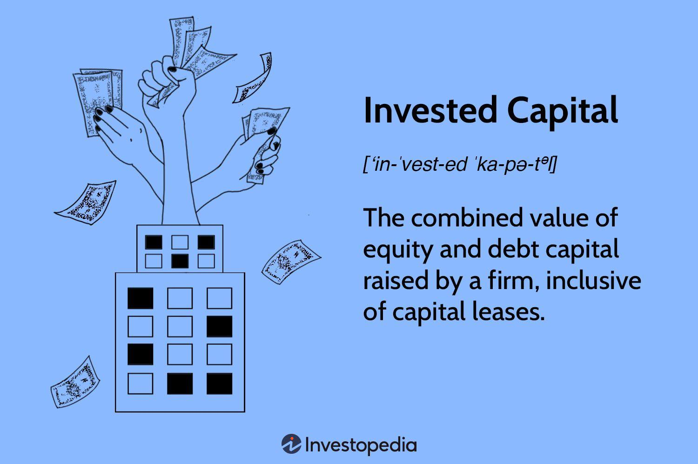

## Table of Contents

## What is investment capital?

Investment capital is the money that people or businesses use to start or grow a business. It can come from different places, like savings, loans, or investors who believe in the business idea. When someone uses their own money to start a business, it's called personal investment capital. If they borrow money from a bank or get it from other people, it's called external investment capital.

Using investment capital is important because it helps businesses buy things they need, like equipment or buildings, and pay for things like salaries and advertising. Without investment capital, it would be hard for new businesses to get started or for existing businesses to grow. The goal is to use this money wisely so that the business can make more money in the future and hopefully pay back the investors or lenders.

## What are the different types of investment capital?

There are several types of investment capital that businesses can use. One type is equity capital, which comes from selling part of the business to investors. These investors become part owners and share in the profits and losses. Another type is debt capital, which is money borrowed from banks or other lenders. The business has to pay back this money with interest over time. A third type is retained earnings, which is the money a business makes that it keeps and uses to grow instead of giving it to the owners or shareholders.

Another kind of investment capital is venture capital, which is money given to new businesses that have a lot of potential but also a lot of risk. Venture capitalists invest in these businesses hoping they will grow quickly and make a lot of money. There's also angel investment, which is similar to venture capital but usually involves individual investors who help start-ups in the early stages. Lastly, crowdfunding is a newer way to raise investment capital where many people give small amounts of money to support a business or project, often through online platforms.

## How does investment capital differ from other types of capital?

Investment capital is money used to start or grow a business. It's different from working capital, which is the money a business uses every day to pay for things like salaries and supplies. Investment capital is often used for big projects or to buy things that will help the business grow over time, like new equipment or a new building. It can come from the business owners themselves, from investors, or from loans.

Other types of capital include human capital, which is the skills and knowledge of the people working in the business, and social capital, which is the relationships and networks that help the business succeed. Unlike investment capital, human and social capital are not about money but about the people and connections that make the business work. Investment capital is focused on funding growth and development, while these other types of capital are more about the resources and support that keep the business running smoothly.

## What are the common sources of investment capital?

Investment capital can come from many places. One common source is personal savings. This is when the business owner uses their own money to start or grow their business. Another source is friends and family. They might believe in the business idea and give money to help it grow. Banks are also a big source of investment capital. They give loans that the business has to pay back with interest. 

Another place to get investment capital is from investors. These can be angel investors, who are usually rich people that give money to new businesses they think will do well. Venture capitalists are another type of investor. They give money to businesses that they think will grow quickly and make a lot of money. Crowdfunding is a newer way to get investment capital. This is when a lot of people give small amounts of money to support a business or project, usually through the internet.

Sometimes, businesses can also use their own profits to grow. This is called retained earnings. Instead of giving the money to the owners or shareholders, the business keeps it and uses it to buy new things or start new projects. Each source of investment capital has its own benefits and risks, so business owners need to think carefully about which one is best for their needs.

## How can someone start accumulating investment capital?

To start accumulating investment capital, someone can begin by saving their own money. This means setting aside a portion of their income regularly, whether from a job or other sources, into a savings account or investment account. They can also look for ways to increase their income, like taking on a part-time job or starting a small side business. Another way is to cut down on expenses, so more money can be saved. Being smart with money and living within one's means can help build up savings over time.

Another way to accumulate investment capital is by seeking help from others. This can include asking friends and family for financial support if they believe in the business idea. People can also look into crowdfunding platforms, where many small contributions from different people can add up to a significant amount. For those willing to share ownership, finding angel investors or venture capitalists who are interested in the business can provide a large boost of capital. Each method has its own set of considerations, but the key is to start small, be consistent, and gradually build up the capital needed to start or grow a business.

## What are the risks associated with using investment capital?

Using investment capital can be risky. One big risk is that the business might not make enough money to pay back the investors or the bank. If the business fails, the owner could lose their own money and also owe money to others. This can be stressful and might even lead to bankruptcy. Another risk is that the business might grow too fast with the new money and not be able to manage it well. This can cause problems like running out of cash or not being able to keep up with demand.

There are also risks when working with investors. If the business takes money from investors, they might want a say in how the business is run. This can lead to disagreements and conflicts. Sometimes, investors might want to change the direction of the business, which might not be what the owner wants. Also, if the business uses crowdfunding, there's a risk that it might not meet the expectations of all the people who gave money. This can hurt the business's reputation and make it hard to get more investment in the future.

## How does investment capital impact business growth?

Investment capital is really important for business growth. It gives businesses the money they need to buy new things, like machines or buildings, and to pay for things like advertising or hiring more workers. When a business gets investment capital, it can grow faster because it has the money to do more things. For example, a small bakery might use investment capital to buy a bigger oven so it can make more bread and sell it to more people. This can help the bakery make more money and grow bigger.

But, using investment capital also has risks. If the business doesn't use the money well, it might not make enough money to pay back the investors or the bank. This can cause big problems, like the business going bankrupt. Also, if the business grows too fast with the new money, it might not be able to handle everything well. This can lead to running out of money or not being able to keep up with customers. So, while investment capital can help a business grow, it's important to use it wisely and plan carefully.

## What are the tax implications of using investment capital?

When a business uses investment capital, it can affect how much tax they have to pay. If the business gets money from investors by selling part of the business, this is called equity capital. The money the business gets from selling part of the business is not usually taxed right away. But, when the business makes money and gives some of it to the investors, those profits might be taxed. Also, if the investors sell their part of the business later and make a profit, they might have to pay capital gains tax on that profit.

If the business borrows money from a bank or other lender, this is called debt capital. The business has to pay back this money with interest. The interest the business pays on the loan can sometimes be taken off the business's taxes, which means they might pay less tax. But, the business still has to make enough money to pay back the loan and the interest. If the business uses its own profits to grow, this is called retained earnings. Using retained earnings doesn't usually change the business's taxes right away, but it can affect how much tax the business pays in the future because it's using money that could have been given to the owners or shareholders.

## How can investment capital be used to diversify a portfolio?

Investment capital can be used to diversify a portfolio by putting money into different types of investments. When someone has money to invest, they can choose to spread it out across different things, like stocks, bonds, real estate, or even starting a new business. This helps lower the risk because if one type of investment doesn't do well, the others might still be okay. For example, if someone puts all their money into one company's stock and that company does badly, they could lose a lot. But if they spread their money across many different investments, they're less likely to lose everything.

Diversifying with investment capital also means looking at different industries and countries. Instead of just investing in tech companies in the United States, someone could use their investment capital to buy stocks in healthcare companies in Europe or real estate in Asia. This way, they're not relying on just one part of the world or one type of business to do well. By using investment capital to diversify, people can build a stronger, more balanced portfolio that can handle ups and downs in the market better.

## What strategies can maximize the returns on investment capital?

To maximize the returns on investment capital, it's important to do your homework. This means researching different investment options and understanding how they work. For example, if you're thinking about investing in a business, you should look at the business plan, the market it's in, and the people running it. You can also talk to experts or other investors to get their advice. Another good strategy is to spread your money across different types of investments. This is called diversification. By putting your money in different places, like stocks, bonds, and real estate, you lower the risk of losing everything if one investment doesn't do well.

Another strategy to maximize returns is to keep an eye on your investments and be ready to make changes. This means checking how your investments are doing and selling or buying new ones if needed. It's also a good idea to reinvest any profits you make back into your investments. This can help your money grow faster over time. Lastly, patience is key. Good investments often take time to pay off, so it's important not to get too excited or worried about short-term changes. By staying calm and sticking to your plan, you can increase your chances of getting the best returns on your investment capital.

## How do economic conditions affect the availability and cost of investment capital?

Economic conditions can really change how easy it is to get investment capital and how much it costs. When the economy is doing well, people feel more confident about the future. Banks are more likely to give loans because they think businesses will be able to pay them back. Investors also feel good about putting their money into new businesses because they think those businesses will grow and make money. This means there's more investment capital available, and it might be cheaper to get because everyone is feeling positive.

But when the economy is not doing well, things can be different. Banks might be scared to give out loans because they're worried businesses won't be able to pay them back. Investors might also be more careful about where they put their money because they're not sure if businesses will do well. This can make it harder to find investment capital, and it might cost more because fewer people are willing to lend or invest. So, the state of the economy can make a big difference in how much investment capital is out there and how expensive it is to use.

## What advanced techniques can be used to manage and optimize investment capital in large enterprises?

In large enterprises, one advanced technique to manage and optimize investment capital is through the use of sophisticated financial modeling and forecasting tools. These tools help businesses predict future cash flows and assess the potential returns on different investment opportunities. By using data analytics and [machine learning](/wiki/machine-learning), companies can make more informed decisions about where to allocate their capital. This can involve running simulations to see how different scenarios might play out, helping to minimize risk and maximize returns. For example, a company might use these models to decide whether to invest in expanding a current product line or to start a new one, based on projected market demand and profitability.

Another technique is strategic capital allocation, which involves setting clear priorities and aligning investment decisions with the company's long-term goals. This means regularly reviewing the company's portfolio of investments to see which ones are performing well and which ones might need more or less funding. Large enterprises often use a disciplined approach to capital allocation, which can include setting up an investment committee to oversee decisions and ensure they fit with the company's overall strategy. By focusing on investments that support growth and innovation, while also managing risk, companies can use their investment capital more effectively and achieve better financial outcomes.

## References & Further Reading

[1]: Bergstra, J., Bardenet, R., Bengio, Y., & Kégl, B. (2011). ["Algorithms for Hyper-Parameter Optimization."](https://dl.acm.org/doi/10.5555/2986459.2986743) Advances in Neural Information Processing Systems 24.

[2]: ["Advances in Financial Machine Learning"](https://www.amazon.com/Advances-Financial-Machine-Learning-Marcos/dp/1119482089) by Marcos Lopez de Prado

[3]: ["Evidence-Based Technical Analysis: Applying the Scientific Method and Statistical Inference to Trading Signals"](https://www.amazon.com/Evidence-Based-Technical-Analysis-Scientific-Statistical/dp/0470008741) by David Aronson

[4]: ["Machine Learning for Algorithmic Trading"](https://github.com/PacktPublishing/Machine-Learning-for-Algorithmic-Trading-Second-Edition) by Stefan Jansen

[5]: ["Quantitative Trading: How to Build Your Own Algorithmic Trading Business"](https://books.google.com/books/about/Quantitative_Trading.html?id=j70yEAAAQBAJ) by Ernest P. Chan