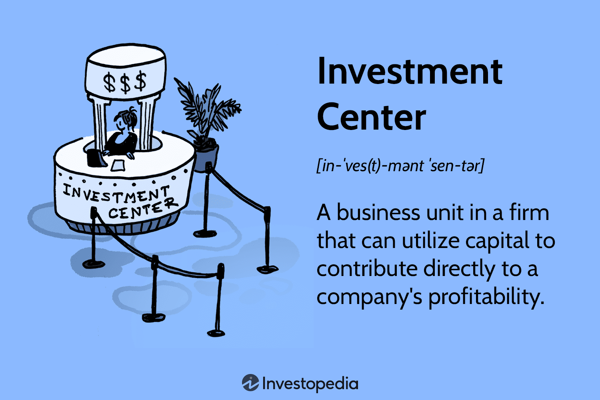

Successful investment center business management integrates several key components to optimize profitability and efficiency. Investment centers function as critical segments within a corporate structure, tasked with generating profits while managing their assets independently. This autonomy necessitates a robust framework for financial responsibility, ensuring that revenues, expenses, and investments align with broader corporate strategies.

One of the core elements influencing modern investment centers is the intersection of financial responsibility and algorithmic trading. Effective financial responsibility requires these centers to carefully monitor and control financial metrics to enhance economic performance. Traditional metrics like Return on Investment (ROI), Residual Income, and Economic Value Added (EVA) are employed to measure and evaluate the center's success in meeting financial objectives. 



Algorithmic trading serves as a pivotal tool in advancing the capabilities of investment centers. Utilizing complex mathematical models and advanced software, algorithmic trading facilitates rapid and accurate execution of trade strategies. The speed and efficiency of algorithmic trading significantly reduce human errors and allow for the execution of high-frequency trades that capitalize on fleeting market opportunities. The integration of such advanced technology empowers investment centers to optimize their trading operations, resulting in increased returns and improved strategic decision-making.

These elements coalesce to form an effective investment center, where meticulous financial oversight complements sophisticated technology to drive both profitability and efficiency. As investment centers continuously innovate and adapt to evolving financial landscapes, the combination of financial responsibility and algorithmic trading stands as a cornerstone of modern financial management strategy. This synergy not only enhances financial performance but also helps navigate the complexities and dynamics of global finance markets.

## Table of Contents

## Investment Center Overview

An investment center is a division or segment within a company that is treated as a standalone entity, responsible for generating revenues, managing expenses, and utilizing assets effectively. Its primary purpose is to maximize returns on invested capital while aligning with the broader strategic objectives of the corporation. Unlike other centers in a corporate structure, an investment center operates with both income and financial accountability, making it a critical component for achieving overall corporate profitability and growth.

An investment center is often compared to profit centers and cost centers, each having distinct roles within an organization. A profit center focuses on generating profits by controlling revenues and expenses but does not have authority over investment decisions. Conversely, a cost center is responsible mainly for controlling costs and does not directly generate revenues or make investment decisions. The investment center, in contrast, has control over revenues, costs, and investment decisions, allowing for comprehensive financial management and strategic alignment.

Performance metrics are essential for evaluating the effectiveness of an investment center. Return on Investment (ROI) is a widely used metric, calculated as:

$$
ROI = \frac{\text{Net Income}}{\text{Invested Capital}}
$$

This formula helps assess the efficiency of the investment center in utilizing its assets to generate income. Another critical metric is Residual Income (RI), which measures the profitability of a segment beyond the required return on its operating assets. RI is calculated as:

$$
RI = \text{Net Operating Income} - (\text{Invested Capital} \times \text{Required Rate of Return})
$$

Economic Value Added (EVA) is also employed to determine the true economic profit created by an investment center. EVA considers the cost of capital in its calculation:

$$
EVA = \text{Net Operating Profit After Taxes (NOPAT)} - (\text{Capital Employed} \times \text{Weighted Average Cost of Capital (WACC)})
$$

These metrics provide insights into how well the investment center is managing its resources and aligning with the company's strategic financial objectives. Understanding and applying these measures enable investment centers to optimize their financial performance, contributing significantly to the overall success of the corporation.

## Financial Responsibility in Investment Centers

Investment centers play a crucial role in a corporation by acting as a separate unit accountable for its own profitability, contributing significantly to the overall success of the organization. The fundamental principle of financial responsibility within these centers is their capacity to manage revenues, expenses, and assets independently. This autonomy requires meticulous financial management to achieve and sustain profitability.

The management of revenues, expenses, and assets involves structured financial planning and execution. Investment centers generate revenue primarily through strategic investments and financial services. Effective management entails optimizing these investments to maximize returns while minimizing costs. This includes diligent tracking of revenue streams, precise budgeting of expenses, and strategic allocation of resources to ensure the most productive use of assets.

### Revenue Management

Investment centers aim to optimize income through a variety of financial products, including equities, bonds, and derivatives. Using financial data analytics and forecasting tools, they can predict market trends and make informed decisions that enhance revenue generation. This approach leads to a more adaptable model for revenue growth, even in fluctuating market conditions.

### Expense Control

Expense control is another crucial element of financial responsibility. Investment centers must maintain a stringent check on operational and investment-related expenditures to gauge their impact on net profit. An effective method is implementing activity-based costing (ABC), which assigns costs to specific activities related to revenue-generating operations, enabling more targeted cost management.

### Asset Management

Asset management in investment centers involves maintaining an optimal portfolio mix that aligns with the entity’s risk tolerance and financial objectives. This can be done using modern portfolio theory, which emphasizes maximizing returns while minimizing risks through diversification. Calculations such as the Sharpe Ratio or Capital Asset Pricing Model (CAPM) are often utilized to evaluate and enhance the efficiency of asset management strategies.

$$
\text{Sharpe Ratio} = \frac{\text{Expected Portfolio Return} - \text{Risk-Free Rate}}{\text{Standard Deviation of Portfolio Returns}}
$$

$$
E(R_i) = R_f + \beta_i \times (E(R_m) - R_f)
$$

where $E(R_i)$ is the expected return of the investment, $R_f$ is the risk-free rate, $\beta_i$ is the beta of the investment, and $E(R_m)$ is the expected market return.

### Aligning Financial Goals with Corporate Strategies

The alignment of financial goals with overarching corporate strategies is vital to driving economic performance. This alignment ensures that every financial decision within the investment center supports the broader corporate objectives, such as market expansion, operational efficiency, and shareholder value maximization. Strategic alignment involves regular financial reviews and adjustments to navigate changing market conditions, leverage emerging opportunities, and mitigate potential risks.

In conclusion, maintaining financial responsibility within investment centers requires a cohesive strategy that integrates revenue management, expense control, and asset optimization. This approach ensures alignment with corporate strategies and sustains the economic performance of the organization. Investment centers that effectively adopt these practices can significantly enhance their contribution to the corporation's financial health and strategic objectives.

## Algorithmic Trading as a Tool for Investment Centers

Algorithmic trading, often abbreviated as algo trading, is the use of computer algorithms to automate trading decisions and execute orders in financial markets. This approach is distinguished by its capacity to process vast volumes of data and make trading decisions at speeds far surpassing human capability. The primary role of [algorithmic trading](/wiki/algorithmic-trading) within investment strategies is to improve the execution of trades, enabling faster, more efficient transactions while minimizing human error. 

### Benefits of Using Algorithms for Trading

One of the key advantages of algorithmic trading is its speed. Algorithms can analyze market conditions, identify trading opportunities, and execute trades within milliseconds. This rapid response time is crucial in volatile markets where prices can change in an instant. For instance, a delay of even a few milliseconds in trade execution can significantly impact profitability.

Efficiency is another critical benefit. Algorithms are capable of managing numerous trades simultaneously across various markets and instruments without becoming fatigued or biased, something human traders cannot achieve. This can lead to improved opportunities for diversification and risk management.

Error reduction is a further advantage of algorithmic trading. By automating the trading process, the risk of human errors—such as entering incorrect order details or making impulsive decisions due to emotions—is substantially minimized. Instead, algorithms follow predefined rules and strategies, ensuring consistency in trade execution.

### Leveraging Technology to Maximize Returns

Investment centers leverage algorithmic trading to enhance their trading operations and maximize returns through several technological methods. One common strategy is high-frequency trading ([HFT](/wiki/high-frequency-trading-strategies)), which exploits small price discrepancies in the market. HFT requires significant infrastructure investments in hardware and network connectivity to ensure that trades are executed as swiftly as possible.

Moreover, algorithmic trading strategies often incorporate advanced statistical models and [machine learning](/wiki/machine-learning) techniques to predict market trends and make informed trading decisions. For instance, a simple moving average crossover strategy might serve as a foundation:

```python
def moving_average(prices, window_size):
    return [sum(prices[i:i+window_size])/window_size for i in range(len(prices)-window_size+1)]

def strategy(prices, short_window, long_window):
    short_ma = moving_average(prices, short_window)
    long_ma = moving_average(prices, long_window)
    signals = []
    for i in range(len(short_ma)):
        if short_ma[i] > long_ma[i]:
            signals.append('buy')
        else:
            signals.append('sell')
    return signals
```

Through such strategies, investment centers can systematically execute trades upon detecting specific market conditions, thereby optimizing the timing of their trades and increasing potential profit margins.

Additionally, investment centers often employ algorithms to manage portfolio risk through techniques like portfolio optimization and dynamic hedging. Algorithms automatically rebalance portfolios according to shifts in market conditions or investment strategies, ensuring that portfolios align with the center's financial goals.

Overall, algorithmic trading empowers investment centers to maintain a competitive edge by leveraging technology to optimize trading operations, maximize returns, and efficiently manage significant volumes of transactions. As technology continues to advance, the integration of sophisticated algorithms in investment strategies will become increasingly critical for achieving economic performance in the financial industry.

## Challenges and Risks of Algorithmic Trading

Algorithmic trading has become an integral part of modern investment centers, offering significant advantages such as speed, efficiency, and reduced human error. However, it also brings a set of challenges and risks that these centers must effectively manage to safeguard against potential negative impacts.

One of the primary risks associated with algorithmic trading is market [volatility](/wiki/volatility-trading-strategies). Algorithms can exacerbate price swings through high-frequency trading and large [volume](/wiki/volume-trading-strategy) transactions within short time frames. This can lead to increased volatility, which is sometimes referred to as "flash crashes" — rapid, deep, and volatile declines in security prices over a relatively short time.

Maintaining effective algorithms in dynamic market conditions is another significant challenge. Financial markets are constantly evolving, influenced by myriad factors such as geopolitical events, economic data releases, and changes in investor sentiment. Algorithms must be continually updated and tested to adapt to these changes, requiring sophisticated machine learning and [artificial intelligence](/wiki/ai-artificial-intelligence) techniques. A simple backpropagation algorithm in Python, using TensorFlow, to adjust trading strategies might look like this:

```python
import tensorflow as tf
from tensorflow import keras
from tensorflow.keras import layers

# Sample neural network architecture
model = keras.Sequential([
    layers.Dense(64, activation='relu', input_shape=(input_dim,)),
    layers.Dense(64, activation='relu'),
    layers.Dense(output_dim, activation='linear')
])

model.compile(optimizer='adam', loss='mse')

# Training the model with market data
model.fit(X_train, y_train, epochs=100, batch_size=32, validation_split=0.2)

# Adjusting algorithm based on new data
predictions = model.predict(X_new_data)
```

Investment centers must also address the technical challenges of monitoring and managing numerous algorithms simultaneously. This requires robust IT infrastructure and highly skilled personnel capable of interpreting complex data outputs and managing algorithmic functions. The reliability of these algorithms can directly impact financial performance.

Mitigating these risks involves thoroughly testing algorithms before deployment, employing real-time monitoring systems, and developing adaptive algorithms that can respond to live market data. Stress testing under various market conditions and implementing risk management strategies, such as setting stop-loss limits or defining maximum allowable losses, are essential for minimizing potential adverse outcomes. Additionally, investment centers can use strategies like diversification to spread risk and limit exposure to specific asset classes or market segments.

Ultimately, investment centers must foster an environment of continuous innovation and learning to adapt to the ever-changing landscape of financial markets. Establishing a robust risk management framework and investing in technology and human capital are key to leveraging algorithmic trading's benefits while minimizing its inherent risks.

## Case Studies in Investment Center Management and Algo Trading

The integration of investment center management and algorithmic trading has become an increasingly important strategy for companies aiming to improve financial metrics and achieve strategic growth. This section explores notable case studies of successful implementations, highlighting key lessons learned from both successes and failures.

One of the prominent examples is Goldman Sachs, which has effectively leveraged algorithmic trading to fortify its investment operations. By integrating sophisticated algorithms into its trading strategies, Goldman Sachs has managed to enhance its trading efficiency, reduce operational costs, and improve its overall return on investment (ROI). Their approach involved developing proprietary algorithms capable of executing trades at high speed and precision, thus capitalizing on market opportunities before competitors. This resulted in significant improvements in key financial metrics such as profit margins and turnover ratios.

Another case study involves Renaissance Technologies, a [hedge fund](/wiki/hedge-fund-trading-strategies) known for its [quantitative trading](/wiki/quantitative-trading) methods. Renaissance Technologies employs algorithmic trading systems to analyze vast datasets and execute trades based on the identified patterns. This integration of technology has enabled the company to systematically outperform traditional investment approaches, achieving remarkable returns even in volatile market conditions. Their success underscores the importance of leveraging data analytics and machine learning to drive informed investment decisions.

In contrast, the failed attempt by Knight Capital Group serves as a cautionary tale. In 2012, a software glitch in Knight's algorithmic trading system resulted in a loss of $440 million in a matter of minutes. This incident highlighted the risks associated with dependence on algorithm-driven trading without adequate risk management protocols. It underscored the necessity for rigorous testing, real-time monitoring, and robust fail-safes to mitigate potential losses from software errors or market anomalies.

Lessons learned from these case studies emphasize the need for continual innovation and adaptation. Companies have realized the importance of constantly refining algorithms to keep pace with rapidly changing market dynamics. Furthermore, maintaining a strong alignment between technological capabilities and strategic financial goals is crucial. Effective risk management practices and a commitment to data-driven decision-making are indispensable for ensuring sustainable growth and competitive advantage in the market.

The experience of industry leaders shows that integrating algorithmic trading within investment centers can yield substantial benefits. However, it also requires a careful balance between leveraging technology and managing inherent risks. As technological advancements continue to reshape financial landscapes, companies must prioritize strategic alignment and ongoing innovation to harness the full potential of investment center business management and algorithmic trading.

## Conclusion and Future Trends

Investment centers increasingly leverage algorithmic trading and financial responsibility to enhance their profitability and efficiency. Algorithmic trading offers significant advantages, such as increased speed, efficiency, and reduced human errors in executing trades. This allows investment centers to optimize trading strategies, accessing global markets swiftly and accurately, which contributes to enhanced returns on investments. The integration of sophisticated algorithms provides centers with the capability to make data-driven decisions that align with fluctuating market dynamics. As a result, investment centers become more adaptive to market changes, ensuring more consistent and favorable financial outcomes.

Simultaneously, the application of financial responsibility ensures that investment centers manage revenues, expenses, and assets with precision. By aligning financial goals with corporate strategies, these centers can effectively evaluate and improve their economic value. Metrics such as Return on Investment (ROI), Residual Income (RI), and Economic Value Added (EVA) remain crucial in assessing their performance, guiding the allocation of resources to areas that promise the highest potential for growth and return.

Looking forward, the future of investment centers is deeply intertwined with technological advancements. As emerging technologies like artificial intelligence and machine learning continue to evolve, they will further enhance algorithmic trading's capabilities. These advancements are expected to provide even deeper market insights, allowing for more predictive analytics and customizable trading strategies that respond to real-time data.

To remain competitive, continuous innovation and strategic alignment are essential for investment centers. Adopting new technologies and refining existing strategies to suit a rapidly evolving financial landscape will be paramount. Additionally, maintaining a proactive approach in risk management and regulatory compliance will safeguard these centers against potential pitfalls associated with technology integration.

In conclusion, investment centers stand to gain considerably from algorithmic trading paired with robust financial responsibility. This synergy not only drives short-term profitability but also builds a foundation for long-term strategic growth. In a technologically advanced financial landscape, adapting and innovating swiftly will be critical to maintaining a competitive edge and achieving sustained success.

## References & Further Reading

[1]: Bergstra, J., Bardenet, R., Bengio, Y., & Kégl, B. (2011). ["Algorithms for Hyper-Parameter Optimization."](https://dl.acm.org/doi/10.5555/2986459.2986743) Advances in Neural Information Processing Systems 24.

[2]: Lopez de Prado, M. (2018). ["Advances in Financial Machine Learning"](https://www.amazon.com/Advances-Financial-Machine-Learning-Marcos/dp/1119482089). Wiley.

[3]: Aronson, D. R. (2006). ["Evidence-Based Technical Analysis: Applying the Scientific Method and Statistical Inference to Trading Signals"](https://www.amazon.com/Evidence-Based-Technical-Analysis-Scientific-Statistical/dp/0470008741). Wiley.

[4]: Jansen, S. (2020). ["Machine Learning for Algorithmic Trading"](https://github.com/stefan-jansen/machine-learning-for-trading). Packt Publishing.

[5]: Chan, E. P. (2009). ["Quantitative Trading: How to Build Your Own Algorithmic Trading Business"](https://github.com/ftvision/quant_trading_echan_book). Wiley.