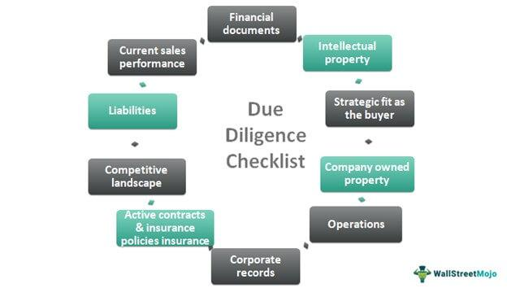

Algorithmic trading, commonly referred to as algo trading, has revolutionized the financial markets by enabling high-speed, high-frequency trades. Its growing popularity largely stems from the systematic and emotion-free nature of trading that algorithms offer, which enhances the accuracy and speed of executing trades. Unlike traditional trading, where human emotions and biases can lead to impulsive decisions, algorithmic trading relies on pre-defined rules and algorithms, thus ensuring a more objective approach to investing.

The adoption of algorithmic trading strategies empowers investors to capitalize on minute changes in the market, which might otherwise be missed in manual trading. These automated systems can operate across multiple markets and securities in a fraction of the time it would take a human trader, highlighting its efficiency and attractiveness for high-frequency trading activities.



A critical aspect of successful algorithmic trading is the development and utilization of an investment checklist. Such checklists serve as comprehensive guides to decision-making, ensuring that every strategy is executed accurately and effectively while aligning with the trader’s investment goals and risk tolerance. The elements of this checklist can range from defining the trading strategy and selecting appropriate algorithms to incorporate advanced risk management techniques and optimizing technology infrastructure.

Understanding the essential components of an investment checklist in algorithmic trading is fundamental to improving decision-making and optimizing trading strategies. It minimizes errors by providing a structured approach, maximizes returns by ensuring disciplines are maintained, and adapts to the ever-evolving market conditions. This article outlines a detailed checklist designed to guide investments in algorithmic trading, thereby underscoring their significance in minimizing errors and maximizing trading results.

## Table of Contents

## Understanding Algorithmic Trading

Algorithmic trading, also known as algo trading, leverages computer programs to execute trades based on pre-defined criteria. This approach eliminates human emotion, resulting in more consistent decision-making within the financial markets. Algorithms can process vast amounts of market data within milliseconds, enabling high-speed, precision trading that humans would struggle to replicate. 

Several strategies are prevalent in algorithmic trading. Trend-following strategies capitalize on market [momentum](/wiki/momentum) by executing trades based on historical price data and indicators, aligning with the expectation that trends will continue in their current direction. Arbitrage strategies exploit price discrepancies in different markets or instruments. By acting on these temporary inefficiencies, traders can lock in risk-free profits. Market-making involves placing both buy and sell orders to capture the spread between the bid and ask prices, providing liquidity to the market.

An investment checklist plays a crucial role in the effectiveness of [algorithmic trading](/wiki/algorithmic-trading) strategies. By systematically organizing and scrutinizing each aspect of the trading process, traders can reduce errors and maintain discipline. For instance, ensuring that the algorithm's parameters are correctly configured according to market conditions or strategy objectives can prevent costly mistakes.

This checklist aids in the implementation of strategies by setting a clear framework and ensuring all necessary conditions are met before executing a trade. It can include algorithm selection, parameter tuning, data analysis, and compliance checks. As a result, traders can focus on optimizing their algorithms and enhancing their overall trading performance. By adhering to a structured investment checklist, traders can more effectively manage market complexities and refine their strategies over time, leading to disciplined and systematic trading practices.

## Components of an Investment Checklist in Algo Trading

In algorithmic trading, constructing a well-defined investment checklist is essential for strategic planning and execution. This section outlines the key components of such a checklist, focusing on selecting the appropriate trading strategies, identifying financial instruments, and choosing reliable trading software and platforms.

### Defining Your Trading Strategy

Selecting the right algorithmic trading strategy is foundational and should align with the trader's goals and risk tolerance. Popular strategies include:

- **Trend-following**: This strategy involves identifying and exploiting market trends. Algorithms are programmed to recognize patterns in price movements, ensuring trades align with the prevailing market direction.

- **Arbitrage**: This involves exploiting the price differentials of the same asset in different markets. Arbitrage strategies require algorithms that can swiftly and accurately detect these disparities and execute trades to capitalize on them, often in fractions of a second.

- **Market-making**: This strategy entails providing liquidity by placing buy and sell orders for a financial instrument simultaneously. The goal is to earn a profit from the bid-ask spread.

To illustrate, a Python code snippet for a simple moving average crossover strategy, a type of trend-following strategy, could look like this:

```python
def moving_average(prices, window_size):
    return sum(prices[-window_size:]) / window_size

def trade_strategy(prices, short_window, long_window):
    short_mavg = moving_average(prices, short_window)
    long_mavg = moving_average(prices, long_window)

    if short_mavg > long_mavg:
        return "Buy"
    elif short_mavg < long_mavg:
        return "Sell"
    else:
        return "Hold"

# Example usage
prices = [110, 112, 115, 113, 118, 120, 125, 119]
decision = trade_strategy(prices, short_window=3, long_window=5)
print(decision)
```

### Identifying Financial Instruments

The selection of financial instruments depends on market access, [liquidity](/wiki/liquidity-risk-premium), and risk management preferences. Traders should consider the following:

- **Stocks**: Equities, or stocks, offer opportunities in both bull and bear markets and are suitable for trend-following and mean-reversion strategies due to their liquidity and volatility.

- **Forex**: The foreign exchange market provides high liquidity and trading volume, making it ideal for strategies like arbitrage and high-frequency trading.

- **Commodities**: These include assets like gold, oil, and agricultural products. Commodities can hedge against inflation and diversify a portfolio, appealing to traders employing macroeconomic strategies.

### Selecting Reliable Algorithmic Trading Software and Platforms

Reliable trading software and platforms are crucial for executing strategies efficiently. Important considerations include:

- **Execution Speed**: The latency of an algorithmic system can significantly affect trade profitability, especially for high-frequency trading strategies.

- **Data Access**: Platforms should provide comprehensive market data and historical datasets for backtesting and strategy refinement.

- **Customization and Automation**: The ability to write custom code and automate trading processes ensures strategies are implemented precisely as designed.

A widely-used platform such as MetaTrader or a language-specific library like Python's `pandas` and `NumPy` can provide essential tools for data analysis and execution automation.

By methodically addressing these components, algorithmic traders can build a robust investment checklist that supports informed decision-making and optimized strategy execution.

## Key Considerations for the Checklist

Backtesting is a critical component of any algorithmic trading strategy. It involves running your trading algorithms through historical data to evaluate how well they would have performed under various market conditions. This process helps traders to identify potential flaws in the algorithm and refine strategies before committing real capital. During [backtesting](/wiki/backtesting), traders should focus on parameters such as win/loss ratios, maximum drawdowns, and [volatility](/wiki/volatility-trading-strategies) to determine the algorithm's robustness. It is essential to use a comprehensive and representative data set to ensure the results are relevant to future trading conditions.

Calculating expected returns and understanding the associated risks are also fundamental in evaluating the potential financial outcomes of a trading strategy. Expected returns can be determined using historical data and statistical methods such as calculating the mean return of a strategy. However, expected returns should always be considered alongside the risk profile of the strategy. The Sharpe ratio is a commonly used measure that can help assess this balance by comparing the expected return to the risk-free rate, adjusted for the strategy's volatility:

$$
\text{Sharpe Ratio} = \frac{\text{Expected Return} - \text{Risk-Free Rate}}{\text{Standard Deviation of Returns}}
$$

Technological advancements play a crucial role in ensuring minimal latency and optimal data processing, which are vital for successful algorithmic trading. It is important for traders to keep abreast of the latest technology in trading platforms, servers, and internet connections to achieve fast and reliable trade execution. Low latency is particularly crucial in high-frequency trading environments, where even microsecond delays can significantly impact profitability. Ensuring that your infrastructure is optimized for high-speed data processing and order execution is key to maintaining a competitive edge in the fast-paced world of algorithmic trading. 

Keeping these considerations in mind when developing an investment checklist helps ensure that algorithmic trading strategies are both successful and resilient against unexpected market conditions.

## Risk Management and Error Minimization

In algorithmic trading, risk management and error minimization are crucial elements that ensure the sustainability and success of trading strategies. Effective risk management involves developing strategies that can mitigate potential losses, while error minimization focuses on reducing mistakes during trade execution. These components are vital for achieving consistent profitability.

To start, trading strategies should incorporate stop-loss orders and automated [exit](/wiki/exit-strategy) strategies. Stop-loss orders automatically close a position when the market price reaches a pre-set level, limiting potential losses from adverse market movements. Automated exit strategies are predefined algorithms that determine when to close a position, based on the trading strategy's parameters and market signals. These mechanisms do not only protect against significant losses but also allow the trading system to operate efficiently without constant oversight.

Additionally, maintaining an up-to-date investment checklist is essential for aligning with evolving market trends and technological advancements. As the market dynamics and infrastructure evolve, algorithmic traders must adapt their strategies and tools to stay competitive. Regular updates to the checklist ensure that the trading system remains responsive and capable of handling new market conditions. This includes recalibrating algorithms, updating software, and integrating new data sources.

Incorporating stress testing is another critical aspect of risk management. Stress testing involves simulating various market scenarios to evaluate how trading algorithms perform under different conditions, especially during periods of high volatility or market disruption. By incorporating stress tests, traders can identify weaknesses in their strategies and make necessary adjustments to prevent potential losses. This proactive approach helps ensure that trading algorithms are resilient to unexpected market events.

Python can be an effective tool for implementing stress tests and analyzing risk management strategies in algorithmic trading. For example, the following Python code snippet demonstrates a simple approach to backtesting a trading strategy:

```python
import pandas as pd

# Sample historical data
data = pd.DataFrame({
    'price': [100, 102, 101, 104, 103, 105],
    'signal': [1, 0, 1, 1, 0, 1]
})

# Parameters for testing
initial_capital = 10000
shares_per_trade = 10
stop_loss = 0.95  # 5% stop-loss

# Backtest strategy
cash = initial_capital
portfolio_value = initial_capital
positions = 0

for i, row in data.iterrows():
    if row['signal'] == 1:
        # Buy shares
        positions += shares_per_trade
        cash -= shares_per_trade * row['price']
    elif row['signal'] == 0:
        # Sell shares and apply stop loss
        if row['price'] < stop_loss * (cash / positions):
            cash += positions * row['price']
            positions = 0

    # Update portfolio value
    portfolio_value = cash + positions * row['price']
    print(f"Day {i+1}: Portfolio Value = ${portfolio_value:.2f}")

```

This script outlines a simple backtest, evaluating a trading strategy's performance with basic buy or sell signals while applying a stop-loss mechanism. Such backtests can reveal how well a strategy might perform under specified conditions, helping to refine the algorithm and improve risk management techniques.

In summary, risk management and error minimization in algorithmic trading are achieved through a combination of stop-loss orders, automated exit strategies, maintaining an up-to-date checklist, and stress testing. These practices help safeguard against substantial losses and ensure that trading strategies can adapt to changing market conditions effectively.

## The Role of an Investment Checklist in Enhancing Execution

An investment checklist plays a crucial role in ensuring precision and efficiency in algorithmic trading by reinforcing structured and systematic procedures prior to executing trades. At its core, the checklist functions as a comprehensive guide for traders to follow specific protocols, thereby reducing human error and minimizing the impact of cognitive biases on decision-making processes.

The primary benefit of an investment checklist is its capacity to enforce discipline among traders. By adhering to predefined guidelines, traders can maintain consistency across their trading activities, thereby ensuring that trades align with their strategic objectives and risk parameters. This methodical approach fosters a more focused trading environment, where decisions are based on well-defined criteria rather than impulsive reactions to market fluctuations.

Furthermore, an investment checklist assists in maintaining operational accuracy by systematically confirming essential trading parameters. For example, before executing a trade, the checklist ensures that traders verify critical data points such as entry and exit signals, position sizing, and stop-loss levels. These checks are crucial in safeguarding against execution errors that can lead to unanticipated financial losses.

Additionally, the utilization of an investment checklist supports traders in maintaining objectivity in their decision-making. The checklist removes the influence of emotional factors by establishing a neutral framework for evaluating trading decisions. It allows traders to focus on data-driven analysis and empirical evidence rather than subjective perceptions, leading to more rational and calculated actions.

The adoption of technology further enhances the effectiveness of an investment checklist. Modern trading platforms can integrate automated checks that complement the manual checklist, providing an additional layer of verification. For instance, Python scripts can be employed to perform real-time analysis and validation of trading signals against the criteria outlined in the checklist. This integration not only increases the efficiency of the trading process but also ensures adherence to the predefined trading strategy.

In conclusion, an investment checklist is instrumental in enhancing the execution of algorithmic trades by systematizing procedures, fostering discipline, and supporting objective decision-making. By integrating these checks within the trading workflow, investors can optimize their strategies, thereby increasing the probability of achieving desired financial outcomes.

## Conclusion

An investment checklist in algorithmic trading is a vital resource that empowers traders to increase both precision and profitability in their transactions. By systematically addressing each component of a trade, a checklist serves as a guide to making well-informed decisions. It helps in minimizing cognitive biases and errors, which are common pitfalls that can compromise the effectiveness of trading strategies. These biases can lead to irrational decision-making and errors, potentially causing financial losses. By following a structured checklist, traders are prompted to follow a sequential method that ensures every aspect of the trade is evaluated through objective parameters, thereby promoting a more coherent and disciplined approach to trade execution.

Furthermore, an investment checklist supports traders in maintaining consistency across various trading activities. It acts as a safeguard against emotional and impulsive trading by reinforcing a pre-determined strategy that has been developed based on quantitative analysis and prior testing. This leads to a less erratic trading pattern and a focus on long-term strategy rather than short-term reactions to market volatility.

Investors are encouraged to customize their checklists according to their personal experiences and unique market exposures. This customization not only tailors the checklist to reflect an individual’s specific trading style, goals, and risk tolerance, but it also enables continuous improvement. By integrating personal insights and adapting to evolving market conditions, traders can refine their checklists over time, which enhances the effectiveness of their algorithmic trading strategies and reinforces their ability to adapt to market dynamics efficiently. This adaptive approach ensures that the checklist remains relevant, allowing it to serve as a powerful tool for optimizing trade executions and improving overall trading outcomes.

## References & Further Reading

[1]: Bergstra, J., Bardenet, R., Bengio, Y., & Kégl, B. (2011). ["Algorithms for Hyper-Parameter Optimization."](https://dl.acm.org/doi/10.5555/2986459.2986743) Advances in Neural Information Processing Systems 24.

[2]: ["Advances in Financial Machine Learning"](https://resources.caih.jhu.edu/textbooks/Resources/_pdfs/Advances_In_Financial_Machine_Learning.pdf) by Marcos Lopez de Prado

[3]: ["Evidence-Based Technical Analysis: Applying the Scientific Method and Statistical Inference to Trading Signals"](https://www.amazon.com/Evidence-Based-Technical-Analysis-Scientific-Statistical/dp/0470008741) by David Aronson

[4]: ["Machine Learning for Algorithmic Trading"](https://github.com/stefan-jansen/machine-learning-for-trading) by Stefan Jansen

[5]: ["Quantitative Trading: How to Build Your Own Algorithmic Trading Business"](https://books.google.com/books/about/Quantitative_Trading.html?id=j70yEAAAQBAJ) by Ernest P. Chan