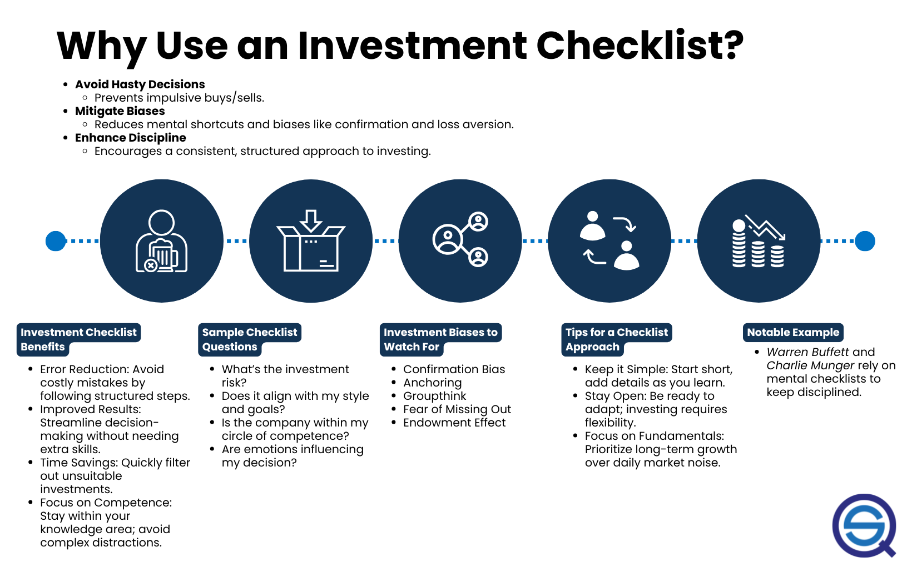

## Table of Contents

## What is an investment checklist and why is it important for investors?

An investment checklist is a list of things that investors use to help them make good choices about where to put their money. It includes important points that they should think about before they decide to invest in something, like a company or a project. This checklist can include things like looking at the company's financial health, understanding the market it operates in, and checking the background of the people running the business.

Using an investment checklist is important because it helps investors make more careful and smart decisions. It makes sure they don't miss important details that could affect their investment. By going through the checklist, investors can reduce the chances of making bad choices and losing money. It also helps them stay organized and feel more confident about their investment decisions.

## How can a beginner start creating their own investment checklist?

A beginner can start creating their own investment checklist by first thinking about what they want to know before they invest their money. They should consider the basic things that matter to them, like how much risk they are okay with, how long they plan to keep their money invested, and what kind of returns they are hoping for. They can write these down as the first items on their checklist. Then, they can learn more about common things that experienced investors look at, like a company's financial statements, its position in the market, and the people who run the company. They can add these to their checklist too.

After they have a basic list, beginners should try using it when they look at possible investments. They can see if the checklist helps them make decisions and if they need to add or change anything. It's a good idea to keep the checklist simple at first and then make it more detailed as they learn more about investing. Over time, they can improve their checklist by adding new things they learn are important, and by taking out things that don't help them make better choices. This way, their checklist will become a useful tool that grows with their investing knowledge.

## What are the key elements that should be included in an investment checklist?

When making an investment checklist, it's important to include elements that help you understand the risks and rewards of an investment. Start with the basics like the company's financial health. Look at things like their income, expenses, debts, and profits. This will give you an idea of how well the company is doing. You should also check the company's position in the market. Is it growing, shrinking, or staying the same? Understanding the market can help you see if the company has a good future ahead.

Another key element is the management team. You want to know who is running the company and if they have a good track record. Look into their past successes and failures. This can tell you a lot about their ability to lead the company well. Finally, think about your own investment goals. Are you looking for quick returns or are you in it for the long haul? Your checklist should include how well the investment fits with your goals and how much risk you're willing to take. By including these elements, your checklist will help you make smarter investment choices.

## How does an investment checklist help in managing risk?

An investment checklist helps manage risk by making sure you look at all the important details before you invest your money. It reminds you to check things like the company's financial health, its market position, and the people running the business. By going through each item on the checklist, you can spot any red flags or problems that might make the investment risky. This way, you can avoid putting your money into something that might not be a good choice.

Using a checklist also helps you stay organized and think clearly about your investment decisions. It can be easy to get caught up in the excitement of a potential investment, but a checklist keeps you focused on the facts. By following the checklist, you can make sure you're not missing any important information that could help you understand the risks better. This careful approach can help you make more informed decisions and reduce the chances of losing money.

## Can you explain the difference between a simple and a comprehensive investment checklist?

A simple investment checklist is short and easy to use. It includes the basic things that you need to know before you invest your money. This might be things like looking at the company's profits, checking how much risk you are okay with, and making sure the investment fits your goals. A simple checklist is good for beginners because it's not too hard to understand and use. It helps you make quick decisions without getting overwhelmed by too much information.

On the other hand, a comprehensive investment checklist is much more detailed. It includes everything from the simple checklist, but also adds a lot more things to think about. This could be looking at the company's debts, understanding the market it is in, checking the background of the management team, and even thinking about what might happen in the future. A comprehensive checklist is better for experienced investors who want to look at every possible detail before they make a decision. It takes more time to go through, but it helps you understand the investment really well and manage risks better.

## What role does an investment checklist play in portfolio diversification?

An investment checklist helps with portfolio diversification by making sure you look at different kinds of investments before you choose them. When you use a checklist, you think about things like how risky an investment is, what kind of returns you might get, and what industry the company is in. By going through these points, you can see if adding a new investment will make your portfolio more diverse. This means you won't put all your money in one type of investment, which can be risky. Instead, you'll spread your money across different investments, which can help protect you if one of them doesn't do well.

Using a checklist also helps you stay organized and make sure you don't miss any important details. When you're trying to diversify your portfolio, it's easy to get confused or forget to look at something important. But with a checklist, you can go through each item and make sure you're considering all the different kinds of investments that could be good for your portfolio. This way, you can make better choices about which investments to add, and you can build a portfolio that is more balanced and less risky.

## How should an investor update their checklist as they gain more experience?

As an investor gains more experience, they should update their checklist by adding new things they learn are important. At first, their checklist might just have the basic stuff like checking a company's profits and thinking about how much risk they want to take. But as they learn more, they can add more details like looking at the company's debts, understanding the market it's in, and checking the background of the people running the business. They should also think about what worked well for them in the past and what didn't, and use that to make their checklist better.

Updating the checklist is all about making it more useful over time. As an investor learns more, they might find that some things on their checklist aren't as important as they thought, or that there are new things they need to think about. They should take out the stuff that doesn't help them make good choices and add new things that do. This way, their checklist will keep getting better and help them make smarter investment decisions as they gain more experience.

## What are some common mistakes to avoid when using an investment checklist?

One common mistake when using an investment checklist is to make it too long or complicated. A checklist should help you make decisions, not confuse you. If it's too detailed, you might spend too much time on it and miss out on good investment opportunities. Keep it simple and focus on the most important things that matter to you. Another mistake is to ignore the checklist once you start feeling confident. Even experienced investors can make bad choices if they don't use their checklist. Always go through it to make sure you're not missing anything important.

Another mistake is not updating the checklist as you learn more about investing. As you gain experience, you'll find new things that are important to consider. If you don't update your checklist, you might miss out on these new insights. It's also a mistake to rely too much on the checklist and not use your own judgment. A checklist is a tool to help you, but you should still think for yourself and make decisions based on what you know and what feels right to you.

## How can an investment checklist be tailored to different types of investments such as stocks, bonds, or real estate?

An investment checklist can be tailored to different types of investments by focusing on the specific details that matter most for each one. For stocks, the checklist should include things like the company's earnings, its position in the market, and the quality of its management team. You might also want to check the stock's price and see if it's a good value compared to other stocks. For bonds, the checklist should look at the bond's interest rate, the credit rating of the issuer, and how long until the bond matures. It's important to understand the risk of the bond not being paid back, so you should also check the financial health of the company or government issuing the bond.

For real estate, the checklist should focus on things like the property's location, its condition, and the rental income it might bring in. You'll want to know about the local real estate market and see if property values are going up or down. It's also a good idea to check the costs of owning the property, like taxes, maintenance, and any loans you might need. By making your checklist specific to each type of investment, you can make sure you're looking at the right things to help you make smart choices. This way, you can understand the risks and rewards better and pick the investments that fit your goals.

## What advanced metrics or criteria should an expert investor include in their checklist?

An expert investor should include advanced metrics like the price-to-earnings ratio (P/E ratio) and the debt-to-equity ratio in their checklist. The P/E ratio helps you see if a stock is a good value by comparing its price to the company's earnings. A lower P/E ratio might mean the stock is undervalued, while a higher one might mean it's overvalued. The debt-to-equity ratio tells you how much the company is borrowing compared to what it owns. A high debt-to-equity ratio can be risky because it means the company might have trouble paying back its loans if things go wrong. These metrics give a deeper look into a company's financial health and can help an expert investor make better decisions.

Another important criterion for an expert investor is to look at the company's free cash flow. Free cash flow is the money a company has left after it pays for everything it needs to run its business. A company with a lot of free cash flow is usually in a good position because it can use that money to grow, pay dividends, or pay down debt. An expert investor should also consider qualitative factors like the company's competitive advantage and its growth potential. A competitive advantage could be something like a strong brand or a unique technology that sets the company apart from others. Growth potential is about whether the company can keep getting bigger and making more money in the future. By including these advanced metrics and criteria, an expert investor can get a fuller picture of an investment and make smarter choices.

## How can technology and software tools enhance the effectiveness of an investment checklist?

Technology and software tools can make an investment checklist much better by helping you keep everything organized and easy to use. With these tools, you can quickly go through your checklist and make sure you're not missing any important details. For example, you can use a spreadsheet to list all the things you need to check and then fill in the information as you go. This way, you can see everything at a glance and it's easier to update your checklist as you learn more. Some software even lets you set up reminders or alerts for when you need to check certain things, so you don't forget to look at them.

Another way technology helps is by giving you access to a lot of data and analysis that you might not have otherwise. There are tools that can pull in financial data, market trends, and other information automatically, so you don't have to spend time looking for it yourself. This means you can make more informed decisions because you have all the information you need right at your fingertips. Plus, some software can help you analyze this data and give you insights that you might not see on your own. By using these tools, you can make your investment checklist more detailed and accurate, which can lead to better investment choices.

## Can you provide examples of successful investment checklists used by expert investors?

Warren Buffett, a famous investor, uses a simple but effective checklist. He looks at a company's long-term earnings potential and its competitive advantage. He also checks if the company's stock is priced at a good value compared to its earnings. Buffett thinks about the people running the company and if they are honest and good at their jobs. He wants to invest in businesses that he understands well and that he thinks will do well in the future. His checklist helps him find companies that are likely to make money for a long time.

Another example is the checklist used by Mohnish Pabrai, who follows a similar approach to Buffett. Pabrai focuses on finding undervalued companies with strong fundamentals. He looks at the company's financial health, including its debt and cash flow. He also considers the company's moat, which means how well it can keep competitors away. Pabrai likes to invest in companies that are misunderstood by the market, so he can buy them at a lower price. His checklist helps him spot these opportunities and make smart investment choices.

## What are the key considerations for the checklist?

Backtesting is a critical component of any algorithmic trading strategy. It involves running your trading algorithms through historical data to evaluate how well they would have performed under various market conditions. This process helps traders to identify potential flaws in the algorithm and refine strategies before committing real capital. During [backtesting](/wiki/backtesting), traders should focus on parameters such as win/loss ratios, maximum drawdowns, and [volatility](/wiki/volatility-trading-strategies) to determine the algorithm's robustness. It is essential to use a comprehensive and representative data set to ensure the results are relevant to future trading conditions.

Calculating expected returns and understanding the associated risks are also fundamental in evaluating the potential financial outcomes of a trading strategy. Expected returns can be determined using historical data and statistical methods such as calculating the mean return of a strategy. However, expected returns should always be considered alongside the risk profile of the strategy. The Sharpe ratio is a commonly used measure that can help assess this balance by comparing the expected return to the risk-free rate, adjusted for the strategy's volatility:

$$
\text{Sharpe Ratio} = \frac{\text{Expected Return} - \text{Risk-Free Rate}}{\text{Standard Deviation of Returns}}
$$

Technological advancements play a crucial role in ensuring minimal latency and optimal data processing, which are vital for successful algorithmic trading. It is important for traders to keep abreast of the latest technology in trading platforms, servers, and internet connections to achieve fast and reliable trade execution. Low latency is particularly crucial in high-frequency trading environments, where even microsecond delays can significantly impact profitability. Ensuring that your infrastructure is optimized for high-speed data processing and order execution is key to maintaining a competitive edge in the fast-paced world of algorithmic trading. 

Keeping these considerations in mind when developing an investment checklist helps ensure that algorithmic trading strategies are both successful and resilient against unexpected market conditions.

## References & Further Reading

[1]: Bergstra, J., Bardenet, R., Bengio, Y., & Kégl, B. (2011). ["Algorithms for Hyper-Parameter Optimization."](https://dl.acm.org/doi/10.5555/2986459.2986743) Advances in Neural Information Processing Systems 24.

[2]: ["Advances in Financial Machine Learning"](https://resources.caih.jhu.edu/textbooks/Resources/_pdfs/Advances_In_Financial_Machine_Learning.pdf) by Marcos Lopez de Prado

[3]: ["Evidence-Based Technical Analysis: Applying the Scientific Method and Statistical Inference to Trading Signals"](https://www.amazon.com/Evidence-Based-Technical-Analysis-Scientific-Statistical/dp/0470008741) by David Aronson

[4]: ["Machine Learning for Algorithmic Trading"](https://github.com/stefan-jansen/machine-learning-for-trading) by Stefan Jansen

[5]: ["Quantitative Trading: How to Build Your Own Algorithmic Trading Business"](https://books.google.com/books/about/Quantitative_Trading.html?id=j70yEAAAQBAJ) by Ernest P. Chan