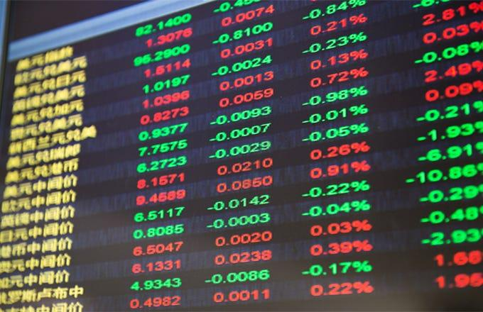

The landscape of investing has evolved significantly with the advent of algorithmic trading, presenting new opportunities and challenges for investors globally. In particular, Chinese stocks have emerged as a significant point of interest, driven by China's rapid economic growth and substantial market reforms. As one of the largest economies in the world, China offers a diverse range of investment opportunities that extend across various industries, including technology, manufacturing, and consumer goods. These sectors have shown robust performance and promise considerable expansion potential, appealing to both institutional and retail investors seeking exposure to emerging markets.

Algorithmic trading—a technology-driven approach to executing trades using complex algorithms and computer programs—has transformed traditional trading practices by enhancing speed, efficiency, and accuracy in financial markets. This integration has enabled traders to capitalize on market opportunities by executing large volumes of trades within fractions of a second, thereby optimizing investment strategies and reducing transaction costs. The role of algorithmic trading in stock markets, including those in China, signifies a shift toward more sophisticated trading techniques that leverage data analytics and machine learning to predict market movements.



This article examines the interplay between investing in Chinese stocks and the role of algorithmic trading in enhancing market potential. By analyzing the unique characteristics of the Chinese stock market and the operational mechanics of algorithmic trading, investors can better navigate the complexities of this rapidly evolving financial landscape. The integration of these elements not only highlights the transformative impact of technology on investing but also underscores the dynamic nature of global financial markets. Understanding these trends is crucial for investors aiming to maximize returns and strategically position themselves in the burgeoning Chinese stock market.

## Table of Contents

## Overview of the Chinese Stock Market

China's stock market plays a critical role in the global economy due to the country's expansive and rapidly growing economic activities. As one of the largest economies worldwide, China influences various sectors across the globe. The Shanghai Stock Exchange (SSE) and Shenzhen Stock Exchange (SZSE) are two of the most prominent platforms for trading Chinese stocks, offering investors opportunities in over 2,000 listed companies.

Investment vehicles in China provide diverse options for investors. Domestic stocks offer direct ownership in Chinese companies, often providing high growth potential especially in burgeoning sectors such as technology and consumer goods. Additionally, mutual funds and Exchange-Traded Funds (ETFs) attract international investors who seek exposure to China's markets. These vehicles enable diversified investments and better risk management while accessing the fast-paced Chinese economy.

China's regulatory environment and economic reforms have been pivotal in shaping its stock market. The government has progressively implemented policies to streamline market operations, enhance transparency, and improve investor protections. These reforms include the opening of its capital markets to foreign investors through schemes like the Stock Connect, which links Chinese stock exchanges with international counterparts, facilitating easier access for global investors.

The country's rapid economic transformation continues to shape its stock market. China’s emphasis on technology, innovation, and a consumer-driven economy has led to the growth of industries that drive stock market performance. Moreover, strategic government initiatives such as the "Made in China 2025" plan aim to upgrade industries and move up the value chain, thereby impacting enterprise growth and investors' returns positively.

China's stock market is not without risks and challenges. Political factors and regulatory changes can create uncertainties, affecting market stability. However, for investors with a profound understanding of the local market dynamics, these challenges can be navigated effectively, potentially leading to lucrative investment outcomes.

In conclusion, China’s stock market offers a compelling opportunity for investors worldwide. The blend of vast economic growth, strategic reforms, and evolving market dynamics positions China as a significant player in the global investment landscape. Whether through direct stock investments, mutual funds, or ETFs, understanding China's market potential can yield substantial opportunities.

## Benefits and Risks of Investing in Chinese Stocks

Investing in Chinese stocks offers considerable access to industries poised for growth, notably in technology, consumer goods, and infrastructure. China’s commitment to technological innovation has resulted in significant expansion within its tech sector, driven by companies engaged in [artificial intelligence](/wiki/ai-artificial-intelligence), 5G networks, and e-commerce. Similarly, the consumer goods sector in China is flourishing, fueled by a growing middle class with increasing disposable income and evolving consumption habits.

However, potential investors must be aware of various risks inherent in the Chinese stock market. Political uncertainties are a major concern, as government policies can rapidly alter market dynamics, impacting sectors differentially. Regulatory challenges also present a significant risk. The Chinese government exercises considerable control over its economy, frequently enacting regulations that might affect foreign investment or specific industries.

Furthermore, differences in accounting standards between China and Western countries can pose challenges for investors unfamiliar with them. Chinese companies often adhere to the Chinese Accounting Standards (CAS), which may diverge from International Financial Reporting Standards (IFRS). This divergence can sometimes obscure the true financial health of a company, requiring investors to undertake thorough due diligence.

To navigate these challenges, understanding the unique aspects of the Chinese market environment is imperative. Conducting comprehensive research, possibly with assistance from local financial advisors or experts familiar with the Chinese market, can provide invaluable insights. This approach is crucial for making informed investment decisions and maximizing potential returns while mitigating risks. An awareness of China’s cultural, regulatory, and economic landscape can equip investors to better anticipate and respond to market shifts, ensuring a well-balanced and informed investment strategy.

## The Rise of Algorithmic Trading

Algorithmic trading has revolutionized the financial markets by employing computer algorithms to execute trades at high speed and efficiency. This methodology leverages mathematical models and statistical analyses to determine the optimal timing, price, and size of trades. Its rise is attributed to several key advantages that make it an attractive option for both institutional and individual investors.

One of the primary benefits of [algorithmic trading](/wiki/algorithmic-trading) is the significant reduction in transaction costs. By automating the trading process, these algorithms eliminate the need for manual intervention, thus minimizing delays and errors associated with human traders. This leads to more precise execution of transactions, often at better prices due to the elimination of the human emotional [factor](/wiki/factor-investing), such as fear or greed, which can impact trading decisions negatively.

The sophistication of algorithmic trading also reduces the likelihood of human errors, such as incorrect trade entries or missed opportunities. Algorithms operate based on pre-defined conditions and can process vast amounts of market data in real-time, executing trades whenever market conditions meet the specified criteria. This capability not only enhances the accuracy of trades but also enables the execution of complex strategies that would be challenging for humans to perform manually.

The role of algorithmic trading has expanded significantly across various global stock markets, including China’s. Due to China's rapidly growing and dynamic market environment, algorithmic trading aids in capturing quick market movements and [arbitrage](/wiki/arbitrage) opportunities that would be difficult to exploit through traditional trading methods. The speed offered by algorithmic trading is particularly advantageous in such a volatile environment, where prices can fluctuate significantly within short time frames.

Moreover, the adaptability of algorithmic trading to diverse market conditions makes it a versatile tool. In China's stock markets, characterized by unique regulatory landscapes and frequent policy changes, algorithmic trading systems can be quickly adjusted to comply with new regulations or to capitalize on the latest market trends. This flexibility ensures that traders remain competitive and can optimize their strategies in response to evolving market dynamics.

In conclusion, the rise of algorithmic trading represents a significant technological advancement that continues to shape modern trading practices. Its capability to enhance efficiency, reduce costs, and minimize errors has established algorithmic trading as a vital component of contemporary financial markets, including those in China. The ongoing development and refinement of these algorithms promise further integration and evolution in the field of trading.

## Algorithmic Trading and Chinese Stocks

Algorithmic trading has become a significant force in the Chinese stock market, deploying sophisticated strategies to navigate its unique and volatile nature. The Chinese stock market, characterized by rapid turnover and frequent price fluctuations, presents both opportunities and challenges for algorithmic traders. By leveraging the efficiency of algorithms, investors aim to capture short-term market movements and exploit inefficiencies more effectively than traditional trading methods.

The potential for higher returns in the Chinese stock market is a primary attraction for algorithmic traders. Algorithms designed for high-frequency trading ([HFT](/wiki/high-frequency-trading-strategies)) capitalize on fleeting market opportunities that may last only seconds. These strategies are adept at processing substantial amounts of data rapidly, executing trades based on predefined criteria faster than any human could achieve. For example, [statistical arbitrage](/wiki/statistical-arbitrage), a common algorithmic strategy, involves exploiting price differentials between related financial instruments, allowing traders to profit from temporary mispricings. The volatile nature of Chinese equities, with their frequent price swings, provides fertile ground for such techniques.

However, trading in the Chinese stock market using algorithms is not without challenges. The regulatory environment poses significant hurdles. China has stringent rules that govern trading activities, including restrictions on HFT [volume](/wiki/volume-trading-strategy) and limits on data streams accessible to foreign traders. Compliance with these regulations requires constant monitoring and adaptation of trading algorithms. Additionally, the unpredictability of the market, influenced by both domestic policy and global economic shifts, necessitates robust risk management systems. Algorithmic traders must develop strategies that adapt to sudden changes, such as unexpected government interventions or shifts in economic policy, which can lead to abrupt market [volatility](/wiki/volatility-trading-strategies).

To successfully implement algorithmic trading strategies in China, it is essential for investors to comprehend these regulatory and market dynamics. A flexible approach that can quickly adjust to the evolving landscape is crucial. Algorithms should be designed not only for speed and efficiency but also for scalability and compliance with local regulations.

Moreover, given the rapid advances in technology, continuous optimization and testing of algorithms are imperative. Machine learning, for example, is being increasingly integrated into algorithmic trading. By analyzing vast datasets, [machine learning](/wiki/machine-learning) models enhance predictive accuracy and trade execution, thus potentially improving profitability despite market complexities. Consequently, algorithmic trading in the Chinese market demands a blend of advanced technological capabilities, deep market understanding, and rigorous adherence to regulatory frameworks.

## Strategies for Investing in Chinese Stocks Using Algorithms

Investing in Chinese stocks using algorithmic strategies requires tailored approaches that consider the unique characteristics of the Chinese markets. These strategies must be agile and adaptable to navigate the rapidly changing financial landscape of China. Several key aspects should be considered when developing algorithmic strategies for Chinese stock investments.

### Identifying Robust Algorithmic Strategies

Algorithmic strategies should be equipped to handle the volatility and speculative nature prevalent in Chinese stock markets. Quantitative approaches, such as statistical arbitrage and mean reversion, are often employed to capitalize on short-term price movements. For example, mean reversion strategies assume that stock prices will revert to their historical average over time. This can be modeled using the formula:

$$

R_t = \alpha + \beta \cdot P_{t-1} + \epsilon_t 
$$

where $R_t$ is the return at time $t$, $P_{t-1}$ is the stock price at the previous period, $\beta$ is the mean reversion coefficient, $\alpha$ is a constant, and $\epsilon_t$ is the error term.

### Technological Advancements

The use of big data analytics and machine learning enhances the ability of algorithms to analyze vast amounts of real-time data for stock selection. Advanced technologies allow algorithms to detect patterns and trends invisible to human traders. This necessitates high-frequency data processing and sophisticated computational power. Python libraries such as Pandas, NumPy, and Scikit-learn provide tools for implementing machine learning models, which can be used to predict stock movements based on historical data.

```python
import pandas as pd
from sklearn.ensemble import RandomForestRegressor

# Load historical stock data
data = pd.read_csv('chinese_stock_data.csv')
X = data.drop(columns='Price')  # Features
y = data['Price']  # Target variable

# Train a Random Forest model
model = RandomForestRegressor(n_estimators=100)
model.fit(X, y)

# Predict future stock prices
predictions = model.predict(X)
```

### Risk Management Practices

Effective risk management is crucial in mitigating the inherent risks of investing in Chinese stocks. This includes setting stop-loss limits, diversifying portfolios across different sectors, and regularly adjusting algorithmic parameters in response to market conditions. Value at Risk (VaR) models are commonly used to quantify the potential loss in investment, providing a measure to hedge against large losses. The VaR at a confidence level $\alpha$ can be expressed as:

$$
VaR_\alpha = -\text{quantile}(R, \alpha)
$$

where $R$ represents the distribution of portfolio returns.

Implementing these practices ensures that investment strategies remain resilient against market fluctuations, offering a balanced approach to capturing growth opportunities in Chinese stocks while minimizing exposure to adverse financial risks. Adopting robust algorithms and leveraging technology will position investors advantageously in China's dynamic markets.

## Future Outlook: Chinese Stocks and Algorithmic Trading

China’s economic progression continues to signal lucrative investment opportunities, with its GDP growth maintaining a substantive influence on global markets. The country's focus on innovation and infrastructure development is expected to create fertile ground for investors, particularly in emerging sectors such as green energy, technology, and consumer markets. This ongoing development aligns with the rapid changes and technological dynamism required for successful algorithmic trading.

Algorithmic trading will likely play an increasingly critical role in investment strategies within the Chinese stock market. The use of sophisticated algorithms enables investors to analyze vast amounts of data swiftly, identify patterns, and execute trades with precision. Its relevance is further amplified in a fast-paced market like China, where market conditions can shift rapidly. Notably, algorithmic trading's ability to minimize transaction costs and enhance execution speed offers significant advantages over traditional trading methods.

Emerging technologies such as artificial intelligence (AI) and machine learning are expected to strengthen algorithmic trading models. These technologies facilitate better predictive analytics and adaptive learning, improving trading strategies' accuracy and efficacy. For instance, AI tools can process real-time data to adjust trading models dynamically, capturing short-term market movements and optimizing decision-making processes.

Adapting to market changes involves not only leveraging technological advancements but also understanding and accommodating regulatory developments. China's regulatory framework continues to evolve, impacting how algorithmic strategies may be implemented. Successful investors will need to navigate and adapt to these regulatory landscapes while staying informed about international economic policies affecting Chinese stocks.

As China continues to open its financial markets and promote foreign investment, it presents substantial potential for growth. Investors who effectively integrate algorithmic trading strategies stand to benefit from enhanced returns. The confluence of economic growth, technological advancements, and an adaptable approach to market shifts forms the cornerstone of future investment success in Chinese stocks.

## Conclusion

Investing in Chinese stocks through algorithmic trading presents a compelling combination of risk and reward. This method leverages advanced computer algorithms to analyze vast datasets and execute trades at speeds beyond human capability. The integration of algorithmic trading into the Chinese stock market landscape opens up opportunities for capturing rapid market movements and optimizing investment strategies.

One significant aspect to monitor is the evolving regulatory environment in China. Changes in regulations can drastically impact market dynamics, necessitating continuous adaptation in algorithmic strategies. These regulatory shifts, coupled with China's distinct market attributes, such as variable [liquidity](/wiki/liquidity-risk-premium) and unique stock behavior, underscore the importance of aligning trading algorithms with local conditions.

Technological innovations are another critical factor. The rapid advancement in data analytics, machine learning, and computational power provides traders with sophisticated tools for market analysis and decision-making. Algorithms equipped with real-time data processing capabilities can swiftly adjust to market fluctuations, improving the chances of achieving superior returns.

A nuanced understanding of market peculiarities is essential for investors aiming to maximize returns. The Chinese stock market's idiosyncrasies demand tailored algorithmic approaches that consider factors such as market sentiment, news impact, and economic indicators. By embracing algorithmic strategies specifically designed for these conditions, investors can enhance their portfolio performance.

In conclusion, algorithmic trading in Chinese stocks offers a sophisticated avenue for investment, balancing the inherent risks with substantial potential gains. Staying informed about regulatory developments and technological advancements will be crucial for investors aiming to capitalize on the dynamic and evolving nature of the Chinese stock market.

## References & Further Reading

[1]: Lee, G., & Lee, J. (2018). ["China's Stock Market: A Guide to Developing."](https://www.sciencedirect.com/science/article/abs/pii/S0007681317301246) Routledge.

[2]: Aldridge, I. (2013). ["High-Frequency Trading: A Practical Guide to Algorithmic Strategies and Trading Systems."](https://www.wiley.com/en-us/High-Frequency+Trading%3A+A+Practical+Guide+to+Algorithmic+Strategies+and+Trading+Systems%2C+2nd+Edition-p-9781118343500) Wiley.

[3]: Matthew Harrison. (2020). ["Machine Learning for Asset Managers."](https://books.google.com/books/about/Machine_Learning_for_Asset_Managers.html?id=gRfeDwAAQBAJ) Cambridge University Press.

[4]: Koller, T., Goedhart, M., & Wessels, D. (2015). ["Valuation: Measuring and Managing the Value of Companies."](https://www.mckinsey.com/capabilities/strategy-and-corporate-finance/our-insights/valuation-measuring-and-managing-the-value-of-companies) Wiley Finance.

[5]: Yu, K. (2018). ["Handbook of Financial Risk Management: Simulations and Case Studies."](https://www.academia.edu/35733745/Handbook_of_Financial_Risk_Management_Simulations_and_Case_Studies) John Wiley & Sons.