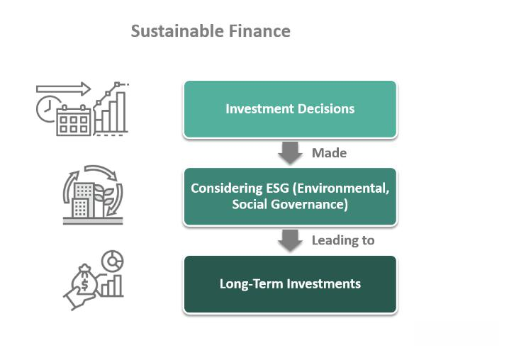

## Table of Contents

## What is the investment climate?

The investment climate refers to the overall conditions and environment that affect how easy or hard it is to invest money in a country or region. This includes things like the stability of the government, the strength of the economy, the rules and regulations for businesses, and how safe it is to invest there. If a place has a good investment climate, it means that investors feel confident and secure about putting their money there because they believe they can make a good return on their investment without too much risk.

On the other hand, a poor investment climate can make investors hesitant. This might happen if there is a lot of political unrest, if the economy is not doing well, or if the laws make it difficult to start and run a business. For example, if a country has a lot of corruption or if it changes its laws a lot, investors might worry that their money is not safe. Understanding the investment climate is important for anyone thinking about where to invest their money, as it helps them make smarter choices about where their money will be most secure and profitable.

## Why is the investment climate important for investors?

The investment climate is important for investors because it tells them how safe and profitable it might be to put their money into a certain place. If the investment climate is good, it means the country or region has a stable government, a strong economy, and clear rules for businesses. This makes investors feel confident that their money will be safe and that they can make a good return on their investment.

On the other hand, if the investment climate is bad, it can scare investors away. A bad investment climate might mean there is a lot of political trouble, the economy is weak, or the laws make it hard to do business. Investors might worry that their money could be lost or that they won't be able to get their profits back easily. So, understanding the investment climate helps investors decide where to put their money to get the best results with the least risk.

## How does the political stability of a country affect its investment climate?

Political stability is very important for a country's investment climate. When a country has a stable government, investors feel more confident. They believe that the rules and laws will stay the same, which makes it easier to plan and invest money. If a country is politically stable, it usually means there is less risk of sudden changes or surprises that could hurt investments. This makes investors more likely to put their money into businesses and projects in that country.

On the other hand, if a country has a lot of political unrest or changes in government, it can scare investors away. They might worry that new leaders will change the laws or that there could be violence or protests that make it hard to do business. When investors are unsure about what might happen, they often choose to invest their money somewhere safer. So, a country with political instability can have a harder time attracting investment, which can slow down its economic growth.

## What role do economic indicators play in assessing the investment climate?

Economic indicators are really important when you want to figure out the investment climate of a country. They are like signs that show how well the economy is doing. Things like the growth of the economy (GDP growth), how many people have jobs (unemployment rate), and how much prices are going up (inflation rate) tell investors a lot. If these signs are good, it means the economy is strong and stable, which makes investors feel safe about putting their money there. They believe they can make a good profit without too much risk.

On the other hand, if the economic indicators are not so good, it can make investors worried. For example, if the economy is not growing or if a lot of people are out of work, investors might think twice about investing. They might worry that their money won't be safe or that they won't make a profit. So, looking at these economic signs helps investors decide if a country is a good place to invest their money or if they should look somewhere else.

## How can regulatory frameworks influence the investment climate?

Regulatory frameworks are the rules and laws that businesses have to follow in a country. These rules can make a big difference in the investment climate. If the rules are clear and easy to understand, it helps investors feel more confident. They know what they need to do to start and run a business, and they can plan better. When the government makes it easy to get permits and licenses, and when taxes are fair, investors are more likely to put their money into that country. They believe they can make a good profit without too much hassle.

On the other hand, if the regulatory framework is complicated or changes a lot, it can scare investors away. If the rules are hard to follow or if they keep changing, investors might worry that they will have trouble running their business. They might also be concerned about getting into trouble with the law or having to pay a lot of money in fines. So, a country with a clear and stable regulatory framework is more likely to attract investment, while a country with confusing or changing rules might struggle to get investors interested.

## What are the key differences in investment climates between developed and emerging markets?

Developed markets usually have a strong and stable investment climate. This means they have steady governments, good economic signs, and clear rules for businesses. Investors feel safe putting their money into these countries because they think they can make a good profit without too much risk. For example, countries like the United States, Germany, and Japan have strong economies and stable laws, which make them attractive places to invest. The infrastructure, like roads and internet, is also good, which helps businesses run smoothly.

Emerging markets, on the other hand, can have a more risky investment climate. These countries are still growing and developing their economies, so they might have more political changes and economic ups and downs. The rules for businesses can be less clear or might change often, which can make investors worried. However, emerging markets can also offer big rewards because they are growing fast. Countries like Brazil, India, and China are examples of emerging markets where investors might find good opportunities, but they need to be careful because of the higher risks.

In summary, the main difference between the investment climates of developed and emerging markets is the level of stability and risk. Developed markets are generally safer and more predictable, while emerging markets can be more unpredictable but also offer higher potential returns. Investors need to think about these differences when deciding where to put their money.

## How do social and cultural factors impact the investment climate?

Social and cultural factors can really change how good or bad the investment climate is in a country. If people in a country are open to new ideas and like to try new things, it can make it easier for businesses to start and grow. This kind of culture can attract investors because they see that people are willing to buy new products and services. Also, if a country has a good education system, it means there are more smart people who can work in businesses, which is good for investors. On the other hand, if people in a country don't like change or are not open to new ideas, it can be harder for businesses to do well. This can make investors think twice about putting their money there.

Another important thing is how people in a country treat each other. If there is a lot of trust and fairness, it makes a better place for businesses to grow. Investors feel safer when they know that people will follow the rules and treat each other well. But if there is a lot of corruption or unfairness, it can scare investors away. They might worry that their money won't be safe or that they won't be treated fairly. So, the way people act and think in a country can make a big difference in whether investors want to put their money there.

## What are the effects of technological advancements on the investment climate?

Technological advancements can make the investment climate better by making it easier for businesses to start and grow. When a country has good technology, like fast internet and new tools, it helps businesses work more efficiently. This can attract investors because they see that businesses can make more money with less effort. For example, if a country has a lot of people using smartphones and the internet, businesses can reach more customers easily. This makes the country a more attractive place to invest in because investors believe they can make a good profit.

However, technology can also bring challenges to the investment climate. If a country is slow to adopt new technology, it might fall behind other countries. This can make investors worried because they might think the country won't be able to compete well in the future. Also, new technology can change industries very quickly, which can be risky for investors. They might be unsure about where to put their money because they don't know which businesses will do well with the new technology. So, while technology can make the investment climate better, it can also make it more unpredictable.

## How can investors use investment climate data to make informed decisions?

Investors can use investment climate data to make smart choices about where to put their money. By looking at things like how stable the government is, how well the economy is doing, and what the rules are for businesses, investors can figure out if a country is a safe place to invest. If the data shows that a country has a strong economy and clear laws, investors might feel more confident about putting their money there. They can also look at social and cultural factors, like how open people are to new ideas and how much they trust each other, to see if it's a good place for businesses to grow.

On the other hand, if the investment climate data shows a lot of risks, like political unrest or a weak economy, investors might decide to look for other places to invest. They can use this data to compare different countries and see which one offers the best chance for making a profit with the least risk. By keeping an eye on how things like technology and economic indicators are changing, investors can also stay ahead of trends and make better decisions about where to put their money in the future.

## What are some common tools and indices used to measure investment climate?

There are several common tools and indices that help measure the investment climate of a country. One popular tool is the World Bank's Ease of Doing Business Index. This index looks at how easy it is to start and run a business in a country by checking things like how long it takes to get permits, how easy it is to get loans, and how simple the tax system is. Another useful tool is the Corruption Perceptions Index by Transparency International, which measures how corrupt a country is seen to be. This is important because high levels of corruption can scare investors away.

Another important index is the Global Competitiveness Index by the World Economic Forum. This index looks at a country's overall competitiveness by considering things like its infrastructure, education system, and how well its businesses can innovate. The Heritage Foundation's Index of Economic Freedom also helps investors by measuring how free a country's economy is, looking at things like trade freedom, investment freedom, and property rights. By using these tools and indices, investors can get a good picture of the investment climate and make smarter decisions about where to put their money.

## How do global events and international relations affect the investment climate?

Global events and international relations can really change the investment climate in a country. When big things happen around the world, like wars or big economic changes, they can make investors worried. For example, if two countries are fighting, investors might be scared to put their money in either of those countries because they think it's too risky. Also, if countries put up trade barriers or have bad relations, it can make it harder for businesses to sell their products in other countries. This can slow down the economy and make investors think twice about investing.

On the other hand, good international relations can make the investment climate better. If countries work well together and have good trade agreements, it can help businesses grow and make more money. This makes investors feel more confident about putting their money into those countries. For example, if a country joins a big trade group, it can open up new markets for businesses, which can attract more investment. So, what happens around the world and how countries get along can have a big impact on whether investors want to put their money in a certain place.

## What strategies can countries implement to improve their investment climate?

Countries can improve their investment climate by making their government more stable and their economy stronger. If a country has a stable government, investors feel safer because they know the rules won't change suddenly. To do this, countries can work on having fair elections and making sure the government follows the law. They can also focus on growing their economy by helping businesses start and grow. This can be done by making it easier to get loans, building good roads and internet, and keeping taxes fair. When the economy is strong, investors believe they can make a good profit, which makes them more likely to invest.

Another way to improve the investment climate is by making the rules for businesses clear and easy to follow. If the laws are simple and don't change a lot, investors feel more confident. Countries can do this by making it easy to get permits and licenses, and by having a clear tax system. They can also fight corruption, which makes investors feel safer about putting their money in the country. By being open to new ideas and technology, countries can also attract more investment. When people are willing to try new things and the country has good technology, businesses can grow faster, which is good for investors.

## References & Further Reading

[1]: Bergstra, J., Bardenet, R., Bengio, Y., & Kégl, B. (2011). ["Algorithms for Hyper-Parameter Optimization."](https://dl.acm.org/doi/10.5555/2986459.2986743) Advances in Neural Information Processing Systems 24.

[2]: ["Advances in Financial Machine Learning"](https://www.amazon.com/Advances-Financial-Machine-Learning-Marcos/dp/1119482089) by Marcos Lopez de Prado

[3]: ["Evidence-Based Technical Analysis: Applying the Scientific Method and Statistical Inference to Trading Signals"](https://www.amazon.com/Evidence-Based-Technical-Analysis-Scientific-Statistical/dp/0470008741) by David Aronson

[4]: ["Machine Learning for Algorithmic Trading"](https://github.com/stefan-jansen/machine-learning-for-trading) by Stefan Jansen

[5]: ["Quantitative Trading: How to Build Your Own Algorithmic Trading Business"](https://www.amazon.com/Quantitative-Trading-Build-Algorithmic-Business/dp/1119800064) by Ernest P. Chan