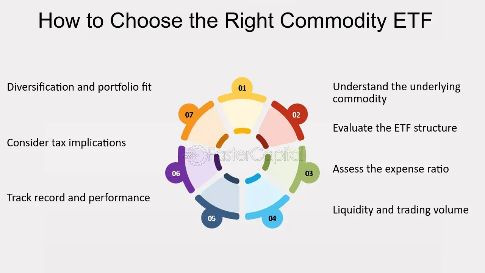

## Table of Contents

## What are commodity ETFs and how do they work?

Commodity ETFs, or Exchange-Traded Funds, are investment funds that focus on commodities like gold, oil, or agricultural products. These ETFs allow investors to buy and sell shares of the fund on a stock exchange, just like they would with stocks. Instead of investing in a single commodity, commodity ETFs usually hold a basket of different commodities or commodity-related financial instruments, like futures contracts. This diversification can help spread out the risk that comes with investing in just one commodity.

When you invest in a commodity ETF, you're not actually buying the physical commodities themselves. Instead, the ETF might invest in futures contracts, which are agreements to buy or sell a commodity at a set price on a future date. The value of the ETF goes up or down based on the prices of these commodities or futures contracts. This makes it easier for individual investors to gain exposure to commodities without having to deal with the complexities of trading futures or storing physical goods.

## What are the benefits of investing in commodity ETFs?

Investing in commodity ETFs can help spread out your investment risk. Instead of putting all your money into one thing, like gold or oil, you can invest in a mix of different commodities. This way, if one commodity's price goes down, the others might go up, balancing things out. It's like not putting all your eggs in one basket.

Another benefit is that commodity ETFs are easy to buy and sell. You can trade them on the stock market just like you would with regular stocks. This means you don't have to worry about the hassle of buying and storing physical commodities. Plus, you can start investing with a small amount of money, making it easier for more people to get into the commodity market.

## What are the risks associated with commodity ETFs?

Investing in commodity ETFs can be risky because commodity prices can go up and down a lot. Things like weather, political events, or changes in supply and demand can make commodity prices change quickly. If you invest in a commodity [ETF](/wiki/etf-trading-strategies) and the prices of the commodities it holds go down, the value of your investment will go down too. This can be a big problem if you need to sell your investment when the prices are low.

Another risk is that commodity ETFs often use futures contracts to track commodity prices. Futures contracts are agreements to buy or sell a commodity at a set price in the future. But the price of these futures can be different from the actual price of the commodity. This difference, called "contango" or "backwardation," can affect the performance of the ETF. If the ETF has to keep rolling over futures contracts at higher prices, it can lose money over time, even if the commodity prices stay the same or go up a little.

## How do commodity ETFs differ from other types of ETFs?

Commodity ETFs are different from other types of ETFs because they focus on commodities like gold, oil, or agricultural products. Most other ETFs invest in stocks, bonds, or a mix of different assets. Commodity ETFs usually don't buy the actual commodities but instead use futures contracts, which are agreements to buy or sell a commodity at a set price in the future. This is different from stock ETFs, which buy shares of companies, or bond ETFs, which invest in government or corporate bonds.

Another way commodity ETFs differ is in how they are affected by market changes. Commodity prices can be very volatile, meaning they can go up and down a lot because of things like weather, political events, or changes in supply and demand. This makes commodity ETFs riskier than ETFs that invest in more stable assets like stocks or bonds. Also, the use of futures contracts in commodity ETFs can lead to something called "contango" or "backwardation," which can affect the ETF's performance in ways that don't happen with other types of ETFs.

## What are some popular commodity ETFs available in the market?

Some popular commodity ETFs include the SPDR Gold Shares (GLD) and the iShares Silver Trust (SLV). These ETFs focus on precious metals like gold and silver. They are easy ways for people to invest in these metals without having to buy and store the physical stuff. The GLD ETF tracks the price of gold, while the SLV ETF follows the price of silver. Both are well-known and widely used by investors who want to add some gold or silver to their investment mix.

Another popular commodity ETF is the United States Oil Fund (USO), which focuses on oil. This ETF uses futures contracts to track the price of West Texas Intermediate (WTI) light, sweet [crude oil](/wiki/crude-oil). It's a good choice for people who want to invest in oil without dealing with the complexities of the oil market. The USO ETF can be a bit riskier because oil prices can change a lot due to things like political events or changes in supply and demand.

There are also ETFs that invest in a mix of different commodities, like the Invesco DB Commodity Index Tracking Fund (DBC). This ETF holds futures contracts for a variety of commodities, including oil, gold, corn, and more. It's a good option for investors who want to spread their risk across different types of commodities. By investing in the DBC, you can get exposure to a broad range of commodities without having to pick and choose individual ones.

## How can commodity ETFs be used to diversify an investment portfolio?

Commodity ETFs can help you spread out your investment risk by adding different types of assets to your portfolio. Instead of just investing in stocks or bonds, you can also invest in things like gold, oil, or agricultural products. This mix can help balance your investments because commodities often don't move in the same way as stocks or bonds. For example, if the stock market goes down, the price of gold might go up, which can help protect your overall investment.

Using commodity ETFs for diversification is also easy because you can buy and sell them just like stocks. You don't have to worry about storing physical commodities or dealing with the complexities of futures contracts. By adding commodity ETFs to your portfolio, you can get exposure to a wide range of commodities without having to pick and choose individual ones. This can make your investments more stable and help you manage risk better.

## What factors should be considered when choosing a commodity ETF?

When choosing a commodity ETF, it's important to think about what kind of commodities you want to invest in. Some ETFs focus on just one commodity, like gold or oil, while others invest in a mix of different commodities. If you want to spread out your risk, you might choose an ETF that holds a variety of commodities. But if you have a strong belief that a specific commodity will do well, you might pick an ETF that focuses on that one. Also, consider the fees of the ETF. Some ETFs have higher fees than others, and these costs can eat into your returns over time.

Another thing to think about is how the ETF tracks the price of commodities. Many commodity ETFs use futures contracts, which can be affected by something called "contango" or "backwardation." These terms mean that the price of futures can be different from the actual price of the commodity, and this can impact the ETF's performance. If you're worried about this, you might look for ETFs that use different methods, like holding physical commodities or investing in commodity-related companies. Finally, consider the [liquidity](/wiki/liquidity-risk-premium) of the ETF. An ETF that trades a lot is easier to buy and sell, which can be important if you need to get your money out quickly.

## How do commodity prices affect the performance of commodity ETFs?

Commodity prices have a big impact on how well commodity ETFs do. When the prices of the commodities that an ETF holds go up, the value of the ETF usually goes up too. For example, if an ETF focuses on gold and the price of gold rises, the ETF's value will likely increase. On the other hand, if commodity prices fall, the ETF's value will go down. This is because the ETF's performance is tied to the prices of the commodities it tracks, whether it's oil, gold, or agricultural products.

But it's not just about the current price of the commodity. Many commodity ETFs use futures contracts, which are agreements to buy or sell a commodity at a set price in the future. The price of these futures can be different from the actual price of the commodity, and this difference can affect the ETF's performance. If the ETF has to keep rolling over futures contracts at higher prices, it can lose money over time, even if the commodity prices stay the same or go up a little. So, understanding how commodity prices and futures work is important when investing in commodity ETFs.

## What are the tax implications of investing in commodity ETFs?

When you invest in commodity ETFs, you need to think about taxes. Commodity ETFs are often treated differently than stock or bond ETFs for tax purposes. If a commodity ETF uses futures contracts, it might be taxed as a "collectibles" fund, which means you could pay a higher tax rate on your gains. Instead of the usual long-term capital gains rate of 15% or 20%, you might have to pay up to 28%. This can make a big difference in how much you keep after taxes.

Also, some commodity ETFs might give you a special form called a K-1 at tax time instead of the usual 1099 form. The K-1 form can be more complicated and might delay your tax filing. It's a good idea to talk to a tax professional to understand how your commodity ETF investments will affect your taxes. They can help you figure out the best way to handle your investments and taxes.

## How do macroeconomic trends influence commodity ETFs?

Macroeconomic trends can have a big impact on commodity ETFs. Things like inflation, interest rates, and economic growth can change the demand and supply of commodities, which in turn affects their prices. For example, when inflation goes up, people might want to invest in commodities like gold as a way to protect their money. This can make the price of gold go up, and if a commodity ETF holds gold, its value will likely go up too. On the other hand, if the economy is doing badly and people are buying less, the demand for commodities like oil or copper might go down, which can lower their prices and the value of related ETFs.

Another way macroeconomic trends can influence commodity ETFs is through changes in currency values. If the U.S. dollar gets weaker, commodities that are priced in dollars, like oil, might become cheaper for people using other currencies. This can increase demand and push up commodity prices, which would be good for commodity ETFs. Also, big events like geopolitical tensions or natural disasters can mess with supply chains and affect commodity prices. For instance, if there's a war in an oil-producing country, it might disrupt oil supplies and cause prices to spike, impacting the performance of oil-focused ETFs.

## What are the strategies for trading commodity ETFs?

One strategy for trading commodity ETFs is to use a long-term buy-and-hold approach. This means you buy the ETF and keep it for a long time, hoping that the price of the commodities it holds will go up over time. This strategy works well if you believe in the long-term value of the commodities, like gold or oil. It's good for people who don't want to check their investments every day and are okay with waiting for their investments to grow slowly. But remember, commodity prices can be very up and down, so you need to be ready for some bumps along the way.

Another strategy is to trade commodity ETFs more actively, trying to make money from short-term price changes. This means you might buy and sell the ETF more often, trying to guess when the price will go up or down. This can be riskier because it's hard to predict short-term price movements, but it can also be more exciting and potentially more rewarding if you get it right. You'll need to keep a close eye on things like supply and demand, economic reports, and even the weather, because all these things can affect commodity prices quickly.

A third strategy is to use commodity ETFs to hedge against other investments. This means you use them to protect your portfolio from losses. For example, if you have a lot of money in stocks, you might buy a commodity ETF that focuses on gold. If the stock market goes down, the price of gold might go up, which can help balance out your losses. This strategy is good for people who want to make their investments more stable and less risky. It's like having a safety net for your other investments.

## How can one assess the performance and track record of a commodity ETF?

To assess the performance and track record of a commodity ETF, you should first look at its historical returns. This means checking how the ETF has done over different time periods, like the past year, three years, or five years. You can find this information on financial websites or the ETF's own website. It's important to compare the ETF's returns to a relevant benchmark, like a commodity index, to see if it's doing better or worse than the market. Also, look at the ETF's [volatility](/wiki/volatility-trading-strategies), which shows how much its price goes up and down. A high volatility means the ETF's price can change a lot, which can be riskier.

Another thing to consider is the expense ratio of the ETF, which is the fee you pay for owning it. A lower expense ratio means you keep more of your returns, so it's good to compare different ETFs to see which one has the lowest fees. You should also read the ETF's prospectus, which is a document that explains what the ETF invests in and how it works. This can help you understand if the ETF matches your investment goals. Finally, look at the ETF's trading [volume](/wiki/volume-trading-strategy), which shows how many shares are bought and sold each day. A higher trading volume means the ETF is more liquid, making it easier to buy and sell without affecting the price too much.

## References & Further Reading

[1]: Castura, J., & de Prado, M. L. (2015). ["Optimal Inputs for Fast Momentum Trading Strategies."](https://www.cambridge.org/core/books/machine-learning-for-asset-managers/6D9211305EA2E425D33A9F38D0AE3545) Journal of Portfolio Management.

[2]: DeVille, L. (2008). ["Exchange-Traded Funds: History, Trading, and Research."](https://link.springer.com/chapter/10.1007/978-0-387-76682-9_4) Financial Analysts Journal, 64(6), 80-101.

[3]: Gorton, G., Hayashi, F., & Rouwenhorst, K. G. (2012). ["The Fundamentals of Commodity Futures Returns."](https://www.nber.org/papers/w13249) Review of Finance, 17(1), 35-105.

[4]: Liu, B., & Zhang, J. (2017). ["A Comprehensive Review on Commodity Futures Markets and Commodity ETFs."](https://onlinelibrary.wiley.com/doi/10.1002/fut.22115) IEEE Journal of Selected Topics in Signal Processing.

[5]: Narang, R. K. (2013). ["Inside the Black Box: A Simple Guide to Quantitative and High-Frequency Trading."](https://onlinelibrary.wiley.com/doi/book/10.1002/9781118662717) Wiley Trading Series.