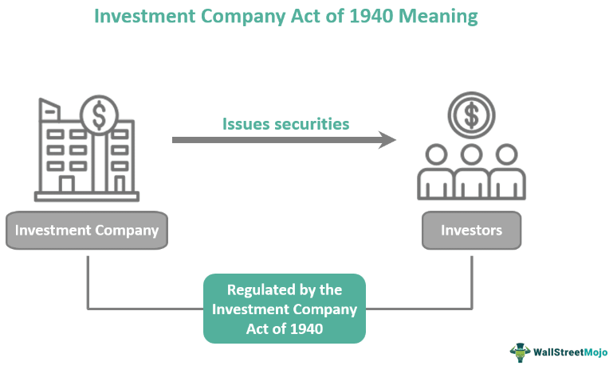

## Table of Contents

## What is the Investment Company Act of 1940?

The Investment Company Act of 1940 is a law in the United States that helps protect people who invest in mutual funds and other types of investment companies. It was created to make sure that these companies are honest and fair with their investors. The law sets rules that investment companies must follow, like how they can invest money, what they need to tell investors, and how they should be managed.

This law is important because it helps keep the investment industry safe and trustworthy. It makes sure that investment companies give clear information to people about where their money is going and how it is being used. By doing this, the law helps prevent fraud and other bad practices that could harm investors. Overall, the Investment Company Act of 1940 plays a big role in making sure that people can invest their money with confidence.

## Why was the Investment Company Act of 1940 created?

The Investment Company Act of 1940 was created because of problems that happened during the Great Depression. Many people lost their money because some investment companies were not honest and did not follow good practices. The government saw that investors needed more protection, so they made this law to set strict rules for investment companies. It was a way to make sure that these companies would be more honest and fair in the future.

The law was also made to help rebuild trust in the investment industry. Before the law, many people were afraid to invest their money because they did not know if it would be safe. The Investment Company Act of 1940 helped by making rules that forced investment companies to be more open about their actions and investments. This way, people could feel more confident that their money was being handled properly and that they were being told the truth about where it was going.

## What types of companies does the Investment Company Act of 1940 regulate?

The Investment Company Act of 1940 regulates different types of companies that manage and invest money for people. These companies include mutual funds, closed-end funds, and unit investment trusts. A mutual fund pools money from many investors to buy a variety of stocks, bonds, or other securities. A closed-end fund is similar but has a fixed number of shares that trade on a stock exchange. A unit investment trust is a type of investment company that buys and holds a set of securities and does not actively trade them.

The law also covers other types of investment companies like face-amount certificate companies and management companies. Face-amount certificate companies issue certificates that promise to pay a certain amount of money in the future. Management companies are companies that manage the investments of their clients, making decisions about buying and selling securities. By setting rules for these companies, the Investment Company Act of 1940 helps make sure that they are honest and fair with the people who invest their money with them.

## What are the main provisions of the Investment Company Act of 1940?

The Investment Company Act of 1940 has several important rules to protect people who invest their money. One main rule is that investment companies must be honest and clear about what they do with the money they manage. They have to give investors a lot of information, like what they are investing in and how much it costs to invest. This helps people make smart choices about where to put their money. Another rule is about how investment companies can invest. They have to follow certain limits on what they can buy and how much they can borrow. This keeps them from taking too many risks with people's money.

Another important part of the law is about how investment companies are run. The law says that these companies need to have a board of directors, and most of the board members should not work for the company. This helps make sure the board can watch over the company and make sure it is doing the right thing. The law also has rules about how much people who work for the company can be paid. This stops them from making too much money in ways that might hurt the investors. Overall, these rules help make sure that investment companies treat their investors fairly and keep their money safe.

## How does the Act define an 'investment company'?

The Investment Company Act of 1940 defines an 'investment company' as a company that is in the business of investing, holding, or trading in securities. This means that if a company's main job is to buy and sell stocks, bonds, or other types of investments, it is considered an investment company under the law. The Act looks at what the company does with its money to decide if it fits this definition. If more than 40% of a company's assets are invested in securities, it might be seen as an investment company.

There are different kinds of investment companies under the Act, like mutual funds, closed-end funds, and unit investment trusts. A mutual fund pools money from many investors to buy a variety of securities. A closed-end fund is similar but has a fixed number of shares that trade on a stock exchange. A unit investment trust holds a set of securities and does not actively trade them. The Act makes sure these companies follow rules to protect the people who invest their money in them.

## What is the difference between a 'face-amount certificate company', 'unit investment trust', and 'management company' under the Act?

A 'face-amount certificate company' is a type of investment company that sells certificates to people. These certificates promise to pay back a certain amount of money plus interest after a set time. It's like a loan where the company borrows money from people and then pays it back later with some extra money. The main thing about these companies is that they deal with these special certificates, which is different from other investment companies.

A 'unit investment trust' is another type of investment company, but it works differently. It takes money from investors and uses it to buy a fixed set of securities, like stocks or bonds. Once the trust is set up, it doesn't change its investments much. It just holds onto the securities until the trust ends. This makes it a more passive type of investment company compared to others that might actively buy and sell securities.

A 'management company' is an investment company that actively manages the money it gets from investors. It makes decisions about what to buy and sell, trying to make the best return for the people who invested. There are two kinds of management companies: open-end and closed-end. An open-end company, like a mutual fund, can keep selling new shares to new investors. A closed-end company has a fixed number of shares that trade on a stock exchange. Both types actively manage their investments, which is the key difference from unit investment trusts.

## What are the exemptions from the Investment Company Act of 1940?

The Investment Company Act of 1940 has some rules that let certain companies not have to follow all of its rules. These are called exemptions. One big exemption is for companies that do not mainly invest in securities. If a company uses less than 40% of its money to buy stocks, bonds, or other securities, it might not be considered an investment company and does not have to follow the Act's rules. Another exemption is for companies that are owned by a small group of people. If a company has less than 100 investors and does not plan to sell its shares to the public, it can be exempt from the Act.

There are also special exemptions for certain types of companies. For example, banks, insurance companies, and some types of pension funds do not have to follow the Act because they are already regulated by other laws. Another exemption is for companies that only invest in certain types of securities, like government securities. These companies can be exempt if they meet specific conditions set by the Act. These exemptions help make sure that the Act only applies to companies that really need to be watched closely to protect investors.

## How does the Act protect investors?

The Investment Company Act of 1940 helps protect investors by making sure investment companies are honest and fair. The law says that these companies must give clear information to people about where their money is going and how it's being used. This way, people can make smart choices about where to invest their money. The Act also sets rules on how much risk investment companies can take with the money they manage. By limiting how much they can borrow and what kinds of investments they can make, the law helps keep people's money safe.

Another way the Act protects investors is by making sure investment companies are run properly. It says that these companies need to have a board of directors, and most of these directors should not work for the company. This helps make sure the board can watch over the company and make sure it's doing the right thing. The law also has rules about how much people who work for the company can be paid. This stops them from making too much money in ways that might hurt the investors. Overall, these rules help make sure that investment companies treat their investors fairly and keep their money safe.

## What are the reporting and disclosure requirements under the Investment Company Act of 1940?

The Investment Company Act of 1940 has rules that make investment companies tell investors a lot of important information. They have to give out something called a prospectus, which is a document that explains what the company does with the money it gets from investors. The prospectus tells people about the risks of investing, how much it costs to invest, and what the company plans to invest in. This helps people understand what they are getting into before they decide to invest their money. Investment companies also have to keep updating this information, so if anything changes, they let investors know.

Another important part of the Act is that investment companies have to file regular reports with the Securities and Exchange Commission (SEC). These reports give details about the company's finances, how well its investments are doing, and any big changes that happen. The reports help the SEC keep an eye on the company and make sure it's following the rules. By making these reports public, the Act helps investors stay informed about what's happening with their money and feel more confident that the company is being honest and fair.

## How has the Investment Company Act of 1940 evolved since its enactment?

Since it was made in 1940, the Investment Company Act has changed a lot to keep up with new ways of investing and new rules. One big change happened in 1970 when the law was updated to make sure investment companies were even more honest and fair. This update made the rules about what companies need to tell investors even stricter. It also added new rules about how much companies can charge investors for managing their money. Over the years, there have been many more updates to keep the law working well with new types of investments like exchange-traded funds (ETFs) and to make sure it still protects people as the world changes.

Another important change came in 1996 with the National Securities Markets Improvement Act. This law made it easier for investment companies to work across different states by having one main set of rules from the SEC. It also helped make the rules about how companies can invest money more clear and easier to follow. Since then, the SEC has kept making small changes to the Investment Company Act to make sure it keeps up with new technology and ways of investing. All these changes help make sure the law still does a good job of protecting people who invest their money.

## What are the penalties for non-compliance with the Investment Company Act of 1940?

If an investment company does not follow the rules of the Investment Company Act of 1940, it can get into big trouble. The Securities and Exchange Commission (SEC) can make the company stop what it's doing wrong and fix it. They can also make the company pay money as a fine. If people who work for the company break the rules on purpose, they might have to pay fines too, and they could even go to jail. The fines can be a lot of money, and going to jail can be for a long time, like up to five years.

The SEC also has the power to take away the company's license to work as an investment company. This means the company would not be allowed to keep managing people's money. If the company keeps breaking the rules, the SEC can take it to court. The court can then decide to make the company stop what it's doing, pay even bigger fines, or even shut down the company completely. All these penalties are there to make sure investment companies follow the rules and treat their investors fairly.

## How does the Investment Company Act of 1940 interact with other financial regulations?

The Investment Company Act of 1940 works together with other financial rules to make sure that people's investments are safe. One important rule it works with is the Securities Act of 1933. This law makes sure that companies tell the truth about the investments they are selling. The Investment Company Act adds to this by making sure that investment companies also tell the truth about what they do with the money they get from investors. Another rule it works with is the Investment Advisers Act of 1940. This law makes sure that people who give investment advice are honest and fair. The Investment Company Act helps by making sure the companies these advisers work with follow strict rules too.

The Investment Company Act also connects with the Securities Exchange Act of 1934. This law helps control how stocks and other investments are bought and sold. The Investment Company Act makes sure that the companies that manage these investments are honest and fair. Together, these laws help keep the whole investment world safe and trustworthy. By working together, all these rules help make sure that people can invest their money without worrying too much about being cheated or losing their money because of dishonest companies.

## References & Further Reading

[1]: ["The New Laws of the Stock Market Jungle: An Insider's Guide to Successful Investing in a Changing World"](https://www.amazon.com/New-Laws-Stock-Market-Jungle/dp/032124785X) by Michael J. Panzner

[2]: ["The Investment Company Act of 1940: Regulation and Taxation"](https://en.wikipedia.org/wiki/Investment_Company_Act_of_1940) by Tamar Frankel

[3]: Securities and Exchange Commission. (2009). ["An Introduction to Investment Companies"](https://crsreports.congress.gov/product/pdf/IF/IF11714).

[4]: Hasbrouck, J. (2003). ["Intraday Price Formation in U.S. Equity Markets"](https://onlinelibrary.wiley.com/doi/10.1046/j.1540-6261.2003.00609.x). The Journal of Finance, 58(6), 2375-2400.

[5]: U.S. Securities and Exchange Commission. (2013). ["SEC Adopts New Measures to Enhance Market Stability and Transparency"](https://www.sec.gov/rules-regulations/statutes-regulations). 

[6]: ["Algorithmic and High-Frequency Trading"](https://assets.cambridge.org/97811070/91146/frontmatter/9781107091146_frontmatter.pdf) by Alvaro Cartea, Sebastian Jaimungal, and José Penalva