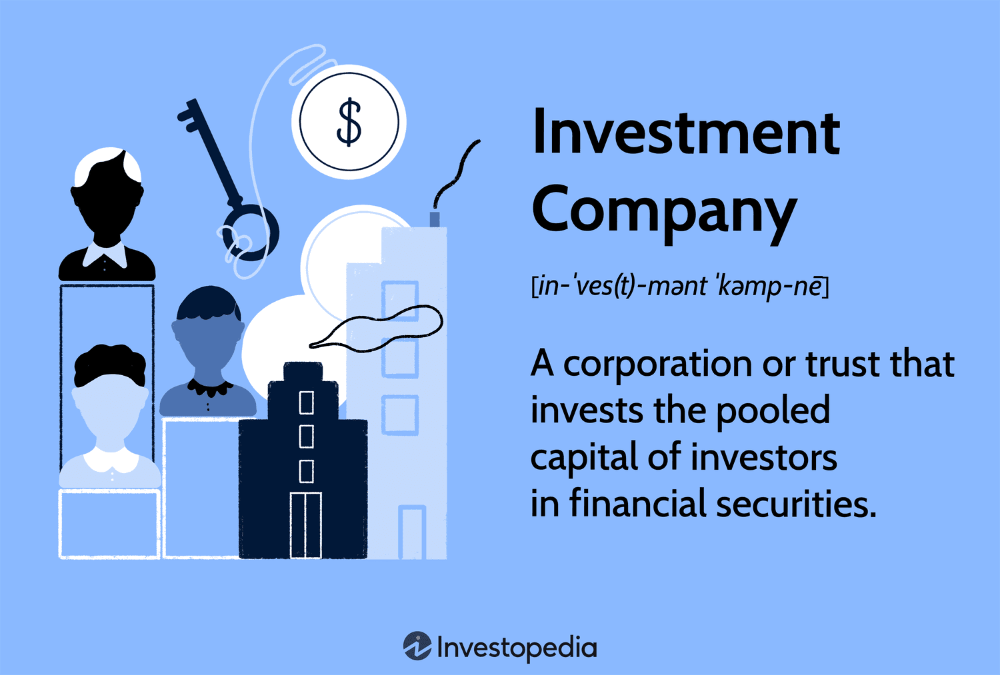

## Table of Contents

## What is an investment company?

An investment company is a business that collects money from many people and uses it to buy different kinds of investments, like stocks, bonds, or real estate. These companies help people who want to invest their money but don't know how to do it themselves. By pooling everyone's money together, the investment company can buy a variety of investments, which helps spread out the risk.

There are different types of investment companies, such as mutual funds, closed-end funds, and unit investment trusts. Each type works a bit differently, but they all aim to make money for the people who invest in them. The investment company is managed by professionals who decide which investments to buy and sell, trying to make the best returns for the investors.

## What are the different types of investment companies?

Investment companies come in different forms, each with its own way of working. One common type is a mutual fund. Mutual funds collect money from many investors and use it to buy a mix of stocks, bonds, or other assets. They are managed by professionals who decide what to buy and sell. Investors can buy or sell shares of the mutual fund at the end of each trading day based on the fund's net asset value.

Another type is a closed-end fund. Unlike mutual funds, closed-end funds have a fixed number of shares that are traded on stock exchanges just like regular stocks. The price of these shares can be higher or lower than the value of the investments the fund holds. This means the price can be affected by supply and demand, not just the value of the assets inside the fund.

Lastly, there are unit investment trusts (UITs). UITs are like mutual funds but they don't have a professional manager actively buying and selling assets. Instead, they hold a fixed portfolio of securities for a set period of time. Once the UIT is set up, it doesn't change its investments until it reaches its end date. This makes UITs a bit more predictable but less flexible than mutual funds or closed-end funds.

## How does an investment company make money?

An investment company makes money in a few ways. One way is by charging fees to the people who invest in it. These fees can be called management fees, and they pay for the work the professionals do to pick and manage the investments. Another type of fee is called a load, which is charged when someone buys or sells shares of the fund. These fees add up and help the investment company make money.

Another way an investment company makes money is by [earning](/wiki/earning-announcement) money from the investments it holds. For example, if the company invests in stocks that pay dividends, it can keep some of that money. If the company invests in bonds, it can keep the interest payments. The company can also make money if it sells an investment for more than it paid for it. All these earnings help the investment company make money and keep running.

Some investment companies also make money through other services they offer. For example, they might provide financial advice or other investment products that people pay for. These extra services can bring in more money for the company. Overall, investment companies use a mix of fees, investment earnings, and other services to make money and keep their business going.

## What are the benefits of investing through an investment company?

Investing through an investment company can make things easier for you. They have experts who know a lot about investing. These experts pick and manage the investments for you, so you don't have to do all the work yourself. This can be really helpful if you don't know much about investing or if you don't have the time to do it. Also, because the investment company pools money from many people, they can buy a variety of investments. This helps spread out the risk, so if one investment does badly, it won't hurt your whole investment as much.

Another benefit is that investment companies often let you start with a small amount of money. This means you don't need a lot of money to start investing. They also make it easy to buy and sell shares of their funds, so you can change your investments when you need to. Plus, they give you regular updates on how your investments are doing, which helps you keep track of your money. Overall, using an investment company can help you invest more easily, safely, and with less work.

## What are the risks associated with investment companies?

Investing through an investment company can be risky. One big risk is that the value of your investments can go down. If the stocks, bonds, or other things the company buys don't do well, you could lose money. Also, the fees that investment companies charge can add up over time. These fees might eat into your profits, so you end up with less money than you expected.

Another risk is that you might not have much control over your investments. When you invest through an investment company, you're trusting the professionals to make good choices. But sometimes, they might make bad decisions or focus on things that don't match what you want. This means your money might not be used in the way you hoped. It's important to understand these risks before you decide to invest through an investment company.

## How do you choose the right investment company?

Choosing the right investment company can be tricky, but it's important to think about what you want. First, look at the fees they charge. Some companies have high fees that can eat into your profits, so it's good to find one with lower fees. Also, think about the kind of investments they make. Do they focus on stocks, bonds, or something else? Make sure their focus matches what you want to invest in. It's also a good idea to check their past performance. While past results don't guarantee future success, it can give you an idea of how well they've done before.

Another thing to consider is the company's reputation and how easy it is to work with them. Read reviews and see what other people say about their experiences. A company with a good reputation is usually a safer bet. Also, think about how easy it is to buy and sell investments with them. Some companies make it simple, while others can be more complicated. Lastly, make sure the company is clear about what they do and how they do it. A good investment company will explain things in a way that's easy to understand, so you know exactly where your money is going.

## What is the difference between a mutual fund and an investment company?

A mutual fund is a type of investment company, but not all investment companies are mutual funds. A mutual fund is a specific kind of investment company that pools money from many investors to buy a mix of stocks, bonds, or other assets. It's managed by professionals who decide what to buy and sell. Investors can buy or sell shares of the mutual fund at the end of each trading day based on the fund's net asset value. So, a mutual fund is a way for people to invest together in a managed portfolio of securities.

An investment company, on the other hand, is a broader term that includes mutual funds but also other types of companies. For example, there are closed-end funds and unit investment trusts, which work differently from mutual funds. Closed-end funds have a fixed number of shares that trade on stock exchanges like regular stocks, and their price can be higher or lower than the value of the investments they hold. Unit investment trusts hold a fixed portfolio of securities for a set time and don't have active management. So, while a mutual fund is a type of investment company, the term "investment company" covers a wider range of investment options.

## How are investment companies regulated?

Investment companies are watched over by government groups to make sure they play fair and keep investors safe. In the United States, the main group that does this is the Securities and Exchange Commission, or SEC. The SEC makes rules that investment companies have to follow. These rules say things like how much the companies can charge in fees, what they have to tell investors about their investments, and how they should handle money. The SEC checks to make sure investment companies are following these rules and can punish them if they don't.

Other countries have their own groups that do the same thing. For example, in the UK, the Financial Conduct Authority (FCA) watches over investment companies. These groups work to keep the investing world honest and safe. They make sure that investment companies are clear about what they're doing with people's money and that they're not taking too much risk. This helps people feel more confident when they invest their money through these companies.

## What role do investment companies play in the financial market?

Investment companies play a big role in the financial market. They help people invest their money by pooling it together and buying different kinds of investments like stocks and bonds. This way, even people who don't know a lot about investing can put their money into the market. Investment companies make it easier for people to start investing with less money and less work. They also help spread out the risk by buying a mix of investments, so if one thing does badly, it doesn't hurt the whole investment as much.

These companies also help keep the financial market running smoothly. By buying and selling lots of stocks and bonds, they help make sure there's always someone to buy or sell. This is important because it keeps the market stable. Investment companies also give people a lot of choices for where to put their money. This means more money can move around in the market, which helps the economy grow. Overall, investment companies are key players that help both individual investors and the whole financial market.

## How do investment companies manage their portfolios?

Investment companies manage their portfolios by having experts pick and choose what to buy and sell. These experts, called portfolio managers, look at a lot of information to decide which stocks, bonds, or other investments are good to buy. They think about things like how well a company is doing, what's happening in the economy, and what other investors are doing. They want to make sure the portfolio has a good mix of investments so it's not too risky. If they think an investment isn't doing well, they might sell it and buy something else they think will do better.

Sometimes, investment companies use computers and special math to help manage the portfolio. This is called quantitative analysis. The computers can look at a lot of data quickly and find patterns that humans might miss. This can help the portfolio managers make better decisions. But even with computers, the final choices are usually made by people. The goal is always to make the portfolio grow and make money for the investors, while also trying to keep the risk low.

## What advanced strategies do investment companies use to maximize returns?

Investment companies use some smart tricks to try to make more money for their investors. One trick is called "active management." This means the people running the company are always looking at the market and trying to pick the best investments. They might buy and sell things a lot, trying to get the best deals. Another trick is "hedging." This is like buying insurance for their investments. If they think something might go wrong, they can use other investments to protect their money. It's like having a safety net.

Another way investment companies try to make more money is by using "leverage." This means they borrow money to buy more investments. If the investments do well, they can make a lot more money. But it's risky because if the investments do badly, they could lose a lot. Some companies also use "sector rotation," which means they move their money from one part of the market to another. They try to guess which parts of the market will do well and put their money there. All these tricks are used to try to beat the market and make more money for investors, but they can also make things more complicated and risky.

## How can one evaluate the performance of an investment company?

To evaluate how well an investment company is doing, you should look at how much money their investments have made over time. This is called their "return." You can compare the return of the investment company to a benchmark, like the S&P 500, which is a big group of stocks that shows how the overall market is doing. If the investment company's return is higher than the benchmark, they're doing a good job. But if it's lower, they might not be doing as well as they could. It's also important to look at how much risk they took to get that return. A high return might look good, but if they took a lot of risk to get it, it might not be worth it.

Another thing to think about is the fees the investment company charges. These fees can eat into your profits, so a company with lower fees might be better, even if their return is a bit lower. You can also look at how steady their returns are. If their returns go up and down a lot, it might be riskier than a company with more steady returns. Finally, it's good to read reviews and see what other people say about the company. If a lot of people are happy with them, it's a good sign. But if there are a lot of complaints, you might want to look at other companies.

## References & Further Reading

[1]: Bergstra, J., Bardenet, R., Bengio, Y., & Kégl, B. (2011). ["Algorithms for Hyper-Parameter Optimization."](https://papers.nips.cc/paper/4443-algorithms-for-hyper-parameter-optimization) Advances in Neural Information Processing Systems 24.

[2]: ["Advances in Financial Machine Learning"](https://www.amazon.com/Advances-Financial-Machine-Learning-Marcos/dp/1119482089) by Marcos Lopez de Prado

[3]: ["Evidence-Based Technical Analysis: Applying the Scientific Method and Statistical Inference to Trading Signals"](https://www.amazon.com/Evidence-Based-Technical-Analysis-Scientific-Statistical/dp/0470008741) by David Aronson

[4]: ["Machine Learning for Algorithmic Trading"](https://github.com/stefan-jansen/machine-learning-for-trading) by Stefan Jansen

[5]: ["Quantitative Trading: How to Build Your Own Algorithmic Trading Business"](https://www.amazon.com/Quantitative-Trading-Build-Algorithmic-Business/dp/1119800064) by Ernest P. Chan