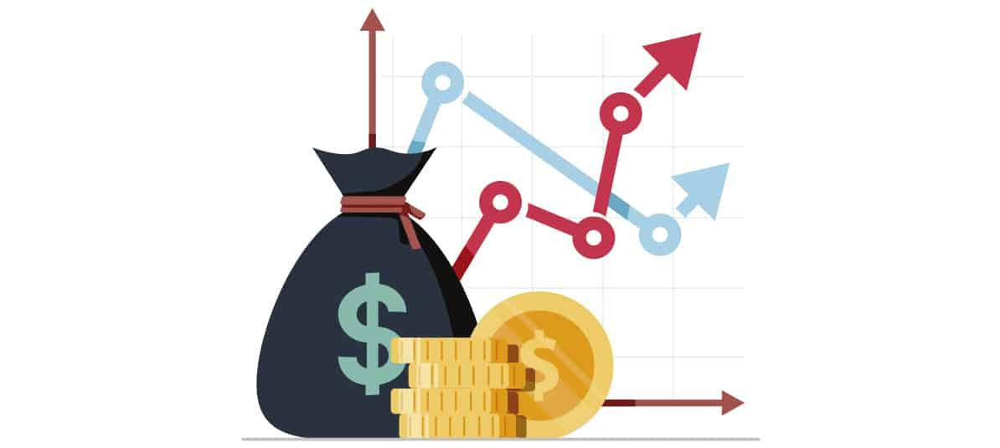

## Table of Contents

## What are investment costs?

Investment costs are the expenses you pay when you put money into something to make more money later. These costs can include things like fees for buying stocks, charges for managing your investments, and taxes you might have to pay. When you decide to invest, it's important to know about these costs because they can affect how much money you make in the end.

For example, if you buy a stock, you might have to pay a fee to the broker who helps you buy it. If you invest in a mutual fund, there might be a management fee that the fund charges every year. These fees can add up over time and reduce the amount of money you earn from your investments. Knowing about these costs can help you choose investments that are more likely to give you a good return on your money.

## Why are investment costs important to consider?

Investment costs are important to consider because they can eat into the money you earn from your investments. If you pay a lot in fees and charges, you might end up with less money than you expected, even if your investments do well. For example, if you invest $1,000 and your investment grows by 10%, you should have $1,100. But if you have to pay $50 in fees, you'll only have $1,050. That's a big difference!

Knowing about investment costs can also help you make smarter choices about where to put your money. Some investments have high fees but might not give you a good return. Others might have lower fees and could be a better choice. By understanding the costs, you can pick investments that are more likely to help you reach your financial goals. It's like shopping for groceries – you want to get the best value for your money.

## What are the different types of investment costs?

Investment costs can be broken down into different types. One common type is transaction fees. These are charges you pay when you buy or sell an investment, like stocks or bonds. Another type is management fees, which are what you pay to have someone else manage your investments, like in a mutual fund or an exchange-traded fund ([ETF](/wiki/etf-trading-strategies)). Then there are expense ratios, which are yearly fees charged by mutual funds and ETFs to cover their operating costs.

Load fees are another type of investment cost. These are charges you might pay when you buy or sell shares in a mutual fund. There are also account fees, which are costs for maintaining your investment account, like an annual fee for a brokerage account. Taxes are another cost to think about. When you sell an investment and make a profit, you might have to pay capital gains tax on that profit.

Understanding all these different costs can help you make better choices about where to put your money. High costs can eat into your returns, so it's important to look at the fees and charges before you invest. By choosing investments with lower costs, you can keep more of your money working for you over time.

## How do transaction fees affect investment costs?

Transaction fees are charges you pay every time you buy or sell an investment, like stocks or bonds. These fees can add up quickly, especially if you trade a lot. For example, if you pay $10 to buy a stock and another $10 to sell it, that's $20 in fees for one trade. If you make many trades, these costs can really eat into your returns.

Because transaction fees can be so high, they can make a big difference in how much money you keep from your investments. If you're not careful, you might end up paying a lot in fees and not see much growth in your investments. That's why it's important to think about these fees when you're deciding what to invest in and how often to trade. Choosing investments with lower transaction fees can help you keep more of your money working for you over time.

## What role do management fees play in investment costs?

Management fees are what you pay to have someone else manage your investments, like in a mutual fund or an exchange-traded fund (ETF). These fees are usually a percentage of the total amount you have invested. For example, if you have $10,000 in a fund with a 1% management fee, you'll pay $100 each year just for the management of your money. These fees can add up over time and take a big chunk out of your returns.

Because management fees are charged every year, they can really affect how much money you end up with in the long run. If you're paying high fees, you might not see as much growth in your investments, even if the fund is doing well. That's why it's important to look at the management fees before you invest. Choosing funds with lower management fees can help you keep more of your money working for you over time.

## How can expense ratios impact the overall cost of an investment?

Expense ratios are the yearly fees you pay to cover the costs of running a mutual fund or an ETF. They are usually a small percentage of the total amount you have invested. For example, if you have $10,000 in a fund with a 0.5% expense ratio, you'll pay $50 each year. These fees are taken out of your investment, so they can lower the amount of money you have working for you.

Over time, even a small expense ratio can add up and make a big difference in how much money you end up with. If you're paying a high expense ratio, it can eat into your returns and slow down the growth of your investment. That's why it's a good idea to look at the expense ratio before you invest. Choosing funds with lower expense ratios can help you keep more of your money and see better growth over time.

## What are the hidden costs associated with investing?

Hidden costs in investing are expenses that you might not see right away but can still affect how much money you keep. One type of hidden cost is something called a bid-ask spread. This is the difference between the price someone is willing to pay for a stock and the price someone is willing to sell it for. When you buy or sell a stock, you might have to pay a little more than the market price because of this spread. Another hidden cost is something called market impact costs. These happen when you buy or sell a lot of a stock at once, and it causes the price to move against you. This can make your trade more expensive than you expected.

There are also hidden costs like taxes on dividends and interest. When you earn money from your investments, you might have to pay taxes on that income. These taxes can add up over time and reduce the amount of money you keep. Another hidden cost is something called opportunity cost. This is when you miss out on a better investment because you've put your money somewhere else. For example, if you invest in a stock that doesn't grow much, you might miss out on the chance to invest in a stock that could have grown a lot more. Knowing about these hidden costs can help you make better choices and keep more of your money.

## How do taxes influence investment costs?

Taxes can make your investment costs higher because you might have to pay them on the money you earn from your investments. When you sell a stock or a fund and make a profit, you might have to pay capital gains tax on that profit. The amount of tax you pay depends on how long you held the investment and how much money you made. If you earn money from dividends or interest, you might also have to pay taxes on that income. These taxes can add up over time and take away from the money you keep from your investments.

Knowing about taxes can help you make smarter choices about when to buy and sell your investments. For example, if you hold onto a stock for more than a year, you might pay a lower tax rate on your profit than if you sold it sooner. You can also look for investments that are more tax-efficient, like certain types of funds that don't pay out a lot of dividends. By understanding how taxes work, you can plan your investments in a way that helps you keep more of your money.

## What strategies can be used to minimize investment costs?

To minimize investment costs, you can choose investments that have low fees. Look for mutual funds and ETFs with low expense ratios and management fees. Some funds are called "index funds" and they often have lower costs than other types of funds. Also, try to avoid funds that charge load fees, which are extra charges you pay when you buy or sell shares. Instead of trading a lot, which can lead to high transaction fees, consider a "buy and hold" strategy where you keep your investments for a long time. This can help you save on costs and let your money grow over time.

Another way to minimize investment costs is to be smart about taxes. If you can, hold onto your investments for more than a year before selling them. This can help you pay a lower tax rate on your profits. You can also put some of your money into tax-advantaged accounts like IRAs or 401(k)s. These accounts can help you save on taxes and keep more of your money working for you. By choosing the right investments and being careful about when you buy and sell, you can keep your investment costs low and see better growth in the long run.

## How do investment costs vary across different types of investment vehicles?

Investment costs can be different depending on the type of investment you choose. For example, if you invest in stocks, you might have to pay transaction fees every time you buy or sell a stock. These fees can add up if you trade a lot. On the other hand, if you invest in mutual funds or ETFs, you might have to pay management fees and expense ratios. These are yearly costs that can eat into your returns over time. Some mutual funds also charge load fees, which are extra charges you pay when you buy or sell shares.

Another type of investment vehicle is a bond. Bonds usually have lower costs than stocks or mutual funds, but you might still have to pay transaction fees when you buy or sell them. If you invest in real estate, the costs can be even higher. You might have to pay for things like property taxes, maintenance, and insurance, on top of any fees you pay to buy or sell the property. Each type of investment has its own set of costs, so it's important to understand these before you decide where to put your money. By choosing investments with lower costs, you can keep more of your money working for you over time.

## What advanced techniques can be used to analyze and optimize investment costs?

To analyze and optimize investment costs, one advanced technique is to use cost attribution analysis. This means looking at all the different costs you pay for your investments and figuring out which ones are hurting your returns the most. For example, you might find out that you're paying a lot in transaction fees because you trade too often. By seeing this, you can change your strategy to trade less and save on costs. Another part of cost attribution analysis is looking at the expense ratios and management fees of the funds you own. If you find that some funds have high fees but aren't giving you good returns, you might decide to switch to funds with lower costs.

Another advanced technique is to use tax optimization strategies. This means thinking about how taxes affect your investment costs and finding ways to pay less in taxes. One way to do this is by using tax-loss harvesting, where you sell investments that have lost value to offset the taxes you owe on your gains. Another way is to hold onto your investments for more than a year before selling them, which can help you pay a lower tax rate on your profits. By being smart about taxes, you can keep more of your money and see better growth in your investments over time.

## How do global economic factors affect investment costs and strategies?

Global economic factors can change how much it costs to invest and the strategies you might use. For example, if the economy in another country is doing well, it might make their stocks go up in value. This could mean you pay more to buy those stocks, or you might have to pay more in transaction fees if a lot of people want to buy them at the same time. On the other hand, if the economy in a country is doing badly, their stocks might go down in value. This could mean you pay less to buy those stocks, but you might also have to pay more in taxes if you make a profit when you sell them later.

Another way global economic factors can affect investment costs is through interest rates. If interest rates go up in one country, it might make it more expensive to borrow money to invest. This could mean you pay more in interest costs, which can eat into your returns. It might also make you change your strategy to focus on investments that do well when interest rates are high, like bonds. On the other hand, if interest rates go down, it might be cheaper to borrow money, but it could also mean you earn less from your investments. By understanding how global economic factors work, you can make better choices about where to put your money and how to manage your costs.

## Why do investing costs matter in finance?

Investing costs are a critical component of financial management because they directly impact the profitability of investments. For algorithmic traders, these costs are particularly significant due to the high [volume](/wiki/volume-trading-strategy) and rapid pace of trades. As algorithmic systems can execute thousands of transactions per second, even modest fees can accumulate quickly, potentially eroding gains substantially.

Algorithmic traders often face a variety of costs including commission fees, data feed subscriptions, and expenses associated with technological infrastructure. Each of these costs subtracts from the gross returns, ultimately reducing the net returns available to investors. For example, if an algorithmic trade incurs a 0.1% fee on a trade volume of $1 million, it results in a $1,000 cost. While this might seem minor, when scaled across numerous trades, the cumulative impact can be substantial, emphasizing the need for cost management.

In traditional finance, the relationship between costs and returns is often modeled using the formula:

$$
\text{Net Return} = \text{Gross Return} - \text{Total Costs}
$$

For [algorithmic trading](/wiki/algorithmic-trading), maintaining low costs is even more crucial than for traditional investing. This is because algorithmic strategies often rely on executing a high number of transactions to capitalize on small price discrepancies, making them more sensitive to transaction fees. Therefore, any reduction in costs can translate into higher profitability. Strategies to achieve this include using efficient algorithms, selecting brokers with competitive fees, and implementing regular cost audits to identify and eliminate unnecessary expenditures.

Investors are urged to carefully monitor and scrutinize all associated costs because reductions in these expenses can have a significant impact on improving overall returns. By devoting attention to managing investing costs, algorithmic traders can enhance their profitability and ensure that their trading strategies are as effective as possible.

## References & Further Reading

[1]: Bergstra, J., Bardenet, R., Bengio, Y., & Kégl, B. (2011). ["Algorithms for Hyper-Parameter Optimization."](https://dl.acm.org/doi/10.5555/2986459.2986743) Advances in Neural Information Processing Systems 24.

[2]: ["Advances in Financial Machine Learning"](https://www.amazon.com/Advances-Financial-Machine-Learning-Marcos/dp/1119482089) by Marcos Lopez de Prado

[3]: ["Evidence-Based Technical Analysis: Applying the Scientific Method and Statistical Inference to Trading Signals"](https://www.amazon.com/Evidence-Based-Technical-Analysis-Scientific-Statistical/dp/0470008741) by David Aronson

[4]: ["Machine Learning for Algorithmic Trading"](https://github.com/PacktPublishing/Machine-Learning-for-Algorithmic-Trading-Second-Edition) by Stefan Jansen

[5]: ["Quantitative Trading: How to Build Your Own Algorithmic Trading Business"](https://books.google.com/books/about/Quantitative_Trading.html?id=j70yEAAAQBAJ) by Ernest P. Chan