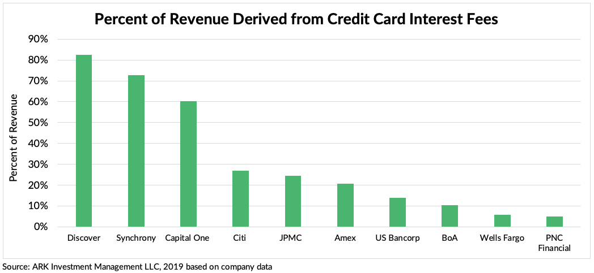

## Table of Contents

## What is a credit card company?

A credit card company is a business that gives people credit cards. These cards let people borrow money to buy things. They can use the card to pay for stuff and then pay the company back later. The company makes money by charging interest on the money people borrow. They also charge fees for using the card.

Credit card companies work with banks and stores to offer their cards. People can apply for a card and, if approved, they get a limit on how much they can borrow. It's important for people to pay back what they borrow on time. If they don't, they might have to pay more money in fees and interest. Credit card companies help people buy things they need, but it's important to use the cards wisely.

## Why might someone invest in a credit card company?

Someone might invest in a credit card company because it can make them money. Credit card companies earn money from the interest and fees they charge people who use their cards. If a lot of people use the cards and pay back what they borrow, the company can make a lot of profit. Investors like this because they can get a share of that profit. Also, credit card companies often grow over time, which can make the value of the investment go up.

Another reason is that credit card companies can be a stable investment. People will always need to borrow money, so there is a steady demand for credit cards. This can make the company's earnings more predictable, which is good for investors who want a reliable source of income. Plus, credit card companies can spread out their risk by having many customers. If one person can't pay back their card, it doesn't hurt the company too much because they have lots of other customers who are paying on time.

## What are the major credit card companies to consider for investment?

When thinking about investing in credit card companies, some of the biggest names to consider are Visa, Mastercard, and American Express. Visa and Mastercard are very popular because they work with many banks and are accepted in a lot of places around the world. They make money mostly from the fees they charge when people use their cards to buy things. American Express is different because it not only processes payments but also lends money directly to its cardholders. This means American Express can make money from interest on loans as well as from fees.

Another company to look at is Discover Financial Services. Discover is known for its credit cards and also for its banking services. Like American Express, Discover makes money from interest on loans and from fees. It's a bit smaller than Visa, Mastercard, and American Express, but it can still be a good choice for investors. Each of these companies has its own way of making money and its own risks, so it's important to learn about them before deciding to invest.

## How do credit card companies generate revenue?

Credit card companies make money in a few main ways. One way is by charging interest on the money people borrow. When someone uses their credit card to buy something, they are borrowing money from the credit card company. If they don't pay back all of the money they borrowed by the due date, the company charges them interest on the remaining amount. This interest can add up over time, and it's a big part of how credit card companies make money.

Another way credit card companies earn money is through fees. They charge fees for different things, like when someone uses their card to get cash from an ATM, or if they pay their bill late. Credit card companies also charge merchants a fee every time someone uses their card to buy something. This fee is called an interchange fee, and it's usually a small percentage of the purchase amount. These fees add up and help the credit card company make more money.

## What are the risks associated with investing in credit card companies?

Investing in credit card companies can be risky because of economic changes. If the economy gets bad, people might lose their jobs and not be able to pay back their credit card bills. This can hurt the credit card company's profits because they won't get as much money from interest and fees. Also, if a lot of people can't pay back their loans, the company might have to write off those debts as losses, which can make their financial situation worse.

Another risk is competition. There are many credit card companies out there, and they are always trying to get more customers. If a new company comes along with better rewards or lower fees, it could take customers away from the company you invested in. This can make it harder for the company to make money and grow. Plus, changes in laws and regulations can affect how credit card companies do business. If new rules make it harder for them to charge fees or interest, it could hurt their profits and make your investment less valuable.

## How does the economic cycle affect credit card companies?

The economic cycle can have a big impact on credit card companies. When the economy is doing well, people have jobs and money to spend. They use their credit cards more often to buy things, and they can usually pay back what they borrow on time. This is good for credit card companies because they make more money from interest and fees. But when the economy is not doing well, like during a recession, people might lose their jobs or have less money. They might not be able to pay back their credit card bills, which can hurt the company's profits. The company might have to write off those debts as losses, which can make their financial situation worse.

Another way the economic cycle affects credit card companies is through interest rates. When the economy is growing, interest rates might go up. This can be good for credit card companies because they can charge more interest on the money people borrow. But if interest rates go up too much, it might make it harder for people to pay back their credit cards, which can lead to more defaults. On the other hand, when the economy is slow, interest rates might go down. This can make it easier for people to borrow money, but it also means the credit card company makes less money from interest. So, the economic cycle can change how much money credit card companies make and how well they do.

## What financial metrics should be considered when evaluating a credit card company for investment?

When thinking about investing in a credit card company, it's important to look at some key financial numbers. One important number is the company's revenue. This shows how much money the company makes from interest, fees, and other sources. Another number to check is the net income, which is what's left after the company pays all its bills. This tells you if the company is making a profit. You should also look at the debt-to-equity ratio, which shows how much the company is borrowing compared to what it owns. A high ratio might mean the company is taking on too much risk.

Another set of numbers to consider are the company's growth rates. You want to see if the company's revenue and profits are growing over time. This can show if the company is doing well and getting bigger. It's also good to look at the return on equity (ROE), which tells you how well the company is using the money that shareholders have invested. A high ROE can mean the company is good at making money for its investors. Finally, don't forget to check the company's credit loss ratio, which shows how much money the company is losing from people not paying back their credit card bills. A low ratio is better because it means fewer people are defaulting on their loans.

## How do regulations impact the operations and profitability of credit card companies?

Regulations can really change how credit card companies work and how much money they make. Governments make rules to protect people who use credit cards. These rules might say how much interest the company can charge or what fees they can add. If the rules are strict, credit card companies might not be able to make as much money from interest and fees. For example, a law might say the company can't charge more than a certain amount of interest. This can make it harder for the company to earn a lot of profit.

Also, regulations can make credit card companies spend more money. They might need to change their computer systems or hire more people to follow the new rules. This can cost a lot of money and take time. If the company has to spend more to follow the rules, it might not have as much money left to give to its investors. So, when thinking about investing in a credit card company, it's important to know about the rules it has to follow and how those rules might affect its profits.

## What role does technology play in the growth and efficiency of credit card companies?

Technology helps credit card companies grow and work better. They use computers and the internet to make it easy for people to apply for cards and use them to buy things online. Credit card companies also use technology to keep track of what people spend and make sure they pay back what they borrow. This helps them catch any strange spending that might be from someone stealing a card. Plus, technology lets them offer new services, like letting people use their phones to pay instead of a card. All these things can help the company get more customers and make more money.

Technology also helps credit card companies save time and money. They can use computers to handle a lot of work that people used to do by hand. For example, they can use machines to send out bills and process payments instead of having people do it. This makes things faster and cheaper. Credit card companies also use technology to learn about their customers and offer them special deals or rewards. This can make people want to use their cards more, which helps the company make more money. So, technology is really important for credit card companies to grow and work well.

## How do credit card companies manage and mitigate credit risk?

Credit card companies manage credit risk by checking people's credit history before giving them a card. They look at things like if someone has paid their bills on time before and how much money they owe. If they think someone might not pay back what they borrow, they might not give them a card or they might give them a card with a small limit. This helps the company avoid losing too much money if someone can't pay back their card.

They also use technology to keep an eye on how people use their cards. If they see someone spending a lot more than usual or buying things in strange places, they might think the card was stolen. They can then stop the card from being used until they check with the cardholder. This helps them stop fraud and reduce the risk of losing money. Plus, credit card companies can change the interest rates or fees they charge based on how risky they think a customer is. If someone is more likely to not pay back their card, the company might charge them more interest to make up for the risk.

## What are the competitive dynamics within the credit card industry?

The credit card industry is very competitive. There are a lot of companies trying to get people to use their cards. They do this by offering different rewards, like cash back or travel points, to make their cards more attractive. Some companies also try to stand out by having lower interest rates or fewer fees. They also work with stores and banks to make sure their cards are accepted in more places. All this competition means that credit card companies always have to think of new ways to keep their customers happy and attract new ones.

Another part of the competition is technology. Credit card companies use new technology to make their services better and easier to use. For example, they might let people use their phones to pay instead of a card, or they might have apps that help people keep track of their spending. Companies that can use technology well can get more customers and make more money. But if a company doesn't keep up with the latest technology, it might lose customers to other companies that do. So, staying ahead in technology is a big part of staying competitive in the credit card industry.

## How can an investor analyze the long-term growth potential of a credit card company?

To analyze the long-term growth potential of a credit card company, an investor should look at how the company is doing now and how it might do in the future. One important thing to check is the company's revenue and profit growth over time. If the company is making more money each year, it might keep growing in the future. Investors should also look at the company's market share, which is how much of the credit card business it has compared to other companies. A company that is getting a bigger share of the market might have good long-term growth potential. Another thing to consider is the company's plans for the future, like new products or services they want to offer. If these plans sound good, they could help the company grow even more.

Another way to understand a credit card company's long-term growth potential is to look at the bigger picture. This means thinking about things like the economy and technology. If the economy is doing well, more people might use credit cards, which is good for the company. But if the economy is not doing well, people might not use their cards as much, which could hurt the company's growth. Technology is also important. A company that uses new technology to make its services better might attract more customers and grow faster. Investors should also pay attention to laws and rules that could affect the company. If new rules make it harder for the company to make money, it might not grow as much in the future. By looking at all these things, an investor can get a good idea of a credit card company's long-term growth potential.

## References & Further Reading

[1]: ["The Complete Guide to Credit Card Values and Pricing"](https://thepointsguy.com/credit-cards/guide-credit-card-annual-fees/) by Ron Lieber

[2]: ["Algorithmic Trading and DMA: An Introduction to Direct Access Trading Strategies"](https://www.amazon.com/Algorithmic-Trading-DMA-introduction-strategies/dp/0956399207) by Barry Johnson

[3]: ["Advances in Financial Machine Learning"](https://www.amazon.com/Advances-Financial-Machine-Learning-Marcos/dp/1119482089) by Marcos Lopez de Prado

[4]: Fabozzi, F. J., Focardi, S. M., Kolm, P. N., & Pettersson, L. (2010). ["Robust Portfolio Optimization and Management"](https://onlinelibrary.wiley.com/doi/book/10.1002/9781119202172). Wiley Finance Series.

[5]: Patel, N. R., & Brooks, C. (2011). ["Evaluating the Role of Credit Card Companies in the Financial Sector"](https://www.semanticscholar.org/paper/Exploring-Research-Methodology%3A-Review-Article-Patel-Patel/88848e60f6063fbe61e3487c1d9681650e33703e). The Journal of Finance.

