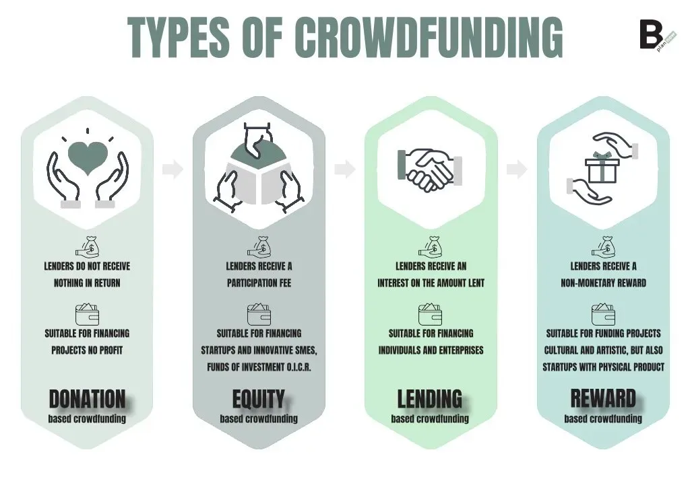

## Table of Contents

## What is investment crowdfunding?

Investment crowdfunding is a way for people to invest money in new businesses or projects. Instead of one big investor, many people can give smaller amounts of money. This helps new businesses get the money they need to start or grow. People who invest hope to make money if the business does well.

There are different types of investment crowdfunding. Some let you buy a small part of the business, called equity. Others might give you rewards or interest on your money. It's important to know that investing this way can be risky. You might lose your money if the business fails. But if it succeeds, you could make more money than you put in.

## How does investment crowdfunding differ from traditional crowdfunding?

Investment crowdfunding and traditional crowdfunding are two ways people can support new projects or businesses, but they work differently. In traditional crowdfunding, people give money to help a project or business, but they don't expect to get their money back or make a profit. They might get a reward, like a product or a thank you, but that's it. It's more about helping the project succeed because you believe in it.

On the other hand, investment crowdfunding lets people invest money in a business with the hope of making a profit. When you invest, you might get a part of the business, called equity, or you might get interest on your money. This means if the business does well, you could make more money than you put in. But it's riskier because if the business fails, you could lose your investment.

So, the main difference is what you get in return. Traditional crowdfunding is about supporting a project without expecting financial gain, while investment crowdfunding is about investing with the hope of making money. Both can help new businesses get started, but they attract different kinds of supporters.

## What are the common platforms used for investment crowdfunding?

Some popular platforms for investment crowdfunding are Kickstarter, Indiegogo, and GoFundMe. These platforms are well-known and have helped many projects and businesses get off the ground. They work a bit differently though. Kickstarter and Indiegogo are often used for creative projects or products, while GoFundMe is more about personal causes or small business funding. People use these platforms to share their ideas and get money from lots of different people.

Other platforms like SeedInvest, StartEngine, and Wefunder focus more on investment crowdfunding. They let people invest in startups and small businesses with the hope of making money. On these platforms, you might get a small piece of the business or earn interest on your investment. They are designed for people who want to invest and are okay with taking some risk to possibly make a profit. These platforms have rules to make sure the businesses are good investments and that people understand the risks.

## What types of projects or businesses typically use investment crowdfunding?

Investment crowdfunding is often used by startups and small businesses that need money to grow. These businesses might be working on new technology, like a cool app or a new kind of gadget. They use investment crowdfunding to get money from lots of people who believe in their idea. This can help them make their product or service better and reach more customers. It's a good way for businesses that are too new or small to get a big loan from a bank.

Another type of project that uses investment crowdfunding is real estate. People can invest in buildings or land that they think will become more valuable over time. This can be a good way to make money if the property does well. Some projects might also be about helping the community, like building affordable housing or fixing up old buildings. These projects need money to get started, and investment crowdfunding lets lots of people help out and possibly make a profit.

Sometimes, investment crowdfunding is used for creative projects, like movies or music. Artists and filmmakers can get money from fans who want to see their work come to life. In return, the fans might get a small part of the profits if the project does well. This can be a fun way for people to support art they love and maybe make some money too.

## How does the investment process work in crowdfunding?

When someone wants to invest in a project or business through crowdfunding, they first find a platform like SeedInvest or StartEngine. They look at different projects and choose one they believe in. They decide how much money they want to invest and then use the platform to make their investment. This money goes to the project or business, helping them to grow or start up. The investor hopes that the project will do well and they will make money from their investment.

After investing, the investor might get something in return, depending on the type of crowdfunding. If it's equity crowdfunding, they get a small piece of the business, called shares. If the business makes money, the value of these shares could go up, and the investor could sell them for a profit. If it's debt crowdfunding, the investor might get interest on their money over time. The investor needs to wait and see how the project does. If it succeeds, they could make more money than they put in. But if it fails, they could lose their investment.

## What are the legal and regulatory considerations for investment crowdfunding?

Investment crowdfunding has to follow certain rules to make sure it's fair and safe for everyone. In the United States, the Securities and Exchange Commission (SEC) has rules that businesses and platforms must follow. One important rule is that businesses can only raise a certain amount of money from investors each year. They also have to give investors a lot of information about their business, like how they plan to use the money and the risks involved. This helps investors make smart choices. Platforms that help with investment crowdfunding also have to be careful. They need to check that the businesses are honest and that they follow the rules.

Another thing to think about is that different countries have different rules. If a business wants to get money from people in other countries, they need to follow the rules in those places too. This can be tricky because the rules can be very different. For example, some countries might have limits on how much money people can invest, or they might need special permission to invest in foreign businesses. It's important for businesses and investors to know these rules so they don't get into trouble.

## What are the risks associated with investment crowdfunding?

Investment crowdfunding can be risky because you might lose the money you invest. If the business or project you invest in fails, you won't get your money back. This is different from putting money in a bank, where it's usually safe. With crowdfunding, you're betting on a new idea or business that might not work out. It's important to know that you could lose everything you put in.

Another risk is that you might not know enough about the business or project. Sometimes, the people running the crowdfunding campaign might not tell you everything, or they might make their idea sound better than it really is. This can make it hard to decide if it's a good investment. You need to do your own research and be careful about what you believe. Even if you do everything right, there's still a chance the business won't succeed.

## How can investors assess the potential of a crowdfunding investment?

To assess the potential of a crowdfunding investment, investors should start by looking at the business plan. This plan should explain what the business does, how it will make money, and how it plans to use the money from investors. It's important to see if the plan makes sense and if the goals seem realistic. Investors should also check the background of the people running the business. Do they have experience in this area? Have they successfully run a business before? This can give you a good idea of whether they can make the business work.

Another thing to consider is the market for the product or service. Is there a demand for what the business is offering? Are there already other businesses doing the same thing, and if so, how will this new business be different or better? Investors should also look at the financial projections. These are guesses about how much money the business will make and spend in the future. If these numbers seem too good to be true, they probably are. By looking at all these things, investors can get a better idea of whether the crowdfunding investment is worth the risk.

## What are the benefits for businesses using investment crowdfunding?

Investment crowdfunding can help businesses get the money they need without going to a bank. When a business uses crowdfunding, lots of people can give small amounts of money. This can add up to a lot of money, which the business can use to start up or grow. It's a good way for businesses that are too new or small to get a big loan from a bank. Plus, it lets businesses keep control of their company, because they don't have to give up a big part of it to one big investor.

Another benefit is that crowdfunding can help businesses find out if people like their idea. When people invest in a business through crowdfunding, it shows that they believe in the product or service. This can be a good way to test the market and see if there's a demand for what the business is offering. It also helps businesses build a community of supporters who can help spread the word about the business. This can make it easier to succeed in the long run.

## How does investment crowdfunding impact the broader financial market?

Investment crowdfunding can change the way money moves in the financial market. It lets more people invest in new businesses and projects, not just big investors or banks. This can help more new ideas get the money they need to start up and grow. When lots of people invest small amounts, it can add up to a lot of money. This can make the financial market more open and help new businesses that might not have been able to get money before.

But investment crowdfunding can also make the financial market more risky. When lots of people invest in new businesses, there's a chance that many of these businesses might fail. If too many businesses fail at the same time, it could cause problems in the financial market. It's important for people to understand the risks and for rules to be in place to keep things fair and safe. Overall, investment crowdfunding can bring new energy and ideas to the financial market, but it needs to be managed carefully.

## What are the success rates of projects funded through investment crowdfunding?

The success rates of projects funded through investment crowdfunding can vary a lot. Some studies say that around 20% to 30% of these projects end up doing well and making money for investors. But it's hard to know the exact numbers because not all projects share their results. Also, what counts as "success" can be different for each project. For some, it might mean making a profit, while for others, it might just mean finishing the project.

One reason why success rates can be low is that many of these projects are new and risky. They might have good ideas, but turning those ideas into a successful business is hard. Investors need to be ready to lose their money if the project doesn't work out. But when a project does succeed, it can be very rewarding. The people who invested early can make a lot of money if the business grows and does well.

## What future trends are expected in the field of investment crowdfunding?

In the future, investment crowdfunding is expected to grow a lot. More people will use it to invest in new businesses and projects. This is because technology is making it easier for people to find and invest in these opportunities. Also, more countries are making rules that make investment crowdfunding safer and easier to use. This means more businesses will be able to get money from lots of different people, not just big investors or banks. As more people see the benefits, investment crowdfunding will become a bigger part of the financial world.

Another trend is that investment crowdfunding will become more focused on certain types of projects. For example, more people might invest in businesses that help the environment or use new technology. This is because people want to support projects that make a difference in the world. Also, platforms might start using new tools like [artificial intelligence](/wiki/ai-artificial-intelligence) to help people find the best investments. This can make it easier for people to choose projects that are likely to succeed. Overall, investment crowdfunding will keep changing and growing, offering new ways for people to invest and support new ideas.

## References & Further Reading

[1]: "Crowdfunding: A Guide to Raising Capital on the Internet" by Steven Dresner

[2]: Agrawal, A., Catalini, C., & Goldfarb, A. (2015). ["The Geography of Crowdfunding."](https://www.nber.org/papers/w16820) Journal of Economic Geography, 15(2), 367–394.

[3]: Lebovitz, S., & Santana, N. (2016). ["Investment Crowdfunding in the United States: Review of the Industry and Recommendations."](https://www.researchgate.net/publication/354639860_Is_AI_Ground_Truth_Really_True_The_Dangers_of_Training_and_Evaluating_AI_Tools_Based_on_Experts'_Know-What) Cornell Hospitality Reports.

[4]: Mollick, E. (2014). ["The Dynamics of Crowdfunding: An Exploratory Study."](https://www.sciencedirect.com/science/article/pii/S088390261300058X) Journal of Business Venturing, 29(1), 1-16.

[5]: Lu, C., & Chen, Y. (2016). ["The Impact of Regulation Crowdfunding Rules on Entrepreneural Financing."](https://link.springer.com/article/10.1007/s11846-018-0295-y) International Small Business Journal, 34(8), 1003-1019.

[6]: JOBS Act of 2012. [Public Law 112-106](https://www.congress.gov/112/plaws/publ106/PLAW-112publ106.pdf)

[7]: "Algorithmic Trading: Winning Strategies and Their Rationale" by Ernie Chan

[8]: Shiller, R. J. (2013). ["Reflections on Finance and the Good Society."](https://www.jstor.org/stable/23469765) American Economic Review, 103(3), 7-11.