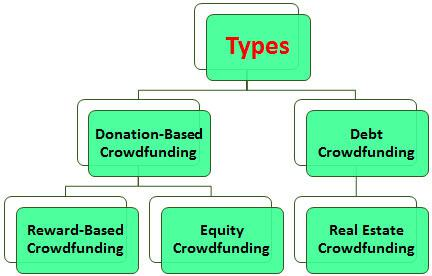

Crowdfunding has emerged as a transformative approach in the world of finance, enabling businesses and entrepreneurs to gather modest amounts of capital from a large number of individuals, often via online platforms. This innovative method has significantly altered the traditional investment landscape by removing intermediaries and expanding access to investment opportunities. By connecting entrepreneurs with potential investors, crowdfunding facilitates a mutually beneficial relationship that can lead to successful business ventures and profitable returns.

Investment crowdfunding, a prominent subset of crowdfunding, involves sourcing funds in exchange for equity or debt stakes. This model caters to both accredited and non-accredited investors, depending on the regulatory and platform-specific guidelines. With the adoption of legislative measures, such as the JOBS Act in the United States, investment crowdfunding has opened up avenues for a broader audience to participate in investment opportunities that were previously limited to a select group of wealthy individuals and institutional investors.



As crowdfunding continues to gain traction, understanding its mechanics and benefits becomes critical for both entrepreneurs seeking to launch and grow their projects and investors looking for diverse investment opportunities. Moreover, the intersection of crowdfunding with algorithmic trading offers investors advanced tools and strategies to optimize their investments, potentially enhancing returns through data-driven decision-making processes.

This article provides a comprehensive overview of crowdfunding, particularly focusing on investment crowdfunding. It offers valuable insights into how crowdfunding operates and examines its potential when integrated with algorithmic trading. From learning the fundamentals to exploring sophisticated investment approaches, this guide aims to equip readers with the knowledge needed to navigate the evolving landscape of crowdfunding effectively.

## Table of Contents

## Understanding Crowdfunding and Investment Crowdfunding

Crowdfunding is a financial strategy that enables businesses to gather capital by soliciting small contributions from a large number of investors, typically via online platforms. This approach democratizes the investment process, allowing entrepreneurs to reach potential investors directly without traditional intermediaries like banks. Crowdfunding platforms act as the bridge between entrepreneurs who need funding and individuals interested in supporting projects or ventures.

Investment crowdfunding is a specific type of crowdfunding that involves raising funds in exchange for equity or debt stakes in a company. This model allows contributors to gain a financial share in the success of the business they invest in, distinguishing it from other crowdfunding types such as reward-based or donation-based models. Investment crowdfunding is particularly appealing to both accredited and non-accredited investors, although participation might vary due to specific platform restrictions and local regulations.

The formal introduction of investment crowdfunding in the United States was significantly influenced by the Jumpstart Our Business Startups (JOBS) Act, signed into law in 2012. This legislation was designed to expand investment opportunities by reducing regulatory hurdles, thereby enabling a broader spectrum of individuals to invest in private companies. The JOBS Act introduced Title III, also known as Regulation Crowdfunding, which allows small businesses to offer and sell securities through crowdfunding platforms, subject to specific conditions such as limits on the amount raised and disclosure requirements.

The JOBS Act was a pivotal moment in the evolution of crowdfunding, allowing companies to publicly solicit investments from a larger pool of small investors. This has led to a more inclusive investment landscape, making it possible for a wider audience to participate in funding startups and small businesses, which were traditionally confined to venture capitalists and angel investors. Consequently, investment crowdfunding has opened up new avenues for entrepreneurs to access capital while providing investors with the opportunity to participate in the growth of innovative businesses from an early stage.

## How Crowdfunding Works

Crowdfunding is an innovative financial mechanism that connects entrepreneurs with potential investors through digital platforms. By leveraging the reach and accessibility of the internet, crowdfunding enables entrepreneurs to present their business ideas, innovations, or projects directly to a wide audience. This audience, composed of potential investors, evaluates the proposals and decides whether to invest based on the project's potential, perceived benefits, and projected returns.

This approach circumvents traditional financial intermediaries such as banks or venture capital firms, thus providing both entrepreneurs and investors with greater flexibility and accessibility. Entrepreneurs gain the opportunity to raise necessary funds without the stringent requirements often imposed by conventional lenders, while investors access a broader range of investment opportunities, including those at early stages that might not be available through traditional financial channels.

Various forms of crowdfunding cater to different needs and preferences:

1. **Reward-based Crowdfunding:** Investors contribute funds in exchange for non-monetary rewards, such as products or services. This model is popular for creative projects and pre-product launches.

2. **Equity Crowdfunding:** Investors provide capital in exchange for equity stakes in the company. This model aligns the interests of investors and entrepreneurs by offering potential financial returns based on the company's growth and success.

3. **Debt Crowdfunding (also known as Peer-to-Peer Lending):** Investors lend money to individuals or businesses with the expectation of receiving the principal amount plus interest over time. This model functions similarly to traditional loans but operates through digital platforms.

4. **Donation-based Crowdfunding:** Individuals contribute money to support a cause or project without expecting financial returns. This model is prevalent in charitable endeavors and community-driven initiatives.

The effectiveness of crowdfunding relies on the platform's ability to match the right projects with the appropriate investor base. Platforms typically provide the necessary infrastructure for financial transactions, communication, and project presentation, thus facilitating the entire fundraising process. This digital environment not only democratizes finance by enabling smaller investors to participate in funding rounds but also allows entrepreneurs to validate their business ideas and reach a global audience, thereby transforming how capital is accessed and utilized.

## Benefits of Investment Crowdfunding

Investment crowdfunding has notably lowered the barriers to entry for investors and provided a rapid mechanism for entrepreneurs seeking capital. This method of financing allows individuals to participate in ventures with relatively small investments. Unlike traditional investing, which often requires substantial capital, crowdfunding enables entry with minimal amounts, inviting a diverse range of participants to potentially lucrative opportunities. For instance, platforms like StartEngine or SeedInvest allow individuals to invest as little as $100 in startups and growing companies, democratizing access to venture capital.

Investors gain not only financial inclusion but also the chance to earn equity stakes in early-stage companies. This equity can appreciate significantly if the company grows successfully. Moreover, these investments can sometimes yield above-average returns compared to conventional avenues, such as savings accounts or bonds, which typically offer lower returns. For instance, suppose a startup valued at $1 million seeks to raise $100,000 by offering 10% equity. An investor contributing $1,000 would own a 0.1% equity stake. If the company's valuation increases to $10 million, the investor's stake could potentially be worth $10,000, representing substantial potential gains.

For entrepreneurs, crowdfunding presents an opportunity to validate business ideas and test market demand before committing significant resources. The ability to gauge public interest and feedback during the fundraising campaign acts as a preliminary market test. Moreover, successful campaigns often lead to increased visibility and credibility, attracting further investment and attention. Notably, these platforms do not require upfront fees, reducing initial financial strain. For many entrepreneurs, this accessibility translates into a critical advantage, especially when traditional financing routes, such as bank loans or venture capital, are unattainable.

In essence, investment crowdfunding creates an ecosystem that benefits both investors and entrepreneurs. The reduction in barriers fosters a more inclusive financial landscape, while the prospects of significant returns and business validation continue to attract stakeholders globally.

## Risks and Challenges in Crowdfunding

Crowdfunding, while providing numerous benefits, is not devoid of risks and challenges that both investors and entrepreneurs need to consider. One of the primary risks associated with crowdfunding is the potential for investment failure. The nascent stage of many crowdfunded ventures means they often lack a proven track record and can struggle to achieve commercial success. Investors face the possibility of losing their entire investment if a project or business does not succeed.

Fraud is another significant concern. Although crowdfunding platforms attempt to vet projects for legitimacy, the sheer [volume](/wiki/volume-trading-strategy) of campaigns can make thorough verification challenging. Scammers may exploit this to create fraudulent campaigns, ultimately resulting in financial losses for investors who fall victim to these schemes.

Liquidity risk further complicates crowdfunding investments. Unlike publicly traded securities, crowdfunded investments are relatively illiquid. Investors typically cannot sell their stakes easily or quickly, often having to wait for a [liquidity](/wiki/liquidity-risk-premium) event such as a buyout or IPO to recoup their investment. This limited liquidity can be problematic for investors who may need to access their funds sooner than anticipated.

Another challenge investors face is share dilution. As companies undergo multiple rounds of funding to continue growing, new shares may be issued, thereby diluting existing shareholders' stakes. This dilution reduces the percentage of the company that early investors own, potentially impacting their returns.

Entrepreneurs also encounter significant hurdles in the crowdfunding process. The success rate of crowdfunding campaigns can be low, with many projects failing to meet their funding goals. Creating a compelling pitch that captures the attention and trust of the crowd requires considerable effort and time. The process involves not just preparing a detailed business plan and promotional content, but also engaging continuously with the potential investor community. This can be time-intensive and may divert valuable resources away from other critical aspects of business development.

In summary, while crowdfunding offers unique opportunities for both investors and entrepreneurs, a comprehensive understanding of its inherent risks and challenges is essential. This awareness allows stakeholders to make informed decisions and to strategize effectively, balancing potential rewards with associated risks.

## Popular Platforms and How to Get Started

Platforms like Kickstarter, Indiegogo, GoFundMe, and equity-based platforms such as StartEngine are integral to the crowdfunding ecosystem, each offering unique features and catering to different types of projects and investors. Kickstarter primarily supports creative projects, emphasizing tangible rewards rather than equity stakes. Indiegogo is slightly more flexible, allowing both creative and entrepreneurial ventures, often with a choice between fixed and flexible funding models. GoFundMe focuses on personal and charitable causes, operating predominantly through donations without expecting financial returns for contributors. Conversely, StartEngine, one of the popular equity crowdfunding platforms, allows companies to offer shares to the public, thereby providing investors with a direct stake in the company's potential success or failure.

For those interested in starting their journey with crowdfunding investments, a structured approach is paramount. The first step involves selecting a reliable platform that aligns with one's investment goals and risk appetite. It is critical to comprehend the platform's focus, whether it supports creative projects, technological startups, or social causes.

Prospective investors should conduct thorough due diligence by scrutinizing project details, assessing the credibility of the creators, and understanding the financial terms offered. This evaluation process is crucial as it involves analyzing potential returns against the inherent risks, such as the project's viability and market demand.

Additionally, investors should be mindful of the financial commitment involved, ensuring that the amounts allocated to crowdfunding are sums they are comfortable losing, given the speculative nature of this investment avenue. Crowdfunding investments may offer substantial returns, but they also [carry](/wiki/carry-trading) a high risk of loss, particularly in platforms offering equity stakes.

Getting started requires an interested investor to create an account on the selected platform. The registration process typically involves providing personal information, agreeing to the platform's terms of service, and choosing a secure payment method for transactions. Post-registration, investors should meticulously evaluate the available investment opportunities. This examination involves a detailed review of project goals, timelines, funding requirements, and potential rewards or returns.

In summary, while platforms such as Kickstarter, Indiegogo, GoFundMe, and StartEngine enable diverse crowdfunding opportunities, success in this investment landscape demands careful planning, comprehensive research, and prudent financial management.

## Algorithmic Trading in Crowdfunded Investments

Algorithmic trading involves the use of computer algorithms to automate and optimize trading decisions. This sophisticated technique has found its way into the domain of crowdfunded investments, where it can serve as a powerful tool for investors looking to enhance their strategies and potentially improve returns. By analysing large datasets and executing trades based on pre-defined criteria, [algorithmic trading](/wiki/algorithmic-trading) offers an efficient and systematic approach to investment in crowdfunding ventures.

Investors who employ algorithmic trading in crowdfunded investments can benefit from increased precision and the ability to process vast amounts of data swiftly. Algorithms are capable of monitoring various crowdfunding platforms simultaneously, identifying potential investment opportunities that meet specific criteria. This capability allows investors to execute trades at speed and scale that would be unmanageable manually, thus optimizing their investment portfolios.

A notable advantage of algorithmic trading is its ability to mitigate emotional biases in decision-making. By following a set of predefined rules, algorithms can execute trades based on quantitative signals rather than gut feelings or market emotions. This objectivity can lead to more consistent investment outcomes, particularly in the volatile environment of crowdfunded investments.

To implement algorithmic trading in crowdfunding, investors must possess technical expertise and a robust understanding of financial markets. Designing an effective algorithm requires knowledge of programming languages such as Python, along with the ability to develop and backtest strategies before deploying them in real-world scenarios. Here is a simple Python snippet demonstrating how one might begin to build an algorithmic trading strategy:

```python
import pandas as pd
import numpy as np

# Sample historical data for a crowdfunding investment
data = pd.DataFrame({
    'date': pd.date_range(start='2022-01-01', periods=100),
    'investment_return': np.random.randn(100) * 0.01 + 0.001
})

# Simple moving average strategy
data['SMA_10'] = data['investment_return'].rolling(window=10).mean()
data['SMA_20'] = data['investment_return'].rolling(window=20).mean()

# Generating trading signals
data['signal'] = 0
data.loc[data['SMA_10'] > data['SMA_20'], 'signal'] = 1  # Buy signal
data.loc[data['SMA_10'] < data['SMA_20'], 'signal'] = -1  # Sell signal

# Preview the data with signals
print(data.head(20))
```

However, utilizing algorithmic trading also entails challenges. It requires access to reliable financial data and robust computational infrastructure to operate efficiently. Furthermore, the market dynamics of crowdfunding may not always align with traditional trading models, necessitating bespoke strategies tailored to this unique environment. Risk management remains crucial, as algorithms can amplify losses during volatile market conditions if not properly monitored and adjusted.

In conclusion, while algorithmic trading presents a promising avenue for optimizing investments in crowdfunding, it demands careful planning, technical expertise, and a keen understanding of both the crowdfunding and financial landscapes. Investors who can navigate these complexities may well find themselves at an advantage in the evolving crowdfunding market.

## The Final Word on Crowdfunding Investments

Investment crowdfunding has brought transformative change to the financial sector, presenting a dynamic landscape that simultaneously offers substantial opportunities and notable challenges. This innovative method of financing has opened the doors for a broader demographic of participants—both investors and entrepreneurs—to engage in the financial system. Key to its burgeoning success is the democratization of investment opportunities, allowing individuals who were traditionally excluded to partake in financial ventures.

For investors, the advantages of investment crowdfunding are manifold. It provides a unique opportunity to access ventures with the potential for high returns that are often not available through conventional investment channels. However, it is imperative for investors to conduct thorough due diligence and fully comprehend the inherent risks involved, such as potential investment loss and market [volatility](/wiki/volatility-trading-strategies). They must maintain a balanced perspective by weighing potential financial gains against possible downsides like fraudulent activities or lack of liquidity.

Entrepreneurs leverage investment crowdfunding to not only gather funds but also to validate their business ideas and products within the market. This form of fundraising enables them to receive immediate feedback from a diverse investor base, which can be invaluable in refining their business models and strategies. Despite its advantages, entrepreneurs should be mindful of the rigorous effort required to launch successful campaigning initiatives and the competitive landscape that can challenge campaign success.

As the industry continues to evolve, stakeholders must engage in ongoing education and adaptation to exploit the potential of crowdfunding successfully. This involves staying informed about regulatory changes, technological advancements, and emerging market trends that could impact investment outcomes. Those looking to harness the full power of crowdfunding must also consider integrating new tools and methodologies, like algorithmic trading, to refine investment strategies and improve decision-making processes.

In conclusion, investment crowdfunding stands as a powerful catalyst for change in the financial ecosystem, offering a spectrum of possibilities for both investors and entrepreneurs. Its continued growth and success will rely heavily on the ability of all parties to navigate its complexities, mitigate risks, and leverage new associated technologies for enhanced performance and returns.

## References & Further Reading

[1]: "Crowdfunding: A Guide to Raising Capital on the Internet" by Steven Dresner

[2]: Agrawal, A., Catalini, C., & Goldfarb, A. (2015). ["The Geography of Crowdfunding."](https://www.nber.org/papers/w16820) Journal of Economic Geography, 15(2), 367–394.

[3]: Lebovitz, S., & Santana, N. (2016). ["Investment Crowdfunding in the United States: Review of the Industry and Recommendations."](https://www.researchgate.net/publication/354639860_Is_AI_Ground_Truth_Really_True_The_Dangers_of_Training_and_Evaluating_AI_Tools_Based_on_Experts'_Know-What) Cornell Hospitality Reports.

[4]: Mollick, E. (2014). ["The Dynamics of Crowdfunding: An Exploratory Study."](https://www.sciencedirect.com/science/article/pii/S088390261300058X) Journal of Business Venturing, 29(1), 1-16.

[5]: Lu, C., & Chen, Y. (2016). ["The Impact of Regulation Crowdfunding Rules on Entrepreneural Financing."](https://link.springer.com/article/10.1007/s11846-018-0295-y) International Small Business Journal, 34(8), 1003-1019.

[6]: JOBS Act of 2012. [Public Law 112-106](https://www.congress.gov/112/plaws/publ106/PLAW-112publ106.pdf)

[7]: "Algorithmic Trading: Winning Strategies and Their Rationale" by Ernie Chan

[8]: Shiller, R. J. (2013). ["Reflections on Finance and the Good Society."](https://www.jstor.org/stable/23469765) American Economic Review, 103(3), 7-11.