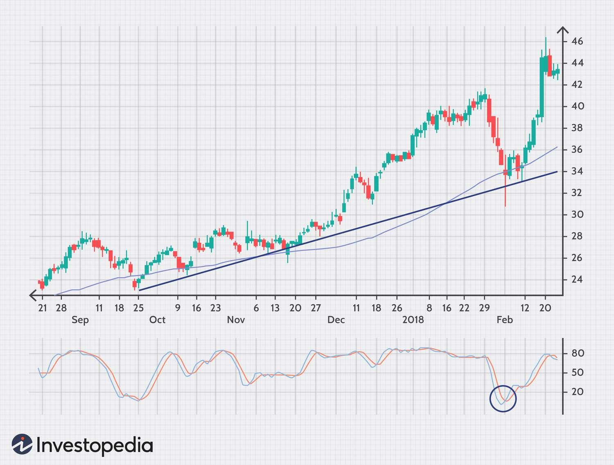

Investment strategies are fundamental to achieving success in the financial markets, where the precise timing and optimization of entry points can significantly enhance returns for investors. Entry points, defined as the specific prices at which investments are initiated, play a critical role in determining potential profitability. As financial markets evolve, the complexity of making informed decisions at these critical junctures has increased, leading investors to explore advanced techniques for optimizing their strategies.

Algorithmic trading has emerged as a transformative force in this context, allowing investors to use pre-defined rules and mathematical models to execute trades at optimal times. By leveraging vast amounts of data and sophisticated computational methods, algorithmic trading systems can identify favorable entry points more accurately and execute trades at speeds beyond human capability. This reduces emotional biases often associated with manual trading and results in more disciplined decision-making processes.



Investment optimization further complements these efforts by ensuring that resources are allocated effectively to maximize returns while minimizing risks. Techniques such as diversification, risk management, and performance analysis are integral to creating robust investment portfolios. Optimized strategies not only address the variance in market conditions but also provide a systematic approach to achieving consistent returns over time.

This article evaluates the convergence of precise entry point identification, investment optimization, and algorithmic trading, demonstrating their combined potential to form an efficient and effective investment strategy. By integrating these elements, investors can achieve a competitive edge, ultimately driving sustained profitability and success in the ever-evolving financial markets.

## Table of Contents

## Understanding Entry Points in Investment

Entry points refer to the specific price level or moment at which an investor decides to initiate a position in a particular security. Identifying an optimal entry point is essential, as it can set the stage for the overall success of an investment. A well-timed entry can capitalize on market movements and yield significant gains, while a poorly timed one might lead to losses.

Several techniques are employed by investors to pinpoint the most opportune entry points:

1. **Trendlines**: Trendlines are graphical representations of trends in market prices, which are formed by connecting a series of descending peaks and ascending troughs in a price chart. They are useful in identifying potential entry and exit points by indicating the direction of the market. For instance, in an upward trendline, an investor may enter a long position upon observing the price approaching or rebounding from the trendline, suggesting continued bullish momentum.

2. **Moving Averages (MAs)**: Moving averages smooth out price data to identify the direction of a trend. They are calculated by averaging the closing prices over a specified period. Common types include simple moving average (SMA) and exponential moving average (EMA). Investors might use a crossover strategy, where a shorter-term MA crossing above a longer-term MA signals a potential buy entry point, while the reverse indicates a sell signal.

3. **Technical Indicators**: Various indicators are utilized to enhance the accuracy of entry point identification. For instance, the Relative Strength Index (RSI) measures the speed and change of price movements, indicating whether a security is overbought or oversold. An RSI below 30 may suggest a buying opportunity, while a reading above 70 could indicate a selling point. Similarly, the Moving Average Convergence Divergence (MACD) indicator, which includes signal line crossovers, helps identify potential entry points.

Timing entry and [exit](/wiki/exit-strategy) points is crucial not just for capitalizing on profitable trades but also for effective risk management. By carefully selecting entry points, investors can implement stop-loss orders at strategic levels to limit potential losses, thereby ensuring that their investment strategy is aligned with their risk tolerance. Additionally, establishing disciplined exit strategies complements the entry point, as it allows investors to lock in gains or cut losses at the appropriate time.

In summary, understanding and accurately determining entry points through various techniques is a fundamental aspect of investment strategy. By leveraging trendlines, moving averages, and technical indicators, investors can enhance their ability to enter markets at the most opportune times, thereby maximizing returns and effectively managing risk.

## The Importance of Investment Optimization

Investment optimization is a crucial process in financial management, ensuring that resources are allocated in a manner that maximizes returns while minimizing risks. By employing various techniques such as diversification, risk management, and performance analysis, investors can achieve a balanced portfolio that withstands market fluctuations and achieves consistent growth.

Diversification is a core principle of investment optimization. It involves spreading investments across different asset classes, industries, and geographic regions to reduce exposure to any single risk. The logic behind diversification is rooted in the idea that while some assets may perform poorly at times, others might perform well, balancing the overall portfolio performance. Mathematically, diversification aims to minimize the overall portfolio variance, which can be represented as follows:

$$
\sigma_p^2 = \sum_{i=1}^{n} w_i^2 \sigma_i^2 + \sum_{i=1}^{n-1} \sum_{j=i+1}^{n} 2w_iw_j \sigma_i \sigma_j \rho_{ij}
$$

where $\sigma_p^2$ is the variance of the portfolio, $w_i$ and $w_j$ are the weights of assets $i$ and $j$ in the portfolio, $\sigma_i$ and $\sigma_j$ are the standard deviations of the assets, and $\rho_{ij}$ is the correlation coefficient between assets $i$ and $j$.

Risk management goes hand in hand with diversification. It involves identifying, assessing, and taking steps to mitigate or eliminate potentially adverse effects on an investment portfolio. Effective risk management includes the use of hedging strategies, setting stop-loss orders, and maintaining adequate [liquidity](/wiki/liquidity-risk-premium) to address unforeseen circumstances. For instance, portfolio managers often employ Value at Risk (VaR) as a quantitative measure of potential loss in value of a portfolio over a defined period for a given confidence interval.

Performance analysis is another vital element of investment optimization. It involves evaluating the success of investment strategies through comprehensive assessment techniques. Performance metrics such as the Sharpe ratio, which measures risk-adjusted return, and the Sortino ratio, which differentiates harmful [volatility](/wiki/volatility-trading-strategies) from total overall volatility, help assess the efficiency of investment strategies:

$$
\text{Sharpe Ratio} = \frac{R_p - R_f}{\sigma_p}
$$

where $R_p$ is the return of the portfolio, $R_f$ is the risk-free rate, and $\sigma_p$ is the standard deviation of the portfolio's excess return. Meanwhile, the Sortino Ratio is calculated as follows:

$$
\text{Sortino Ratio} = \frac{R_p - R_f}{\sigma_d}
$$

where $\sigma_d$ is the standard deviation of the negative asset returns, better capturing downside risk.

By properly integrating these techniques, optimized investment strategies significantly reduce risk and enhance the consistency of returns, leading to a more secure financial future. An ongoing process, investment optimization requires continuous monitoring and adjustments to align with evolving market conditions and investor goals.

## Algorithmic Trading Strategies

Algorithmic trading, often referred to as algo trading, utilizes pre-defined rules and sophisticated mathematical models to execute trades with high precision and speed. This method has revolutionized the way trades are conducted by minimizing human intervention and leveraging computational algorithms that analyze market data to identify profitable trading opportunities.

Common [algorithmic trading](/wiki/algorithmic-trading) strategies encompass trend-following, [arbitrage](/wiki/arbitrage), and mean reversion. Trend-following strategies are designed to capitalize on market [momentum](/wiki/momentum). By analyzing historical market data, algorithms can identify patterns and trends, automatically executing trades aligned with the prevailing market direction. This approach eliminates the emotional element from trading, allowing for more disciplined execution.

Arbitrage strategies exploit price discrepancies in different markets or instruments. For instance, when a security is priced differently on two exchanges, an algorithm can simultaneously buy at the lower price and sell at the higher, capturing the spread. This requires rapid execution capabilities that algo trading provides, allowing traders to capitalize on fleeting opportunities that human traders might miss.

Mean reversion is based on the assumption that prices will revert to their mean or average over time. Algorithms employing this strategy identify securities that are overbought or oversold relative to historical norms, automatically executing trades to profit from expected reversions to the mean. This strategy often involves complex statistical analyses and calculations to predict price movements accurately.

Beyond these common strategies, the primary advantage of algorithmic trading is its ability to process vast amounts of data and execute trades faster than humanly possible. This capability is facilitated by advanced programming languages and frameworks. For instance, Python, with libraries such as Pandas and NumPy, allows for efficient data manipulation, while [machine learning](/wiki/machine-learning) libraries like scikit-learn enable predictive analytics to enhance trading strategy development.

Python code illustrating a simple moving average crossover strategy might look like this:

```python
import pandas as pd

# Load your market data into a DataFrame
data = pd.read_csv('market_data.csv')
data['SMA50'] = data['Close'].rolling(window=50).mean()
data['SMA200'] = data['Close'].rolling(window=200).mean()

# Signal generation based on moving average crossovers
data['Signal'] = 0
data.loc[data['SMA50'] > data['SMA200'], 'Signal'] = 1
data.loc[data['SMA50'] < data['SMA200'], 'Signal'] = -1

# The 'Signal' column can be used to generate buy/sell trades
buy_signals = data[data['Signal'] == 1]
sell_signals = data[data['Signal'] == -1]
```

The automation inherent in algorithmic trading reduces emotional biases, contributing to more disciplined and consistent trading approaches. By eliminating the subjective influences of emotions, traders can adhere to predefined strategies with precision, thereby enhancing decision-making processes and potentially increasing profitability. The deployment of algorithmic trading strategies marks a significant advancement in financial markets, reflecting a shift towards data-driven investment and risk management approaches.

## Implementing Entry Point Investment Strategies with Algo Trading

Combining entry point identification with algorithmic trading is a robust method to enhance investment decision-making. An entry point, the price at which an investor buys into a security, is crucial for profitability. Precise identification and timing of these entry points can influence the overall success of an investment strategy. Algorithms, which can be programmed to act on pre-defined conditions and rules, automate these investment decisions, optimizing the timing of both entry and exit points to maximize returns.

Algorithmic trading strategies can utilize technical indicators such as moving averages, trendlines, and support and resistance levels to define entry and exit criteria. For instance, a simple moving average crossover strategy could be implemented where a shorter moving average crosses above a longer one, indicating a buy signal. This can be expressed in Python as follows:

```python
# Sample Python code for moving average crossover strategy

import pandas as pd

# Assume df is a DataFrame with a 'Close' column for stock prices
df['Short_MA'] = df['Close'].rolling(window=10).mean()
df['Long_MA'] = df['Close'].rolling(window=50).mean()

# Determine when to buy/sell
df['Signal'] = 0
df['Signal'][10:] = np.where(df['Short_MA'][10:] > df['Long_MA'][10:], 1, 0)
df['Position'] = df['Signal'].diff()
```

In this code, 'Signal' identifies buy (1) and sell (0) signals, while 'Position' indicates changes in the investment stance. By automating this process, the strategy removes human emotion and biases, such as fear and greed, leading to more disciplined trading.

Advanced strategies leverage machine learning to further refine and adapt to changing market conditions. Machine learning models can be trained on historical data to recognize patterns that traditional signals might miss. These models can employ techniques such as regression analysis, classification, or clustering to predict future price movements.

For example, a [neural network](/wiki/neural-network) could be used to predict entry points by learning from a set of input features such as previous prices, volumes, and economic indicators. The trained model then generates buy or sell signals based on the learned patterns, which an algorithm can seamlessly execute.

Implementing entry point strategies through algorithms also enables the rapid processing of large datasets. This provides a significant advantage in analyzing real-time data to adjust strategies dynamically in reaction to market volatility. As the financial markets continue to evolve, the combination of algorithmic trading and machine learning techniques not only enhances the precision of entry points but also improves the overall robustness and adaptability of investment strategies.

## Case Studies and Real-World Examples

The integration of algorithmic trading with entry point strategies has led to notable successes in financial markets. Let's explore some real-world examples and case studies that illustrate how these strategies have been effectively employed.

### Examples of Successful Entry Point Strategies Leveraging Algorithmic Trading

1. **Statistical Arbitrage in Equities**: A prominent strategy utilized by hedge funds involves identifying mispricings between correlated stocks and capitalizing on their convergence over time. Algorithmic trading systems are essential here due to their ability to process vast datasets quickly and execute trades at optimal times. Firms such as Renaissance Technologies have successfully employed these techniques, leveraging their high-frequency trading (HFT) algorithms to exploit short-term statistical anomalies across stocks.

2. **Trend-Following in Commodity Markets**: Commodity trading advisors (CTAs) often use trend-following algorithms, which rely on technical indicators like moving averages to identify favorable entry and exit points. For instance, during bullish trends, an algorithm may initiate a long position when the short-term moving average crosses above the long-term moving average. This was notably successful during periods of sustained market trends, such as the oil bull run in the early 2000s.

### Case Studies Showcasing Optimization Techniques in Varying Market Conditions

1. **Case Study: Portfolio Optimization Using Machine Learning during Market Volatility**: A financial firm implemented a machine learning algorithm to optimize its asset allocation strategy amid volatile market conditions. By employing techniques like clustering and data-driven risk assessment, the algorithm dynamically adjusted asset weights to minimize risk and maximize return. This approach proved advantageous during the 2008 financial crisis, where traditional static portfolios underperformed.

2. **Case Study: Adaptive Algorithmic Strategies in Forex Trading**: A forex trading firm adopted a machine learning-based algorithm to adapt its trading strategies according to real-time market conditions. By using reinforcement learning, the algorithm continuously learned from market data, refining its entry and exit points. This adaptability was crucial during episodes of geopolitical instability, where market sentiment rapidly shifted.

### Lessons Learned from Both Successful and Failed Strategies

1. **Importance of Backtesting and Model Validation**: Successful strategies emphasize robust backtesting and validation using historical data. Failure to do so, as seen in some underperforming trading firms, results in overfitting models that do not generalize well to new market conditions.

2. **Risk Management and Diversification**: Successful algorithmic trading strategies often incorporate comprehensive risk management protocols, ensuring diversified exposure and capital preservation. The downfall of Long-Term Capital Management in the late 1990s underscored the perils of insufficient diversification and excessive leverage.

3. **Continuous Learning and Adaptation**: Financial markets are never static, and adaptive strategies that evolve over time tend to outperform rigid models. Algorithms leveraging machine learning have a distinct advantage by recalibrating continuously based on fresh market data.

In conclusion, real-world applications of algorithmic trading combined with strategic entry points have provided significant competitive edges in investment. Their success hinges on the continuing development of methodologies, fostering resilience against market fluctuations, and embracing innovation in trading technology.

## Challenges and Future Trends

Investment strategies face several challenges that can impact their effectiveness and sustainability. One prominent challenge is market volatility, which refers to the rapid and unpredictable changes in market prices. Such fluctuations can lead to significant financial risk, particularly for strategies that rely heavily on precise entry and exit points. Volatility requires strategies to be adaptive and robust, capable of withstanding sudden shocks and changes in market dynamics.

Technological complexities present another significant challenge. As algorithmic trading becomes more advanced, the systems and infrastructure required to support these strategies become increasingly sophisticated. This complexity necessitates substantial investment in technology and expertise to develop, maintain, and optimize trading algorithms. Additionally, the rapid pace of technological change means that strategies need regular updates to remain competitive and effective.

Regulatory requirements also pose a challenge for investment strategies, especially those involving algorithmic trading. Financial markets are subject to stringent regulatory frameworks designed to ensure fair trading practices and protect investors. These regulations can impact how algorithms are developed and deployed, necessitating compliance measures that can add to operational complexity and cost.

Despite these challenges, the future of investment strategies is promising, driven by the integration of [artificial intelligence](/wiki/ai-artificial-intelligence) (AI) and machine learning (ML). AI and ML provide advanced analytical capabilities that can enhance decision-making by identifying patterns and trends that may not be evident through traditional analysis. These technologies enable the development of more sophisticated models that can process large datasets and adjust strategies in real-time, improving accuracy and adaptability.

Furthermore, there is a growing emphasis on sustainable and ethical trading strategies. As awareness of environmental, social, and governance ([ESG](/wiki/esg-investing)) issues rises, investors are increasingly looking to align their portfolios with sustainable practices. This trend is driving the development of strategies that prioritize ethical considerations alongside financial returns, leading to the emergence of ESG-compliant algorithmic trading models.

In conclusion, while challenges such as market volatility, technological complexities, and regulatory requirements pose significant obstacles, the integration of AI and ML, combined with a focus on sustainability and ethics, offers a promising future for investment strategies. With continuous innovation and adaptation, investors can develop strategies that not only maximize returns but also contribute to positive societal outcomes.

## Conclusion

Optimizing entry points through algorithmic trading offers a competitive advantage by enabling investors to capitalize on market inefficiencies with precision and speed. Algorithmic trading employs mathematical models and computational algorithms to automatically execute trades based on pre-determined criteria, significantly reducing human error and emotional biases. This methodology allows for the identification and execution of optimal entry points, which can lead to enhanced returns.

A key component of successful investment strategies is the concept of continuous learning and adaptation. The financial markets are dynamic, exhibiting fluctuations influenced by global events, investor sentiment, and economic indicators. One approach to maintaining an edge in such an environment is through machine learning techniques, where algorithms are trained to recognize patterns and adjust strategies in real-time based on historical data. The self-learning nature of these algorithms enables them to evolve as market conditions change, thus fostering sustained profitability.

Embracing technology and innovation is paramount in today's fast-paced financial landscape. Innovations such as artificial intelligence and blockchain technology are not only redefining conventional trading mechanisms but also broadening the scope of what is achievable with investment strategies. For example, artificial intelligence can be leveraged to enhance predictive analytics, while blockchain can offer transparency and security in transactions.

Incorporating technologies like these into investment strategies isn't just about keeping pace with competitors; it can fundamentally transform the decision-making process, improve efficiency, and boost return on investment. As the financial markets continue to evolve, the successful investor will be one who not only utilizes cutting-edge technology but also continuously hones their strategy in response to shifting market dynamics.

## References & Further Reading

[1]: Bergstra, J., Bardenet, R., Bengio, Y., & Kégl, B. (2011). ["Algorithms for Hyper-Parameter Optimization."](https://dl.acm.org/doi/10.5555/2986459.2986743) Advances in Neural Information Processing Systems 24.

[2]: ["Advances in Financial Machine Learning"](https://www.amazon.com/Advances-Financial-Machine-Learning-Marcos/dp/1119482089) by Marcos Lopez de Prado

[3]: ["Evidence-Based Technical Analysis: Applying the Scientific Method and Statistical Inference to Trading Signals"](https://www.amazon.com/Evidence-Based-Technical-Analysis-Scientific-Statistical/dp/0470008741) by David Aronson

[4]: ["Machine Learning for Algorithmic Trading"](https://github.com/stefan-jansen/machine-learning-for-trading) by Stefan Jansen

[5]: ["Quantitative Trading: How to Build Your Own Algorithmic Trading Business"](https://www.amazon.com/Quantitative-Trading-Build-Algorithmic-Business/dp/1119800064) by Ernest P. Chan