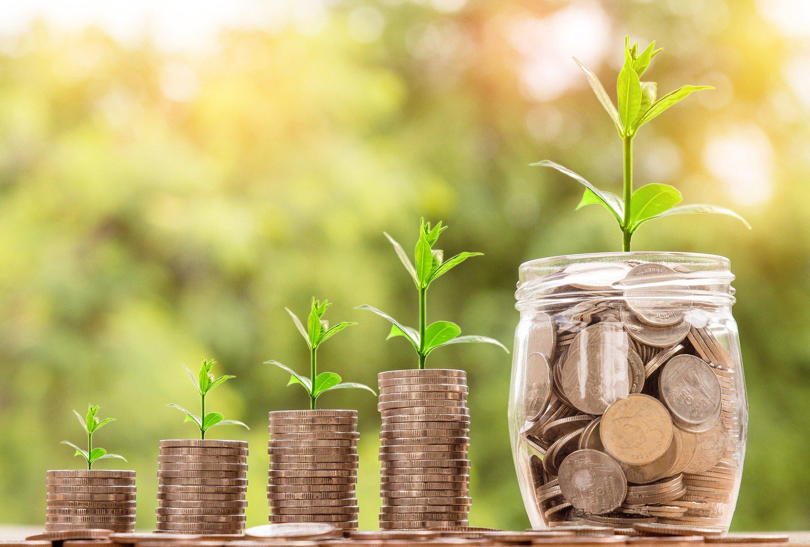

## Table of Contents

## What is an investment farm?

An investment farm is a type of business where people invest money to help grow and manage a farm. Instead of just buying land and farming it themselves, investors put their money into a farm that someone else runs. This can be a good way for people to earn money from farming without having to do the hard work themselves. The farm might grow crops, raise animals, or do both. The investors hope that the farm will make a profit, and they will get some of that profit back.

Investment farms can be a good choice for people who want to invest in agriculture but don't know much about farming. They can also be a way for farmers to get the money they need to start or grow their farm. The investors and the farmers work together, with the farmers taking care of the day-to-day work and the investors providing the money. If the farm does well, everyone can benefit. But if the farm has problems, the investors might lose their money. So, it's important for investors to understand the risks before they put their money into an investment farm.

## Why might someone invest in a farm?

Someone might invest in a farm because they want to make money. Farms can be a good investment because they can make a profit by selling crops or animals. If the farm does well, the investor can get some of that profit. This can be a good way to earn money without having to do the hard work of farming themselves. 

Another reason someone might invest in a farm is because they care about where their food comes from. They might want to support local farmers and help make sure that the food is grown in a way that is good for the environment. By investing in a farm, they can help make sure that the farm stays successful and keeps producing healthy food. 

Also, some people invest in farms because they think it's a safe way to keep their money. Farms have been around for a long time and they can be less risky than other kinds of investments. This can be a good choice for people who want to keep their money safe while still having the chance to earn a profit.

## What are the different types of investment farms?

There are different types of investment farms, and each one can be a good choice for different reasons. One type is a crop farm, where the farm grows things like wheat, corn, or vegetables. Investors put money into the farm to help it grow these crops, and they hope to make money when the crops are sold. Another type is a livestock farm, where the farm raises animals like cows, pigs, or chickens. Investors help pay for the animals and their care, and they can make money when the animals or their products, like milk or eggs, are sold.

Another kind of investment farm is a mixed farm, which does both crops and livestock. This can be a good choice for investors because it can help spread out the risk. If one part of the farm has problems, the other part might still do well. There are also organic farms, where the farm grows food without using chemicals. Some people like to invest in organic farms because they think it's better for the environment and for their health.

Finally, there are agribusiness investment farms, which are bigger and more like a business. These farms might use new technology and ways of farming to try to make more money. They can be a good choice for investors who want to be part of a big, successful farm. Each type of investment farm has its own risks and rewards, so it's important for investors to understand what they are getting into before they put their money in.

## How does one start investing in a farm?

To start investing in a farm, you first need to decide what kind of farm you want to invest in. There are different types like crop farms, livestock farms, organic farms, and agribusiness farms. Each type has its own way of making money and its own risks. You should think about what you want from your investment and what you are okay with losing if things don't go well. Once you know what kind of farm you want to invest in, you can start looking for farms that need investors.

The next step is to find a farm that is looking for investors. You can do this by talking to people in the farming community, looking online, or working with a company that helps connect investors with farms. When you find a farm that you like, you should learn as much as you can about it. You should ask the farmer about their plans, how they will use your money, and what kind of profit you can expect. It's also a good idea to look at the farm's financial records to see if it is doing well. Once you are happy with everything, you can put your money into the farm and become an investor.

## What are the initial costs and ongoing expenses of an investment farm?

The initial costs of investing in a farm can be pretty high. You might need to put in a lot of money at the start to buy the land, buy equipment, or pay for seeds and animals. Sometimes, you also have to pay for things like building barns or fixing up old buildings. The exact amount you need to spend can be different depending on the kind of farm you choose and where it is. It's a good idea to talk to the farmer and look at their plans to know how much money you will need to put in at the beginning.

Once you have started investing, there will be ongoing expenses to keep the farm running. These can include things like buying more seeds or feed for the animals, paying for water and electricity, and fixing or replacing equipment that breaks. You might also need to pay the people who work on the farm, like farmhands or managers. These costs can change from month to month, so it's important to keep an eye on them. If the farm does well, the money you make from selling crops or animals can help cover these expenses, but if things don't go as planned, you might need to put in more money to keep the farm going.

## What are the potential risks and challenges associated with farm investments?

Investing in a farm can be risky because there are many things that can go wrong. Weather can be a big problem. If there is too much rain, too little rain, or a big storm, it can hurt the crops or make it hard to take care of the animals. Pests and diseases can also cause big problems. If bugs or sickness get into the farm, it can destroy the crops or make the animals sick. Prices can change a lot too. If the price of what the farm sells goes down, it can be hard to make money. And sometimes, the people who run the farm might not do a good job, which can make the farm lose money.

Another challenge is that farming needs a lot of money. You have to spend money on things like land, equipment, seeds, and animals before you can start making money. And even after you start, you have to keep spending money to keep the farm going. If the farm doesn't make enough money to cover these costs, you might lose your investment. Also, rules and laws about farming can change. New rules might make it harder or more expensive to run the farm. So, it's important to think about all these risks before you decide to invest in a farm.

## How can an investment farm generate income?

An investment farm can make money by selling what it grows or raises. If it's a crop farm, it can sell things like wheat, corn, or vegetables to stores or other buyers. If it's a livestock farm, it can sell animals like cows, pigs, or chickens, or the things they make, like milk, eggs, or meat. The money from these sales can help pay for the costs of running the farm and give some profit to the investors. If the farm does well, it can make a lot of money this way.

Another way an investment farm can make money is by renting out parts of the land or equipment. Some farms might have extra land that they don't use, and they can rent it to other farmers. Or they might have machines that other farmers need, and they can rent those out too. This can bring in extra money for the farm. Also, if the farm gets bigger or more successful, the value of the land and the farm itself can go up. If the investors decide to sell the farm later, they might be able to sell it for more money than they paid for it, which can also be a way to make money.

## What legal and regulatory considerations should be taken into account when investing in a farm?

When you invest in a farm, you need to think about the laws and rules that can affect it. Different places have different rules about farming, like how you can use the land, what you can grow, and how you can treat animals. You might need special permits or licenses to do certain things on the farm. It's important to know these rules so you don't get in trouble and so you can plan your investment well. Also, there are laws about how you can sell what the farm produces, like food safety rules and rules about labeling. If you don't follow these rules, you could lose money or even have to close the farm.

Another thing to think about is taxes. Farms can have special tax rules that are different from other businesses. You might be able to get tax breaks or other benefits, but you also have to pay taxes on the money the farm makes. It's a good idea to talk to a tax expert to understand how taxes will affect your investment. Finally, if you are investing with other people, you need to think about the legal agreements between you. You should have a clear contract that says who owns what, how profits will be shared, and what happens if someone wants to leave the investment. This can help prevent problems later on.

## How can technology and modern farming techniques improve the profitability of an investment farm?

Technology and modern farming techniques can make an investment farm more profitable by helping it grow more food and save money. For example, using machines like tractors and harvesters can make farming faster and easier. This means the farm can grow more crops or take care of more animals without needing more people to work. Also, things like drones and sensors can help farmers know exactly when to water the crops or feed the animals, so they don't waste resources. This can save a lot of money and make the farm more efficient.

Another way technology helps is by making it easier to keep track of everything on the farm. With computer programs, farmers can see how much they are spending and how much they are making. This helps them make better decisions about what to grow or raise and when to sell it. Modern farming techniques, like using better seeds or new ways of growing crops, can also make the farm more successful. These techniques can help the farm produce more food that is healthier and tastes better, which can make it easier to sell and make more money.

## What are the tax implications of owning and operating an investment farm?

When you own and operate an investment farm, you need to think about taxes. Farms can have special tax rules that are different from other businesses. You might be able to get tax breaks or other benefits, like deductions for things like equipment, seeds, and feed. These can help lower the amount of taxes you have to pay. But you also have to pay taxes on the money the farm makes. This can include income from selling crops or animals, and sometimes even money from renting out parts of the land or equipment. It's a good idea to talk to a tax expert to understand exactly how taxes will affect your investment.

Another important thing to know is that the value of the farm's land and buildings can affect your taxes. If the value of the farm goes up, you might have to pay more in property taxes. But if you sell the farm later for more money than you paid for it, you might have to pay capital gains tax on the profit. There are also special rules about how you can pass the farm down to your family or sell it to someone else. These rules can be complicated, so it's important to understand them to make sure you are following the law and getting the best tax benefits possible.

## How can an investor assess the performance and value of an investment farm?

To assess the performance and value of an investment farm, an investor should look at the farm's financial records. This means checking how much money the farm is making from selling crops or animals, and how much it is spending on things like seeds, feed, and equipment. If the farm is making more money than it is spending, it is doing well. The investor should also look at the farm's profit over time to see if it is growing or if it is going up and down a lot. This can help the investor know if the farm is a good investment.

Another way to assess the farm's value is by looking at the land and buildings. If the farm is in a good location and the land is being used well, it can be worth more money. The investor should also think about the value of the equipment and any other things the farm owns. If the farm is using new technology or modern farming techniques, it might be worth more because it can grow more food or save money. By looking at all these things, the investor can get a good idea of how well the farm is doing and how much it is worth.

## What are some advanced strategies for maximizing returns from an investment farm?

One advanced strategy for maximizing returns from an investment farm is to use technology and data to make better decisions. By using tools like drones, sensors, and computer programs, farmers can know exactly when to plant, water, and harvest crops, or when to feed and care for animals. This can help the farm grow more food and save money on resources. Also, by keeping track of the farm's financials with software, investors can see where the farm is making money and where it is losing money. This helps them make smart choices about what to grow or raise and when to sell it, which can lead to higher profits.

Another strategy is to diversify the farm's operations. Instead of just growing one type of crop or raising one type of animal, the farm can do a mix of different things. This can help spread out the risk because if one part of the farm has problems, the other parts might still do well. For example, the farm could grow both crops and raise livestock, or it could grow different kinds of crops. The farm could also try new ways of farming, like organic or sustainable methods, which might attract more customers and allow the farm to charge higher prices. By diversifying, the farm can make more money and be more stable over time.

## References & Further Reading

[1]: ["Advances in Financial Machine Learning"](https://www.amazon.com/Advances-Financial-Machine-Learning-Marcos/dp/1119482089) by Marcos Lopez de Prado

[2]: Bergstra, J., Bardenet, R., Bengio, Y., & Kégl, B. (2011). ["Algorithms for Hyper-Parameter Optimization."](https://dl.acm.org/doi/10.5555/2986459.2986743) Advances in Neural Information Processing Systems 24.

[3]: ["Evidence-Based Technical Analysis: Applying the Scientific Method and Statistical Inference to Trading Signals"](https://www.amazon.com/Evidence-Based-Technical-Analysis-Scientific-Statistical/dp/0470008741) by David Aronson

[4]: ["Machine Learning for Algorithmic Trading"](https://github.com/stefan-jansen/machine-learning-for-trading) by Stefan Jansen

[5]: ["Global Agricultural Market Information System (AMIS)"]("http://www.amis-outlook.org/") by the Food and Agriculture Organization (FAO)

[6]: ["Quantitative Trading: How to Build Your Own Algorithmic Trading Business"](https://www.amazon.com/Quantitative-Trading-Build-Algorithmic-Business/dp/1119800064) by Ernest P. Chan

[7]: White, T. A., & Thomé, K. M. (2020). ["Agricultural Commodity Market Integration in the Americas: Anticipation and Impacts of Energy Markets."](https://www.nature.com/articles/s41598-024-81905-x) Food Policy.

[8]: ["Agricultural Policy Monitoring and Evaluation 2021"] (https://www.oecd.org/en/publications/agricultural-policy-monitoring-and-evaluation-2021_2d810e01-en.html) by OECD 

