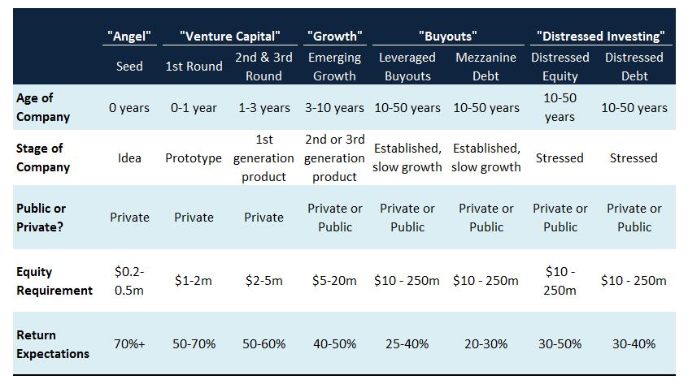

Financial charges and fees play a pivotal role in the investment landscape, forming an essential consideration for anyone engaged in financial markets. These charges encompass various costs that investors incur during the process of buying, holding, and selling investments. Understanding these fees is critical for investors as they can significantly influence the overall profitability of an investment portfolio. Even minor fees, when compounded over time, can erode substantial portions of returns, making awareness and management of these costs imperative. For instance, a seemingly small annual fee of 1% on a $100,000 investment can result in a loss of over $28,000 in potential returns over 20 years, assuming a 5% annual return rate.

Algorithmic trading has introduced new dynamics to trading fees. It utilizes complex algorithms and high-speed transactions to execute trades, often with lower transaction costs due to reduced human involvement. This can lead to more efficient trading by taking advantage of price discrepancies with minimal delay. However, the infrastructure and technology required for algorithmic trading can introduce their own costs, changing the traditional fee structure.



Minimizing fees is crucial for maximizing investment returns. Lower fees mean that a larger portion of investment gains are retained, enhancing the power of compounding. This compounding effect can significantly impact long-term growth, allowing investors to achieve their financial goals faster. Thus, strategically managing these expenses isn't merely about expense reduction; it's a vital component of return optimization.

This article will explore various financial charges and investment fees, distinguishing between different types such as brokerage and transaction fees. It will discuss high-fee versus low-fee investment options, providing insights into their impact on investment performance. The article will also cover algorithmic trading, examining its financial implications and cost management strategies. Finally, we will present approaches for minimizing costs and maximizing returns, emphasizing the integral role of strategic financial literacy in enhancing investment outcomes.

## Table of Contents

## Types of Financial Charges and Investment Fees

Financial charges and investment fees are crucial components that every investor should understand, as they directly impact investment returns. These fees can be categorized into various types, each with unique characteristics and implications.

Brokerage Fees:
These are fees charged by brokerage firms for their services in facilitating trades on behalf of investors. The most common types of brokerage fees include:

1. **Commission Fees**: Traditional brokers charge a fee per trade, which can be a flat rate or a percentage of the transaction value. Although many online platforms have adopted commission-free models, specific investments such as options and mutual funds might still incur commissions.

2. **Account Maintenance Fees**: Some brokers may charge an annual or monthly fee to maintain a trading account. This fee might be waived if certain conditions, such as maintaining a minimum balance, are met.

3. **Inactivity Fees**: Brokerage firms may penalize investors for not meeting a minimum number of trades within a specific period, which encourages active account use.

Financial Fees:
These are associated with specific investment products and services, particularly in mutual funds and advisory services.

1. **Mutual Fund Management Fees**: Typically represented by the expense ratio, this fee covers the cost of managing and operating a mutual fund. It is expressed as a percentage of the fund's assets, directly deducted from the fund's returns.

2. **Advisory Fees**: Investors may pay these fees to financial advisors for personalized investment advice. These can be flat fees, hourly rates, or a percentage of the assets under management (AUM).

Transaction Fees:
Transaction fees can emerge from various activities related to trading and investing.

1. **Trading Fees**: Charged per transaction, these are similar to commission fees but can involve other costs related to trade execution, including exchange fees.

2. **Service Charges**: These might include fees for account statements, account transfers, or wire transfers and vary by service providers.

3. **Late Payment Penalties**: If investors fail to meet payment obligations, such as for margin accounts, penalties are incurred, adding to investment costs.

Differentiation Between Explicit and Implicit Costs:
Investment fees can also be categorized into explicit and implicit costs:

1. **Explicit Costs**: These are direct and visible costs, such as the fees mentioned above—commissions, management fees, and service charges. They are straightforward and typically appear on investment statements.

2. **Implicit Costs**: These are not directly billed to investors but impact the overall investment value. Examples include bid-ask spreads, market impact, and slippage, where the execution price differs from the expected price due to market volatility.

Understanding these various fees helps investors make informed decisions, allowing them to choose cost-effective investment strategies that align with their financial goals. By differentiating between explicit and implicit costs, investors can better assess the total cost of their investment activities.

## High-Fee vs. Low-Fee Investment Types

High-fee investments often include derivatives and exotic assets. Derivatives, such as options and futures, are financial contracts whose value is dependent on the price of underlying assets. These instruments are frequently associated with high fees due to their complexity and the significant risk they [carry](/wiki/carry-trading). Exotic assets, which involve structured products and alternative investment vehicles like hedge funds, typically command elevated management and transaction fees. The nature of these investments often necessitates advanced trading strategies and extensive due diligence, contributing to their higher cost structure.

In contrast, low-fee investments are typically more straightforward, focusing on broad market exposure with reduced management and trading expenses. Exchange-Traded Funds (ETFs), index funds, and bond funds fall into this category. ETFs and index funds generally track specific market indices and offer diversification with minimal fees, as they do not require active management. Bond funds, which invest in fixed-income securities, also tend to incur lower fees, especially when they emphasize passive management and invest in government securities or high-rated corporate bonds.

The fees associated with these investment types can greatly impact performance. High-fee investments need substantial returns to offset their costs; failures in this regard can erode investor profits. Conversely, low-fee options frequently yield higher net returns over time due to reduced expenditure on fees, particularly for passive investors seeking long-term growth. The annualized impact of fees ($\text{Fee Impact} = \left(1 - \frac{\text{Total Return with Fees}}{\text{Total Return without Fees}}\right) \times 100\%$) highlights the importance of scrutinizing fee structures when evaluating investment options.

Choosing the right investment product requires careful consideration of fee structures in relation to investment strategy and goals. Investors with a higher risk appetite and short-term focus might explore derivatives and exotic assets despite the higher fees. In contrast, those looking for steady, long-term gains often prefer low-fee avenues like ETFs or index funds to maximize net returns. Awareness of fees and cost efficiency becomes essential for optimizing investment outcomes across varied financial landscapes.

## Algorithmic Trading and Its Financial Implications

Algorithmic trading, often referred to as algo trading, involves the use of computer algorithms to automate trading strategies. These algorithms are designed to execute trades at high speeds and frequencies, based on pre-defined criteria such as timing, price, and [volume](/wiki/volume-trading-strategy). By leveraging complex mathematical models and formulas, [algorithmic trading](/wiki/algorithmic-trading) seeks to capitalize on market inefficiencies. This method is widely used by institutional investors like hedge funds and investment banks to optimize trade execution and enhance profitability.

One of the primary advantages of algorithmic trading is its ability to minimize transaction costs. Traditional manual trading involves human intervention, which can lead to costly delays and errors. Algorithms, on the other hand, can operate at speeds far beyond human capability, executing trades in fractions of a second. This speed allows traders to take advantage of minute price discrepancies and achieve more favorable buying or selling conditions. Additionally, algorithms can manage a large number of trades simultaneously, further reducing the overall cost per transaction through economies of scale.

Despite its benefits, algorithmic trading poses several challenges for traders, particularly concerning costs. Infrastructure expenses, such as acquiring advanced computing systems and access to high-frequency data feeds, can be substantial. Moreover, the development and maintenance of sophisticated algorithms require skilled personnel, adding to the operational costs. Another key challenge is the risk of over-optimization, where a model performs exceptionally well on historical data but fails in live trading environments due to unforeseen market conditions.

Algorithms also play a crucial role in reducing slippage and market impact. Slippage occurs when there's a difference between the expected price of a trade and the actual price. This is often a consequence of market [volatility](/wiki/volatility-trading-strategies) or delayed order execution. By automating trades, algorithms can act quickly, thus lessening the chance of price changes before trade completion. Additionally, by breaking down large trades into smaller parts, algorithms can execute them incrementally to prevent significant market movements that could affect the trade's profitability.

Code example for an elementary algorithmic strategy in Python might resemble:

```python
import pandas as pd

# Assuming 'data' is a DataFrame with market data
def moving_average_strategy(data, short_window=40, long_window=100):
    signals = pd.DataFrame(index=data.index)
    signals['price'] = data['price']

    # Calculate short-term moving average
    signals['short_mavg'] = data['price'].rolling(window=short_window, min_periods=1, center=False).mean()

    # Calculate long-term moving average
    signals['long_mavg'] = data['price'].rolling(window=long_window, min_periods=1, center=False).mean()

    # Create signals
    signals['signal'] = 0.0
    signals['signal'][short_window:] = np.where(
        signals['short_mavg'][short_window:] > signals['long_mavg'][short_window:], 1.0, 0.0
    )

    # Generate trading orders
    signals['positions'] = signals['signal'].diff()

    return signals
```

In conclusion, algorithmic trading offers significant advantages in minimizing transaction costs and improving trade precision. However, it demands upfront investments in technology and expertise, and careful management to address potential pitfalls like over-optimization and infrastructure costs. By effectively leveraging algorithms, traders can reduce slippage and market impact, thereby achieving a more efficient trading process.

## Cost Management in Algorithmic Trading

Transaction cost analysis (TCA) is a critical component for managing costs in algorithmic trading. TCA involves evaluating the expenses associated with buying and selling securities, including direct costs like commissions and indirect ones such as market impact and opportunity costs. A thorough TCA allows traders to identify inefficiencies in their trading strategies and make informed decisions to optimize execution and profitability. By systematically analyzing these costs, traders can gain insights into price slippage, which occurs when there is a difference between the expected price of a trade and the actual price. Minimizing slippage is essential because it directly impacts the overall performance of trading strategies.

To minimize brokerage and transaction fees, efficient strategies include negotiating favorable commission rates with brokers, using advanced order types to reduce market impact, and selecting execution venues that offer competitive pricing. Additionally, adopting a cost-focused approach during the algorithm design phase is vital. This involves integrating cost considerations into the algorithmic strategy itself, ensuring that it accounts for factors such as [liquidity](/wiki/liquidity-risk-premium) and volatility, which can influence transaction costs.

Algorithmic trading also requires substantial technological infrastructure. This includes high-performance computing systems, low-latency network connections, and reliable data feeds. The cost of maintaining this infrastructure can be significant; however, it is essential for achieving optimal trading performance. A well-designed infrastructure reduces latency and increases the chances of successful trade execution at favorable prices. While these technological investments are costly, they often lead to long-term savings by facilitating faster and more accurate trades.

Machine learning plays a pivotal role in cost optimization within algorithmic trading. By analyzing historical trade data, [machine learning](/wiki/machine-learning) models can predict market conditions and adjust strategies to minimize costs. For example, predictive models can determine the optimal timing for placing trades to achieve the best prices while incurring minimal fees. Machine learning algorithms can also optimize order execution by dynamically adjusting order size and timing based on market conditions. Here's a basic illustration in Python showcasing how machine learning can assist in optimizing trading costs:

```python
import numpy as np
from sklearn.model_selection import train_test_split
from sklearn.linear_model import LinearRegression

# Sample trade data: columns represent features like time, volume, and price
trade_data = np.array([...])

# Target is the transaction cost or slippage
transaction_costs = np.array([...])

# Split data into training and testing sets
X_train, X_test, y_train, y_test = train_test_split(trade_data, transaction_costs, test_size=0.2, random_state=42)

# Create and train the machine learning model
model = LinearRegression()
model.fit(X_train, y_train)

# Predict transaction costs for the test set
predicted_costs = model.predict(X_test)

# Evaluate model performance
performance = model.score(X_test, y_test)
print(f"Model Performance: {performance:.2f}")
```

In summary, effective cost management in algorithmic trading demands a comprehensive approach that encompasses careful analysis of transaction costs, strategic fee reduction, robust technological infrastructure, and leveraging advanced technologies like machine learning for dynamic optimization. By implementing these practices, trading firms can substantially lower their trading costs and enhance their overall return on investment.

## Minimizing Costs and Maximizing Returns

Combining algorithmic trading with financial literacy is a powerful strategy to manage investment costs effectively, thereby maximizing returns. This approach requires a keen understanding of both trading technologies and investment principles to evaluate and mitigate various fees associated with trading and investing.

Choosing low-cost investment vehicles and platforms is a foundational step. Exchange-traded funds (ETFs) and index funds typically offer lower management fees compared to actively managed mutual funds. These vehicles provide diversified exposure to markets with minimal cost. Platforms that offer zero-commission trading or have low account maintenance fees can further reduce costs. Investors should conduct thorough research to find platforms that align with their investment goals while minimizing cost overhead.

Regular monitoring and adjustments are crucial to maintain low investment fees. Investors should set up periodic reviews of their portfolios to identify any unnecessarily high-cost assets or services. This could involve automated alerts for fee changes or periodic audits of broker's fee structures. Employing analytics tools can enhance this process, providing detailed insights into the cost vs. benefit of each asset. A dynamic approach to investment ensures that fees remain optimized in accordance with market conditions and individual investment strategies.

Tax-efficient investing strategies can complement fee reduction efforts, maximizing post-tax returns. Investors should be aware of tax implications associated with different investment products and choose those that offer the most favorable tax treatment. Tax-loss harvesting is a common strategy where investors sell securities at a loss to offset capital gains, thus reducing the tax burden. Utilizing tax-advantaged accounts, such as IRAs or 401(k)s, can also significantly impact net returns, enabling investors to defer taxes until withdrawal or even benefit from tax-free gains.

By integrating algorithmic trading with these financial strategies, investors can effectively minimize costs while maximizing their returns. Algorithmic strategies inherently focus on rapid execution and minimal market impact, reducing the risk of slippage—a hidden cost for many traders. At the same time, financial literacy empowers investors to make informed, strategic decisions about where and how to allocate their capital most effectively, balancing between tax considerations, fee structures, and investment outcomes. 

Overall, a conscious and educated approach to managing financial charges and fees in trading and investing can lead to a significant enhancement in long-term investment performance.

## Conclusion

The compounded effect of financial fees over time can significantly impact investment returns. This principle is anchored in the time value of money and compound interest. Even seemingly minor fees can erode returns when compounded over long periods. For example, consider an investment with an annual return of 7% before fees. If a 1% annual fee is introduced, the effective return drops to 6%. Over 30 years, an initial investment of $10,000 would grow to $76,122 at a 7% return rate, but only to $57,435 at a 6% rate. This demonstrates the substantial impact fees can have due to compounding, a phenomenon investors often underestimate.

Smart cost management is critical in both traditional and algorithmic trading to amplify returns. In traditional trading, investors can minimize costs by selecting low-fee investment products, such as index funds and ETFs, or by using platforms that offer competitive fee structures. In algorithmic trading, the reduction of transaction costs is equally important. Techniques such as transaction cost analysis (TCA) and the strategic use of algorithms can mitigate slippage and reduce market impact, enhancing net returns.

Staying informed about market trends and evolving fee structures is essential for effective cost management. Investors who understand the nuances of trading fees, platform charges, and investment product costs are better equipped to make decisions that align with their investment goals. Adapting to changes in the financial landscape, such as shifts in regulatory policies or industry practices, allows investors to optimize their strategies proactively.

The strategic decisions investors make regarding financial charges and fees have lasting value. By prioritizing low-cost investment options and maintaining awareness of fee structures, investors can improve their potential for wealth accumulation over time. This strategic approach not only enhances immediate returns but also fosters sustainable long-term growth, securing a robust financial future.

## References & Further Reading

[1]: Bergstra, J., Bardenet, R., Bengio, Y., & Kégl, B. (2011). ["Algorithms for Hyper-Parameter Optimization."](https://dl.acm.org/doi/10.5555/2986459.2986743) Advances in Neural Information Processing Systems 24.

[2]: ["Advances in Financial Machine Learning"](https://www.amazon.com/Advances-Financial-Machine-Learning-Marcos/dp/1119482089) by Marcos Lopez de Prado

[3]: ["Evidence-Based Technical Analysis: Applying the Scientific Method and Statistical Inference to Trading Signals"](https://www.amazon.com/Evidence-Based-Technical-Analysis-Scientific-Statistical/dp/0470008741) by David Aronson

[4]: ["Machine Learning for Algorithmic Trading"](https://github.com/stefan-jansen/machine-learning-for-trading) by Stefan Jansen

[5]: ["Quantitative Trading: How to Build Your Own Algorithmic Trading Business"](https://github.com/LucindaYa/quant-resources/blob/master/Quantitative%20Trading%20How%20to%20Build%20Your%20Own%20Algorithmic%20Trading%20Business.pdf) by Ernest P. Chan

[6]: French, K. R. (2008). ["Presidential Address: The Cost of Active Investing."](https://onlinelibrary.wiley.com/doi/abs/10.1111/j.1540-6261.2008.01368.x) The Journal of Finance, 63(4), 1537-1573.

[7]: Carhart, M. M. (1997). ["On Persistence in Mutual Fund Performance."](https://onlinelibrary.wiley.com/doi/full/10.1111/j.1540-6261.1997.tb03808.x) The Journal of Finance, 52(1), 57-82.