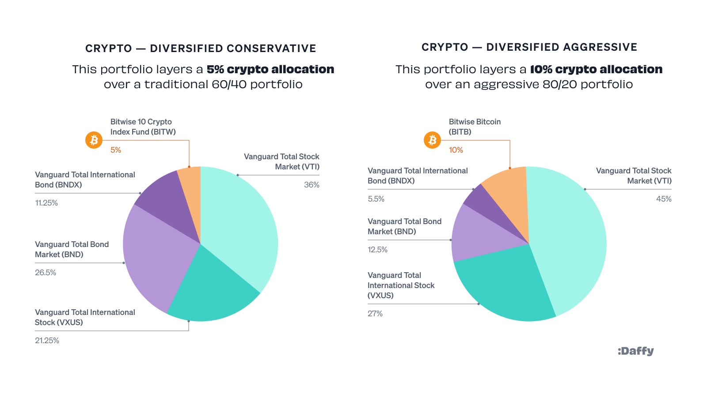

## Table of Contents

## What is Bitcoin and why is it considered an investment?

Bitcoin is a type of digital money that you can use to buy things online. It was created in 2009 by someone using the name Satoshi Nakamoto. Unlike regular money, Bitcoin is not controlled by any government or bank. Instead, it uses a special technology called blockchain to keep track of all transactions. This means that when you send or receive Bitcoin, the information is recorded on many computers around the world, making it very secure and transparent.

People consider Bitcoin an investment because its value can go up over time. When Bitcoin first started, it was worth very little, but now it can be worth thousands of dollars for just one Bitcoin. Many people buy Bitcoin hoping that its value will keep increasing, so they can sell it later for a profit. However, it's important to know that Bitcoin's value can also go down, which means investing in it can be risky. Just like any investment, it's a good idea to learn as much as you can before deciding to buy Bitcoin.

## What are investment funds and how do they work?

Investment funds are pools of money collected from many people and managed by professionals. These funds are used to buy a variety of investments, like stocks, bonds, or real estate. The goal is to grow the money over time by making smart investment choices. When you put your money into an investment fund, you own a small part of the whole fund, and your returns depend on how well the fund does overall.

The way investment funds work is pretty straightforward. Fund managers use the money collected to buy different assets. They try to pick investments that will do well in the future. If the investments do well, the value of the fund goes up, and so does the value of your share. If the investments don't do well, the value of the fund can go down. The fund might also pay out dividends or interest, which are profits that get shared with the people who own parts of the fund. This way, everyone who invests in the fund can benefit from the expertise of the professional managers.

## How can investment funds provide exposure to Bitcoin?

Investment funds can give people a way to invest in Bitcoin without having to buy it directly. These funds, sometimes called Bitcoin funds or crypto funds, collect money from lots of people and use it to buy Bitcoin. When you invest in one of these funds, you get a part of the fund, which means you get a share of the Bitcoin the fund owns. This can be easier and less risky than buying Bitcoin yourself because the fund is managed by experts who know a lot about Bitcoin and other cryptocurrencies.

These funds can help spread out the risk of investing in Bitcoin. Instead of putting all your money into Bitcoin, you can put some money into the fund, which might also invest in other things. This way, if Bitcoin's value goes down, the other investments in the fund might help balance things out. Plus, because the fund is managed by professionals, they can make decisions about when to buy or sell Bitcoin to try to make the best returns for everyone who has invested in the fund.

## What are the benefits of investing in Bitcoin through funds rather than directly?

Investing in Bitcoin through funds can be easier and less risky than buying it directly. When you invest in a fund, experts manage the money and make decisions about when to buy or sell Bitcoin. This can be helpful because they know a lot about cryptocurrencies and can try to make the best choices. Also, funds often invest in other things besides Bitcoin, which can help spread out the risk. If Bitcoin's value goes down, the other investments in the fund might help balance things out, making it less scary for you.

Another benefit is that funds can make it simpler to get started with Bitcoin. Instead of having to set up a special wallet and learn how to buy and store Bitcoin yourself, you can just put your money into the fund. The fund takes care of all the technical stuff, so you don't have to worry about it. This can be a good choice if you want to try investing in Bitcoin but don't feel comfortable doing it on your own.

## What types of investment funds offer Bitcoin exposure?

There are different types of investment funds that can help you invest in Bitcoin. One common type is called a Bitcoin exchange-traded fund (ETF). These funds are traded on stock exchanges, just like regular stocks. When you buy shares in a Bitcoin ETF, you're buying a piece of a fund that owns Bitcoin. This makes it easy to invest in Bitcoin without having to buy it directly. Another type of fund is a Bitcoin mutual fund. These funds pool money from many investors and use it to buy Bitcoin. They are managed by professionals who make decisions about when to buy or sell Bitcoin to try to make the best returns for everyone in the fund.

Another option is a cryptocurrency index fund. These funds invest in a mix of different cryptocurrencies, including Bitcoin. By investing in an index fund, you get exposure to Bitcoin along with other cryptocurrencies, which can help spread out the risk. Some funds also offer a way to invest in Bitcoin through a fund of funds. These funds invest in other funds that own Bitcoin, giving you another way to get exposure to Bitcoin without buying it directly. Each type of fund has its own way of working, but they all aim to make it easier for you to invest in Bitcoin and possibly see good returns.

## How do Bitcoin-focused funds differ from diversified crypto funds?

Bitcoin-focused funds are all about Bitcoin. They use the money they collect to buy Bitcoin and nothing else. When you invest in a Bitcoin-focused fund, you're betting that Bitcoin's value will go up. These funds are simple because they only deal with one cryptocurrency, but they can be risky because if Bitcoin's value goes down, the whole fund goes down with it. The fund managers will try to buy and sell Bitcoin at the best times to make the most money for everyone in the fund.

Diversified crypto funds are different because they spread their money across many cryptocurrencies, not just Bitcoin. They might invest in Bitcoin, but also in other popular cryptocurrencies like Ethereum, Litecoin, or even smaller ones. The idea is to lower the risk by not putting all the money into one thing. If one cryptocurrency doesn't do well, the others might help balance it out. These funds can be a good choice if you want to invest in cryptocurrencies but don't want to risk everything on Bitcoin alone. The fund managers will pick a mix of cryptocurrencies they think will do well and manage them to try to get the best returns.

## What are the risks associated with Bitcoin investment funds?

Investing in Bitcoin through funds can be risky because the value of Bitcoin can go up and down a lot. If Bitcoin's price drops, the value of the fund will go down too. This means you could lose money if you need to sell your shares when Bitcoin is not doing well. Also, Bitcoin is a new kind of money and not everyone trusts it yet. If something big happens, like new rules from governments or a big security problem, it could make Bitcoin's value drop suddenly.

Another risk is that the people managing the fund might not make good choices. They decide when to buy or sell Bitcoin, and if they make bad decisions, it can hurt the fund's performance. Plus, there are fees to pay for having someone else manage your money. These fees can eat into your profits, especially if the fund doesn't do well. So, it's important to think about these risks before deciding to invest in a Bitcoin fund.

## How do regulatory environments affect Bitcoin investment funds?

The rules that governments make can change how Bitcoin investment funds work. If a country decides to put tight rules on Bitcoin, it might be harder for funds to buy and sell it. This can make the fund's value go down because it's harder to do business. Also, if the government says Bitcoin is too risky or not allowed, people might not want to invest in the fund anymore. This can make the fund less popular and harder to manage.

On the other hand, if a country makes rules that help Bitcoin, it can be good for the funds. Clear rules can make people feel safer about investing in Bitcoin, which can bring more money into the funds. But even with good rules, things can change fast. Governments might change their minds about Bitcoin, and new rules can come out that affect how the funds work. So, it's important for people who invest in Bitcoin funds to keep an eye on what the government is doing.

## What should investors look for when choosing a Bitcoin investment fund?

When choosing a Bitcoin investment fund, investors should first look at the fund's track record. This means checking how well the fund has done in the past. Even though past results don't promise future success, they can give you an idea of how the fund has managed Bitcoin. Also, it's important to see who is managing the fund. Good managers have experience and know a lot about Bitcoin and the cryptocurrency market. They can make smart choices about when to buy and sell Bitcoin, which can help the fund do well.

Another thing to consider is the fees the fund charges. These can be for managing the fund or for buying and selling Bitcoin. High fees can eat into your profits, so it's good to find a fund with reasonable fees. Also, think about how much risk you're okay with. Some funds might focus only on Bitcoin, which can be riskier, while others might spread their money across different cryptocurrencies to lower the risk. Understanding the fund's strategy and how it fits with your own goals and comfort with risk is key to making a smart choice.

## How do the fees and performance of Bitcoin funds compare to other investment vehicles?

Bitcoin funds often have higher fees than other investment vehicles like stock or bond funds. This is because managing Bitcoin and other cryptocurrencies can be more complicated and risky. Bitcoin funds might charge fees for managing the fund, as well as fees for buying and selling Bitcoin. These fees can add up and take a bigger bite out of your profits compared to traditional funds. For example, while a stock fund might charge around 1% in fees, a Bitcoin fund could charge 2% or more.

The performance of Bitcoin funds can be very different from other investment vehicles. Bitcoin's price can go up and down a lot more than stocks or bonds. This means Bitcoin funds can offer the chance for big gains, but also big losses. Over the last few years, Bitcoin has had times where it grew a lot, but also times where it dropped a lot. Because of this, Bitcoin funds can be riskier and more unpredictable than funds that invest in more stable assets. It's important to think about how much risk you're okay with before choosing to invest in a Bitcoin fund.

## What are some advanced strategies for managing a portfolio with Bitcoin funds?

One advanced strategy for managing a portfolio with Bitcoin funds is called dollar-cost averaging. This means you put a set amount of money into the fund at regular times, like every month. This can help you buy Bitcoin at different prices over time, which can lower the risk of putting all your money in at once when the price is high. Another strategy is to rebalance your portfolio. This means you check your investments regularly and adjust them to keep the right mix of Bitcoin and other investments. If Bitcoin's value goes up a lot, you might sell some of it to buy more of other things, to keep your portfolio balanced and not too risky.

Another strategy is to use stop-loss orders. This is a way to limit how much money you could lose. You can set a rule that says if Bitcoin's price drops to a certain level, the fund will automatically sell some of its Bitcoin to stop the losses from getting too big. Also, some investors use hedging strategies. This means they might invest in things that go up in value when Bitcoin goes down. This can help protect their portfolio if Bitcoin's price falls. These advanced strategies can help manage the risks of investing in Bitcoin funds, but they need careful planning and understanding of how the market works.

## How might future trends in cryptocurrency affect Bitcoin investment funds?

Future trends in cryptocurrency could really change how Bitcoin investment funds work. If more people start using cryptocurrencies for everyday things like buying stuff online or even in stores, it might make Bitcoin more popular and valuable. This could be good for Bitcoin funds because more people might want to invest in them. Also, if governments start making clear rules about how to use and trade cryptocurrencies, it could make people feel safer about investing in Bitcoin. This might bring more money into Bitcoin funds, making them grow.

On the other hand, if new kinds of cryptocurrencies come out that are better or easier to use than Bitcoin, it might make Bitcoin less popular. This could hurt Bitcoin funds because fewer people might want to invest in them. Also, if there are big problems with security, like hackers stealing Bitcoin, it could make people scared to invest in Bitcoin funds. So, it's important for people who manage Bitcoin funds to keep an eye on these trends and be ready to change how they do things to keep the funds doing well.

## What is Understanding Portfolio Diversification in Cryptocurrency?

Diversification is a fundamental investment strategy aimed at mitigating risk by distributing capital across a variety of financial assets and sectors. In cryptocurrencies, this strategy involves more than merely allocating funds to different coins. The volatile nature of the crypto market necessitates diverse sector allocations, covering areas like Decentralized Finance (DeFi), Non-Fungible Tokens (NFTs), and foundational blockchain technology.

To understand diversification in [cryptocurrency](/wiki/cryptocurrency), consider the analogy of traditional stock market investments in technology, healthcare, and consumer goods. Similarly, cryptocurrency investors can distribute their portfolios across sectors such as DeFi, emerging blockchain protocols, stablecoins, NFTs, and other crypto assets. This approach helps investors manage risks associated with the fluctuating nature of individual assets while potentially capitalizing on various technological advancements.

### Sector Allocation

1. **DeFi (Decentralized Finance):** DeFi represents a broad category of financial applications aimed at disrupting traditional financial systems. Investing in DeFi involves assets like decentralized exchanges, lending platforms, and stablecoins. DeFi assets often exhibit different risk profiles and growth potential compared to other cryptocurrencies, providing unique opportunities and challenges.

2. **NFTs (Non-Fungible Tokens):** NFTs offer digital ownership verification, predominantly in art, collectibles, and gaming. This sector has shown explosive growth and volatility, making it both a lucrative yet risky area. Investors eyeing high-growth opportunities might allocate a portion of their portfolio to NFTs while balancing it with other stable assets.

3. **Blockchain Technology:** Underpinning the entire crypto universe are various blockchain technologies beyond Bitcoin and Ethereum. Investing in emerging blockchain protocols, Layer 2 solutions, and interoperability projects can ensure investors are part of the next wave of technological innovation.

### Risk-Adjusted Asset Selection

Risk-adjusted returns are essential for evaluating the performance and potential of crypto investments. Metrics like the Sharpe Ratio, which considers the return of an investment relative to its risk, are invaluable. The formula for the Sharpe Ratio is:

$$
\text{Sharpe Ratio} = \frac{R_p - R_f}{\sigma_p}
$$

Where:

- $R_p$ is the expected portfolio return.
- $R_f$ is the risk-free rate of return (often a constant like U.S. Treasury yields).
- $\sigma_p$ is the portfolio's standard deviation (a measure of risk).

For a crypto portfolio, the risk-adjusted selection process may involve using algorithmic tools to derive optimized allocations that balance return and [volatility](/wiki/volatility-trading-strategies). Python libraries such as `numpy` and `pandas` can be used for quantitative analysis, with `numpy` particularly useful for operations like calculating the covariance matrix essential for optimal portfolio construction.

```python
import numpy as np
import pandas as pd

# Example of calculating historical returns
def calculate_historical_returns(prices):
    return np.log(prices / prices.shift(1))

# Example portfolio covariance calculation
returns = calculate_historical_returns(pd.DataFrame({
    'asset1': [...],  # Price list of asset1
    'asset2': [...],  # Price list of asset2
}))

cov_matrix = returns.cov()
```

In summary, diversification within the cryptocurrency market requires a balanced allocation across various coins and sectors such as DeFi, NFTs, and blockchain technology. Investors can optimize their portfolios using a mix of qualitative insights into sector trends and quantitative techniques for risk-adjusted asset selection, ensuring they are well-prepared to handle the unique challenges and opportunities presented by the crypto sphere.

## References & Further Reading

[1]: Bergstra, J., Bardenet, R., Bengio, Y., & Kégl, B. (2011). ["Algorithms for Hyper-Parameter Optimization."](https://papers.nips.cc/paper/4443-algorithms-for-hyper-parameter-optimization) Advances in Neural Information Processing Systems 24.

[2]: ["Advances in Financial Machine Learning"](https://www.amazon.com/Advances-Financial-Machine-Learning-Marcos/dp/1119482089) by Marcos Lopez de Prado

[3]: ["Evidence-Based Technical Analysis: Applying the Scientific Method and Statistical Inference to Trading Signals"](https://books.google.com/books/about/Evidence_Based_Technical_Analysis.html?id=MeoJAQAAMAAJ) by David Aronson

[4]: ["Machine Learning for Algorithmic Trading"](https://github.com/stefan-jansen/machine-learning-for-trading) by Stefan Jansen

[5]: ["Quantitative Trading: How to Build Your Own Algorithmic Trading Business"](https://www.amazon.com/Quantitative-Trading-Build-Algorithmic-Business/dp/1119800064) by Ernest P. Chan