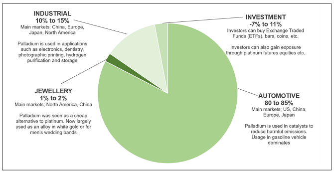

## Table of Contents

## What is palladium and why is it valuable?

Palladium is a rare metal that looks silvery-white. It is part of a group of metals called the platinum group. Palladium is found in the earth's crust and is often used in making jewelry, electronics, and car parts. It is soft and can be shaped easily, which makes it useful for many things.

Palladium is valuable because it is rare and has many important uses. One big use is in cars, where it helps clean the exhaust fumes. This makes the air cleaner. Palladium is also used in making electronic devices like phones and computers. Because it is hard to find and very useful, people are willing to pay a lot of money for it.

## What are investment funds and how do they work?

Investment funds are like big pools of money that are collected from many people who want to invest their money. These funds are managed by professionals who decide where to invest the money, like in stocks, bonds, or other things. The idea is to spread the money across different investments to lower the risk. When you put your money into an investment fund, you buy a small part of the fund, called a share or unit.

The way investment funds work is that the money they make or lose depends on how well the investments they choose do. If the investments do well, the value of the fund goes up, and so does the value of your shares. If the investments do poorly, the value of the fund and your shares goes down. The professionals managing the fund charge a fee for their work, which is usually a small percentage of the money in the fund. This fee is taken out of the fund's returns before they are given to the investors.

## How can investors gain exposure to palladium through investment funds?

Investors can gain exposure to palladium through investment funds by buying shares in funds that focus on commodities, specifically those that include palladium in their portfolio. These funds are often called commodity funds or precious metals funds. By investing in these funds, investors can own a small piece of a larger pool of money that is used to buy palladium and other similar metals. This way, they don't need to buy the actual metal themselves, which can be expensive and hard to store.

These funds work by pooling money from many investors and using it to buy palladium and other commodities. The value of the fund goes up or down based on the price of palladium and other investments it holds. If the price of palladium goes up, the value of the fund usually goes up too, and investors can make money. If the price goes down, the value of the fund goes down, and investors might lose money. The fund managers charge a fee for managing the investments, which is taken out of the fund's returns before they are shared with investors.

## What are the different types of investment funds that offer palladium exposure?

There are a few types of investment funds that can help you invest in palladium without buying the metal yourself. One type is called an Exchange-Traded Fund (ETF). These funds are like a basket of investments that you can buy and sell on the stock market, just like stocks. Some ETFs focus on commodities like palladium, so by buying shares in these ETFs, you can own a piece of the fund that owns palladium.

Another type of fund is a mutual fund. These funds also pool money from many people to invest in different things, including palladium. Mutual funds are managed by professionals who decide where to put the money. You can buy shares in a mutual fund that includes palladium in its portfolio, which gives you exposure to the metal's price movements.

Lastly, there are commodity funds that specialize in investing in raw materials like palladium. These funds can be either ETFs or mutual funds, but they focus specifically on commodities. By investing in these funds, you can benefit from changes in palladium prices without having to handle the physical metal. Each type of fund has its own fees and risks, so it's important to understand them before you invest.

## What are the benefits of investing in palladium through funds rather than direct investment?

Investing in palladium through funds is easier than buying the metal directly. When you invest in a fund, you don't have to worry about where to store the metal or how to keep it safe. Funds take care of all that for you. Plus, you can start investing with less money because you're buying shares in the fund, not the whole metal. This makes it easier for more people to invest in palladium.

Another big benefit is that funds spread your money across many different investments, not just palladium. This is called diversification, and it helps lower the risk. If the price of palladium goes down, other investments in the fund might go up, which can help balance out your losses. Plus, funds are managed by professionals who know a lot about investing. They make the decisions about when to buy or sell, which can help your investment do better than if you were trying to do it all by yourself.

## What are the risks associated with palladium investment funds?

Investing in palladium through funds can be risky because the price of palladium can go up and down a lot. Palladium is a commodity, and its price can change because of things like how much people want it, how much is available, and what's happening in the world. If the price of palladium goes down, the value of your investment in the fund will also go down. This means you could lose money.

Another risk is that funds charge fees for managing the investments. These fees can add up over time and eat into your returns. Even if the price of palladium goes up, the fees might make your overall gain smaller. It's important to look at how much the fund charges before you invest. Also, since funds can invest in other things besides palladium, if those other investments do badly, it can affect the overall performance of the fund. This means your investment could be affected by more than just the price of palladium.

## How do palladium prices affect the performance of these investment funds?

Palladium prices have a big effect on how well palladium investment funds do. When the price of palladium goes up, the value of the fund usually goes up too. This is because the fund owns palladium or investments that are tied to palladium prices. So, if you own shares in the fund, your investment can make more money when palladium prices rise. But, if the price of palladium goes down, the value of the fund will also go down. This means you could lose money if you need to sell your shares when the price is low.

The performance of these funds can also be affected by other things the fund invests in. Some funds might have a mix of different investments, not just palladium. If these other investments do well, they can help the fund's performance even if palladium prices are not doing so great. But if those other investments do badly, it can make the fund's performance worse, even if palladium prices are going up. So, the overall performance of the fund depends a lot on palladium prices, but it's not the only thing that matters.

## What are some examples of successful palladium-focused investment funds?

One successful palladium-focused investment fund is the Aberdeen Standard Physical Palladium Shares ETF (PALL). This fund is an exchange-traded fund that aims to match the price of palladium. It does this by holding actual palladium bars in a secure vault. Investors can buy and sell shares of PALL on the stock market just like they would with any other stock. Because PALL directly tracks the price of palladium, it has done well when palladium prices go up. For example, if palladium prices rise, the value of PALL shares usually goes up too, which can lead to good returns for investors.

Another example is the Sprott Physical Palladium Trust (SPPD). This fund also focuses on giving investors direct exposure to palladium prices. SPPD holds physical palladium and allows investors to own a share of that metal without having to store it themselves. The trust has been successful in tracking palladium prices, providing investors with a way to benefit from increases in palladium's value. Both PALL and SPPD are good examples of how investors can gain from rising palladium prices through investment funds, without the need to handle the physical metal.

## How does the global supply and demand for palladium impact investment fund performance?

The global supply and demand for palladium has a big impact on how well palladium investment funds do. When more people want palladium than there is available, the price goes up. This is good for the funds because they own palladium or investments that are tied to its price. So, if the price of palladium goes up because of high demand, the value of the fund goes up too. This means investors in the fund can make more money. On the other hand, if there's a lot of palladium available and not many people want it, the price goes down. This can make the value of the fund go down, which is bad for investors because they could lose money.

The supply of palladium can change because of things like mining problems or new sources being found. If there's a problem at a mine, less palladium might be available, which can push the price up. Also, if new sources of palladium are discovered, more might be available, which can push the price down. Demand for palladium can change because of things like how many cars are being made, since palladium is used in car parts. If more cars are being made, more palladium is needed, which can push the price up. All these changes in supply and demand affect the price of palladium, and that in turn affects how well palladium investment funds perform.

## What role does palladium play in industries like automotive and electronics, and how does this influence fund investment strategies?

Palladium is really important in the automotive and electronics industries. In cars, palladium is used in something called catalytic converters. These help clean the air by turning harmful gases from the car's exhaust into less harmful ones. Because more and more cars are being made around the world, the need for palladium keeps going up. In electronics, palladium is used in things like phones and computers because it's a good conductor and doesn't wear out easily. As more people use electronic devices, the demand for palladium in this industry also grows.

The way palladium is used in these industries affects how investment funds that focus on palladium make their plans. Since the demand for palladium can go up because of more cars and electronics being made, funds might decide to buy more palladium when they think the demand will keep growing. This can help the fund make more money if the price of palladium goes up. But, if the fund managers think that the demand might go down, like if fewer cars are being made, they might sell some of their palladium to avoid losing money if the price drops. So, keeping an eye on what's happening in the automotive and electronics industries helps fund managers decide the best way to invest in palladium.

## How can investors evaluate the performance and management of palladium investment funds?

To evaluate the performance of palladium investment funds, investors should look at how well the fund has done over time. This means checking the fund's returns to see if it has made money or lost money. Investors can compare the fund's performance to the price of palladium itself. If the fund's returns match the changes in palladium prices closely, it's a good sign that the fund is doing what it's supposed to do. Also, investors should look at how the fund has done compared to other similar funds. If a fund has done better than others, it might be a good choice. But, it's important to remember that past performance doesn't always mean the fund will do well in the future.

When looking at the management of palladium investment funds, investors should check who is in charge of the fund and how much experience they have. Good fund managers know a lot about palladium and the industries that use it, like cars and electronics. Investors should also look at the fees the fund charges. Lower fees can mean more money in your pocket because the fund managers take less out of the returns. It's also good to see if the fund managers have been able to make smart choices about when to buy or sell palladium. This can show if they are good at their job and if they can help the fund do well in the future.

## What future trends and technological advancements might affect the viability of palladium investment funds?

Future trends and technological advancements could have a big impact on how well palladium investment funds do. One trend to watch is the move toward electric cars. Electric cars don't need as much palladium as gas cars do because they don't have catalytic converters. If more people start buying electric cars, the demand for palladium might go down, which could make its price drop. This would be bad for palladium funds because their value goes up and down with the price of palladium. Also, new technologies that find other ways to clean car exhaust or make electronic parts could mean less need for palladium. If these new technologies become popular, they could affect how much palladium is used and how much it's worth.

On the other hand, some technological advancements might help palladium stay important. For example, if new ways are found to use palladium in things like fuel cells or hydrogen storage, the demand for it could go up. This would be good for palladium funds because higher demand usually means higher prices. Also, if mining technology gets better, it could make it easier to find and get palladium out of the ground. This might mean more palladium is available, which could affect its price in different ways depending on how much demand there is. So, keeping an eye on these trends and technologies can help investors understand what might happen to palladium funds in the future.

## What is Understanding Financial Exposure?

Financial exposure denotes the degree of risk associated with financial transactions, highlighting the potential losses an investor might incur due to market volatility. It serves as an essential concept in the financial world, where the primary aim is to maximize returns while minimizing risk. Market volatility, characterized by frequent and significant price fluctuations, can unpredictably impact the value of investments. Such movements necessitate a keen understanding of financial exposure for investors seeking to safeguard their assets.

Managing financial exposure is paramount to protecting investments from unexpected market conditions. Investors employ various strategies to mitigate the risks associated with financial exposure, with diversification being one of the most prominent. Diversification involves spreading investments across a range of asset classes, sectors, or geographic regions, which reduces the impact of a single adverse event on the overall portfolio. For instance, combining stocks, bonds, and commodities in a diversified portfolio can balance the risk, as these asset classes often react differently to the same market conditions.

Additionally, employing hedging instruments is another effective method to manage financial exposure. Hedging involves taking a position in one market to offset the risk of adverse price movements in another. Common hedging instruments include options, futures, and swaps, each serving as a contract to lock in prices or exchange cash flows, thereby minimizing risk. For example, an investor holding significant foreign currency assets might use currency futures to hedge against exchange rate fluctuations, effectively stabilizing the asset's value in their domestic currency.

In mathematical terms, financial exposure can be quantified by calculating the [value at risk](/wiki/var-value-at-risk) (VaR), which estimates the maximum potential loss of an investment portfolio over a specific time frame at a given confidence level. The formula for VaR in a simple context might be expressed as:

$$
\text{VaR} = X \times Z \times \sigma
$$

where:
- $X$ is the initial investment value,
- $Z$ is the Z-score corresponding to the desired confidence level,
- $\sigma$ is the standard deviation of the investment's returns.

Such calculations assist investors in understanding the extent of their financial exposure and making informed decisions to manage it effectively.

In summary, understanding and managing financial exposure is crucial for investors who seek to protect their portfolios against unforeseen market [volatility](/wiki/volatility-trading-strategies). By employing strategies such as diversification and hedging, investors can mitigate potential losses, navigate uncertainties more confidently, and enhance their investment success.

## References & Further Reading

[1]: ["Advances in Financial Machine Learning"](https://www.amazon.com/Advances-Financial-Machine-Learning-Marcos/dp/1119482089) by Marcos Lopez de Prado

[2]: ["Machine Learning for Algorithmic Trading"](https://www.amazon.com/Machine-Learning-Algorithmic-Trading-alternative/dp/1839217715) by Stefan Jansen

[3]: ["Quantitative Trading: How to Build Your Own Algorithmic Trading Business"](https://www.amazon.com/Quantitative-Trading-Build-Algorithmic-Business/dp/1119800064) by Ernest P. Chan

[4]: ["The Handbook of Commodity Investing"](https://onlinelibrary.wiley.com/doi/book/10.1002/9781118267004) by Frank J. Fabozzi, Roland Fuss, and Dieter G. Kaiser

[5]: ["Evidence-Based Technical Analysis: Applying the Scientific Method and Statistical Inference to Trading Signals"](https://www.amazon.com/Evidence-Based-Technical-Analysis-Scientific-Statistical/dp/0470008741) by David Aronson

[6]: ["The Little Book of Trading: Trend Following Strategy for Big Winnings"](https://www.amazon.com/Little-Book-Trading-Following-Strategy/dp/1118063503) by Michael W. Covel