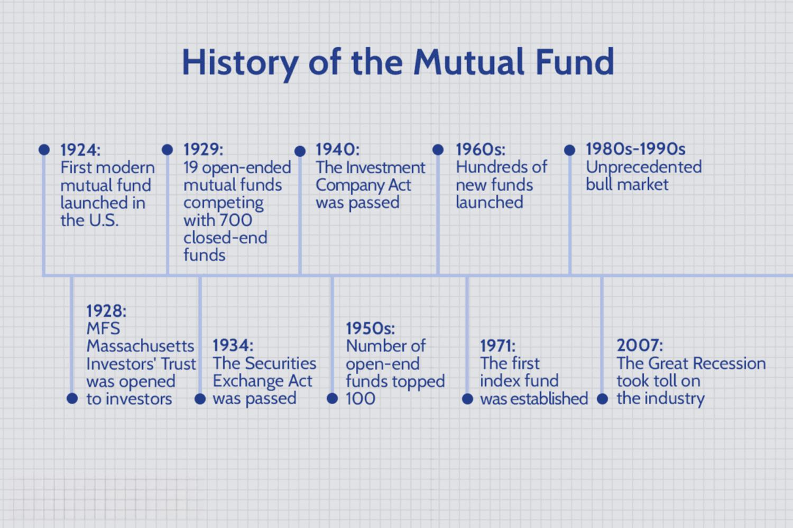

Investment funds, including mutual funds, hedge funds, and exchange-traded funds (ETFs), are pooled investment vehicles that enable individual and institutional investors to participate in a diversified portfolio of assets. By aggregating capital from multiple investors, these funds can access a broader range of investment opportunities, manage risk through diversification, and provide professional management. Investment funds play a pivotal role in financial markets by facilitating capital allocation, promoting market efficiency, and contributing to economic growth.

Understanding the various types of investment funds is crucial for investors, as each fund type has distinct characteristics, risk profiles, and investment strategies. Mutual funds, typically open-end funds, allow investors to buy and sell shares at the fund's net asset value (NAV), while closed-end funds issue a fixed number of shares traded on stock exchanges. ETFs, gaining popularity for their flexibility and lower costs, trade like stocks and usually track specific indices. Hedge funds, typically accessible to accredited investors, employ diverse, often complex strategies, aiming for absolute returns. An informed understanding of these nuances helps investors align their financial goals with appropriate fund choices.



Algorithmic trading has revolutionized modern investment strategies by utilizing computer algorithms to automate trading decisions, optimizing speed and efficiency. This approach allows for the rapid execution of trades and the processing of vast volumes of data to identify market patterns and opportunities. As algorithmic trading systems continue to evolve with advancements in technology, they offer distinct advantages such as reduced transaction costs, minimized human errors, and the ability to execute sophisticated trading strategies that can adapt swiftly to changing market conditions.

The purpose of this article is to explore the history, types, and impact of algorithmic trading on investment funds. By understanding the historical context, the diverse range of investment funds, and their intersection with cutting-edge trading technologies, investors can better appreciate the dynamic landscape of fund management. As technology continues to transform financial markets, examining the synergies and challenges between traditional fund management practices and modern algorithmic trading approaches is essential for navigating current and future investment climates.

## Table of Contents

## The History of Investment Funds

Investment funds have played a crucial role in the evolution of financial markets, offering investors a means to diversify their portfolios, manage risk, and access professional management. The inception of investment funds can be traced back to the late 18th century, with the founding of the first documented mutual fund in the Netherlands in 1774, named "Eendragt Maakt Magt" ("Unity Creates Strength"). This pioneering mutual fund allowed investors to pool their resources and invest in a diversified portfolio, significantly reducing the risk compared to investing in individual securities.

The 20th century witnessed a dramatic expansion of investment funds. The introduction of formalized mutual funds in the United States began with the establishment of the Massachusetts Investors Trust in 1924. This ushered in a new era of investment accessibility for the average investor, providing a structured means to participate in the equity markets. Post-World War II economic growth, particularly in the United States and Europe, led to increased disposable income and a burgeoning middle class, further driving the popularity of mutual funds. Regulatory developments, including the U.S. Investment Company Act of 1940, provided a legal framework that enhanced investor protection and spurred the industry's growth.

Several key historical events have shaped the investment fund industry. The Great Depression resulted in stringent regulations to protect investors, laying the foundation for trust and stability in financial markets. The bull market of the 1980s and 1990s was marked by a surge in equity mutual funds. Technology played a pivotal role, with the advent of the Internet enabling real-time information dissemination and execution of trades, thereby increasing market participation.

A significant milestone was the introduction of the first index fund by John Bogle of Vanguard in 1976. Unlike actively managed funds, index funds aimed to replicate the performance of a specific market index, such as the S&P 500, offering lower fees and enhanced tax efficiency. This innovation democratized investing by providing a low-cost option for gaining diversified exposure to the stock market, leading to a rapid increase in their popularity.

The development of Exchange-Traded Funds (ETFs) in the early 1990s marked another significant advancement. Similar to index funds, ETFs typically track a specific index but are traded on exchanges like stocks, providing [liquidity](/wiki/liquidity-risk-premium) and flexibility. The SPDR S&P 500 [ETF](/wiki/etf-trading-strategies), launched in 1993, was the first ETF in the United States and has become one of the most traded securities, highlighting the growing preference for passive investment strategies.

Over time, various trends have contributed to the emergence of diverse fund types. Innovations in financial engineering and increased demand for tailored investment solutions have led to the creation of specialized funds, such as sector-specific funds, international funds, and socially responsible funds. Additionally, the demand for alternative investment strategies has given rise to hedge funds, Real Estate Investment Trusts (REITs), bond funds, and money market funds, catering to varying investor preferences and risk appetites.

In conclusion, the history of investment funds is a testament to the adaptability and creativity of financial markets in meeting the evolving needs of investors. From their origins in the 18th century to the sophisticated and diverse offerings available today, investment funds continue to be a vital component of the global financial ecosystem.

## Types of Investment Funds

Investment funds are collective investment vehicles that pool capital from multiple investors to purchase a diversified portfolio of securities. This diversification aims to reduce risk while providing a potential return on investment. Several types of investment funds cater to varying investor preferences and risk tolerances.

### Mutual Funds

Mutual funds are one of the most well-known types of investment funds and can be categorized into open-end and closed-end funds.

- **Open-End Funds**: These funds issue shares that can be purchased or redeemed at any time at the net asset value (NAV) per share. The NAV is calculated as:
$$
  \text{NAV} = \frac{\text{Total Assets - Total Liabilities}}{\text{Number of Outstanding Shares}}

$$

  Open-end funds are highly liquid and offer investors flexibility in buying and selling shares.

- **Closed-End Funds**: In contrast, closed-end funds issue a fixed number of shares through an initial public offering (IPO). These shares are then traded on secondary markets, like stocks, and their prices are determined by market demand and supply, which may cause the shares to trade at a premium or discount to the NAV.

### Exchange-Traded Funds (ETFs)

ETFs are similar to mutual funds but distinguish themselves by being traded on stock exchanges throughout the day, allowing investors to buy and sell them at market prices. ETFs typically track an index, commodity, or basket of assets, offering cost-effective and tax-efficient investment options. Their popularity has surged due to their liquidity, transparency, and lower expense ratios compared to mutual funds.

### Hedge Funds

Hedge funds are private investment funds that employ diverse and complex strategies to achieve high returns. These funds are usually structured as limited partnerships and are open to accredited investors due to their inherent risk, high fees, and lower liquidity. Hedge fund strategies may include leveraging, short selling, and investing in derivatives, providing opportunities for significant gains even in downturn markets.

### Index Funds

Index funds are mutual funds or ETFs designed to replicate the performance of a specific index, such as the S&P 500. By maintaining a portfolio reflecting the constituent securities of the index, these funds offer a passive investment strategy with low management fees. Index funds are popular among investors seeking broad market exposure without active management.

### Other Fund Types

- **Real Estate Investment Trusts (REITs)**: These funds invest in real estate or real estate-related assets, allowing investors to gain exposure to the real estate market without owning physical properties. REITs must distribute a significant portion of their income as dividends, providing a steady income stream.

- **Bond Funds**: Focused on fixed-income securities, bond funds invest in a variety of bonds issued by governments and corporations. These funds are ideal for investors seeking regular income and reduced risk compared to equities.

- **Money Market Funds**: These funds invest in short-term, high-quality debt instruments, such as Treasury bills and commercial paper. Money market funds aim to provide liquidity, safety, and returns slightly higher than traditional savings accounts, making them suitable for conservative investors.

By understanding the various types of investment funds, investors can make informed decisions to align their investments with their financial goals and risk tolerance.

 to Algorithmic Trading

Algorithmic trading refers to the use of computer algorithms to automate trading decisions and execute trades in financial markets. This approach leverages mathematical models and complex [statistics](/wiki/bayesian-statistics) to decide on the timing, price, and quantity of trades. The basic principle involves using a set of pre-defined rules that determine trading actions based on market data analysis.

The advent of technology has markedly transformed trading operations by increasing the speed and efficiency of trade executions. Electronic trading platforms allow for the handling of vast amounts of data and enable market participants to react to price fluctuations instantaneously. This technological progression has bridged the gap between high-frequency trading participants and traditional traders.

There are several advantages to [algorithmic trading](/wiki/algorithmic-trading) for investors and fund managers. Firstly, it minimizes human error and emotions in trading decisions, leading to more consistent and objective strategies. Secondly, algorithms can process information faster than humans, enabling quicker response times to market changes. Thirdly, transaction costs can be reduced due to the efficient placement of trades and optimized execution strategies.

High-frequency trading ([HFT](/wiki/high-frequency-trading-strategies)) is a form of algorithmic trading characterized by the rapid execution of a large number of orders at extremely high speeds. HFT seeks to capitalize on minute price discrepancies and execute trades within fractions of a second, impacting liquidity and pricing in markets. However, high-frequency trading has sparked controversy as it is often perceived as contributing to increased market [volatility](/wiki/volatility-trading-strategies) and unfair advantages over slower market participants.

Basic algorithms used in investment fund management range from mean-reversion strategies to more complex [machine learning](/wiki/machine-learning) models. Mean-reversion strategies are based on the assumption that asset prices will revert to their historical average over time. 

```python
# Example of a simple moving average trading algorithm
def simple_moving_average_strategy(prices, window_size):
    """
    Calculate the moving average of given price data and return a suggested trade action.

    :param prices: A list of prices.
    :param window_size: The number of periods to calculate the average.
    :return: List of signals (buy/sell).
    """
    moving_averages = []
    signals = []

    for i in range(len(prices)):
        if i < window_size - 1:
            moving_averages.append(None)  # Not enough data to calculate the average
            signals.append("Hold")
        else:
            window = prices[i-window_size+1:i+1]
            moving_average = sum(window) / window_size
            moving_averages.append(moving_average)

            # Trading signal
            if prices[i] > moving_average:
                signals.append("Buy")
            elif prices[i] < moving_average:
                signals.append("Sell")
            else:
                signals.append("Hold")

    return signals

# Example usage
prices = [100, 102, 101, 103, 105, 104, 106, 107]
window_size = 3
simple_moving_average_strategy(prices, window_size)
```

In conclusion, algorithmic trading represents a significant shift in how trades are executed and strategies are developed in investment funds. While offering numerous efficiencies, it also brings about challenges that require careful risk management and regulatory oversight.

## The Intersection of Investment Funds and Algorithmic Trading

Investment funds have increasingly incorporated algorithmic trading strategies to enhance performance and adapt to rapidly changing market conditions. Various types of funds, including mutual funds, hedge funds, and exchange-traded funds (ETFs), benefit from these automated strategies due to their capacity to process vast amounts of data at high speeds, thus allowing traders and fund managers to capitalize on fleeting market opportunities.

**Algorithmic Trading Utilization in Funds**

Algorithmic trading employs complex algorithms to make trading decisions at speeds unattainable by human traders. In mutual funds and ETFs, these algorithms can execute large-[volume](/wiki/volume-trading-strategy) trades to track specific indices more efficiently, minimizing transaction costs. Hedge funds, known for their active management strategies, extensively use algorithms to develop market-neutral positions, thus reducing systemic risk exposure.

**Influence on Fund Performance and Market Dynamics**

Algorithmic trading significantly impacts fund performance by enhancing liquidity and enabling tighter spreads. While algorithms can reduce human bias and error, they also contribute to increased market volatility, especially during abnormal market conditions. Strategies like statistical [arbitrage](/wiki/arbitrage) and mean reversion use historical data to predict future price movements, thereby optimizing fund performance.

**Reliance on Data-Driven Decision Making**

Investment funds rely on data-driven decision-making to optimize asset allocation and risk management. Algorithms can analyze historical prices, economic indicators, and market sentiment to offer actionable insights and predictive analytics. The shift towards data-centric finance is evident in the sophisticated models used for forecasting market movements and adjusting portfolio weights dynamically.

**Role of Machine Learning and AI**

Machine learning and [artificial intelligence](/wiki/ai-artificial-intelligence) (AI) have enhanced the capability of algorithmic trading by allowing models to learn from vast datasets and identify intricate patterns within financial markets. Techniques such as natural language processing enable algorithms to gauge market sentiment from news and social media, while [reinforcement learning](/wiki/reinforcement-learning) helps in developing adaptive strategies that evolve with changing market conditions.

**Case Studies of Successful Algorithmic Integration**

Quantitative hedge funds such as Renaissance Technologies have successfully integrated algorithmic trading, demonstrating superior returns through data-driven strategies. Vanguard’s use of algorithmic trading in its index funds illustrates how transaction costs can be minimized and tracking errors reduced. These cases highlight the transformative potential of algorithmic trading, providing fund managers with powerful tools to enhance returns while managing risks effectively.

In conclusion, the intersection of investment funds and algorithmic trading offers a panoramic view of how technology reshapes traditional investing methods. While offering numerous advantages, this integration necessitates a vigilant approach to address the accompanying risks and ensure ethical standards in data usage and transaction execution.

## Challenges and Risks Associated with Algorithmic Trading in Funds

Algorithmic trading, though transformative in nature, poses a number of challenges and risks within the context of investment funds. Among these are inherent risks within algorithmic systems, market volatility implications, ethical and regulatory concerns, cybersecurity threats, and the importance of transparency and continuous monitoring.

Algorithmic trading systems, while designed to exploit market efficiencies, come with their own potential risks. One significant risk is the potential for system errors, often referred to as "bugs," which can lead to substantial financial losses. These errors may arise from incorrect algorithms, failure to update algorithms in response to changing market conditions, or coding mistakes that lead to unexpected trading behaviors.

Market volatility can significantly impact algorithmic trading strategies. These systems rely on historical data and patterns to make predictions; however, during periods of abnormal market volatility, such as those caused by economic crises or geopolitical events, these patterns can become unreliable. High volatility can amplify the risks of algorithms making erroneous trades or executing trades at unfavorable prices, hence potentially escalating losses instead of curbing them.

Ethical and regulatory challenges also play a crucial role. Algorithmic trading practices have sparked debates over market fairness and transparency. High-frequency trading (HFT), a subset of algorithmic trading, has faced criticism for potentially creating an uneven playing field, where firms with superior technology gain an unfair advantage. This raises ethical concerns regarding market manipulation and fairness. Regulatory bodies across the globe are still grappling with how best to oversee these fast-paced, technology-driven activities, aiming to prevent market abuses while not stifling innovation.

Cybersecurity threats represent another significant risk, as algorithmic trading systems are highly reliant on computer networks and software. These systems are vulnerable to hacking, data breaches, and other cyber threats that could lead to unauthorized access or manipulation of trading strategies. Consequently, robust cybersecurity measures are essential to protect these sophisticated trading platforms, including encryption, frequent security audits, and real-time threat detection systems.

Minimizing risks associated with algorithmic trading requires a mix of transparency and continuous monitoring. Transparency is crucial for investors and regulatory bodies to understand and assess the risks and performances of algorithmic trading strategies. Continuous monitoring of algorithmic systems helps in identifying and mitigating errors or malfunctions quickly. Fund managers should employ advanced risk management practices, including stress testing and scenario analysis, to ensure systems can withstand unexpected market conditions.

To encapsulate these complexities in reproducible frameworks, Python offers tools like NumPy and Pandas for data analysis and modeling, while libraries such as TensorFlow or PyTorch can support machine learning applications for adaptive trading strategies. Implementing redundant systems and automated fail-safes can also help in managing systemic risks associated with algorithmic trading. These strategies ensure that while algorithms enhance efficiency and execution, they do not compromise the foundational integrity of financial markets.

## The Future of Investment Funds and Algorithmic Trading

Investment funds are poised for considerable transformation as they navigate the digital age, driven predominantly by advancements in algorithmic trading and emerging financial technologies. The evolution of these funds will likely be marked by increased efficiency, adaptability, and a higher degree of personalization for investors. 

Emerging technologies such as artificial intelligence (AI), machine learning (ML), and blockchain are set to revolutionize both algorithmic trading and fund management. AI and ML, for instance, can process vast amounts of data far quicker and more accurately than traditional methods, enabling the development of sophisticated trading algorithms that can adapt to market conditions with remarkable precision. For example, machine learning models can predict asset price movements, optimize trading strategies, and even automate risk management. Python, a preferred language in financial technology, allows for implementing such models using libraries like TensorFlow or PyTorch, which are capable of [deep learning](/wiki/deep-learning) computations:

```python
import tensorflow as tf

# Example of a simple neural network model in TensorFlow for predicting stock prices
model = tf.keras.Sequential([
    tf.keras.layers.Dense(64, activation='relu', input_shape=(input_shape,)),
    tf.keras.layers.Dense(32, activation='relu'),
    tf.keras.layers.Dense(1)  # Output layer
])

model.compile(optimizer='adam', loss='mean_squared_error')
```

Algorithmic trading also facilitates greater personalization and customization of investment strategies. Investors today demand bespoke financial products tailored to their risk preferences and investment goals. Algorithms can assess individual investor profiles and market data to offer personalized portfolios, dynamically adjusting asset allocation in real-time. The concept of robo-advisors exemplifies this trend, providing automated, algorithm-driven financial planning services that require minimal human intervention.

Regulatory developments are expected to follow closely behind these technological advances. As algorithmic trading becomes more widespread, regulators will likely develop comprehensive frameworks to address ethical and practical concerns, such as market fairness, transparency, and fraud prevention. Institutions will have to balance innovation with compliance to ensure investor protection and market stability. Notably, the European Union’s Markets in Financial Instruments Directive (MiFID II) and the United States’ Dodd-Frank Act demonstrate efforts to regulate algorithmic trading practices, ensuring they align with broader financial stability objectives.

Despite increased automation, the role of human expertise should not be underestimated. While algorithms execute trades and manage portfolios, human insight remains crucial for strategic decision-making, ethical judgment, and relationship management with clients. The synthesis of human intuition with algorithmic efficiency can produce optimal outcomes. Fund managers who can harness technology while maintaining the nuances of human judgement are likely to prosper in this evolving landscape.

In conclusion, the future of investment funds and algorithmic trading is one of rapid innovation and adaptation, driven by technological advancements. This evolution promises not only improved efficiencies and personalized investment offerings but also necessitates rigorous regulatory oversight to mitigate associated risks. Amidst these changes, the symbiotic relationship between human expertise and automated systems will define the new era of fund management.

## Conclusion

Investment funds have played a pivotal role in enabling individuals and institutions to pool their resources for diversified investment opportunities, leveraging a wide array of financial instruments and strategies to optimize returns. Understanding the history and types of investment funds is crucial, as it provides context for current market dynamics and highlights the evolution of investment vehicles over time.

Algorithmic trading has profoundly impacted investment funds, offering precision, speed, and a data-driven approach to fund management. It has transformed trading operations, providing significant advantages such as improved liquidity, reduced trading costs, and enhanced risk management. However, implementing algorithmic strategies also introduces challenges, including increased market volatility and complex regulatory landscapes.

Striking a balance between leveraging cutting-edge technology and the irreplaceable insight of human expertise in fund management is essential. While algorithms excel in processing vast amounts of data and executing trades at speeds beyond human capabilities, human judgment remains crucial in overseeing strategic direction and ethical considerations.

Investors are encouraged to stay informed about technological advancements and regulatory changes as they unfold. The financial landscape is continually evolving, with emerging technologies prompting the need for adaptive strategies and regulatory frameworks to ensure stability and fairness in trading practices.

Despite the rapid advancement of technology, the fundamental concept of investment funds as a collective investment vehicle remains enduringly relevant. Investment funds continue to offer diversification benefits and professional management, making them indispensable in modern financial markets. As we navigate an era increasingly characterized by automation, investment funds will maintain their status as a cornerstone of effective investment strategy, guided by both technological innovation and human wisdom.

## References & Further Reading

[1]: Peter L. Bernstein. ["Against the Gods: The Remarkable Story of Risk"](https://www.amazon.com/Against-Gods-Remarkable-Story-Risk/dp/0471295639) (1998). This book provides a historical perspective on risk management and the evolution of financial instruments.

[2]: John C. Bogle. ["The Little Book of Common Sense Investing: The Only Way to Guarantee Your Fair Share of Stock Market Returns"](https://www.amazon.com/Little-Book-Common-Sense-Investing/dp/1119404509) (2007). This book explains the benefits of investing in low-cost index funds.

[3]: Andrew W. Lo. ["Adaptive Markets: Financial Evolution at the Speed of Thought"](https://www.amazon.com/Adaptive-Markets-Financial-Evolution-Thought/dp/0691135142) (2017). This work discusses the intersection of market evolution, investment funds, and algorithmic trading.

[4]: Burton G. Malkiel. ["A Random Walk Down Wall Street: The Time-Tested Strategy for Successful Investing"](https://www.amazon.com/Random-Walk-Down-Wall-Street/dp/0393358380) (1973). A comprehensive guide to understanding different types of investment strategies, including mutual funds and ETFs.

[5]: Michael Lewis. ["Flash Boys: A Wall Street Revolt"](https://en.wikipedia.org/wiki/Flash_Boys) (2014). This book investigates into high-frequency trading and its impact on financial markets.