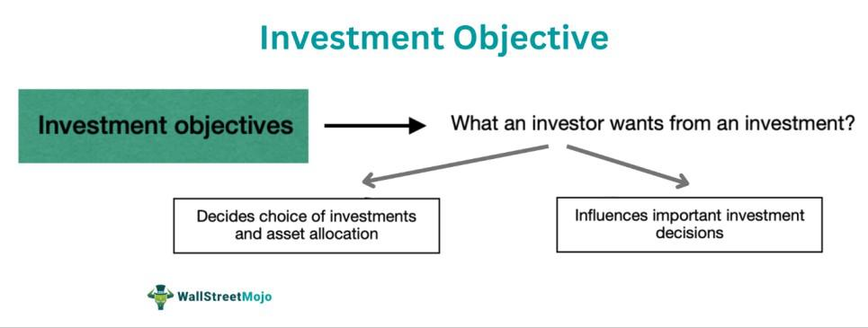

In today's dynamic financial landscape, setting and achieving investment goals is critical to ensuring long-term financial success. The integration of robust goal-setting strategies, comprehensive financial planning, and innovative algorithmic trading can significantly enhance one's ability to navigate volatile markets and garner substantial returns. These elements, when harmoniously aligned, serve as the pillars of a solid financial framework that not only safeguards existing wealth but also fosters growth and sustainability.

Investment goals, which may range from accumulating wealth for retirement to purchasing a home or financing a child’s education, form the cornerstone of any financial strategy. Clearly defined goals provide direction and a sense of purpose, allowing investors to allocate resources efficiently and evaluate the success of their strategies over time. Achieving these goals often requires a dynamic approach, as market conditions and personal circumstances can shift dramatically.



Financial planning acts as the systematic process of devising and maintaining a roadmap for meeting one's life objectives through the proper management of financial resources. A well-structured financial plan incorporates budgeting, saving, investing, and continuous monitoring, ensuring that investment activities are aligned with one's risk tolerance and time horizons. For instance, a diversified portfolio tailored to individual risk preferences can help mitigate potential losses during market downturns while maximizing returns during periods of economic prosperity.

Algorithmic trading, on the other hand, represents the cutting-edge of technological advancements in investment strategies. This methodology utilizes algorithms—pre-programmed series of rules—to execute trades based on market data. The advantages of algorithmic trading include enhanced efficiency, speed, and the minimization of emotional biases that often plague human decision-making. For investors, employing algorithmic trading strategies can lead to optimized portfolio management and superior risk-adjusted returns.

In essence, the convergence of goal setting, financial planning, and algorithmic trading creates a holistic approach to personal finance management. By embracing these elements, investors are better equipped to adapt to the ever-evolving financial environment, ultimately achieving their long-term financial ambitions.

## Table of Contents

## Understanding Investment Strategies

Investment strategies are essential frameworks for making informed financial decisions that align with individual objectives. These strategies can be broadly categorized into passive and active investing, each with unique characteristics and suitable for different investor profiles.

**Passive Investing**  
Passive investing focuses on achieving long-term growth with minimal buying and selling actions. This strategy often involves investing in index funds or exchange-traded funds (ETFs) that replicate the performance of a market index like the S&P 500. The advantage of passive investing is its low-cost structure and minimal time requirement, making it ideal for investors seeking steady growth without frequent market analysis. Burton Malkiel's "A Random Walk Down Wall Street" is a seminal work that supports the philosophy behind passive investing, arguing that markets are efficient and difficult to consistently outperform.

**Active Investing**  
Conversely, active investing aims to outperform market averages by frequently buying and selling individual securities. Active investors depend on in-depth research, market forecasting, and timing trades effectively. This strategy often involves the expertise of financial advisors or portfolio managers. While potentially offering higher returns, active investing comes with higher costs and increased risks due to its speculative nature. One prominent style of active investing is growth investing, which entails focusing on companies that exhibit potential for significant earnings growth.

**Growth Investing**  
Growth investing centers on the potential for capital appreciation in stocks of companies exhibiting signs of above-average growth, even if they don't currently generate profits. Investors using this strategy typically look for companies that are revolutionizing industries or are leaders in emerging markets. Growth stocks often exhibit higher price-to-earnings ratios, reflecting optimism about future growth prospects. However, these investments also come with higher [volatility](/wiki/volatility-trading-strategies), as they may be more susceptible to market swings due to external factors such as [interest rate](/wiki/interest-rate-trading-strategies) changes and economic cycles.

**Value Investing**  
Value investing seeks stocks perceived to be undervalued based on intrinsic value, identified through comprehensive financial analysis. Pioneered by Benjamin Graham and popularized by Warren Buffet, this strategy involves looking for companies with strong fundamentals but whose stock prices do not reflect their full value due to market sentiment or cyclical factors. Value investors often benefit from dividends as an additional component of their returns, with a focus on long-term gains as the market recognizes the true worth of the undervalued stocks.

**Influence of Market Conditions**  
Market conditions significantly impact the choice and success of an investment strategy. For instance, in a bull market, growth investing might outperform due to optimism about future earnings. Conversely, value investing might prove more resilient during bearish conditions, as the focus on intrinsic value provides a buffer against market volatility. Additionally, macroeconomic factors such as interest rates, inflation, and geopolitical events can sway investor sentiment and influence strategy suitability. For example, in a high-interest-rate environment, income-focused strategies, like dividend investing, may be more attractive as investors seek income generation.

Ultimately, the choice of investment strategy should be influenced by individual financial goals, risk tolerance, investment horizon, and market conditions. A well-informed approach can help investors navigate the complex financial landscape and optimize their investment outcomes.

## The Role of Financial Planning

Financial planning is essential to any investment strategy, serving as the groundwork upon which investors build their financial futures. It involves establishing a comprehensive approach to managing one's finances to achieve specific life goals. Central to a solid financial plan are four components: budgeting, saving, investing, and monitoring.

Budgeting is the initial step in financial planning. It involves creating a detailed plan that outlines expected income and expenses over a specific period. A well-structured budget helps individuals manage their cash flow, ensuring they spend within their means and allocate resources effectively toward their financial goals. Ensuring that expenditures do not exceed income is crucial, thereby preventing debt accumulation and promoting financial stability.

Saving is another crucial element of financial planning. It entails setting aside a portion of income for future needs or emergencies. Regular savings build a financial cushion, providing security and reducing reliance on credit. The key is to prioritize savings as a recurring expense, which can be achieved by automating transfers to savings accounts. The power of compound interest emphasizes the importance of starting to save early. The formula for compound interest is expressed as:

$$
A = P \left(1 + \frac{r}{n}\right)^{nt}
$$

where $A$ is the amount of money accumulated after $n$ years, including interest, $P$ is the principal amount, $r$ is the annual interest rate, $n$ is the number of times that interest is compounded per year, and $t$ is the time in years.

Investing is also integral to financial planning, offering the potential for compounding wealth over time. This can involve purchasing stocks, bonds, real estate, or other assets. Unlike saving, which prioritizes security, investing typically involves a higher degree of risk with the expectation of achieving higher returns. Financial planners often recommend a diversified investment portfolio tailored to one's risk tolerance, which varies among individuals. Younger investors might prefer aggressive growth investments, while those nearing retirement might opt for more conservative, income-focused investments.

Monitoring, the final component, involves regularly reviewing and adjusting financial plans to ensure they remain aligned with one's personal goals and market conditions. Continuous evaluation allows for timely changes in response to life events, such as marriage, childbirth, career changes, and market fluctuations. Leveraging technology, such as budgeting apps and financial planning tools, can facilitate continuous monitoring and provide real-time insights into one's financial health.

Aligning financial plans with personal goals and risk tolerance is pivotal. Personal goals can range from short-term objectives like saving for a vacation to long-term plans, such as retirement. Effective financial planning requires understanding one's capacity to bear risk and adjusting the strategy accordingly. Risk tolerance depends on factors such as age, income level, and personal attitudes towards risk. A well-aligned financial plan considers these factors, ensuring that each step taken contributes meaningfully toward achieving individual aspirations.

In summary, financial planning is a dynamic process involving budgeting, saving, investing, and monitoring. By aligning these elements with personal goals and risk tolerance, individuals can navigate their financial journeys with confidence and agility, setting the stage for a secure and prosperous future.

## Creating a Trading Plan

A trading plan is a systematic approach designed to manage the complexities of financial markets. It serves as a roadmap for traders, enabling them to navigate market intricacies with defined objectives and strategies. The development of a comprehensive trading plan involves several essential steps.

### Goal-Setting

The foundation of a trading plan begins with clear goal-setting. Identifying specific, measurable, achievable, relevant, and time-bound (SMART) objectives is crucial. These goals might include profit targets, risk tolerance levels, or long-term investment aspirations. Establishing goals helps maintain focus and discipline, reducing impulsive decisions driven by short-term market fluctuations.

### Market Analysis

Market analysis is pivotal in crafting a successful trading plan. This involves examining market conditions and historical data to forecast future price movements. Two primary approaches are used: technical analysis and [fundamental analysis](/wiki/fundamental-analysis). Technical analysis focuses on statistical trends derived from trading activity, such as moving averages or [volume](/wiki/volume-trading-strategy) data, while fundamental analysis evaluates an asset's intrinsic value by examining economic data and financial statements. Both methods provide insights that inform strategic entry and [exit](/wiki/exit-strategy) points for trades.

### Risk Management

Risk management is a critical component of a trading plan, aiming to protect capital and minimize potential losses. Effective risk management strategies include setting stop-loss orders to limit downside risk, position sizing to allocate capital appropriately, and diversification to mitigate the impact of market volatility. A well-defined risk management plan ensures that adverse market movements do not jeopardize overall financial health.

### Performance Metrics

To evaluate the effectiveness of a trading plan, performance metrics must be established. Common metrics include return on investment (ROI), win-loss ratio, and maximum drawdown. Tracking these indicators allows for the assessment of trading strategies and their alignment with the trader's goals. Over time, analyzing these metrics provides insights into areas for improvement and helps refine the trading plan to enhance profitability.

### Real-life Examples

Successful execution of trading plans can be seen in numerous real-life scenarios. For instance, a trader may set a goal to achieve a 10% annual return by leveraging both technical and fundamental analysis to guide decisions. By implementing stop-loss orders and a diversified portfolio, they effectively manage risk and adapt strategies as market conditions change. Historical case studies demonstrate that traders who adhere to a disciplined trading plan generally achieve more consistent results compared to those who trade impulsively.

In summary, a trading plan amalgamates goal-setting, market analysis, risk management, and performance evaluation into a cohesive strategy. This structured approach not only aids in navigating financial markets but also aligns trading activities with personal financial objectives, ultimately contributing to long-term success.

## Algo Trading: The Future of Trading

Algorithmic trading, often referred to as algo trading, represents a paradigm shift in the execution of trades. It utilizes advanced mathematical models and computer programs to make high-speed transactions with minimal human intervention. This innovative approach is designed to capitalize on minute market inefficiencies and trends.

One of the primary benefits of algo trading is its efficiency. It eliminates the need for manual trading, allowing for the execution of large volumes of trades at optimal prices. The algorithms are capable of scanning and analyzing multiple markets simultaneously, which significantly enhances their decision-making process.

Speed is another crucial advantage of algo trading. Transactions occur at incredibly fast rates, often in milliseconds, greatly reducing latency and taking advantage of fleeting market opportunities. This speed not only improves the execution efficiency but also increases the potential for capturing short-lived [arbitrage](/wiki/arbitrage) opportunities.

Reduced emotional bias is an inherent benefit of using algorithms for trading. Unlike human traders, algorithms operate on predefined criteria without being influenced by emotions such as fear or greed. This objectivity ensures consistency in execution, reducing the risk of erroneous trades driven by psychological factors.

For those interested in adopting algo trading, certain prerequisites are essential. A foundational understanding of programming languages, such as Python, is crucial for developing and implementing trading algorithms. Python, in particular, is favored due to its extensive libraries like Pandas and NumPy, which simplify data manipulation and analysis. Here is a simple Python snippet that outlines a basic setup of a trading strategy using the Pandas library:

```python
import pandas as pd

# Load the market data
data = pd.read_csv('market_data.csv')

# Basic moving average strategy
data['SMA_20'] = data['Close'].rolling(window=20).mean()
data['SMA_50'] = data['Close'].rolling(window=50).mean()

# Signal generation
data['Signal'] = 0
data['Signal'][20:] = np.where(data['SMA_20'][20:] > data['SMA_50'][20:], 1, -1)

# Trade decision
data['Position'] = data['Signal'].shift(1)
```

Furthermore, understanding risk management principles is vital. Algorithms must be designed to adapt to market volatility and have built-in triggers to prevent substantial losses, commonly known as stop-loss orders. Awareness of risk ensures the sustainability and profitability of algo trading strategies.

In conclusion, [algorithmic trading](/wiki/algorithmic-trading) is shaping the future of financial markets by offering unparalleled advantages in efficiency, speed, and objectivity. Developing the necessary programming skills and understanding risk management strategies are integral steps for anyone keen on exploring algo trading.

## Integration of Strategies for Optimum Financial Growth

In the pursuit of optimum financial growth, integrating investment strategies, financial planning, and trading plans is essential. This integration helps align investments with personal financial objectives, maximizing potential returns while managing risk.

**Diversification and Algorithmic Systems**  
Diversification is a core principle in risk management that involves spreading investments across different asset classes to mitigate risk. The aim is to ensure that the overall portfolio performance is not overly dependent on any single investment. An effective diversification strategy requires careful selection of assets based on their correlation, risk, and return profiles. 

Algorithmic systems can significantly enhance diversification efforts by utilizing advanced algorithms to analyze vast amounts of market data and identify potential investment opportunities. Algorithms can execute trades across multiple asset classes and markets almost instantly, diversifying with speed and precision beyond human capability. Python, with its robust libraries like Pandas, NumPy, and specialized libraries like PyAlgoTrade, has become a popular choice for developing such algorithmic strategies.

**Example Algorithm for Diversification:**  
Here is an example of how Python can be used to implement a basic mean-variance optimization, a common strategy for diversification:

```python
import numpy as np
import pandas as pd
from scipy.optimize import minimize

# Assume we have a dataframe 'returns' with historical returns of assets
returns = pd.DataFrame({
    'Stock A': [0.05, 0.10, -0.02],
    'Stock B': [0.02, 0.08, 0.03],
    'Stock C': [0.01, 0.02, 0.05]
})

# Calculate expected returns and covariance matrix
expected_returns = returns.mean()
cov_matrix = returns.cov()

# Define portfolio variance function
def portfolio_variance(weights):
    return np.dot(weights.T, np.dot(cov_matrix, weights))

# Constraints for weights: sum of weights is 1, weights are positive
constraints = ({'type': 'eq', 'fun': lambda weights: np.sum(weights) - 1})
bounds = tuple((0, 1) for _ in range(len(expected_returns)))

# Initial guess for weights equally distributed
initial_weights = [1./len(expected_returns)] * len(expected_returns)

# Execute optimization
result = minimize(portfolio_variance, initial_weights, bounds=bounds, constraints=constraints)

# Optimized weights for diversification
optimized_weights = result.x
```

**Regular Assessment and Adaptation**  
It's crucial to regularly assess and adapt strategies to align with changing market conditions and personal financial goals. Dynamic market environments can render static strategies ineffective. Regular evaluation helps ensure that strategies remain relevant and aligned with both short-term performance metrics and long-term objectives.

Key components of a strategic assessment include evaluating portfolio performance against benchmarks, reviewing risk exposure, and considering changes in economic indicators. By incorporating feedback loops into the strategy development process, investors and traders can adapt more quickly to new information or market shifts. This adaptability is integral to sustainable financial growth. 

In modern investment management, using technology to automate parts of this assessment and adaptation process allows for more timely and objective decisions. Tools such as [machine learning](/wiki/machine-learning) can predict potential market changes and recommend portfolio adjustments beyond traditional methods.

In summary, the integration of diversified investment strategies with algorithmic systems and a disciplined approach to strategy assessment and adaptation paves the way for achieving optimal financial growth. This framework supports the alignment of investments with personal financial goals while navigating the uncertainties and opportunities presented in dynamic financial markets.

## Case Studies and Practical Applications

Analyzing real-world applications and outcomes of integrated financial strategies provides valuable insights into their efficacy and adaptability. Both successful and unsuccessful case studies reveal critical lessons that can guide current and future financial planning efforts, offering a pragmatic perspective on theoretical concepts.

### Successful Case Study: The All-Weather Portfolio

One prominent example of successful financial strategy integration is the All-Weather Portfolio, developed by Ray Dalio of Bridgewater Associates. This portfolio strategy emphasizes diversification across asset classes to weather various economic climates. The strategy integrates several investment principles and financial planning methodologies to minimize risk and maximize returns across market cycles.

**Key Components and Execution:**
- **Diversification**: The portfolio is diversified across asset types, such as stocks, bonds, commodities, and Treasury Inflation-Protected Securities (TIPS). This diversification aims to reduce volatility and risk by ensuring that no single economic event overwhelmingly impacts the entire portfolio.
- **Risk Parity**: Allocation is based on risk contribution rather than capital allocation. This means balancing the risk across the different asset classes rather than equally distributing capital. The goal is to achieve a stable return stream by balancing risk exposure.

**Lessons Learned:**
- **Importance of Risk Management**: A robust risk management strategy that considers a wide range of economic scenarios can protect wealth during downturns.
- **Adaptability to Market Conditions**: The ability to adjust asset allocation as market conditions evolve is crucial for maintaining portfolio balance.

### Unsuccessful Case Study: Long-Term Capital Management (LTCM)

Long-Term Capital Management is a textbook example of financial failure due to over-reliance on sophisticated mathematical models without adequate risk mitigation strategies. LTCM, managed by Nobel Prize-winning economists and renowned Wall Street traders, collapsed in the late 1990s.

**Key Components and Execution:**
- **Leverage**: LTCM employed high levels of leverage to amplify returns, borrowing extensively to invest in convergence trades.
- **Complex Derivatives**: The firm used complex mathematical models to identify arbitrage opportunities in bond markets.

**Lessons Learned:**
- **Overconfidence in Models**: Reliance on quantitative models without consideration for unprecedented market events proved detrimental when market conditions deviated from historical data assumptions.
- **Lack of Effective Risk Management**: Excessive leverage and lack of diversification exposed the firm to unsustainable losses when markets shifted contrary to predictions.

### Practical Application of Theory

The contrasting outcomes of these case studies underscore several critical takeaways for the application of integrated financial strategies:

1. **Diversification and Risk Management**: Diversification across asset classes and mitigation of risk are fundamental to enduring financial stability, as demonstrated by the All-Weather Portfolio.
2. **Regular Assessment and Strategy Adaptation**: Continuous evaluation and adjustment of financial strategies ensure alignment with current and predicted market conditions.
3. **The Balance between Quantitative Models and Market Realities**: While quantitative models are indispensable tools, they must be complemented with qualitative risk assessments and contingency planning.
4. **Understanding Leverage**: Appropriate use of leverage can enhance returns, but excessive leverage increases vulnerability—highlighted by LTCM's downfall.

These insights emphasize the necessity of holistic strategy implementation, encompassing risk assessment, diversification, and dynamic adaptation, to achieve sustainable financial growth and resilience.

## Conclusion

A successful financial strategy hinges on the seamless integration of investment goals, meticulous financial planning, and the innovative use of algorithmic trading. These components form the core pillars that can enhance an individual's ability to navigate the ever-changing financial environment. 

Investment goals act as the guiding beacon, steering financial decisions towards a defined objective. They ensure that investments are purpose-driven and aligned with personal aspirations, such as retirement planning, wealth accumulation, or other financial milestones. Clear, actionable goals provide a framework for measuring progress and making necessary adjustments.

Financial planning is the foundational scaffold that supports every investment journey. By instituting a disciplined approach that encompasses budgeting, saving, investing, and monitoring, individuals can effectively manage their resources. It is crucial to align these plans with personal risk tolerance, ensuring that the financial strategy not only aids in achieving goals but also does so within a comfort zone of risk exposure.

Algorithmic trading represents the cutting edge of implementing financial strategies. By utilizing algorithms, traders can execute strategies with heightened efficiency and precision, reducing the influence of emotional biases. The integration of algorithmic trading within a strategy exemplifies the importance of adapting to technological advancements to maintain a competitive edge in today's markets.

Continuous learning and adaptability are indispensable in the pursuit of financial success. Markets evolve, and so should the strategies deployed. Investors are encouraged to remain vigilant, constantly updating their knowledge base and reassessing their strategies to incorporate new information, methodologies, and technologies. 

Embarking on a financial journey with a strategic mindset involves an appreciation of these components and a commitment to their continuous refinement. By fostering an environment of learning and adaptability, individuals can better position themselves to capitalize on opportunities and mitigate risks, ultimately achieving a resilient and prosperous financial future.

## References & Further Reading

1. **Books**

   - *The Intelligent Investor* by Benjamin Graham: This timeless book provides insights into value investing and the importance of disciplined investment strategies.
   - *A Random Walk Down Wall Street* by Burton Malkiel: A comprehensive guide to understanding how markets work, along with practical advice on investing.
   - *Common Stocks and Uncommon Profits* by Philip Fisher: This book explores investment philosophies that can help increase financial success.
   - *Algorithmic Trading: Winning Strategies and Their Rationale* by Ernie Chan: A useful resource for those interested in the technical aspects of algorithmic trading.

2. **Articles**

   - "Financial Planning and Algorithmic Trading: A Match for Success?" by Financial Times [Link](https://www.ft.com/content/algorithmic-trading-success-stories)
   - "Investment Strategies: Tailoring to Market Conditions" by The Economist [Link](https://www.economist.com/finance-and-economics/strategies-market-conditions/)
   - "The Role of Financial Planning in Achieving Investment Goals" by Harvard Business Review [Link](https://hbr.org/financial-planning-investment-goals)

3. **Online Courses**

   - *Coursera*: "Investment Management Specialization" by the University of Geneva [Link](https://www.coursera.org/specializations/investment-management)
   - *edX*: "Algorithmic Trading and Lectures" by the Indian Institute of Technology [Link](https://www.edx.org/course/algorithmic-trading)
   - *Udacity*: "Algorithmic Trading Nanodegree" [Link](https://www.udacity.com/course/algorithmic-trading-nanodegree--nd880)

4. **Websites and Forums**

   - *Investopedia* provides a plethora of articles and tutorials on financial planning and investment strategies [Link](https://www.investopedia.com)
   - *QuantConnect* is a community-driven platform for those interested in algorithmic trading [Link](https://www.quantconnect.com/)
   - *Stack Exchange (Quantitative Finance)* is a question-and-answer site for finance professionals and academics [Link](https://quant.stackexchange.com/)

These resources are excellent starting points for expanding your knowledge and refining your approach to financial strategy, investment, and algorithmic trading.