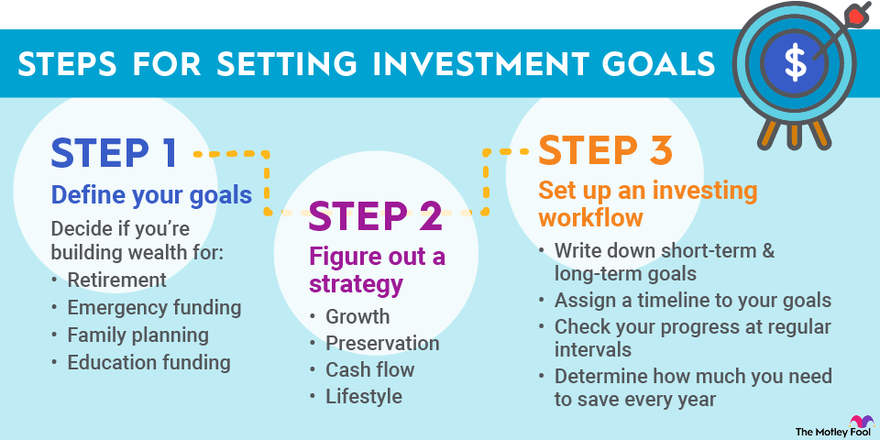

## Table of Contents

## What is an investment goal?

An investment goal is a specific target you set for your money when you invest it. It helps you decide where to put your money and how long to keep it there. For example, if you want to save for a new house, your investment goal might be to grow your money enough to make a down payment in five years.

Having clear investment goals is important because it guides your choices and keeps you focused. Without goals, you might make random decisions that don't help you achieve what you want. By setting goals, you can pick the right investments that match your timeline and how much risk you're willing to take. This way, you're more likely to reach your financial dreams.

## Why is identifying investment goals important?

Identifying investment goals is important because it gives you a clear direction for your money. When you know what you want to achieve, like saving for retirement or buying a car, you can choose the best ways to invest your money. It helps you decide how much risk you're willing to take and how long you can leave your money invested. Without goals, you might end up making random choices that don't help you reach your dreams.

Having specific goals also helps you stay focused and motivated. It's easy to get distracted by different investment options or market changes, but knowing your goals keeps you on track. For example, if your goal is to save for your child's college education, you'll be more likely to stick with a plan that grows your money steadily over time, rather than chasing quick gains that might not be safe. In the end, clear investment goals make it more likely that you'll achieve what you want with your money.

## How do personal circumstances influence investment goals?

Personal circumstances play a big role in shaping your investment goals. Things like how old you are, how much money you make, and if you have a family can change what you want to do with your money. For example, if you're young and just starting your career, you might want to invest in a way that grows your money over many years for retirement. But if you're older and closer to retiring, you might want to keep your money safer so you can use it soon.

Your life situation can also affect how much risk you're willing to take with your investments. If you have a steady job and no big expenses coming up, you might be okay with taking more risks to try and make more money. But if you're the only one [earning](/wiki/earning-announcement) money in your family or if you're worried about losing your job, you might want to be more careful and choose safer investments. Understanding your personal circumstances helps you set realistic goals that fit your life and make you feel more secure about your financial future.

## What are common types of investment goals?

Common types of investment goals include saving for retirement, buying a home, and paying for education. Saving for retirement is a long-term goal that many people have. It means putting money away now so you can live comfortably when you're older and not working anymore. Buying a home is another big goal. People often save and invest to have enough money for a down payment on a house. Paying for education, like college or a trade school, is also important. Parents might invest to help their kids go to school, or adults might save to go back to school themselves.

Another type of investment goal is building an emergency fund. This is money you keep aside for unexpected things, like losing your job or needing to fix your car. It's usually a shorter-term goal than retirement, but it's still really important. Some people also invest to increase their wealth or to leave money to their family after they're gone. This can mean different things to different people, but it often involves growing your money over time. Each of these goals can affect how you choose to invest your money, depending on what you want to achieve and when you need the money.

## How can short-term and long-term goals be differentiated?

Short-term and long-term goals are different because of how long it takes to reach them. Short-term goals are things you want to do soon, like saving for a vacation or building an emergency fund. These goals usually take less than five years to achieve. Because you need the money sooner, you might choose safer investments that don't go up and down a lot, so you can be sure you'll have the money when you need it.

Long-term goals take more time, often more than five years. Examples include saving for retirement or buying a house. Since you have more time, you can take more risks with your investments. This means you might choose things that could grow more over time, even if they go up and down a lot in the short term. The longer time frame gives your investments a chance to recover from any dips and grow over the years.

## What role does risk tolerance play in setting investment goals?

Risk tolerance is how much you're okay with your investments going up and down. It's really important when you're setting your investment goals because it helps you pick the right investments. If you don't like taking risks, you'll want to choose safer investments, even if they might not grow as much. This means your goals might be more about keeping your money safe than making it grow a lot. But if you're okay with taking risks, you might choose investments that could go up a lot, even if they could also go down. This can help you reach bigger goals, like saving a lot of money for retirement.

Understanding your risk tolerance helps you set goals that you can stick with. If you pick investments that are too risky for you, you might get scared and sell them when they go down, which could stop you from reaching your goals. But if you choose investments that match how much risk you're okay with, you'll be more likely to keep them for the long term. This way, you can stay focused on your goals, whether they're short-term, like saving for a car, or long-term, like planning for retirement.

## How should one assess their financial situation before setting investment goals?

Before you set your investment goals, it's important to take a good look at your financial situation. Start by figuring out how much money you make and how much you spend every month. This will help you see how much extra money you can put into investments. Also, think about any big expenses coming up, like a wedding or a new baby. These can change how much you can invest and what your goals should be.

Next, check your debts and savings. If you have a lot of debt, like credit card bills or student loans, you might want to pay those off before you start investing a lot. Having an emergency fund is also important. This is money you keep aside for unexpected things, like fixing your car or losing your job. Once you know where you stand financially, you can set realistic investment goals that match your situation.

Understanding your financial situation helps you set goals that you can actually reach. It's all about making sure your goals fit with how much money you have, what you need to spend, and what you want to achieve. Whether you're saving for a new house, your kid's education, or your retirement, knowing your financial situation will guide you to the right investments.

## What are the steps to effectively identify and prioritize investment goals?

To effectively identify and prioritize your investment goals, start by thinking about what you want to achieve with your money. Make a list of all the things you want, like saving for retirement, buying a house, or paying for your kids' education. Then, think about when you need the money. Goals that you need to reach soon, like buying a car in a year, are short-term. Goals that will take longer, like saving for retirement in 30 years, are long-term. After you have your list, think about how important each goal is to you. Some goals might be more important than others, like making sure you have enough money to live on when you're old.

Once you've identified your goals, it's time to prioritize them. Look at your financial situation to see how much money you can put toward your goals. If you don't have a lot of extra money, you might need to focus on just one or two goals at first. Think about which goals will have the biggest impact on your life. For example, if you're worried about not having enough money when you retire, that goal might be more important than saving for a vacation. Also, consider how much risk you're okay with taking. If you're not comfortable with big risks, you might need to adjust your goals to match safer investments. By thinking about what you want, when you need it, and how much you can invest, you can set clear and achievable investment goals.

## How can one adjust investment goals in response to life changes?

Life changes a lot, and your investment goals need to change with it. If you get a new job that pays more, you might be able to save more money for your goals. Or if you have a baby, you might want to start saving for their education. Maybe you get married or divorced, which can change what you want to do with your money. When these things happen, take a look at your goals and see if they still make sense. You might need to save more, or less, or change what you're saving for.

It's important to check your investment goals every now and then, especially when big things happen in your life. If you lose your job, you might need to use your emergency fund instead of investing more. Or if you get a big raise, you could put more money into your retirement savings. The key is to keep your goals realistic and make sure they match what's going on in your life. By adjusting your goals when things change, you can stay on track and reach your dreams.

## What tools or methods can be used to track progress towards investment goals?

One easy way to keep track of your investment goals is to use a simple spreadsheet. You can list your goals, how much money you need for each one, and how much you've saved so far. Every month, update the spreadsheet with any new money you've put in or taken out. This way, you can see at a glance how close you are to reaching your goals. It's like a scoreboard for your money, showing you if you're winning or need to try harder.

Another tool you can use is investment tracking apps. These apps can connect to your bank accounts and investments, so they automatically update your progress. They often have graphs and charts that make it easy to see how your money is growing. Some apps even send you reminders or alerts if you're not saving enough or if your investments are doing well. Using an app can make tracking your goals feel more fun and less like a chore.

You can also use a simple notebook or journal to write down your goals and track your progress. Every month, write down how much you've saved and any changes to your goals. This method is good if you like writing things by hand and don't want to use technology. It helps you think about your goals more often and stay focused on what you want to achieve.

## How do market conditions affect the achievability of investment goals?

Market conditions can really change how easy or hard it is to reach your investment goals. When the market is doing well, like when stock prices are going up, your investments might grow faster. This can help you reach your goals sooner than you thought. But if the market goes down, your investments might lose value. This can make it harder to reach your goals because you might have less money than you planned. That's why it's important to think about market conditions when you're setting your goals and deciding how much risk to take.

Sometimes, big events like a recession or a global crisis can shake up the market a lot. If you're close to needing the money for a goal, like buying a house, a big drop in the market could mean you don't have enough. But if your goals are far away, like saving for retirement in 30 years, you might have time to wait for the market to recover. Understanding how market conditions can affect your investments helps you plan better and maybe adjust your goals if you need to.

## What advanced strategies can be employed to optimize the achievement of complex investment goals?

One advanced strategy to optimize complex investment goals is to use asset allocation. This means spreading your money across different types of investments, like stocks, bonds, and real estate. By doing this, you can balance the risk and reward of your portfolio. If one type of investment goes down, others might go up, which can help protect your money. You can also change your asset allocation over time to match your goals. For example, if you're getting closer to needing the money, you might move more into safer investments like bonds. This way, you can keep growing your money while also making sure it's there when you need it.

Another strategy is to use tax-efficient investing. This means [picking](/wiki/asset-class-picking) investments that help you pay less in taxes. For example, you might put money into a retirement account like an IRA or a 401(k), which can grow without being taxed until you take the money out. Or you might invest in things like municipal bonds, which often don't get taxed. By being smart about taxes, you can keep more of your money working for you, which can help you reach your goals faster. It's like giving your investments a little boost by saving on taxes.

## What is the Role of Financial Planning?

Financial planning is essential to any investment strategy, serving as the groundwork upon which investors build their financial futures. It involves establishing a comprehensive approach to managing one's finances to achieve specific life goals. Central to a solid financial plan are four components: budgeting, saving, investing, and monitoring.

Budgeting is the initial step in financial planning. It involves creating a detailed plan that outlines expected income and expenses over a specific period. A well-structured budget helps individuals manage their cash flow, ensuring they spend within their means and allocate resources effectively toward their financial goals. Ensuring that expenditures do not exceed income is crucial, thereby preventing debt accumulation and promoting financial stability.

Saving is another crucial element of financial planning. It entails setting aside a portion of income for future needs or emergencies. Regular savings build a financial cushion, providing security and reducing reliance on credit. The key is to prioritize savings as a recurring expense, which can be achieved by automating transfers to savings accounts. The power of compound interest emphasizes the importance of starting to save early. The formula for compound interest is expressed as:

$$
A = P \left(1 + \frac{r}{n}\right)^{nt}
$$

where $A$ is the amount of money accumulated after $n$ years, including interest, $P$ is the principal amount, $r$ is the annual interest rate, $n$ is the number of times that interest is compounded per year, and $t$ is the time in years.

Investing is also integral to financial planning, offering the potential for compounding wealth over time. This can involve purchasing stocks, bonds, real estate, or other assets. Unlike saving, which prioritizes security, investing typically involves a higher degree of risk with the expectation of achieving higher returns. Financial planners often recommend a diversified investment portfolio tailored to one's risk tolerance, which varies among individuals. Younger investors might prefer aggressive growth investments, while those nearing retirement might opt for more conservative, income-focused investments.

Monitoring, the final component, involves regularly reviewing and adjusting financial plans to ensure they remain aligned with one's personal goals and market conditions. Continuous evaluation allows for timely changes in response to life events, such as marriage, childbirth, career changes, and market fluctuations. Leveraging technology, such as budgeting apps and financial planning tools, can facilitate continuous monitoring and provide real-time insights into one's financial health.

Aligning financial plans with personal goals and risk tolerance is pivotal. Personal goals can range from short-term objectives like saving for a vacation to long-term plans, such as retirement. Effective financial planning requires understanding one's capacity to bear risk and adjusting the strategy accordingly. Risk tolerance depends on factors such as age, income level, and personal attitudes towards risk. A well-aligned financial plan considers these factors, ensuring that each step taken contributes meaningfully toward achieving individual aspirations.

In summary, financial planning is a dynamic process involving budgeting, saving, investing, and monitoring. By aligning these elements with personal goals and risk tolerance, individuals can navigate their financial journeys with confidence and agility, setting the stage for a secure and prosperous future.

## References & Further Reading

1. **Books**

   - *The Intelligent Investor* by Benjamin Graham: This timeless book provides insights into value investing and the importance of disciplined investment strategies.
   - *A Random Walk Down Wall Street* by Burton Malkiel: A comprehensive guide to understanding how markets work, along with practical advice on investing.
   - *Common Stocks and Uncommon Profits* by Philip Fisher: This book explores investment philosophies that can help increase financial success.
   - *Algorithmic Trading: Winning Strategies and Their Rationale* by Ernie Chan: A useful resource for those interested in the technical aspects of algorithmic trading.

2. **Articles**

   - "Financial Planning and Algorithmic Trading: A Match for Success?" by Financial Times [Link](https://www.ft.com/content/algorithmic-trading-success-stories)
   - "Investment Strategies: Tailoring to Market Conditions" by The Economist [Link](https://www.economist.com/finance-and-economics/strategies-market-conditions/)
   - "The Role of Financial Planning in Achieving Investment Goals" by Harvard Business Review [Link](https://hbr.org/financial-planning-investment-goals)

3. **Online Courses**

   - *Coursera*: "Investment Management Specialization" by the University of Geneva [Link](https://www.coursera.org/specializations/investment-management)
   - *edX*: "Algorithmic Trading and Lectures" by the Indian Institute of Technology [Link](https://www.edx.org/course/algorithmic-trading)
   - *Udacity*: "Algorithmic Trading Nanodegree" [Link](https://www.udacity.com/course/algorithmic-trading-nanodegree--nd880)

4. **Websites and Forums**

   - *Investopedia* provides a plethora of articles and tutorials on financial planning and investment strategies [Link](https://www.investopedia.com)
   - *QuantConnect* is a community-driven platform for those interested in algorithmic trading [Link](https://www.quantconnect.com/)
   - *Stack Exchange (Quantitative Finance)* is a question-and-answer site for finance professionals and academics [Link](https://quant.stackexchange.com/)

These resources are excellent starting points for expanding your knowledge and refining your approach to financial strategy, investment, and [algorithmic trading](/wiki/algorithmic-trading).

