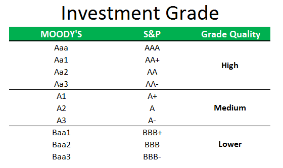

In finance, understanding the complexities of credit ratings, investment grades, and algorithmic trading is crucial for making informed investment decisions. These elements serve as pivotal tools in the financial ecosystem, each playing a distinctive role.

Credit ratings function as a barometer for assessing the creditworthiness of entities, whether they be corporations, governments, or financial instruments. Provided by agencies like Standard & Poor's, Moody's, and Fitch, these ratings significantly influence investment decisions and financial strategies by indicating the likelihood of an entity meeting its financial obligations.



Investment grade securities represent a lower risk of default and are thus appealing to conservative investors, such as pension funds and insurance companies. These securities are typically rated 'BBB-' or higher and are synonymous with reliability and stability in the investment universe.

Algorithmic trading, often abbreviated as algo trading, employs cutting-edge technology to execute trading strategies swiftly and efficiently. By utilizing algorithms to make trading decisions based on predefined criteria such as timing, price, or volume, algo trading enhances trading precision and reaction times, especially in volatile markets.

This article examines the interplay between credit ratings, investment grades, and algorithmic trading. Their roles are crucial in financial assessment, enabling investors to navigate complex financial landscapes by balancing potential risks with anticipated returns. Understanding these components helps foster a robust investment approach in an ever-evolving financial environment.

## Table of Contents

## Understanding Credit Ratings: A Financial Assessment Tool

Credit ratings are pivotal in evaluating the credit risk associated with financial entities or instruments. These ratings are typically issued by esteemed agencies such as Standard & Poor's (S&P), Moody's, and Fitch Ratings, which utilize a letter-based system to signify the creditworthiness of a given entity or instrument. 

This system categorizes credit ratings into two primary segments: investment grade and speculative grade. High credit ratings, such as 'AAA' or 'AA', indicate strong creditworthiness and suggest a lower risk of default. In contrast, lower ratings signify a higher risk, requiring investors and financial analysts to exercise caution.

The implications of credit ratings extend beyond mere categorizations; they significantly influence an entity's capability to access capital markets. A higher credit rating often results in more favorable borrowing terms, including lower interest rates on loans or bonds. This effect can be attributed to the perceived lower risk by creditors, thereby reducing the risk premium included in interest rates. Conversely, a lower rating might lead to restricted access to capital or higher borrowing costs, as lenders seek higher returns to compensate for increased risk.

From an investor’s perspective, credit ratings serve as a crucial tool for assessing potential risks and returns associated with investments. They provide a standardized measure that helps investors make informed financial decisions, aligning investment choices with risk appetite and financial goals. For example, a portfolio manager might prioritize bonds with high ratings to ensure stable returns with minimal risk exposure, while an investor with a higher risk tolerance might explore lower-rated securities for potentially higher yields.

Overall, credit ratings are indispensable in the financial landscape, enabling both corporate entities and investors to strategically manage risks and harness opportunities within the capital markets. They form a backbone for financial assessments, steering the decisions that define investment strategies and risk management frameworks. Through meticulous evaluation and grading, credit rating agencies offer valuable insights into the financial stability and risk profile of various entities, shaping the dynamics of modern financial systems.

## Investment Grades: The Difference Between Safe and Speculative

Investment grade bonds are financial securities with a relatively low risk of default, typically assigned a rating of 'BBB-' or higher by reputable credit rating agencies such as Standard & Poor's, Moody's, and Fitch. These ratings signify the issuer's creditworthiness and ability to meet financial commitments. Consequently, investment-grade bonds are often perceived as safer investments, making them attractive to risk-averse investors, including institutional investors like pension funds and insurance companies.

Conversely, bonds rated below 'BBB-' fall into the speculative-grade or "junk bond" category. These securities are considered riskier due to a higher probability of default, but they may offer increased yields to compensate investors for the added risk. The potential for higher returns can appeal to more adventurous investors who are willing to accept greater uncertainty in pursuit of enhanced earnings.

The classification of bonds into investment and speculative grades is crucial for constructing a balanced investment portfolio. Investors seeking a stable return with minimal risk exposure often gravitate towards investment grade bonds. However, those looking to maximize returns might allocate a portion of their portfolio to speculative-grade bonds, understanding the attendant risks.

Recent economic events illustrate the fluid nature of credit ratings and their broader implications. For example, the recent downgrade of the U.S. credit rating by Fitch showcases the impact such changes can have on both markets and investor sentiment. These adjustments are influenced by a myriad of factors, including economic performance, fiscal policies, and geopolitical developments, emphasizing the necessity for investors to continuously monitor and adapt their strategies in response to these shifts.

## Algorithmic Trading: The Intersection of Tech and Finance

Algorithmic trading, commonly referred to as algo trading, utilizes computer algorithms to automate the trading process, executing orders based on a set of predefined criteria such as timing, price, and [volume](/wiki/volume-trading-strategy). This approach to trading enhances speed and efficiency, especially in markets characterized by high [volatility](/wiki/volatility-trading-strategies). Algo trading eliminates the need for manual intervention, allowing traders to exploit market conditions rapidly and with precision.

At its core, [algorithmic trading](/wiki/algorithmic-trading) is driven by sophisticated algorithms capable of analyzing extensive datasets to identify trading opportunities that may be invisible to the human eye. These algorithms can process information at a scale and speed unmatched by traditional trading methods, thus improving decision-making. The ability to quickly react to market changes and implement strategies in real-time positions algo trading as a crucial tool in modern finance.

High-frequency trading ([HFT](/wiki/high-frequency-trading-strategies)) is one of the most notable applications of algorithmic trading, where the execution speed provides a significant competitive edge. HFT involves executing a large number of orders at extremely high speeds, often within fractions of a second. The success of HFT largely depends on the ability to access and interpret market data almost instantaneously, presenting a compelling case for the integration of sophisticated technological solutions in trading strategies.

Developing effective algo trading strategies requires a profound understanding of market data, credit ratings, and economic indicators. This involves constructing models that can predict market movements and trading behaviors. Python, with its robust libraries such as NumPy, pandas, and scikit-learn, is a popular language for developing these models. A basic outline of code that may be used in developing an algorithmic trading strategy could look as follows:

```python
import pandas as pd

# Load market data, can be from a CSV or an API
market_data = pd.read_csv('market_data.csv')

# Example of a simple moving average strategy
market_data['SMA_50'] = market_data['Close'].rolling(window=50).mean()
market_data['SMA_200'] = market_data['Close'].rolling(window=200).mean()

# Signal generation
market_data['Signal'] = 0
market_data.loc[market_data['SMA_50'] > market_data['SMA_200'], 'Signal'] = 1
market_data.loc[market_data['SMA_50'] < market_data['SMA_200'], 'Signal'] = -1

# Trade execution logic
def execute_trade(signal):
    if signal == 1:
        print("Buy")
    elif signal == -1:
        print("Sell")
    else:
        print("Hold")

# Apply the trading strategy
market_data['Signal'].apply(execute_trade)
```

The example above demonstrates a simple moving average crossover strategy, where signals to buy or sell are generated based on the crossing of two moving averages. While this is a basic example, professional trading algorithms employ far more complex logic and real-time data processing. The ultimate goal of algo trading is to manage risk exposure effectively while seeking optimal returns, using the power of technology to navigate the complexities of financial markets.

## The Role of Credit Ratings and Investment Grades in Algo Trading

Credit ratings and investment grades are fundamental components that algorithmic trading strategies can leverage to enhance financial decision-making. These metrics act as a guide indicating the creditworthiness of securities, thereby shaping the investment decisions made by trading algorithms. 

Automated trading systems can incorporate real-time changes in credit ratings to optimize investment strategies swiftly. This real-time integration enables traders to respond promptly to credit rating upgrades or downgrades, minimizing risk and maximizing potential returns. For instance, if a bond's credit rating is downgraded, an algorithmic model can immediately reduce exposure by reallocating assets to higher-rated securities. This capability is crucial for risk management as it ensures that portfolios are dynamically adjusted in response to changes in creditworthiness.

Moreover, investment grades are integral in shaping the risk management framework of algo trading systems. These grades categorize securities into various risk classes, assisting algorithms in determining allowable risk exposure. By aligning trading strategies with investment grades, algo trading can maintain a balanced risk-return profile. For example, higher investment-grade securities (rated 'BBB-' or higher) are typically prioritized in algorithms aimed at conservative investment strategies due to their lower default risk.

Incorporating credit ratings and investment grades into algo trading models can be implemented programmatically. Python, a prevalent language for developing trading algorithms, allows for seamless integration of these variables. Below is a simple Python code snippet demonstrating how credit ratings might be used in an algorithm to manage a portfolio:

```python
def adjust_portfolio_based_on_credit_rating(portfolio, credit_rating_updates):
    for security, new_rating in credit_rating_updates.items():
        if new_rating < 'BBB-':
            # If the new rating is speculative, reduce or sell off
            portfolio.adjust_security_weight(security, delta=-0.1)
        else:
            # If the rating is stable or investment-grade, consider holding or buying
            portfolio.adjust_security_weight(security, delta=0.1)
    return portfolio
```

The integration of credit ratings within algorithmic models not only aids in risk management but also enhances the efficiency and effectiveness of trading decisions. This synergy between credit evaluations and tech-driven trading fosters a holistic view of the financial landscape, equipping traders with tools to navigate the complexities of modern markets. By aligning with credit assessments, algorithmic trading models take on a structured approach, delivering a balance between risk mitigation and potential rewards.

## Conclusion

In the ever-changing financial landscape, a comprehensive understanding of credit ratings, investment grades, and algorithmic trading is increasingly vital for investors aiming to maximize their returns while minimizing risk. Investment grades play a critical role in financial decision-making by safeguarding against high-risk defaults. They provide a measure of security, offering investors a refuge through steady returns from lower-risk securities. For conservative investors, such as pension funds and insurance companies, investment grades often serve as a cornerstone of their portfolio strategy.

Algorithmic trading has transformed investment management by introducing unparalleled agility and precision. Through the use of complex algorithms, trading orders are executed based on predefined criteria like timing, price, or volume. This rapid execution is invaluable, particularly in volatile markets, where timing is critical. This technology allows for the analysis of vast datasets to identify trading opportunities, thereby improving investment decisions. High-frequency trading, a subset of algo trading, seeks to capitalize on short-lived market inefficiencies, demonstrating the power of speed in modern finance.

The integration of credit ratings analysis into algorithmic trading offers a sophisticated approach to investment. Automated systems that respond dynamically to credit rating changes—such as upgrades or downgrades—provide a strategic advantage by adjusting investment positions in real time. This synergy between algo trading and financial assessments enables a balanced approach, one that manages risk exposure while pursuing optimal returns.

In such a complex and interconnected financial environment, staying informed and adaptive is essential. By leveraging the insights offered by credit ratings, understanding the stability conferred by investment grades, and embracing the technological prowess of algo trading, investors can effectively navigate challenges and seize opportunities. This adaptability and informed decision-making empower investors to thrive in today’s intricate financial world.

## References & Further Reading

[1]: ["Advances in Financial Machine Learning"](https://www.amazon.com/Advances-Financial-Machine-Learning-Marcos/dp/1119482089) by Marcos Lopez de Prado

[2]: ["Quantitative Trading: How to Build Your Own Algorithmic Trading Business"](https://www.amazon.com/Quantitative-Trading-Build-Algorithmic-Business/dp/1119800064) by Ernest P. Chan

[3]: ["Machine Learning for Algorithmic Trading"](https://github.com/stefan-jansen/machine-learning-for-trading) by Stefan Jansen

[4]: ["Evidence-Based Technical Analysis: Applying the Scientific Method and Statistical Inference to Trading Signals"](https://www.amazon.com/Evidence-Based-Technical-Analysis-Scientific-Statistical/dp/0470008741) by David Aronson

[5]: Standard & Poor's. (n.d.). ["Understanding Ratings."](https://www.spglobal.com/ratings/en/about/understanding-credit-ratings) S&P Global Ratings.

[6]: Moody's Investor Service. (n.d.). ["Rating Methodology."](https://ratings.moodys.com/api/rmc-documents/356422) Moody’s Analytics.

[7]: Fitch Ratings. (n.d.). ["What are Fitch Ratings?"](https://www.fitchratings.com/products/rating-definitions) Fitch.