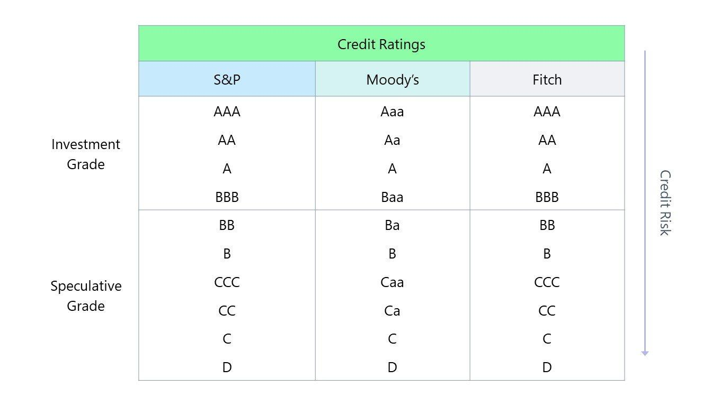

## Table of Contents

## What is an investment grade credit rating?

An investment grade credit rating means that a company or government is considered safe to lend money to. It shows that they are likely to pay back the money they borrow. Credit rating agencies like Moody's, Standard & Poor's, and Fitch give these ratings. They look at things like how much debt the company has, how much money they make, and how well they manage their money.

If a bond or a company has an investment grade rating, it means the risk of them not paying back the money is low. This makes investors feel more confident about lending money to them. Usually, investment grade ratings are from AAA to BBB- according to Standard & Poor's, or Aaa to Baa3 according to Moody's. Anything lower than these ratings is called "non-investment grade" or "junk" and is seen as riskier.

## Who assigns investment grade credit ratings?

Investment grade credit ratings are assigned by credit rating agencies. The main agencies that do this are Moody's, Standard & Poor's (S&P), and Fitch. These agencies look at a lot of information about a company or government to decide if they are safe to lend money to.

They check things like how much debt the company has, how much money they make, and how well they manage their money. If the agency thinks the company or government is safe, they give them an investment grade rating. This means the risk of not getting paid back is low, which makes investors feel more confident about lending money.

## What are the different levels of investment grade ratings?

Investment grade ratings are given by agencies like Moody's, Standard & Poor's (S&P), and Fitch. These ratings show how safe it is to lend money to a company or government. If a rating is investment grade, it means the risk of not getting paid back is low. This makes investors feel more confident about lending money.

For Standard & Poor's and Fitch, investment grade ratings go from AAA to BBB-. AAA is the highest and means the borrower is very safe. A rating of BBB- is the lowest investment grade and means the borrower is still safe but not as much as AAA. For Moody's, the ratings go from Aaa to Baa3. Aaa is the highest and means the borrower is very safe. Baa3 is the lowest investment grade and means the borrower is still safe but not as much as Aaa.

Anything lower than BBB- for S&P and Fitch, or Baa3 for Moody's, is called "non-investment grade" or "junk." These ratings mean the risk of not getting paid back is higher, so investors might be more careful about lending money.

## How does an investment grade rating affect a company's borrowing costs?

When a company gets an investment grade rating, it means that credit agencies think the company is safe to lend money to. This makes investors feel more confident about lending money to the company. Because the company is seen as less risky, they can borrow money at lower interest rates. Lower interest rates mean the company pays less to borrow money, which saves them money.

On the other hand, if a company has a rating that is lower than investment grade, it is seen as riskier. Investors might be worried about lending money to the company because there's a higher chance they might not get their money back. Because of this, the company has to pay higher interest rates to borrow money. Higher interest rates mean the company pays more to borrow money, which costs them more.

## What are the criteria used to determine an investment grade rating?

Credit rating agencies like Moody's, Standard & Poor's, and Fitch look at many things to decide if a company or government should get an investment grade rating. They check how much debt the company has and how much money they make. They also look at how well the company manages its money and if they can keep making money in the future. If the company has a lot of debt but not much money coming in, it might be seen as risky. But if the company has less debt and makes a lot of money, it's seen as safer.

Another important thing the agencies look at is the overall economy and how it might affect the company. If the economy is doing well, the company might be able to make more money and pay back its debts easier. But if the economy is not doing well, it might be harder for the company to make money and pay back what they owe. All these things together help the agencies decide if a company should get an investment grade rating, which means it's safe to lend money to.

## How often are investment grade ratings reviewed or updated?

Credit rating agencies like Moody's, Standard & Poor's, and Fitch check and update investment grade ratings regularly. They usually look at the ratings at least once a year. But if something big happens, like a company getting a lot more debt or the economy changing a lot, the agencies might check the ratings more often.

When they review the ratings, the agencies look at the same things they did when they first gave the rating. They check how much debt the company has, how much money they make, and how well they manage their money. If these things have changed a lot, the rating might go up or down. Keeping the ratings up to date helps investors know if it's still safe to lend money to the company.

## Can a company's credit rating be downgraded from investment grade to non-investment grade?

Yes, a company's credit rating can be downgraded from investment grade to non-investment grade. This happens when credit rating agencies like Moody's, Standard & Poor's, or Fitch think the company is not as safe to lend money to as before. They look at things like how much debt the company has, how much money they make, and how well they manage their money. If these things get worse, the company might get a lower rating.

When a company's rating goes from investment grade to non-investment grade, it's called a "fallen angel." This can make it harder and more expensive for the company to borrow money. Investors might be more worried about lending money to the company because there's a higher chance they might not get their money back. So, the company has to pay higher interest rates to borrow money, which costs them more.

## What are the implications of a downgrade from investment grade to non-investment grade?

When a company's credit rating goes from investment grade to non-investment grade, it means the company is now seen as riskier. Investors might worry more about lending money to the company because there's a higher chance they might not get their money back. Because of this, the company has to pay higher interest rates to borrow money. Paying higher interest rates costs the company more money, which can make things harder for them.

This change can also affect the company's stock price. When investors see that the company's rating has been downgraded, they might sell their stocks, which can make the stock price go down. Also, some investors and funds are only allowed to invest in companies with investment grade ratings. So, when a company's rating drops to non-investment grade, these investors might have to sell their investments in the company. This can make it even harder for the company to get money and can lead to more problems.

## How do investment grade ratings impact investment decisions?

Investment grade ratings help investors decide where to put their money. When a company or government has an investment grade rating, it means they are seen as safe to lend money to. This makes investors feel more confident about buying bonds or lending money to them. They know the risk of not getting their money back is low. Because of this, investors might choose to invest in companies with investment grade ratings because they want to keep their money safe.

On the other hand, if a company's rating drops to non-investment grade, it can change how investors feel. They might see the company as riskier and be less willing to lend money or buy its bonds. This can lead to higher borrowing costs for the company because they have to pay more to get people to lend them money. Investors who can only invest in safe companies might have to sell their investments in the company, which can make things harder for the company. So, investment grade ratings play a big role in how investors make their choices.

## What role do investment grade ratings play in the bond market?

Investment grade ratings are really important in the bond market. They help investors know which bonds are safe to buy. When a bond has an investment grade rating, it means the company or government that issued the bond is seen as safe to lend money to. This makes investors feel more confident about buying the bond because they know the risk of not getting their money back is low. Because of this, investment grade bonds are usually easier to sell and can be sold at lower interest rates.

If a bond's rating drops from investment grade to non-investment grade, it can change things a lot in the bond market. Investors might see the bond as riskier and be less willing to buy it. This can make it harder for the company to sell their bonds and they might have to offer higher interest rates to get people to buy them. Also, some investors and funds are only allowed to buy investment grade bonds. So, if a bond's rating drops, these investors might have to sell it, which can make the bond's price go down and cause more problems for the company.

## How do global economic conditions influence investment grade ratings?

Global economic conditions can have a big impact on investment grade ratings. When the world economy is doing well, companies and governments might make more money and have an easier time paying back their debts. This can make credit rating agencies think they are safer to lend money to, so they might give them higher ratings or keep their investment grade ratings. But if the world economy is not doing well, like during a recession, companies and governments might make less money and have a harder time paying back their debts. This can make the agencies think they are riskier, so they might give them lower ratings or even downgrade them from investment grade to non-investment grade.

These changes in ratings because of global economic conditions can affect how investors feel about lending money. When the economy is good and ratings are high, investors might feel more confident about buying bonds or lending money to companies and governments. But when the economy is bad and ratings go down, investors might be more worried about getting their money back. This can make them less willing to lend money or buy bonds, which can make it harder and more expensive for companies and governments to borrow money.

## What advanced metrics or models are used by rating agencies to assess investment grade status?

Rating agencies use a lot of different tools and models to decide if a company or government should get an investment grade rating. They look at things like how much debt the company has compared to how much money they make, which is called the debt-to-income ratio. They also use models that predict how likely the company is to pay back their debts, like the probability of default model. Another important tool is the cash flow analysis, which checks if the company has enough money coming in to pay back what they owe. These models and metrics help the agencies understand the company's financial health and decide if they are safe to lend money to.

Sometimes, rating agencies also use more advanced models like stress tests. These tests see how well a company can handle bad economic times, like a recession. They look at what would happen if the economy got worse and see if the company could still pay back their debts. Another advanced tool is the use of big data and [machine learning](/wiki/machine-learning). These technologies help the agencies look at a lot of information quickly and find patterns that might show if a company is going to have problems paying back their debts. All these tools together help the agencies make better decisions about investment grade ratings.

## References & Further Reading

[1]: ["Advances in Financial Machine Learning"](https://www.amazon.com/Advances-Financial-Machine-Learning-Marcos/dp/1119482089) by Marcos Lopez de Prado

[2]: ["Quantitative Trading: How to Build Your Own Algorithmic Trading Business"](https://www.amazon.com/Quantitative-Trading-Build-Algorithmic-Business/dp/1119800064) by Ernest P. Chan

[3]: ["Machine Learning for Algorithmic Trading"](https://github.com/stefan-jansen/machine-learning-for-trading) by Stefan Jansen

[4]: ["Evidence-Based Technical Analysis: Applying the Scientific Method and Statistical Inference to Trading Signals"](https://www.amazon.com/Evidence-Based-Technical-Analysis-Scientific-Statistical/dp/0470008741) by David Aronson

[5]: Standard & Poor's. (n.d.). ["Understanding Ratings."](https://www.spglobal.com/ratings/en/about/understanding-credit-ratings) S&P Global Ratings.

[6]: Moody's Investor Service. (n.d.). ["Rating Methodology."](https://ratings.moodys.com/api/rmc-documents/356422) Moody’s Analytics.

[7]: Fitch Ratings. (n.d.). ["What are Fitch Ratings?"](https://www.fitchratings.com/products/rating-definitions) Fitch.