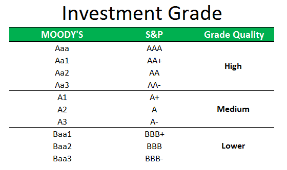

In the complex world of financial markets, understanding the terminology and interconnections can greatly enhance investment strategies. The financial ecosystem is vast, encompassing various critical components such as credit ratings, investment grade classifications, and algorithmic trading. Each of these terms plays a vital role in shaping market dynamics and influencing investment decisions.

Credit ratings, for instance, reflect the creditworthiness of borrowers—be they individuals, corporations, or governments—providing investors with a tool to assess the risk associated with debt securities. These ratings have a substantial impact on the financial markets, influencing the cost and availability of capital for borrowers and the risk-reward calculations for investors.



The concept of investment grade is closely tied to credit ratings, representing those securities considered to have a lower risk of default. For investors seeking stable returns with minimized risk, investment grade securities often present attractive opportunities. Companies or countries with such ratings are typically deemed more reliable, attracting capital under favorable terms.

In contrast, algorithmic trading introduces a technology-driven approach to trading decisions. Utilizing pre-programmed trading instructions, algorithmic trading executes large volumes of transactions at speeds beyond human capabilities. The integration of complex mathematical models allows traders to optimize strategies by reducing emotional biases and enhancing efficiency in decision-making processes.

These elements collectively contribute to the intricacy of financial markets. By unraveling the interplay between them, investors can make informed decisions that capitalize on both traditional and modern trading strategies. Understanding how credit ratings influence investment grade decisions and how algorithmic trading can respond to these ratings in real-time highlights the evolving nature of market strategies. Only by mastering these connections can investors navigate the sophisticated landscape of contemporary finance, achieving more consistent and profitable outcomes.

## Table of Contents

## Understanding Credit Ratings

Credit ratings are fundamentally assessments that reflect the creditworthiness of a borrower, which could be an individual, corporation, or government entity. These evaluations are pivotal in the financial landscape as they provide insights into the credit risks associated with debt securities. Typically, credit rating agencies such as Moody's, Standard & Poor's (S&P), and Fitch Ratings are responsible for assigning these ratings. The agencies utilize rigorous methodologies to evaluate an entity's ability to meet its financial commitments.

The credit ratings are categorized into several grades, which broadly range from high credit quality, referred to as "investment grade," to lower quality, often termed as "speculative" or "junk status." Investment grade ratings, usually denoted by ratings of 'BBB-' and above by S&P and Fitch, or 'Baa3' and above by Moody's, indicate a lower risk of default and imply higher credit quality. Such a rating often enables the borrower to secure more favorable borrowing terms, such as lower interest rates, which reflects a lender's perception of reduced risk.

Conversely, ratings below these thresholds are categorized as speculative grade, reflecting higher credit risk and potentially leading to higher costs of borrowing due to an increased default risk. Thus, understanding credit ratings is essential for investors, particularly those involved in bond markets, as they rely on these ratings to make informed decisions regarding risk management and portfolio allocation.

Investors use credit ratings as a barometer for making strategic decisions. A good credit rating can influence investment strategies, affect portfolio diversification, and aid in the assessment of yield spreads between different debt securities. Moreover, credit rating changes can impact market confidence and influence the cost of capital for the borrowers.

For example, if a corporation's credit rating is downgraded, it might face higher borrowing costs or reduced investor interest — reflecting its increased risk profile. This exemplifies the critical role credit ratings play in not only assessing risk but also in shaping the financial strategies of both investors and borrowers alike.

## The Role of Investment Grade in Financial Markets

Investment grade securities play a crucial role in financial markets due to their perceived lower risk of default. These are typically bonds issued by governments or corporations that credit rating agencies have deemed to have a higher credit quality. As a result, they are particularly favored by conservative investors seeking stable returns with minimal [volatility](/wiki/volatility-trading-strategies). The stability associated with investment grade securities makes them attractive for risk-averse investors, such as pension funds and insurance companies, who prioritize capital preservation and predictable income streams over high returns.

The attainment of an investment grade rating can have a profound effect on the cost of borrowing for companies and countries. Entities with such ratings often access capital at more favorable terms, as these securities typically command lower interest rates compared to their high-yield, speculative-grade counterparts. The rationale behind this is linked to the reduced likelihood of default, which provides reassurance to investors. Therefore, issuers can benefit from reduced interest expenses, improving their financial flexibility and investment capacity.

Yield spreads between investment grade and non-investment grade bonds serve as a crucial indicator of perceived risk in financial markets. Investors demand higher yield spreads—or premiums—for bonds with higher perceived risk. Consequently, investment grade bonds exhibit tighter spreads, reflecting their lower risk profile. This aspect is instrumental in the asset allocation strategies of comprehensive portfolios, allowing investors to maintain an optimal balance of risk and return. 

Investors can diversify their portfolios effectively by incorporating investment grade bonds, thereby reducing exposure to market risks without entirely sacrificing returns. This balance is essential for maintaining portfolio resilience in volatile market conditions and achieving long-term financial objectives. As a result, credit ratings serve as a fundamental tool for investors, guiding them in constructing a diversified, risk-adjusted portfolio that aligns with their financial goals.

 to Algorithmic Trading

Algorithmic trading, commonly known as algo trading, involves the use of automated systems and pre-programmed algorithms to execute orders on financial exchanges. This method of trading utilizes advanced computing power and intricate mathematical models to process and execute large volumes of trades with remarkable speed and precision. By harnessing these technological advancements, traders can optimize strategies that traditionally relied heavily on human judgment and intuition.

A key advantage of algo trading is its ability to minimize emotional biases. Traders often succumb to psychological factors when making decisions, which can adversely affect their performance. Algorithms, however, operate based on predefined criteria, allowing for consistent decision-making free from emotional interference. This consistency is particularly valuable when implementing strategies that require precise timing and swift execution.

Algorithmic trading encompasses a variety of strategies designed to capitalize on different market conditions. One prominent strategy is [arbitrage](/wiki/arbitrage), which exploits price discrepancies of the same asset across different markets. For example, if Asset A is priced differently on two exchanges, an algorithm can swiftly purchase the asset on the lower-priced exchange and sell it at the higher price on another, [earning](/wiki/earning-announcement) a risk-free profit in the process.

Market making is another strategy facilitated by algo trading. Market makers provide [liquidity](/wiki/liquidity-risk-premium) by continuously offering to buy and sell particular assets. By using algorithms, market makers can adjust their bid and ask prices based on real-time market data, thereby maintaining favorable spreads and capturing profits.

Statistical modeling is also widely used in [algorithmic trading](/wiki/algorithmic-trading) to identify and exploit market inefficiencies. Algorithms analyze historical data to predict future price movements, enabling traders to formulate strategies based on statistical probabilities. For instance, mean reversion strategies assume that asset prices will revert to their historical averages over time. Algorithms can quickly detect deviations and execute trades that align with this assumption.

The increasing prevalence of algo trading is largely attributable to its potential to generate superior returns. Institutional investors and hedge funds, in particular, are drawn to its promise of enhanced profitability. By leveraging algorithms, these entities can manage vast portfolios efficiently, capitalize on fleeting market opportunities, and implement complex trading strategies that would be impractical for human traders alone.

As the technology behind algorithmic trading continues to evolve, its role in the financial markets is expected to expand. Traders and investors who integrate these advanced systems into their operations stand to benefit from improved performance, consistency, and adaptability in a rapidly changing investment landscape.

## The Interplay Between Credit Ratings and Algo Trading

The integration of credit rating information within algorithmic trading systems offers significant enhancements to trading strategies. Credit ratings, which assess the creditworthiness of entities, provide a vital data point for evaluating the risk/reward profile of securities. By incorporating these ratings into algorithmic trading algorithms, traders can develop more accurate pricing models. This integration allows algorithms to process vast amounts of real-time data, including credit rating changes, facilitating immediate reactions to upgrades or downgrades.

When a credit rating is upgraded, the perceived risk of default decreases, potentially leading to a rise in the security's price. Conversely, a downgrade increases perceived risk, potentially resulting in a price drop. Algorithmic trading systems can be programmed to identify these shifts swiftly, adjusting trading strategies accordingly.

The use of algorithmic trading enhances traditional financial analysis by leveraging technological advancements. High-frequency trading environments benefit from this hybrid approach, as algorithms execute trades at speeds unattainable by human traders. The technology-driven nature of algo trading, combined with fundamental credit assessments, provides a competitive edge. 

Consider, for example, a Python script designed to respond to credit rating changes: 

```python
def evaluate_credit_change(current_rating, new_rating):
    if new_rating > current_rating:
        return "Buy"
    elif new_rating < current_rating:
        return "Sell"
    else:
        return "Hold"

current_rating = 2 # Sample rating equivalent to AA
new_rating = 1 # Sample rating equivalent to AAA

action = evaluate_credit_change(current_rating, new_rating)
print(f"Recommended action: {action}")
```

This simple function can be part of a larger algorithmic trading system that continuously evaluates credit rating changes. By understanding the interplay between credit ratings and algo trading, traders can leverage technology effectively while grounding strategies in fundamental market assessments. This fusion of quantitative models and traditional credit evaluation maximizes efficiency and profitability in modern financial markets.

## Conclusion

Navigating financial markets demands a deep understanding of several key components, including credit ratings, investment grades, and algorithmic trading. Each element plays a distinct role in shaping market behaviors and driving investment decisions. Credit ratings provide critical insight into the risk associated with debt securities, while investment grades offer a benchmark for stability and credit quality. Algorithmic trading introduces a technological edge, enabling the rapid execution of complex trading strategies with precision and consistency.

The integration of these components allows investors to maximize the reliability of their returns by effectively managing risk and capitalizing on market opportunities. Credit assessments provide the fundamental analytics needed to evaluate securities accurately. When this foundational analysis is augmented with the speed and efficiency of algorithmic trading, investors can execute well-informed trades that reflect both current market conditions and long-term financial assessments.

This synergy between traditional credit evaluation and cutting-edge trading technology forms a dynamic frontier in financial innovation. Investors and traders who remain informed and adaptive can better navigate the evolving landscape of global markets. As technology continues to evolve, staying abreast of advancements and integrating them with tried-and-true financial principles will be paramount for achieving sustained success and leveraging the full potential of available financial tools.

## References & Further Reading

[1]: Bukhari, M. S., & W. L. Ong. (2020). ["Credit Ratings Impact on Corporation Financing Cost and Operating Performance - An Asia Pacific Perspective."](https://onlinelibrary.wiley.com/doi/abs/10.1111/apel.12287) Asia-Pacific Journal of Financial Studies.

[2]: ["Quantitative Credit Portfolio Management"](https://onlinelibrary.wiley.com/doi/book/10.1002/9781119202851) by Arik Ben Dor, et al.

[3]: ["Algorithmic Trading: Winning Strategies and Their Rationale"](https://www.amazon.com/Algorithmic-Trading-Winning-Strategies-Rationale-ebook/dp/B00CY5HC0U) by Ernie Chan

[4]: ["Advances in Financial Machine Learning"](https://www.amazon.com/Advances-Financial-Machine-Learning-Marcos/dp/1119482089) by Marcos Lopez de Prado

[5]: ["Evidence-Based Technical Analysis: Applying the Scientific Method and Statistical Inference to Trading Signals"](https://books.google.com/books/about/Evidence_Based_Technical_Analysis.html?id=MeoJAQAAMAAJ) by David Aronson

[6]: Medhat, A. (2016). ["The Impact of Credit Rating Announcements on the Market: Evidence from Emerging Markets."](https://journals.sagepub.com/doi/full/10.1177/09721509241299952) SAGE Open.

[7]: ["Corporate Credit Analysis"](https://www.wallstreetoasis.com/resources/skills/credit/standard-poors-fundamentals-of-corporate-credit-analysis) by Janette Rutterford & Mark P. Viera

[8]: ["Machine Learning for Algorithmic Trading"](https://github.com/stefan-jansen/machine-learning-for-trading) by Stefan Jansen

[9]: ["Quantitative Trading: How to Build Your Own Algorithmic Trading Business"](https://www.amazon.com/Quantitative-Trading-Build-Algorithmic-Business/dp/1119800064) by Ernest P. Chan