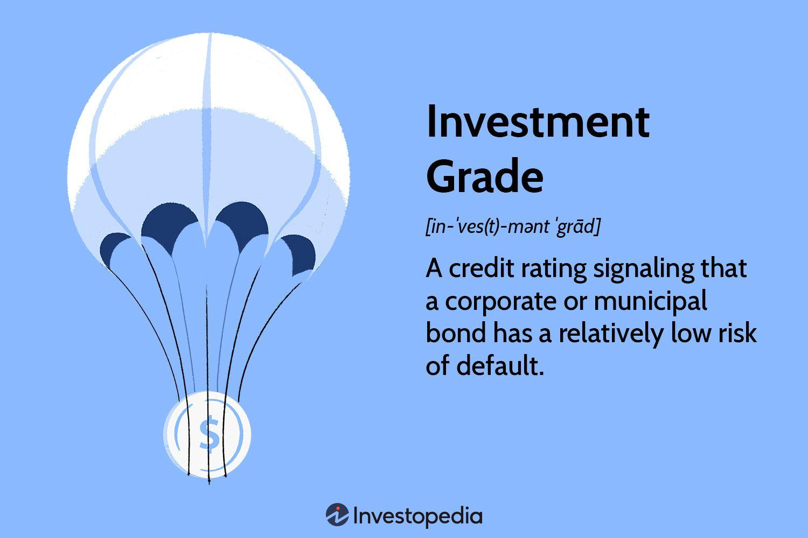

## Table of Contents

## What is an investment grade?

An investment grade is a rating given to a bond or other debt security that shows it is a safe investment. It means the company or government that issued the bond is likely to pay back the money they borrowed. Rating agencies like Standard & Poor's, Moody's, and Fitch give these grades. They look at things like how much debt the issuer has, how well they are doing financially, and the overall economy.

Bonds with an investment grade are seen as less risky than those without. They usually have lower interest rates because investors feel safer lending money to these issuers. If a bond is not investment grade, it is called "junk" or "high-yield" and has a higher risk of default. Investors might still buy these, but they want a higher return to take on the extra risk.

## How is an investment grade determined?

An investment grade is determined by rating agencies like Standard & Poor's, Moody's, and Fitch. These agencies look at many things about the company or government that wants to borrow money. They check how much debt the issuer already has, how well they are doing financially, and what is happening in the overall economy. They also think about things like the issuer's past behavior with paying back loans and their ability to keep making money in the future.

After looking at all these factors, the rating agencies give a grade to the bond. If the bond gets a high grade, it means the issuer is seen as reliable and likely to pay back the money they borrowed. These bonds are called investment grade and are considered safe. If the bond gets a low grade, it means there is more risk that the issuer might not pay back the money. These bonds are called junk or high-yield bonds, and investors want a higher return for taking on this extra risk.

## What are the different rating agencies that assign investment grades?

There are three main rating agencies that assign investment grades to bonds and other debt securities. These agencies are Standard & Poor's, Moody's, and Fitch. They look at how much debt a company or government has, how well they are doing financially, and what is happening in the economy. They also consider the issuer's history of paying back loans and their ability to keep making money in the future.

After looking at all these things, the agencies give a grade to the bond. If the bond gets a high grade, it means the issuer is seen as reliable and likely to pay back the money they borrowed. These bonds are called investment grade and are considered safe. If the bond gets a low grade, it means there is more risk that the issuer might not pay back the money. These bonds are called junk or high-yield bonds, and investors want a higher return for taking on this extra risk.

## What is the difference between investment grade and non-investment grade?

Investment grade and non-investment grade are terms used to describe the safety of bonds. Investment grade bonds are seen as safe because the company or government that issued them is likely to pay back the money they borrowed. Rating agencies like Standard & Poor's, Moody's, and Fitch give these bonds high grades after looking at things like how much debt the issuer has and how well they are doing financially.

Non-investment grade bonds, also called junk or high-yield bonds, are seen as riskier. This means there is a higher chance that the issuer might not pay back the money. Because of this extra risk, investors want a higher return if they decide to buy these bonds. Rating agencies give these bonds lower grades after considering the same factors they use for investment grade bonds.

## What are the benefits of investing in investment grade securities?

Investing in investment grade securities has several benefits. One big benefit is that they are seen as safe. This means the company or government that issued the bond is likely to pay back the money they borrowed. Because they are safe, these bonds usually have lower interest rates. This can be good for investors who want to keep their money safe and don't want to take big risks.

Another benefit is that investment grade securities can help you keep your money stable. When the economy is doing well, these bonds might not make you as much money as riskier investments. But when the economy is not doing well, these bonds can help protect your money. They are a good choice if you want to balance out riskier parts of your investment portfolio.

## How do investment grade ratings affect bond yields?

Investment grade ratings have a big impact on bond yields. When a bond gets a high rating, it means it is seen as safe. Investors feel more sure that the company or government will pay back the money they borrowed. Because it is safe, these bonds usually have lower interest rates. This means investors get less money back over time, but they are okay with that because their money is safe.

On the other hand, if a bond gets a low rating, it is seen as risky. This means there is a higher chance that the issuer might not pay back the money. To make up for this risk, investors want a higher return. So, these bonds, called junk or high-yield bonds, have higher interest rates. Investors are willing to take the risk because they can get more money back if everything goes well.

## What are the criteria used by rating agencies to assess investment grade?

Rating agencies like Standard & Poor's, Moody's, and Fitch look at many things to decide if a bond should be investment grade. They check how much debt the company or government has. If they have a lot of debt, it might be harder for them to pay it back. The agencies also look at how well the issuer is doing financially. If they are making a lot of money and managing their money well, it's a good sign. They also think about what is happening in the economy. If the economy is doing well, it's easier for the issuer to pay back their loans.

Another thing the agencies consider is the issuer's history of paying back loans. If they have always paid back their loans on time, it's a good sign that they will do it again. The agencies also look at the issuer's ability to keep making money in the future. If they have a good plan and a strong business, it's more likely they will be able to pay back the money they borrowed. All these things together help the rating agencies decide if a bond should be investment grade or not.

## Can an investment grade rating change over time, and if so, why?

Yes, an investment grade rating can change over time. Rating agencies like Standard & Poor's, Moody's, and Fitch keep watching the companies and governments that have issued bonds. If something changes, like the company starts doing worse financially or the economy gets into trouble, the agencies might decide to change the rating. They look at things like how much debt the issuer has, how well they are doing financially, and what is happening in the economy to decide if the rating should go up or down.

A rating can go down if the issuer starts having more debt or if they are not making as much money as before. It can also go down if the economy is not doing well, making it harder for the issuer to pay back their loans. On the other hand, if the issuer starts doing better financially or if the economy improves, the rating might go up. This shows that the issuer is now seen as more likely to pay back the money they borrowed.

## How do global economic conditions influence investment grade ratings?

Global economic conditions can have a big impact on investment grade ratings. When the world economy is doing well, companies and governments usually find it easier to make money and pay back their loans. This can lead to better ratings because rating agencies see less risk. For example, if countries are trading a lot and businesses are growing, it's a good sign that issuers will be able to keep up with their debt payments.

On the other hand, if the global economy is struggling, it can make it harder for issuers to pay back their loans. Things like a global recession, high inflation, or big economic changes can make rating agencies worried. They might lower the ratings because there is more risk that the issuer won't be able to pay back the money they borrowed. This means that even if a company or government was doing well before, a bad global economy can lead to a lower investment grade rating.

## What role do investment grade securities play in a diversified investment portfolio?

Investment grade securities are an important part of a diversified investment portfolio. They are seen as safe because the companies or governments that issue them are likely to pay back the money they borrowed. This means they have lower risk compared to other investments like stocks or junk bonds. By including investment grade securities in your portfolio, you can help protect your money, especially during times when the economy is not doing well. They act like a safety net, making sure that not all of your investments are at risk at the same time.

Having investment grade securities also helps balance out the riskier parts of your portfolio. If you have some money in stocks or other high-risk investments, the steady returns from investment grade securities can help keep your overall investment stable. This way, if the stock market goes down, the money you have in safe bonds can help cushion the fall. It's like having a mix of different foods in your diet to stay healthy; a mix of different investments helps keep your money healthy too.

## How can investors use investment grade ratings to manage risk?

Investors can use investment grade ratings to manage risk by choosing bonds that are seen as safe. When a bond has a high rating, it means the company or government that issued it is likely to pay back the money they borrowed. This makes the bond less risky. By putting money into these safe bonds, investors can protect their money, especially during times when the economy is not doing well. It's like wearing a seatbelt in a car; it helps keep you safe even if things get bumpy.

Investment grade ratings also help investors balance out the riskier parts of their portfolio. If an investor has some money in stocks or other high-risk investments, they can use investment grade securities to make their overall investment more stable. When the stock market goes down, the money in safe bonds can help cushion the fall. This way, investors can take some risks with part of their money while keeping the rest safe. It's like having a mix of different foods in your diet to stay healthy; a mix of different investments helps keep your money healthy too.

## What are some advanced strategies for investing in investment grade securities?

One advanced strategy for investing in investment grade securities is laddering. This means buying bonds that mature at different times. For example, you might buy some bonds that mature in one year, some in two years, and some in three years. This way, you get money back at different times. It helps you manage risk because if interest rates go up, you can reinvest the money from the bonds that mature soon at the new, higher rates. If rates go down, you still have bonds that are [earning](/wiki/earning-announcement) the old, higher rates. Laddering helps you keep a steady flow of money and manage changes in the market.

Another strategy is to use bond funds or ETFs that focus on investment grade securities. These funds hold a lot of different bonds, so they spread out the risk. By investing in a fund, you get a piece of many different bonds instead of just one. This can be safer because if one bond does badly, it won't hurt your whole investment. Plus, these funds are managed by experts who watch the market and make changes to keep the fund doing well. This can be a good way to get the benefits of investment grade securities without having to pick each bond yourself.

## References & Further Reading

[1]: Bukhari, M. S., & W. L. Ong. (2020). ["Credit Ratings Impact on Corporation Financing Cost and Operating Performance - An Asia Pacific Perspective."](https://onlinelibrary.wiley.com/doi/abs/10.1111/apel.12287) Asia-Pacific Journal of Financial Studies.

[2]: ["Quantitative Credit Portfolio Management"](https://onlinelibrary.wiley.com/doi/book/10.1002/9781119202851) by Arik Ben Dor, et al.

[3]: ["Algorithmic Trading: Winning Strategies and Their Rationale"](https://www.amazon.com/Algorithmic-Trading-Winning-Strategies-Rationale-ebook/dp/B00CY5HC0U) by Ernie Chan

[4]: ["Advances in Financial Machine Learning"](https://www.amazon.com/Advances-Financial-Machine-Learning-Marcos/dp/1119482089) by Marcos Lopez de Prado

[5]: ["Evidence-Based Technical Analysis: Applying the Scientific Method and Statistical Inference to Trading Signals"](https://books.google.com/books/about/Evidence_Based_Technical_Analysis.html?id=MeoJAQAAMAAJ) by David Aronson

[6]: Medhat, A. (2016). ["The Impact of Credit Rating Announcements on the Market: Evidence from Emerging Markets."](https://journals.sagepub.com/doi/full/10.1177/09721509241299952) SAGE Open.

[7]: ["Corporate Credit Analysis"](https://www.wallstreetoasis.com/resources/skills/credit/standard-poors-fundamentals-of-corporate-credit-analysis) by Janette Rutterford & Mark P. Viera

[8]: ["Machine Learning for Algorithmic Trading"](https://github.com/stefan-jansen/machine-learning-for-trading) by Stefan Jansen

[9]: ["Quantitative Trading: How to Build Your Own Algorithmic Trading Business"](https://www.amazon.com/Quantitative-Trading-Build-Algorithmic-Business/dp/1119800064) by Ernest P. Chan