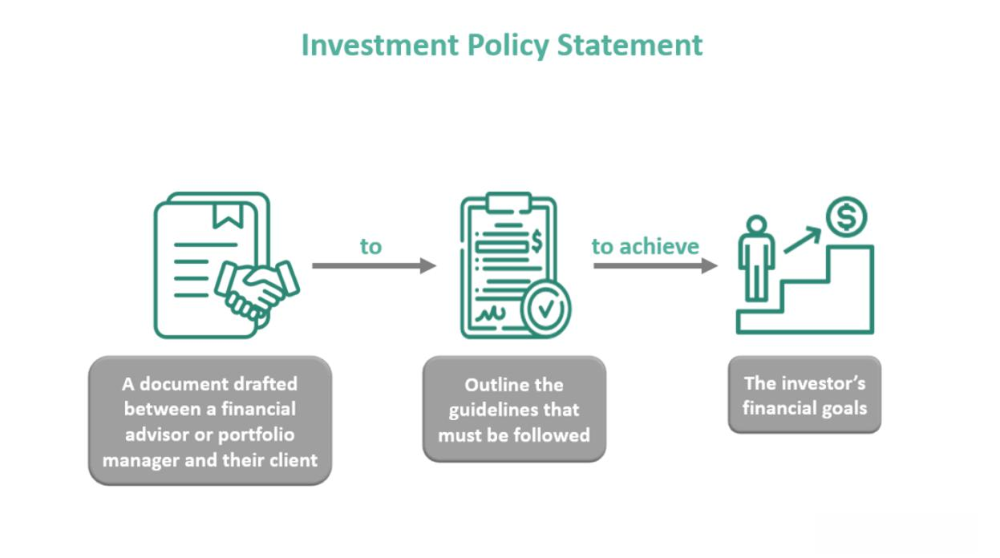

In today's fast-paced financial world, managing personal finance and investment decisions can be overwhelming due to the sheer volume of information and the complexity of financial instruments. Individual investors often face challenges in discerning the most beneficial strategies to achieve their financial objectives amidst fluctuating markets and economic uncertainties. 

The rise of algorithmic trading provides new opportunities for individuals to enhance their investment strategies. By harnessing the power of computer algorithms, investors can efficiently execute trades, capitalize on market trends, and potentially improve financial outcomes with less emotional bias. Algorithmic trading, once predominantly utilized by large financial institutions, is now increasingly accessible to individual investors through various trading platforms and software tools.



This article will explore key aspects of investment advice, personal finance, income management, and the role of algorithmic trading in modern investing, highlighting how technology is reshaping financial strategies. Each section will provide insights into optimizing personal finance practices and leveraging sophisticated financial technologies to navigate the complexities of today's markets effectively.

## Table of Contents

## Understanding Investment Strategies

Investment strategies serve as foundational elements for individuals striving to attain their financial goals, such as saving for retirement or accumulating wealth. These methodologies dictate how an investor allocates assets across various financial instruments, tailoring actions to meet specified financial objectives while adhering to a level of risk they are comfortable with. Broadly, investment strategies can be categorized into three main types: conservative, aggressive, and moderate.

### Types of Investment Strategies

1. **Conservative Strategies**
   Conservative investment strategies prioritize capital preservation over high returns. Investors with a conservative approach typically invest in low-risk assets such as government bonds, money market instruments, and high-grade corporate bonds. The primary objective of conservative strategies is to protect the principal amount with modest appreciation. This approach is suitable for risk-averse individuals or those closer to their financial goals, such as retirees relying on steady income.

2. **Aggressive Strategies**
   Aggressive investment strategies aim for higher returns by assuming a greater degree of risk, often focusing on equities and high-yield bonds. Investors employing this strategy might concentrate their portfolios on [growth stocks](/wiki/growth-stocks), emerging market equities, or small-cap stocks that exhibit significant potential for appreciation. While the possibility of higher returns is attractive, this approach is suitable for investors with a higher risk tolerance and a longer investment time horizon, allowing them to withstand greater [volatility](/wiki/volatility-trading-strategies).

3. **Moderate Strategies**
   Moderate investment strategies strike a balance between risk and return, incorporating elements from both conservative and aggressive strategies. This approach typically involves a mixed allocation in stocks, bonds, and other assets, aimed at achieving a moderate level of growth while managing risk. It's suitable for investors who seek a more balanced portfolio, offering some growth potential with a relatively stable level of risk.

### Aligning Investment Strategies with Risk Profile

Selecting the appropriate investment strategy requires understanding and aligning with one's risk profile. This involves assessing risk tolerance, which depends on factors such as age, income, investment experience, and financial goals. Typically, younger investors may afford to take more risks, favoring aggressive strategies, while older investors might prefer conservative approaches to protect their wealth.

#### Calculating Risk Tolerance

Mathematically, risk tolerance can be assessed through various metrics. One prevalent approach includes using the standard deviation of returns:

$$
\sigma = \sqrt{\frac{\sum (R_i - \bar{R})^2}{N}}
$$

where $\sigma$ represents the standard deviation, $R_i$ are the individual returns, $\bar{R}$ represents the average return, and $N$ is the number of returns. A higher standard deviation indicates a higher risk level.

### Choosing the Right Strategy

To choose the right investment strategy, investors should:

- **Evaluate Financial Objectives**: Clearly define short-term and long-term financial goals.
- **Assess Risk Tolerance**: Use both qualitative assessments and quantitative measures like standard deviation and risk-return ratios.
- **Determine Investment Timeline**: Consider the duration for which investments can be held, which affects risk capacity.
- **Consider Market Conditions**: Understand economic trends and how they might impact various asset classes.

Ultimately, aligning one's investment strategy with their risk tolerance ensures that the portfolio can accommodate market volatility, while still working towards achieving financial goals. Through careful planning and regular assessment of financial objectives and risk profiles, investors can navigate the complexities of investment strategies effectively.

## Personal Finance: Budgeting and Saving

Effective personal finance management begins with the establishment of a realistic budget, which is pivotal in balancing income and essential expenses. A well-structured budget acts as a roadmap, guiding individuals towards their financial objectives while ensuring that day-to-day expenses are met. The process typically involves categorizing expenditures and assessing regular income streams, thus providing a clear picture of one’s financial situation.

At its core, budgeting involves two primary components: income and expenses. Income encompasses all sources of financial inflow, such as salaries, dividends, or rental income. Expenses are divided into essential and discretionary categories. Essential expenses cover necessities like housing, utilities, food, and healthcare. Discretionary spending includes non-essential items like dining out and entertainment. A fundamental budgeting guideline is the 50/30/20 rule, which advocates allocating 50% of income to essentials, 30% to discretionary expenses, and 20% to savings and debt repayment.

The significance of saving a portion of income for future needs and emergencies cannot be overstated. Establishing an emergency fund is crucial, with a recommended saving target covering three to six months’ worth of living expenses. This financial cushion provides security against unexpected events such as job loss or medical emergencies. Furthermore, long-term savings contribute to achieving specific goals, such as purchasing a home or funding retirement.

Multiple strategies can facilitate effective budgeting and saving to support investment goals. First, track spending meticulously to identify areas where expenses can be trimmed. Several mobile applications and online tools can automate this tracking process, providing real-time insights into spending patterns. Second, set clear financial goals—both short-term and long-term. Specific, measurable targets enable individuals to prioritize savings and monitor progress.

Automating savings is another effective strategy. By setting up automatic transfers to savings accounts or investment funds, individuals can ensure consistent contributions without actively managing transactions. This approach not only reduces the temptation to spend impulsively but also capitalizes on the benefits of compounding interest over time.

In conclusion, personal finance management requires a disciplined approach to budgeting and saving. By creating a structured budget and prioritizing savings, individuals can establish a strong financial foundation that supports their investment objectives and safeguards against unforeseen financial challenges.

## Income Management and Wealth Growth

Income management is a vital component of financial stability and growth, extending beyond the mere act of paying bills. It involves strategic planning to ensure that financial resources are utilized effectively to support both current and future financial goals. Successful income management requires a structured approach to allocating a portion of income towards investments, thereby facilitating long-term wealth accumulation.

One of the fundamental concepts in income management is the strategic allocation of resources. A commonly recommended approach is the "50/30/20" rule, which suggests allocating 50% of income to necessities, 30% to discretionary spending, and 20% to savings and investments. This rule of thumb can help individuals maintain a balance between enjoying the present and securing the future.

Investments play a crucial role in wealth growth, offering the potential for higher returns compared to traditional savings accounts. Allocating a consistent percentage of income to a diversified investment portfolio can lead to significant financial growth over time. For instance, investing in stocks, bonds, mutual funds, and other financial instruments allows individuals to tap into different sectors of the market, spreading risk and capitalizing on compound interest.

Understanding passive income streams is essential to effective income management. Passive income refers to earnings derived from investments or business ventures in which an individual is not actively involved. Examples include dividends from stocks, rental income from real estate, or revenue from a business that requires minimal effort to maintain. These income sources can significantly enhance financial stability, providing additional cash flow that can be reinvested to accelerate wealth accumulation.

To illustrate, consider a simple Python script that calculates potential future wealth based on passive income and investment growth:

```python
def future_wealth(investment, annual_interest_rate, years, passive_income):
    future_value = investment * ((1 + annual_interest_rate) ** years)
    total_passive_income = passive_income * years
    return future_value + total_passive_income

initial_investment = 10000  # Initial investment amount in dollars
annual_interest_rate = 0.07  # Expected annual return (7%)
years = 20  # Investment period in years
passive_income = 2000  # Annual passive income in dollars

total_wealth = future_wealth(initial_investment, annual_interest_rate, years, passive_income)
print(f"Projected Total Wealth: ${total_wealth:.2f}")
```

In this example, the script calculates the projected total wealth by considering both the compounded growth of the initial investment and the cumulative passive income over 20 years. The investment grows at an annual rate of 7%, demonstrating the power of compound interest alongside passive income contributions.

Income management and wealth growth are intertwined, emphasizing the importance of making informed financial decisions that prioritize long-term stability. By strategically allocating income towards investments and cultivating passive income streams, individuals lay the foundation for a secure financial future. These efforts ultimately empower individuals to make their money work for them, achieving financial goals with greater efficiency and less reliance on active income sources.

## Exploring Algorithmic Trading

Algorithmic trading involves the use of computer programs and algorithms to automate trading processes. These algorithms can analyze vast datasets much quicker than a human can, execute trades at optimal prices, and reduce the impact of emotions on trading decisions. This section explores the integral components of [algorithmic trading](/wiki/algorithmic-trading) systems, such as market data feeds, strategy development, and [backtesting](/wiki/backtesting), while also considering the benefits and potential drawbacks for personal investment portfolios.

Market data feeds are essential to algorithmic trading as they provide the real-time information needed to make informed decisions. These feeds include data about stock prices, trading volumes, and recent transaction information. Access to accurate and timely data is crucial since algorithms often rely on mere milliseconds of data to execute trades effectively. High-frequency trading, a subset of algorithmic trading, especially emphasizes the necessity for rapid data processing speeds.

Strategy development is another core component. It involves creating a set of rules and conditions under which the algorithm will operate. These rules are often based on technical indicators, statistical [arbitrage](/wiki/arbitrage), or predictive modeling. Here is a basic Python example using a moving average crossover strategy:

```python
import numpy as np
import pandas as pd

# Generate simulated stock price data
np.random.seed(0)
prices = np.random.normal(100, 1, 100)

# Calculate moving averages
short_window = 20
long_window = 50
signals = pd.DataFrame(index=pd.date_range('20230101', periods=100))
signals['price'] = prices
signals['short_mavg'] = signals['price'].rolling(window=short_window, min_periods=1).mean()
signals['long_mavg'] = signals['price'].rolling(window=long_window, min_periods=1).mean()

# Generate buy/sell signals
signals['signal'] = 0
signals['signal'][short_window:] = np.where(signals['short_mavg'][short_window:] > signals['long_mavg'][short_window:], 1.0, 0.0)
signals['positions'] = signals['signal'].diff()

print(signals.head(10))
```

In this example, trading signals are generated when the short-term moving average crosses the long-term moving average, indicating potential buy and sell opportunities.

Backtesting allows traders to evaluate the effectiveness of a trading strategy using historical data. By examining how a strategy would have performed in the past, traders can gain insights into its potential strengths and weaknesses. A key to successful backtesting is ensuring realistic conditions that account for slippage, transaction costs, and other market nuances.

Algorithmic trading offers numerous benefits, such as increased accuracy, reduced trading costs, and the ability to exploit small price movements. Yet, it also presents potential drawbacks. A technical failure could result in significant financial loss if algorithms operate unchecked. Additionally, heavy reliance on algorithms might lead to market distortions or flash crashes when many systems sell simultaneously due to similar signals.

Despite these challenges, algorithmic trading continues to grow and evolve, representing a powerful tool for investors looking to enhance their personal investment portfolios. When utilized correctly, it can effectively streamline the trading process and open new paths to profitability. However, a thorough understanding of both its advantages and limitations is vital to effectively integrate algorithmic trading into one’s investment strategy.

## Risk Management in Investments

Risk management is a critical component of any investment strategy, as it aims to minimize potential financial losses while optimizing returns. By effectively managing risk, investors can maintain more stable portfolios in various market conditions. Traditional risk management strategies often involve diversification and asset allocation tailored to individual risk tolerance and financial goals.

Algorithmic trading platforms enhance risk management by employing advanced techniques and automation to perform complex tasks. One key method is diversification, which involves spreading investments across various asset classes or market sectors to reduce the impact of any single underperforming investment. Algorithmic trading systems can analyze vast amounts of market data rapidly, identifying optimal diversification strategies in real-time. For instance, they can model correlations between different assets to suggest combinations that minimize risk.

Dynamic risk adjustment is another technique facilitated by algorithmic platforms. This involves continuously re-evaluating the riskiness of an investment portfolio relative to market conditions and adjusting positions accordingly. Such systems utilize market data streams to recalibrate strategies, achieving a balance between risk and return. For example, an algorithm might reduce exposure in volatile markets or shift allocations to safer assets during downturns.

Understanding individual risk tolerance is fundamental for crafting a portfolio aligned with financial objectives. Risk tolerance refers to an investor's ability and willingness to endure market fluctuations. Algorithmic trading platforms can assist in this process by providing tools that simulate various economic scenarios, allowing investors to visualize potential outcomes. These platforms might use historical data and advanced statistical models to estimate risk-return scenarios and stress-test portfolios.

Crafting a suitable portfolio involves balancing one's risk profile with investment goals. For investors willing to accept higher risk for potential higher returns, a portfolio composed predominantly of equities might be appropriate. Conversely, those with a lower risk tolerance might favor bonds or index funds. Additionally, algorithmic tools allow investors to backtest investment strategies, verifying their effectiveness under different conditions. Here's a simple Python snippet using the NumPy library to simulate how different asset allocations might perform:

```python
import numpy as np

# Simulate simple portfolio returns
np.random.seed(0)
num_days = 252  # Trading days in a year
equity_returns = np.random.normal(0.0005, 0.01, num_days)  # Mean daily return, daily volatility
bond_returns = np.random.normal(0.0002, 0.002, num_days)

# Portfolio allocations
equity_weight = 0.6
bond_weight = 0.4

# Portfolio returns
portfolio_returns = equity_weight * equity_returns + bond_weight * bond_returns
portfolio_annual_return = np.product(1 + portfolio_returns) - 1

print(f"Estimated annual return: {portfolio_annual_return:.2%}")
```

This code demonstrates a simple simulation of a portfolio consisting of 60% equities and 40% bonds, showcasing how different allocations affect annual returns based on assumed market conditions.

In summary, integrating algorithmic trading with robust risk management strategies allows investors to mitigate losses effectively and capitalize on market opportunities. By understanding their risk tolerance and using technological tools, investors can design portfolios that align with their financial aspirations, bolstering resilience against market uncertainties.

## The Role of Robo-Advisors in Modern Investing

Robo-advisors have emerged as a significant development in the field of investment management, leveraging [artificial intelligence](/wiki/ai-artificial-intelligence) (AI) to provide automated portfolio management services. These platforms use algorithms to assess individual risk profiles and investment goals, creating tailored investment strategies that are both cost-effective and accessible to a wide range of investors, from beginners to seasoned market participants.

### Portfolio Diversification by Robo-Advisors

To achieve diversification, robo-advisors typically begin by assessing the investor's risk tolerance, time horizon, and financial objectives through a set of questions. Based on this information, the algorithm allocates assets across various asset classes such as stocks, bonds, and real estate investment trusts (REITs). The diversification strategy is built around the modern portfolio theory’s principle of optimizing returns for a given level of risk. Typically, the process involves the following steps:

1. **Risk Assessment**: Determining the client’s risk tolerance. This is often calculated using questionnaires that gauge the investor's financial situation and their comfort with market volatility.

2. **Asset Allocation**: Using the assessed risk profile, the robo-advisor selects a diversified mix of exchange-traded funds (ETFs) or mutual funds. For example:
$$
   \text{Optimal Weight} = \frac{E(R_i) - R_f}{\sigma_i^2}

$$

   where $E(R_i)$ is the expected return of asset $i$, $R_f$ is the risk-free rate, and $\sigma_i^2$ is the variance of the asset's return.

3. **Rebalancing**: Robo-advisors automatically rebalance portfolios to maintain alignment with the target asset allocation. Rebalancing ensures that market fluctuations do not alter the intended risk level of the portfolio.

### Advantages of Using Robo-Advisors

**1. Cost-Effectiveness**: Robo-advisors typically charge lower fees compared to traditional financial advisors, as they eliminate the need for human intervention. This is particularly beneficial for investors with smaller portfolios.

**2. Accessibility**: By reducing the costs and complexity associated with investment management, robo-advisors make it possible for individuals with limited financial knowledge to enter the market confidently.

**3. Consistency**: The algorithmic nature of robo-advisors ensures that investment strategies are consistently applied without emotional bias, which can often affect human decision-making.

**4. Convenience**: Their digital platforms allow investors to manage their portfolios from anywhere at any time, offering a user-friendly interface that simplifies tracking performance and making adjustments.

### Limitations of Robo-Advisors

**1. Limited Personalization**: While robo-advisors offer tailored investment strategies, the customization is bounded by the algorithmic models employed. They may not cater to the nuanced financial needs of individual investors with complex situations.

**2. Market Downturn Response**: During volatile market conditions, the algorithms may not provide the same level of responsiveness and adaptability that an experienced human advisor could offer, potentially leading to suboptimal decisions.

**3. Lack of Comprehensive Financial Planning**: Robo-advisors primarily focus on investment management, often leaving broader financial planning aspects, such as estate planning and tax strategies, unaddressed. 

In conclusion, while robo-advisors present a revolutionary approach to investment management through automation and technology, it's essential for investors to weigh the benefits against the limitations. As they continue to evolve, their integration within comprehensive financial advisory services may offer more robust solutions in the future.

## The Future of Investment with AI and Technology

As artificial intelligence (AI) and advanced technologies continue to evolve, they are fundamentally transforming the landscape of personal finance and investing. AI-driven insights are particularly instrumental in enhancing the decision-making process for investors. Through the analysis of vast datasets, AI can identify patterns and trends that might be invisible to the human eye, empowering investors with timely and informed insights. These insights can facilitate more accurate predictions regarding stock movements, asset valuations, and market conditions.

In addition to insights, AI has paved the way for personalized investment advice. Traditional financial advisory services often utilize a one-size-fits-all approach, but AI technologies enable the customization of investment strategies to fit individual risk profiles and financial goals. This results in more tailored and potentially effective investment solutions. Personalized algorithms can consider factors such as income, lifestyle preferences, risk tolerance, and long-term financial objectives to craft a strategy that aligns more closely with an investor’s needs.

Risk management is another crucial area where technology is making significant strides. Sophisticated AI algorithms can assess and predict market volatility with greater precision, allowing for dynamic risk management strategies. By continuously monitoring market dynamics and adjusting portfolios accordingly, AI can help mitigate potential losses and enhance returns. Techniques such as [machine learning](/wiki/machine-learning) and natural language processing can be utilized to aggregate and analyze data from various sources, including news outlets, social media, and economic reports, providing investors with a comprehensive risk assessment.

To stay informed and adapt to these technological advancements, investors are encouraged to embrace a proactive approach. Engaging with educational resources such as webinars, online courses, and financial technology seminars can help investors build their knowledge of AI and its applications in finance. Additionally, collaborating with fintech companies or employing robo-advisors can provide investors with hands-on experience, enabling them to leverage automated systems for portfolio management and investment analysis.

Remaining updated on the latest developments in AI and finance through reputable financial news networks, journals, and expert analyses is also crucial. This continuous learning process ensures that investors can make informed decisions and capitalize on emerging opportunities within the rapidly evolving financial landscape.

In conclusion, AI and advanced technologies represent a paradigm shift in how investors approach personal finance and investing. By harnessing AI-driven insights, personalized advice, and sophisticated risk management protocols, investors can optimize their strategies and achieve their financial objectives more efficiently.

## Conclusion

Effective investment and finance management require a blend of strategic planning and leveraging modern technology. As the financial landscape evolves, the integration of technology into personal finance and investing becomes increasingly critical. Algorithmic trading and artificial intelligence (AI) are at the forefront of these innovations, offering investors new tools to enhance their financial strategies.

Algorithmic trading, by using computer algorithms to execute trades, optimizes the efficiency and accuracy of market activities. This approach minimizes human errors and allows for the rapid execution of large orders, often resulting in better pricing and reduced transaction costs. It also offers sophisticated mechanisms to incorporate real-time market data and adjust to market conditions swiftly.

AI further extends these capabilities by introducing advanced data analytics and machine learning to financial decision-making. These technologies analyze vast amounts of data, revealing insights into market trends and enabling predictive analytics. AI-driven platforms can, therefore, provide investors with personalized investment advice, aligning financial products with individual risk profiles and investment goals. This level of personalization was previously challenging to achieve with traditional investment advisory services.

To effectively navigate the complexities of the financial markets, investors must understand and apply the principles behind algorithmic trading and AI. This involves a shift in mindset—embracing technology as a tool for informed decision-making rather than a replacement for traditional investment wisdom. By integrating these advanced tools into their investment strategies, investors can enhance the precision, efficiency, and overall success of their financial endeavors.

In conclusion, the synergy between strategic planning and technological advancements offers a robust framework for financial management. As AI and algorithmic trading continue to evolve, they will undoubtedly furnish investors with opportunities to optimize their investments and achieve their financial objectives with greater confidence and competence. Embracing these technologies not only prepares investors for the current market environment but also positions them to adapt to future developments in the financial sector.

## References & Further Reading

[1]: Bergstra, J., Bardenet, R., Bengio, Y., & Kégl, B. (2011). ["Algorithms for Hyper-Parameter Optimization."](https://proceedings.neurips.cc/paper/2011/file/86e8f7ab32cfd12577bc2619bc635690-Paper.pdf) Advances in Neural Information Processing Systems 24.

[2]: ["Advances in Financial Machine Learning"](https://www.amazon.com/Advances-Financial-Machine-Learning-Marcos/dp/1119482089) by Marcos Lopez de Prado

[3]: ["Evidence-Based Technical Analysis: Applying the Scientific Method and Statistical Inference to Trading Signals"](https://www.amazon.com/Evidence-Based-Technical-Analysis-Scientific-Statistical/dp/0470008741) by David Aronson

[4]: ["Machine Learning for Algorithmic Trading"](https://github.com/stefan-jansen/machine-learning-for-trading) by Stefan Jansen

[5]: ["Quantitative Trading: How to Build Your Own Algorithmic Trading Business"](https://github.com/LucindaYa/quant-resources/blob/master/Quantitative%20Trading%20How%20to%20Build%20Your%20Own%20Algorithmic%20Trading%20Business.pdf) by Ernest P. Chan