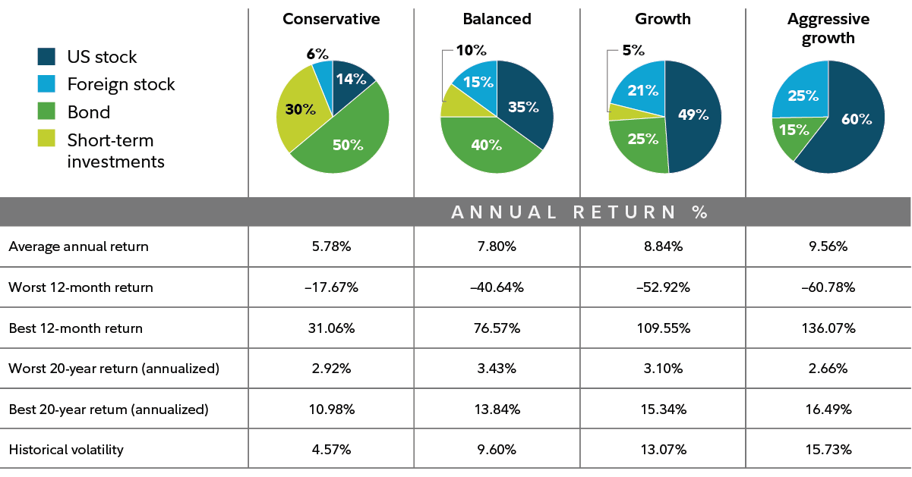

## Table of Contents

## What is an investment holding?

An investment holding is when a person or a company owns shares or other assets to make money over time. Instead of using these assets every day, they keep them to grow in value or earn income from them. For example, someone might buy stocks in a company and hold onto them, hoping the stock price will go up.

Holding investments can be a good way to build wealth. It allows the owner to benefit from things like stock price increases or dividend payments without having to sell the assets right away. However, it also comes with risks, like the chance that the value of the assets might go down. It's important for anyone thinking about investment holdings to understand these risks and rewards.

## How does an investment holding differ from other types of investments?

An investment holding is different from other types of investments because it's about keeping assets for a long time. When you have an investment holding, you're not planning to sell your stocks, real estate, or other assets quickly. You're hoping they will grow in value or give you regular income over many years. This is different from short-term investments, where you might buy something and sell it after a short time to make a quick profit.

Other types of investments might include things like trading, where you buy and sell assets quickly to take advantage of small changes in price. Or you might invest in something like a savings account, where the goal is to keep your money safe and earn a little interest. Investment holdings are more about patience and long-term growth. They can be riskier because the value of what you're holding can go up or down a lot over time, but they also have the potential for bigger rewards if you choose the right assets to hold.

## What are the benefits of including investment holdings in a portfolio?

Including investment holdings in a portfolio can help grow your money over a long time. When you hold onto investments like stocks or real estate, they might go up in value. This can make your portfolio worth more than if you just kept your money in a savings account. Also, some investment holdings, like dividend-paying stocks, can give you regular income. This can be helpful if you need money coming in regularly without selling your investments.

Another benefit is that investment holdings can help spread out risk. If you have different types of investments in your portfolio, like stocks, bonds, and real estate, a problem with one type might not hurt your whole portfolio. This is called diversification. By holding onto different investments for the long term, you can protect your money better and have a chance to earn more over time.

## How can investment holdings contribute to portfolio diversification?

Investment holdings can help make your portfolio more diverse by spreading your money across different types of assets. Instead of putting all your money into one thing, like just stocks or just real estate, you can hold onto a mix of things. This way, if one type of investment goes down in value, the others might still be doing well. It's like not putting all your eggs in one basket.

Having a diverse portfolio can also help you manage risk better. When you hold onto different investments over a long time, you're less likely to lose a lot of money all at once. For example, if the stock market has a bad year, your real estate holdings might still be going up in value. By keeping a variety of investments, you can protect your money and still have a chance to grow it over the long term.

## What are some common types of investment holdings?

Common types of investment holdings include stocks, bonds, and real estate. Stocks are pieces of ownership in a company. When you buy a stock and hold onto it, you hope the company will do well and the stock price will go up. You might also get dividends, which are payments the company makes to its shareholders. Bonds are like loans you give to a company or government. They pay you back with interest over time. Real estate means owning property, like houses or buildings. You can hold onto real estate hoping its value will increase or rent it out for regular income.

Other types of investment holdings include mutual funds and exchange-traded funds (ETFs). These are collections of stocks, bonds, or other assets. When you invest in a mutual fund or ETF, you're buying a little bit of many different investments at once. This can be a good way to spread out your risk. Finally, there are also alternative investments like art, collectibles, or private equity. These can be riskier but might offer big rewards if they go up in value over time.

## How do you evaluate the performance of an investment holding?

To evaluate the performance of an investment holding, you look at how much it's grown in value over time. For example, if you bought a stock for $100 and it's now worth $150, that's a 50% increase. You can also check if you're getting regular income from your investment, like dividends from stocks or rent from real estate. Comparing the performance of your investment to similar investments or to a benchmark, like a stock market index, can help you see if it's doing well.

Another way to evaluate your investment holding is to think about the risks you're taking. If your investment goes up and down a lot, it might be riskier than something that stays more steady. You should also consider any fees or costs you're paying to hold the investment. If the costs are high, they can eat into your profits. Overall, evaluating an investment holding means looking at how much it's grown, the income it provides, how it compares to other investments, and the risks and costs involved.

## What are the risks associated with investment holdings?

One big risk with investment holdings is that their value can go down. If you hold onto stocks, the price might drop because the company isn't doing well or because the whole stock market is going down. The same can happen with real estate if the housing market gets worse. If you need to sell your investment when its value is low, you could lose money. This is called market risk, and it's something you have to think about when you're holding onto investments for a long time.

Another risk is that you might not be able to sell your investment when you want to. This is called liquidity risk. For example, if you own a piece of real estate, it might take a long time to find a buyer. Or if you invest in something like a private company, it might be hard to sell your shares at all. This can be a problem if you need money quickly. Also, holding onto investments means you're not using that money for other things, like paying off debts or spending on things you need now. This is called opportunity cost, and it's another risk to think about when you're deciding to hold onto investments.

## How can beginners start investing in holdings?

Beginners can start investing in holdings by first learning about different types of investments, like stocks, bonds, and real estate. It's important to understand what each one is and how they might grow in value over time. A good way to start is by opening an investment account with a brokerage firm. Many of these firms have tools and resources that can help you learn more and make smart choices. You might want to begin with a small amount of money that you can afford to lose, just in case the investment doesn't go as planned.

Once you have an account set up, you can start by investing in something simple like a mutual fund or an ETF. These are collections of many different investments, which can help spread out your risk. You can choose funds that focus on things you believe in, like technology or green energy. As you learn more and feel more confident, you can start to look at individual stocks or even real estate. The key is to start small, keep learning, and be patient because investment holdings are about growing your money over the long term.

## What strategies can be used to manage a portfolio with multiple investment holdings?

One strategy to manage a portfolio with multiple investment holdings is to keep things balanced. This means checking your investments regularly to make sure you're not putting too much money into one type of investment. If one part of your portfolio grows a lot more than the others, you might want to sell some of it and use the money to buy more of the other investments. This helps you spread out your risk and keep your portfolio healthy. Another part of balancing is thinking about how much risk you want to take. If you're okay with more risk, you might put more money into stocks. If you want things to be safer, you might choose more bonds or real estate.

Another strategy is to keep learning and staying updated. The world of investing changes all the time, and new opportunities or risks can come up. Reading news, watching market trends, and maybe even talking to a financial advisor can help you make better choices. It's also a good idea to set clear goals for your investments. Are you saving for a big purchase, like a house, or are you thinking about your retirement? Knowing your goals can help you decide which investments to hold onto and for how long. By keeping your portfolio balanced and staying informed, you can manage your investment holdings better and work towards your financial goals.

## How do tax implications affect investment holdings?

Tax implications can have a big impact on how much money you make from your investment holdings. When you earn money from investments, like dividends from stocks or rent from real estate, you have to pay taxes on that income. The amount of tax you pay can depend on things like how long you've held the investment and what kind of investment it is. For example, if you hold onto a stock for more than a year before selling it, you might pay a lower tax rate on any profit you make. This is called a long-term capital gains tax, and it's usually less than the tax you'd pay if you sold the stock after holding it for less than a year.

Understanding these tax rules can help you make smarter choices about your investment holdings. You might decide to hold onto an investment longer to get a lower tax rate, or you might choose investments that are taxed less, like certain types of bonds. It's also important to know about tax-advantaged accounts, like IRAs or 401(k)s, where your investments can grow without being taxed right away. By thinking about taxes when you manage your investment holdings, you can keep more of the money you earn and help your portfolio grow over time.

## What role do investment holdings play in long-term financial planning?

Investment holdings are super important for long-term financial planning because they help your money grow over time. When you keep investments like stocks or real estate for many years, they can go up in value. This means that your money can be worth a lot more in the future than it is now. For example, if you're saving for retirement, holding onto investments can help you build a big nest egg that you can use when you stop working. It's like planting a seed and watching it grow into a big tree over time.

Holding onto investments also helps you plan for big goals, like buying a house or paying for your kids' education. By keeping your money in investments that grow over time, you can reach these goals without having to save as much money each month. It's important to think about how long you want to keep your investments and what kind of risks you're okay with. By choosing the right investment holdings and holding onto them for the long term, you can make your financial dreams come true.

## How can advanced investors use investment holdings to optimize their portfolio's risk-return profile?

Advanced investors can use investment holdings to fine-tune their portfolio's risk-return profile by carefully selecting and balancing different types of assets. They might choose to hold onto stocks from different industries or countries to spread out risk. By doing this, they can reduce the chance that a problem in one area will hurt their whole portfolio. They might also mix in some bonds or real estate, which can be less risky than stocks but still grow in value over time. This way, they can aim for steady growth while keeping risk under control.

Another way advanced investors optimize their portfolio is by using strategies like tax-loss harvesting and asset location. Tax-loss harvesting means selling investments that have gone down in value to reduce the taxes they owe on their gains. Asset location is about putting investments in the right types of accounts to minimize taxes. For example, they might hold bonds in a tax-advantaged account like an IRA, where the interest income isn't taxed right away. By using these smart strategies, advanced investors can make their investment holdings work harder for them, helping them get a better return for the level of risk they're willing to take.

## What are the Benefits of Diversified Investment Holdings?

Diversified investment holdings play a crucial role in enhancing the stability and performance of an investment portfolio. By spreading investments across a range of asset classes, sectors, and geographical regions, investors can mitigate the risks associated with particular securities or markets. This broad-based approach helps to smooth out [volatility](/wiki/volatility-trading-strategies) and provides a significant buffer against market downturns.

The principal advantage of diversification is risk reduction. By holding a diversified portfolio, the specific risk, also known as unsystematic risk, associated with individual investments, is minimized. For example, if one asset underperforms due to company-specific issues, the negative impact on the overall portfolio may be offset by better performance in other, uncorrelated assets. This diversification effect is described by the formula for the portfolio standard deviation: 

$$
\sigma_p = \sqrt{\sum_{i=1}^N (w_i \cdot \sigma_i)^2 + 2 \cdot \sum_{i=1}^N \sum_{j=i+1}^N (w_i \cdot w_j \cdot \sigma_i \cdot \sigma_j \cdot \rho_{ij})}
$$

where $\sigma_p$ is the portfolio standard deviation, $w_i$ and $w_j$ are the weights of assets $i$ and $j$ in the portfolio, $\sigma_i$ and $\sigma_j$ are the standard deviations of the returns on assets $i$ and $j$, and $\rho_{ij}$ is the correlation coefficient between the returns on assets $i$ and $j$. The correlation term indicates that as long as assets are imperfectly correlated, diversification reduces risk.

In addition to risk reduction, diversification can lead to improved returns. A well-diversified portfolio enables investors to capture returns across different sectors and regions, potentially increasing the overall portfolio return. For instance, during periods when one sector, such as technology, grows rapidly, while another, such as manufacturing, lags, a diversified portfolio would benefit from the growth in technology while minimizing losses from manufacturing.

Another benefit is the creation of more predictable income streams. By investing in a mix of high-[growth stocks](/wiki/growth-stocks), stable bonds, and international assets, investors can secure various income sources. This approach can be especially valuable during economic downturns when certain assets might continue to provide steady income, thus cushioning against losses in other areas.

Diversification can also enhance an investor's risk tolerance and extend their investment horizon. With a lower risk profile, investors may have the confidence to hold investments over a longer period, allowing them to benefit from compound growth and ride out short-term market fluctuations.

Case studies illustrate the advantages of diversified portfolios. For example, during the 2008 financial crisis, portfolios with broad diversification, including international equities, fixed income, and commodities, generally suffered less severe losses compared to those heavily weighted in U.S. equities. Similarly, in the recovery period that followed, these diversified portfolios often recorded accelerated growth due to exposures in various recovering sectors and international markets.

In conclusion, the strategic allocation of investments across a broad spectrum of asset classes is a vital practice for reducing risk, enhancing returns, and establishing resilient income streams. By maintaining a diverse portfolio, investors can navigate the uncertainties of financial markets with greater confidence and an expanded investment horizon.

 to Algorithmic Trading

Algorithmic trading involves the use of computer programs that execute trades based on predefined criteria. These algorithms are capable of processing substantial volumes of data at remarkable speeds, enabling the execution of trades in fractions of a second—beyond the reach of human capabilities. This computational efficiency allows [algorithmic trading](/wiki/algorithmic-trading) to capitalize on brief market opportunities, executing trades before market conditions change.

There are several types of algorithmic strategies commonly employed in financial markets. Market-making algorithms are designed to provide [liquidity](/wiki/liquidity-risk-premium) by simultaneously placing buy and sell orders for a set margin. This helps maintain market efficiency and reduces volatility. Arbitrage strategies exploit price discrepancies of the same asset across different markets, buying low in one and selling high in another to gain risk-free profits. Trend-following algorithms identify and execute trades based on prevailing market trends, assuming the continuation of a market movement.

Algorithmic trading has evolved from a niche activity to a predominant strategy in financial markets, significantly impacting trading [volume](/wiki/volume-trading-strategy) and liquidity. Initially, algorithmic trading was limited to major financial institutions and hedge funds due to the high costs of technology and data. However, advancements in computing power, data availability, and reductions in costs have democratized access, making it a key tool for diverse investors.

For modern investors, understanding the fundamentals of algorithmic trading is crucial as it enhances trade execution efficiency and accuracy. Algorithms reduce the likelihood of human errors, such as emotional decision-making, and enable consistent application of trading strategies. This consistency can improve performance by ensuring that trades are executed at optimal times and under favorable conditions.

Given the rapid advancements in technology and data analytics, algorithmic trading continues to shape the future of investment. Investors equipped with knowledge in algorithmic strategies can better harness these tools to optimize their portfolios and navigate complex financial markets.

## How can algorithmic trading be integrated with portfolio diversity?

Integrating algorithmic trading with portfolio diversity strategies provides investors with a sophisticated mechanism for optimizing financial returns by dynamically managing investments. Algorithms, powered by [artificial intelligence](/wiki/ai-artificial-intelligence) (AI) and [machine learning](/wiki/machine-learning), enable the continuous assessment and real-time adjustment of diversified portfolios, thereby enhancing the investor's ability to respond swiftly to market fluctuations.

Algorithms can execute trades based on predefined criteria, allowing portfolios to be rebalanced efficiently as market conditions change. This real-time adaptability ensures that the portfolio remains optimally diversified across various asset classes, sectors, and geographic regions. An example of algorithmic trading enhancing portfolio diversification is the use of mean-variance optimization. This method involves a mathematical framework for assembling a portfolio that maximizes expected return for a given level of risk, or equivalently minimizes risk for a given level of expected return. The mean-variance optimization formula is given by:

$$
\min \sigma_p^2 = \mathbf{w}^T \Sigma \mathbf{w}
$$

subject to 

$$
\mathbf{w}^T \mathbf{1} = 1
$$

where $\sigma_p^2$ is the portfolio variance, $\mathbf{w}$ is the vector of asset weights, $\Sigma$ is the covariance matrix of asset returns, and $\mathbf{1}$ is a vector of ones.

AI and machine learning play a critical role in improving the accuracy and efficiency of these trading algorithms. Machine learning models can analyze vast amounts of historical and real-time data to recognize patterns and predict asset price movements, thereby enhancing decision-making processes. These technologies help algorithms become more adaptive and improve over time, learning from each outcome to refine future trading decisions.

AI's ability to analyze heterogenous data also facilitates the identification of correlations and anomalies that human traders might miss. For instance, sentiment analysis, a type of AI application, can assess market sentiment by processing news articles and social media data, thus influencing trading strategies to better align with prevailing market moods.

An example of successful integration is the use of machine-learning-enhanced algorithms to adjust asset allocations in index funds. By continuously monitoring various indicators, these algorithms ensure that the portfolio maintains alignment with the investor's risk tolerance and return objectives, enhancing long-term performance.

In conclusion, the integration of algorithmic trading with portfolio diversity is transforming investment strategies, allowing for more sophisticated, data-driven decision-making. Machine learning and AI are indispensable in this transformation, as they provide the tools necessary for handling complex data and achieving superior results in portfolio management.

## References & Further Reading

[1]: Bergstra, J., Bardenet, R., Bengio, Y., & Kégl, B. (2011). ["Algorithms for Hyper-Parameter Optimization."](https://papers.nips.cc/paper/4443-algorithms-for-hyper-parameter-optimization) Advances in Neural Information Processing Systems 24.

[2]: ["Advances in Financial Machine Learning"](https://www.amazon.com/Advances-Financial-Machine-Learning-Marcos/dp/1119482089) by Marcos Lopez de Prado

[3]: ["Evidence-Based Technical Analysis: Applying the Scientific Method and Statistical Inference to Trading Signals"](https://www.amazon.com/Evidence-Based-Technical-Analysis-Scientific-Statistical/dp/0470008741) by David Aronson

[4]: ["Machine Learning for Algorithmic Trading"](https://github.com/stefan-jansen/machine-learning-for-trading) by Stefan Jansen

[5]: ["Quantitative Trading: How to Build Your Own Algorithmic Trading Business"](https://www.amazon.com/Quantitative-Trading-Build-Algorithmic-Business/dp/1119800064) by Ernest P. Chan