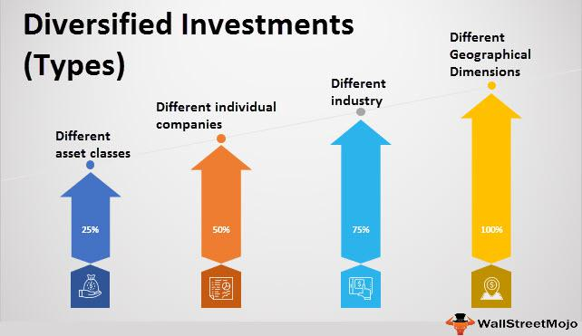

In the dynamic landscape of financial markets, portfolio diversity, investment holdings, and algorithmic trading have gained significant importance. This article explores how modern investors can optimize their strategies using advanced technologies and diversified portfolios. Understanding the synergy between diversification and algorithmic trading is crucial for investors aiming to maximize returns while minimizing risks. As trading technology has evolved, algorithmic trading has opened new avenues for efficiently managing investment portfolios. This combination of elements provides a solid foundation for successful investment management, offering investors the tools to navigate the complexities of modern financial markets with increased precision and efficacy.

Algorithmic trading involves using computer programs that execute trading strategies based on predefined criteria, enabling the analysis of large data volumes and rapid decision-making. This efficiency is particularly advantageous when managing diverse portfolios, where timely adjustments are essential. By integrating algorithmic solutions, investors can maintain optimal diversification, adapting to market changes in real-time, which helps in mitigating risks and exploiting new opportunities.



Portfolio diversity is an investment strategy aimed at reducing risk by allocating assets across various financial instruments, industries, and categories. By diversifying, investors can ensure that the performance of one asset does not heavily influence overall portfolio performance. Modern financial tools play a vital role in creating and maintaining a diversified portfolio, which stabilizes returns over the long term.

Together, these strategies offer a powerful toolset for maximizing financial returns. The integration of technology and diversification enhances the investor's ability to manage risk while securing better returns. It encourages continuous monitoring and adjustment, bolstered by machine learning and AI advancements, to maintain an effective investment strategy.

As the financial landscape continues to evolve with technological advancements, the potential for improving investment returns through these strategies is vast. This article encourages investors to educate themselves on these concepts to remain competitive and leverage their full portfolio potential.

## Table of Contents

## Understanding Portfolio Diversity

Portfolio diversity is a fundamental investment strategy designed to mitigate risk by distributing investments across a variety of financial instruments, industries, and geographic regions. The core idea is to ensure that the performance of a singular asset does not significantly sway the overall portfolio, thereby providing a stabilizing effect on returns over the long term.

### Importance of Diversification

Diversification is crucial as it reduces the unsystematic risk associated with individual securities. This unsystematic risk, also known as specific risk, is the risk inherent to a specific company or industry. By diversifying, investors spread their exposure, thereby reducing the impact of poor performance in any single investment.

For example, if an investor holds stocks only in the technology sector, a downturn in that sector would severely affect their returns. However, by investing across multiple sectors (technology, healthcare, finance, etc.), geographic regions, and even different asset classes (stocks, bonds, real estate), the investor can reduce their overall risk.

### Principles of a Diversified Portfolio

1. **Asset Allocation:** This involves dividing an investment portfolio among different asset categories, such as stocks, bonds, and cash. Each asset class has different levels of risk and return, and their performance can vary under different market conditions. The right mix can help achieve a balance between risk and reward.

2. **Geographic Spread:** Investing in securities from different countries can protect against country-specific economic downturns. For instance, an economic slump in Europe might not affect Asian markets the same way, thus providing a buffer for a well-dispersed investment portfolio.

3. **Industry Variety:** Similar to geographic diversification, industry diversification involves investing in multiple sectors to reduce exposure to sector-specific risks. For example, a scandal affecting one pharmaceutical company may not affect another company in the industrial sector.

### Role of Modern Financial Tools

Advancements in technology and financial tools have greatly facilitated maintaining and creating diversified portfolios. Tools like Exchange-Traded Funds (ETFs) and Mutual Funds allow individuals to access a wide array of investments easily and at a lower cost. Additionally, robo-advisors and algorithmic platforms can automate the diversification process, allocate assets efficiently, and rebalance portfolios based on predefined strategies.

Python Example for Simple Diversification Strategy:
```python
import numpy as np

# Expected returns of different assets
returns = np.array([0.08, 0.07, 0.05])

# Covariance matrix depicting daily returns
cov_matrix = np.array([[0.1, 0.02, 0.04],
                       [0.02, 0.1, 0.06],
                       [0.04, 0.06, 0.09]])

# Portfolio weights
weights = np.array([0.4, 0.4, 0.2])

# Calculate expected portfolio return
expected_return = np.sum(weights * returns)

# Calculate portfolio variance
portfolio_variance = np.dot(weights.T, np.dot(cov_matrix, weights))

# Standard deviation (risk)
portfolio_std_dev = np.sqrt(portfolio_variance)

print(f"Expected Portfolio Return: {expected_return:.2%}")
print(f"Portfolio Risk (Std Dev): {portfolio_std_dev:.2%}")
```

Calculating these metrics helps investors understand the potential return and risk associated with a diversified portfolio. The interplay of diversification principles and modern tools forms a robust framework for effective investment management, accentuating the importance of portfolio diversity in achieving long-term financial goals.

## The Benefits of Diversified Investment Holdings

Diversified investment holdings play a crucial role in enhancing the stability and performance of an investment portfolio. By spreading investments across a range of asset classes, sectors, and geographical regions, investors can mitigate the risks associated with particular securities or markets. This broad-based approach helps to smooth out [volatility](/wiki/volatility-trading-strategies) and provides a significant buffer against market downturns.

The principal advantage of diversification is risk reduction. By holding a diversified portfolio, the specific risk, also known as unsystematic risk, associated with individual investments, is minimized. For example, if one asset underperforms due to company-specific issues, the negative impact on the overall portfolio may be offset by better performance in other, uncorrelated assets. This diversification effect is described by the formula for the portfolio standard deviation: 

$$
\sigma_p = \sqrt{\sum_{i=1}^N (w_i \cdot \sigma_i)^2 + 2 \cdot \sum_{i=1}^N \sum_{j=i+1}^N (w_i \cdot w_j \cdot \sigma_i \cdot \sigma_j \cdot \rho_{ij})}
$$

where $\sigma_p$ is the portfolio standard deviation, $w_i$ and $w_j$ are the weights of assets $i$ and $j$ in the portfolio, $\sigma_i$ and $\sigma_j$ are the standard deviations of the returns on assets $i$ and $j$, and $\rho_{ij}$ is the correlation coefficient between the returns on assets $i$ and $j$. The correlation term indicates that as long as assets are imperfectly correlated, diversification reduces risk.

In addition to risk reduction, diversification can lead to improved returns. A well-diversified portfolio enables investors to capture returns across different sectors and regions, potentially increasing the overall portfolio return. For instance, during periods when one sector, such as technology, grows rapidly, while another, such as manufacturing, lags, a diversified portfolio would benefit from the growth in technology while minimizing losses from manufacturing.

Another benefit is the creation of more predictable income streams. By investing in a mix of high-[growth stocks](/wiki/growth-stocks), stable bonds, and international assets, investors can secure various income sources. This approach can be especially valuable during economic downturns when certain assets might continue to provide steady income, thus cushioning against losses in other areas.

Diversification can also enhance an investor's risk tolerance and extend their investment horizon. With a lower risk profile, investors may have the confidence to hold investments over a longer period, allowing them to benefit from compound growth and ride out short-term market fluctuations.

Case studies illustrate the advantages of diversified portfolios. For example, during the 2008 financial crisis, portfolios with broad diversification, including international equities, fixed income, and commodities, generally suffered less severe losses compared to those heavily weighted in U.S. equities. Similarly, in the recovery period that followed, these diversified portfolios often recorded accelerated growth due to exposures in various recovering sectors and international markets.

In conclusion, the strategic allocation of investments across a broad spectrum of asset classes is a vital practice for reducing risk, enhancing returns, and establishing resilient income streams. By maintaining a diverse portfolio, investors can navigate the uncertainties of financial markets with greater confidence and an expanded investment horizon.

 to Algorithmic Trading

Algorithmic trading involves the use of computer programs that execute trades based on predefined criteria. These algorithms are capable of processing substantial volumes of data at remarkable speeds, enabling the execution of trades in fractions of a second—beyond the reach of human capabilities. This computational efficiency allows [algorithmic trading](/wiki/algorithmic-trading) to capitalize on brief market opportunities, executing trades before market conditions change.

There are several types of algorithmic strategies commonly employed in financial markets. Market-making algorithms are designed to provide [liquidity](/wiki/liquidity-risk-premium) by simultaneously placing buy and sell orders for a set margin. This helps maintain market efficiency and reduces volatility. Arbitrage strategies exploit price discrepancies of the same asset across different markets, buying low in one and selling high in another to gain risk-free profits. Trend-following algorithms identify and execute trades based on prevailing market trends, assuming the continuation of a market movement.

Algorithmic trading has evolved from a niche activity to a predominant strategy in financial markets, significantly impacting trading [volume](/wiki/volume-trading-strategy) and liquidity. Initially, algorithmic trading was limited to major financial institutions and hedge funds due to the high costs of technology and data. However, advancements in computing power, data availability, and reductions in costs have democratized access, making it a key tool for diverse investors.

For modern investors, understanding the fundamentals of algorithmic trading is crucial as it enhances trade execution efficiency and accuracy. Algorithms reduce the likelihood of human errors, such as emotional decision-making, and enable consistent application of trading strategies. This consistency can improve performance by ensuring that trades are executed at optimal times and under favorable conditions.

Given the rapid advancements in technology and data analytics, algorithmic trading continues to shape the future of investment. Investors equipped with knowledge in algorithmic strategies can better harness these tools to optimize their portfolios and navigate complex financial markets.

## Integrating Algorithmic Trading with Portfolio Diversity

Integrating algorithmic trading with portfolio diversity strategies provides investors with a sophisticated mechanism for optimizing financial returns by dynamically managing investments. Algorithms, powered by [artificial intelligence](/wiki/ai-artificial-intelligence) (AI) and [machine learning](/wiki/machine-learning), enable the continuous assessment and real-time adjustment of diversified portfolios, thereby enhancing the investor's ability to respond swiftly to market fluctuations.

Algorithms can execute trades based on predefined criteria, allowing portfolios to be rebalanced efficiently as market conditions change. This real-time adaptability ensures that the portfolio remains optimally diversified across various asset classes, sectors, and geographic regions. An example of algorithmic trading enhancing portfolio diversification is the use of mean-variance optimization. This method involves a mathematical framework for assembling a portfolio that maximizes expected return for a given level of risk, or equivalently minimizes risk for a given level of expected return. The mean-variance optimization formula is given by:

$$
\min \sigma_p^2 = \mathbf{w}^T \Sigma \mathbf{w}
$$

subject to 

$$
\mathbf{w}^T \mathbf{1} = 1
$$

where $\sigma_p^2$ is the portfolio variance, $\mathbf{w}$ is the vector of asset weights, $\Sigma$ is the covariance matrix of asset returns, and $\mathbf{1}$ is a vector of ones.

AI and machine learning play a critical role in improving the accuracy and efficiency of these trading algorithms. Machine learning models can analyze vast amounts of historical and real-time data to recognize patterns and predict asset price movements, thereby enhancing decision-making processes. These technologies help algorithms become more adaptive and improve over time, learning from each outcome to refine future trading decisions.

AI's ability to analyze heterogenous data also facilitates the identification of correlations and anomalies that human traders might miss. For instance, sentiment analysis, a type of AI application, can assess market sentiment by processing news articles and social media data, thus influencing trading strategies to better align with prevailing market moods.

An example of successful integration is the use of machine-learning-enhanced algorithms to adjust asset allocations in index funds. By continuously monitoring various indicators, these algorithms ensure that the portfolio maintains alignment with the investor's risk tolerance and return objectives, enhancing long-term performance.

In conclusion, the integration of algorithmic trading with portfolio diversity is transforming investment strategies, allowing for more sophisticated, data-driven decision-making. Machine learning and AI are indispensable in this transformation, as they provide the tools necessary for handling complex data and achieving superior results in portfolio management.

## Challenges and Considerations

Integrating portfolio diversity with algorithmic trading presents a range of challenges that investors must consider. These challenges primarily revolve around technical and operational complexities inherent in setting up and maintaining algorithmic trading systems. One of the foremost technical challenges is ensuring data quality. High-quality data is essential for algorithms to make accurate trading decisions. Inaccurate, incomplete, or outdated data can lead to substantial financial losses. Investors need to implement robust data management practices, including real-time data feeds, rigorous data validation, and storage systems capable of handling large volumes of information.

The robustness of algorithmic systems is another critical concern. Algorithmic trading relies on software and hardware infrastructure that must be reliable and resilient to ensure continuous operation. System failures can result in missed trading opportunities or erroneous trades. Redundancy, regular system testing, and implementing fail-safes can mitigate these risks. Additionally, algorithmic systems must be adaptable to market changes. This requires continuous monitoring and optimization of algorithms to maintain their effectiveness in dynamic market conditions.

Regulatory considerations are increasingly important as algorithmic trading grows in prominence. Financial markets are subject to stringent regulations that can vary across jurisdictions, impacting how algorithmic trading strategies are implemented. Compliance with these regulations is essential to avoid penalties. Investors should stay informed about regulatory changes and ensure their algorithmic trading practices adhere to all relevant legal frameworks.

Common pitfalls in managing diversified portfolios through algorithmic trading include over-optimization and lack of diversification within the algorithmic strategy itself. Over-optimization occurs when an algorithm is excessively tailored to historical data, leading to suboptimal performance in real-world scenarios. Investors should utilize techniques such as cross-validation and out-of-sample testing to prevent overfitting. Furthermore, ensuring that algorithms accommodate a broad range of market scenarios is crucial to maintaining genuine diversification.

To address these challenges, investors can adopt several best practices. Engaging with experienced industry professionals who specialize in algorithmic trading can provide valuable insights and guidance. Regular audits of trading algorithms and systems can help identify and rectify potential issues. Additionally, employing machine learning techniques can enhance the adaptability and performance of algorithms, enabling them to learn and improve over time. By leveraging these strategies, investors can effectively navigate the complexities of integrating portfolio diversity with algorithmic trading.

## Conclusion

Combining portfolio diversity with algorithmic trading represents a forward-thinking approach in investment strategy. These two elements, each powerful in their own right, together create a sophisticated mechanism to enhance portfolio management. By balancing risk management with strategic opportunities, investors can effectively utilize both tools to optimize their financial outcomes.

A well-diversified portfolio mitigates risk by spreading investments across various assets, sectors, and geographies, thus reducing reliance on any single asset's performance. This risk-spreading mechanism is crucial in maintaining portfolio stability and achieving steady returns. Meanwhile, algorithmic trading introduces precision and efficiency in executing trades, relying on advanced data analytics and real-time decision-making to capitalize on market opportunities. The symbiosis of these strategies equips investors with the means to address market volatility and enhance their decision-making process.

Technological advancements continue to reshape the financial landscape, making these strategies more accessible and robust. The use of AI and machine learning within algorithmic trading further enhances its capabilities, offering tools to refine investment approaches continually. For investors prepared to harness these developments, the opportunity to elevate their portfolio's performance is significant.

To remain competitive, it is imperative for investors to continually educate themselves about these strategies and their evolving technologies. Understanding and effectively applying these investment tools will allow investors to anticipate and navigate the complexities inherent in modern financial markets. Embracing this synergy between portfolio diversity and algorithmic trading opens vast potential for return enhancement, positioning informed investors to leverage their portfolios to their fullest potential.

## References & Further Reading

[1]: Bergstra, J., Bardenet, R., Bengio, Y., & Kégl, B. (2011). ["Algorithms for Hyper-Parameter Optimization."](https://papers.nips.cc/paper/4443-algorithms-for-hyper-parameter-optimization) Advances in Neural Information Processing Systems 24.

[2]: ["Advances in Financial Machine Learning"](https://www.amazon.com/Advances-Financial-Machine-Learning-Marcos/dp/1119482089) by Marcos Lopez de Prado

[3]: ["Evidence-Based Technical Analysis: Applying the Scientific Method and Statistical Inference to Trading Signals"](https://www.amazon.com/Evidence-Based-Technical-Analysis-Scientific-Statistical/dp/0470008741) by David Aronson

[4]: ["Machine Learning for Algorithmic Trading"](https://github.com/stefan-jansen/machine-learning-for-trading) by Stefan Jansen

[5]: ["Quantitative Trading: How to Build Your Own Algorithmic Trading Business"](https://www.amazon.com/Quantitative-Trading-Build-Algorithmic-Business/dp/1119800064) by Ernest P. Chan