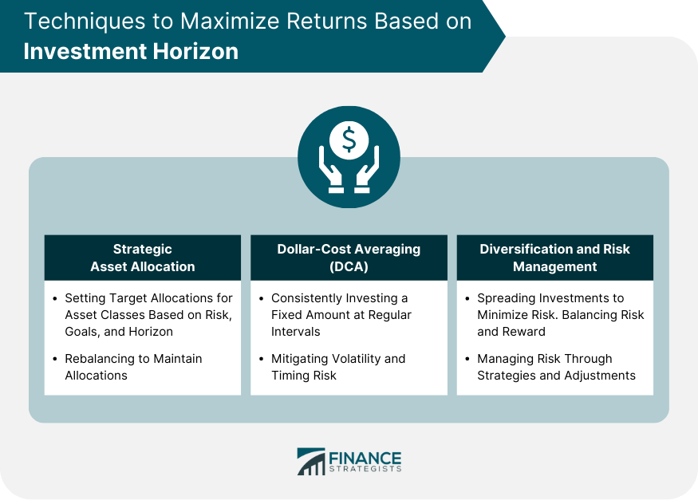

## Table of Contents

## What is an investment horizon?

An investment horizon is the length of time someone plans to hold an investment before they need to use the money. It's like setting a timer for when you want to reach your financial goals. If you're saving for something soon, like a new car next year, your investment horizon is short. But if you're saving for retirement in 30 years, your investment horizon is long.

Knowing your investment horizon helps you choose the right investments. For short horizons, you might pick safer options because you don't have much time to recover from losses. For longer horizons, you can take more risks because you have more time to ride out ups and downs in the market. Understanding your investment horizon can make a big difference in how you plan and grow your money.

## Why is the investment horizon important in portfolio management?

The investment horizon is super important in portfolio management because it helps you pick the right investments for your goals. If you know how long you'll be investing your money, you can choose investments that match that time frame. For example, if you need your money in a few years, you'll want to pick safer investments that won't lose a lot of value quickly. But if you're saving for something far in the future, like retirement, you can take more risks because you have time to recover from any dips in the market.

Understanding your investment horizon also helps you stay calm during market ups and downs. If you know you won't need your money for a long time, you won't panic and sell your investments when the market drops. This can save you from making bad decisions based on short-term market changes. By keeping your investment horizon in mind, you can build a portfolio that grows steadily over time and helps you reach your financial goals.

## How does the length of an investment horizon affect investment choices?

The length of an investment horizon really changes what kinds of investments you should pick. If your investment horizon is short, like you need the money in a few years, you'll want to go for safer investments. Things like savings accounts, CDs, or short-term bonds are good because they don't lose a lot of value quickly. You don't want to take big risks because you won't have much time to get your money back if things go wrong.

On the other hand, if your investment horizon is long, like you're saving for retirement in 30 years, you can take more risks. Stocks and stock funds are good choices because they can grow a lot over time, even if they go up and down in the short term. With a long time to invest, you can ride out the ups and downs of the market and still come out ahead. So, knowing how long you'll be investing helps you pick the right mix of investments to meet your goals.

## What are the different types of investment horizons?

There are three main types of investment horizons: short-term, medium-term, and long-term. A short-term investment horizon is when you need your money back in less than three years. This could be for things like saving for a vacation or buying a new car. Because you need the money soon, you'll want to pick safe investments like savings accounts or short-term bonds that won't lose a lot of value quickly.

A medium-term investment horizon is when you plan to invest for three to ten years. This might be for goals like buying a house or funding a child's education. With a medium-term horizon, you can take a bit more risk than with short-term investments. You might choose a mix of bonds and stocks to grow your money over time while still keeping some safety.

A long-term investment horizon is when you're investing for more than ten years, often for things like retirement. Since you have a lot of time, you can take bigger risks with your money. Stocks and stock funds are good choices because they can grow a lot over many years, even if they go up and down in the short term. Knowing which type of investment horizon you have helps you pick the right investments to meet your goals.

## Can you explain short-term, medium-term, and long-term investment horizons?

A short-term investment horizon is when you need your money back in less than three years. This could be for things like saving for a vacation or buying a new car. Because you need the money soon, you'll want to pick safe investments like savings accounts or short-term bonds. These don't lose a lot of value quickly, which is important when you can't wait long to get your money back.

A medium-term investment horizon is when you plan to invest for three to ten years. This might be for goals like buying a house or funding a child's education. With a medium-term horizon, you can take a bit more risk than with short-term investments. You might choose a mix of bonds and stocks to grow your money over time while still keeping some safety. This way, you can balance growth with the need to have your money ready in a few years.

A long-term investment horizon is when you're investing for more than ten years, often for things like retirement. Since you have a lot of time, you can take bigger risks with your money. Stocks and stock funds are good choices because they can grow a lot over many years, even if they go up and down in the short term. Knowing which type of investment horizon you have helps you pick the right investments to meet your goals.

## How should one adjust their portfolio based on their investment horizon?

If you have a short-term investment horizon, meaning you need your money back in less than three years, you should keep your investments safe. Stick to things like savings accounts, CDs, or short-term bonds. These won't lose a lot of value quickly, which is important because you don't have much time to wait for your money to grow back if it goes down. You want to be sure you can get your money when you need it, so safer choices are the way to go.

For a medium-term investment horizon, where you're looking at three to ten years, you can take a bit more risk. You might mix some stocks with bonds to grow your money over time. This way, you can balance the chance of [earning](/wiki/earning-announcement) more with the need to have your money ready in a few years. It's like having a little bit of both worlds - some safety and some growth.

If your investment horizon is long-term, over ten years, you can go for riskier investments like stocks and stock funds. These can grow a lot over many years, even if they go up and down in the short term. Since you have plenty of time, you can ride out the ups and downs of the market and still come out ahead. This is perfect for big goals like retirement, where you want your money to grow as much as possible over a long time.

## What role do risk tolerance and investment horizon play in asset allocation?

Risk tolerance and investment horizon are super important when you're deciding how to split up your money in different investments, which is called asset allocation. Risk tolerance is about how much risk you're okay with. If you don't like taking big risks, you'll want to put your money in safer things like bonds or savings accounts. But if you're okay with more risk, you might choose to invest more in stocks, which can go up and down a lot but can also grow more over time. Your risk tolerance helps you decide how much of your money to put into risky stuff versus safe stuff.

Your investment horizon, or how long you'll be investing your money, also plays a big role. If you need your money soon, like in a few years, you'll want to keep it in safe places so you can get it back when you need it. But if you're saving for something far away, like retirement, you can put more of your money into riskier investments like stocks. That's because you have time to wait for the market to go up again if it goes down. So, when you're figuring out how to divide your money, you need to think about both how much risk you can handle and how long you'll be investing.

## How do investment goals influence the choice of an investment horizon?

Investment goals are what you want to achieve with your money, like buying a house, paying for college, or saving for retirement. These goals help you decide how long you'll be investing, which is your investment horizon. If your goal is something you need soon, like a new car in a year, your investment horizon will be short. You'll want to pick safe investments because you don't have time to wait for your money to grow back if it goes down.

On the other hand, if your goal is something far away, like retirement in 30 years, your investment horizon will be long. With a long time to invest, you can choose riskier investments like stocks that can grow a lot over many years. Your investment goals set the timeline for when you need your money, and that timeline, or investment horizon, guides you in [picking](/wiki/asset-class-picking) the right investments to reach those goals.

## What are the common mistakes investors make regarding their investment horizon?

One common mistake investors make is not matching their investment choices to their investment horizon. For example, if someone needs their money soon but invests in risky stocks, they might lose money right when they need it. It's like trying to grow a plant in the wrong season. You need to pick investments that fit how long you'll be investing, or you might not reach your goals.

Another mistake is not updating their investment horizon as their goals change. Life changes, and so do our plans. If you're saving for a house and then decide to wait longer, your investment horizon gets longer too. But if you don't adjust your investments to match the new timeline, you might miss out on better growth opportunities or take too much risk. It's important to keep your investments in line with your current goals and timeline.

## How can one reassess and adjust their investment horizon over time?

To reassess and adjust your investment horizon over time, you need to keep an eye on your life goals and how they change. If you originally planned to buy a house in five years but then decide to wait another five years, your investment horizon just got longer. It's important to check in with your goals regularly, maybe once a year or when big life events happen, like getting a new job or having a baby. This helps you see if your investment horizon needs to change to match your new plans.

When you find that your investment horizon has changed, you should adjust your investments to fit the new timeline. If your horizon got longer, you might want to put more money into riskier investments like stocks because you have more time to ride out market ups and downs. But if your horizon got shorter, you'll want to move some of your money into safer investments like bonds or savings accounts to protect what you've saved. By keeping your investments in line with your current investment horizon, you can make sure you're on track to reach your goals.

## What advanced strategies can be employed for managing portfolios with multiple investment horizons?

When you have different goals with different timelines, you can use a strategy called "bucket investing." This means you split your money into different "buckets" based on when you need it. For example, if you need money for a vacation in two years, that goes in a short-term bucket with safe investments like savings accounts or short-term bonds. But if you're saving for retirement in 30 years, that goes in a long-term bucket with riskier investments like stocks. By keeping your money in separate buckets, you can make sure each goal is matched with the right kind of investment.

Another strategy is called "laddering," which is often used with bonds. You buy bonds that mature at different times, like one year, three years, and five years. This way, you get money back at different times, which can help you meet goals with different horizons. As each bond matures, you can either use the money for your short-term goals or reinvest it in new bonds for your longer-term goals. Both bucket investing and laddering help you manage your money better by matching your investments to when you need them, making sure you're ready for all your goals, no matter when they come.

## How do macroeconomic factors and market conditions impact the adjustment of investment horizons?

Macroeconomic factors and market conditions can really change how long you plan to keep your money invested. If the economy is doing well and the market is going up, you might feel more confident about taking risks and keeping your money in for a longer time. But if things are shaky, like during a recession or when the market is going down, you might want to pull your money out sooner or move it to safer places. This is because you don't want to lose a lot of money right when you need it for your goals.

For example, if interest rates go up, it might be a good time to put more money into bonds because they'll give you a better return. But if the stock market is really volatile, you might decide to shorten your investment horizon and move some of your money out of stocks into safer investments. By keeping an eye on what's happening in the economy and the market, you can adjust your investment horizon to make sure your money is safe and growing the way you need it to for your goals.

## What is the relationship between Investment Strategy and Portfolio Management?

A well-structured investment strategy is essential for achieving specific financial objectives while managing associated risks. This strategy must align with an investor's risk tolerance, financial goals, and time horizon, allowing for informed decision-making. Risk tolerance refers to the degree of variability in investment returns that an investor is willing to withstand, influenced by factors such as age, financial stability, and investment experience. Financial goals encompass short-term requirements like purchasing a home or funding education, alongside long-term aspirations such as retirement planning.

Portfolio management is the process of selecting and optimizing asset allocations to reflect the chosen investment strategy. The primary aim is to balance the potential for returns against the risk of losses by strategically diversifying across different asset classes, such as equities, fixed income, real estate, and commodities. Diversification is a risk management strategy that reduces the impact of poor performance in any one area.

To construct risk-adjusted portfolios, financial analysts often use metrics such as the Sharpe Ratio, which measures the performance of an investment relative to its risk:

$$
\text{Sharpe Ratio} = \frac{R_p - R_f}{\sigma_p}
$$

where $R_p$ represents the portfolio return, $R_f$ is the risk-free rate, and $\sigma_p$ is the standard deviation of the portfolio's excess return. A higher Sharpe Ratio indicates more favorable risk-adjusted returns.

Software platforms and financial advisors frequently employ modern portfolio theory (MPT) developed by Harry Markowitz, which emphasizes creating an "efficient frontier." This is a set of optimal portfolios offering the highest expected return for a given level of risk. The Capital Asset Pricing Model (CAPM) further informs these decisions by analyzing an asset's expected return as a function of its systematic risk:

$$
E(R_i) = R_f + \beta_i (E(R_m) - R_f)
$$

In this formula, $E(R_i)$ is the expected return on investment, $R_f$ is the risk-free rate, $\beta_i$ is the beta of the investment (a measure of its [volatility](/wiki/volatility-trading-strategies) relative to the market), and $E(R_m)$ is the expected market return.

Ultimately, robust portfolio management integrates both qualitative elements, such as investor preferences and market conditions, and quantitative analyses, like historical performance data and financial models. This integration fosters a disciplined investment approach that reassesses and rebalances portfolios as markets evolve.

## References & Further Reading

[1]: Malkiel, B. G. (2015). ["A Random Walk Down Wall Street: The Time-Tested Strategy for Successful Investing"](https://www.amazon.com/Random-Walk-Down-Wall-Street/dp/0393358380). W.W. Norton & Company.

[2]: Chan, E. (2013). ["Algorithmic Trading: Winning Strategies and Their Rationale"](https://github.com/ftvision/quant_trading_echan_book). Wiley.

[3]: Lopez de Prado, M. (2018). ["Advances in Financial Machine Learning"](https://www.amazon.com/Advances-Financial-Machine-Learning-Marcos/dp/1119482089). Wiley.

[4]: Jansen, S. (2020). ["Machine Learning for Algorithmic Trading: Predictive Models to Extract Signals from Market and Alternative Data for Systematic Trading Strategies with Python"](https://github.com/stefan-jansen/machine-learning-for-trading). Packt Publishing.

[5]: Grinold, R. C., & Kahn, R. N. (2000). ["Active Portfolio Management: A Quantitative Approach for Producing Superior Returns and Controlling Risk"](https://www.amazon.com/Active-Portfolio-Management-Quantitative-Controlling/dp/0070248826). McGraw-Hill.