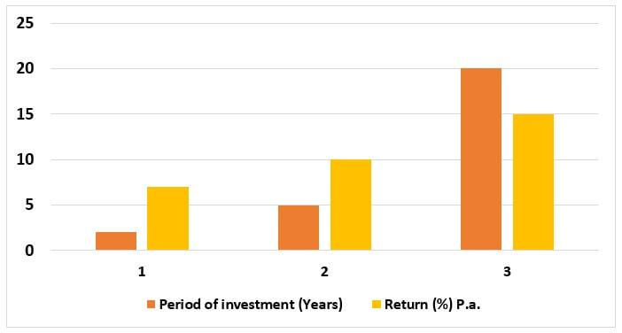

The contemporary investment landscape is characterized by a rapid evolution driven by numerous strategies and technological advancements. Central to the art of successful investing is comprehending the concept of the investment horizon, which serves as a guiding framework for decision-making across an investor's portfolio. This article investigates key components of modern investing: investment horizon, investment strategy, portfolio management, and algorithmic trading.

By understanding these elements, investors can shape their financial decisions decisively and accurately. The investment horizon, for instance, dictates the period an asset is held, influencing the types of financial instruments selected, such as stocks or bonds. Each element, from strategy to technology, plays a fundamental role in dictating the performance and risk management of an investment portfolio.



With advancements in algorithmic trading, investors now have access to sophisticated tools that execute trades with precision and speed, reflecting the latest market dynamics. Aligning one's investment strategy and portfolio management approach with the technological innovations and investment horizon can catalyze enhanced returns and optimized risk management.

Ultimately, achieving an optimal balance among investment horizon, strategy, and technological deployment can significantly impact the outcomes of investment portfolios. This nuanced understanding is crucial for navigating the uncertainties of the financial markets effectively.

## Table of Contents

## Understanding Investment Horizon

Investment horizon refers to the specific time frame over which an investor expects to hold an investment before converting it into cash. This time dimension plays a crucial role in shaping both the risk profile and the selection of investment assets. 

Investment horizons can be broadly categorized into short-term and long-term periods. Short-term horizons are typically measured in days to months. Investors with such horizons generally prioritize capital preservation and liquidity. As a result, they may be inclined towards less volatile assets, such as money market instruments or short-term bonds. These assets tend to have lower returns but also present minimized risks, aligning with an investor's need for stability over a brief period.

Conversely, long-term investment horizons span several years to decades, allowing investors to tolerate higher levels of risk. This tolerance is based on the expectation that markets will recover from cyclical downturns over extended periods, and that riskier assets, such as equities, can offer superior returns over time. The historical performance of stock markets supports this view, showing long-term upward trends despite short-term fluctuations.

The relationship between investment horizon and risk is often captured by concepts such as the risk-return trade-off and modern portfolio theory. According to modern portfolio theory, the risk of a portfolio can be minimized for a given level of expected return by optimizing asset allocation. Longer horizons typically provide the flexibility to include a diversified mix of higher-risk asset classes with higher potential returns, effectively managing the risk-return balance over time.

Investors must carefully assess their investment horizons in relation to their financial goals and risk tolerance. For instance, an individual saving for retirement with decades ahead might opt for a portfolio with a larger equity component, gradually shifting to more conservative investments as the horizon shortens. Conversely, an investor looking to make a sizable purchase in the near future may focus on maintaining [liquidity](/wiki/liquidity-risk-premium) and capital preservation, choosing safer, short-duration assets.

Understanding an investment horizon is essential for aligning investment choices with financial objectives, thereby optimizing potential returns while managing risk exposure effectively.

## Investment Strategy and Portfolio Management

A well-structured investment strategy is essential for achieving specific financial objectives while managing associated risks. This strategy must align with an investor's risk tolerance, financial goals, and time horizon, allowing for informed decision-making. Risk tolerance refers to the degree of variability in investment returns that an investor is willing to withstand, influenced by factors such as age, financial stability, and investment experience. Financial goals encompass short-term requirements like purchasing a home or funding education, alongside long-term aspirations such as retirement planning.

Portfolio management is the process of selecting and optimizing asset allocations to reflect the chosen investment strategy. The primary aim is to balance the potential for returns against the risk of losses by strategically diversifying across different asset classes, such as equities, fixed income, real estate, and commodities. Diversification is a risk management strategy that reduces the impact of poor performance in any one area.

To construct risk-adjusted portfolios, financial analysts often use metrics such as the Sharpe Ratio, which measures the performance of an investment relative to its risk:

$$
\text{Sharpe Ratio} = \frac{R_p - R_f}{\sigma_p}
$$

where $R_p$ represents the portfolio return, $R_f$ is the risk-free rate, and $\sigma_p$ is the standard deviation of the portfolio's excess return. A higher Sharpe Ratio indicates more favorable risk-adjusted returns.

Software platforms and financial advisors frequently employ modern portfolio theory (MPT) developed by Harry Markowitz, which emphasizes creating an "efficient frontier." This is a set of optimal portfolios offering the highest expected return for a given level of risk. The Capital Asset Pricing Model (CAPM) further informs these decisions by analyzing an asset's expected return as a function of its systematic risk:

$$
E(R_i) = R_f + \beta_i (E(R_m) - R_f)
$$

In this formula, $E(R_i)$ is the expected return on investment, $R_f$ is the risk-free rate, $\beta_i$ is the beta of the investment (a measure of its [volatility](/wiki/volatility-trading-strategies) relative to the market), and $E(R_m)$ is the expected market return.

Ultimately, robust portfolio management integrates both qualitative elements, such as investor preferences and market conditions, and quantitative analyses, like historical performance data and financial models. This integration fosters a disciplined investment approach that reassesses and rebalances portfolios as markets evolve.

## Algorithmic Trading and its Role

Algorithmic trading utilizes computer algorithms to automate the process of executing trades in financial markets, achieving speeds and frequencies that are impossible for human traders. This method allows for the analysis and trading of financial instruments based on pre-determined criteria, which can be as simple as timing, price points, or complex functions driven by numerous data points.

Algorithmic trading accommodates a wide range of investment horizons, making it a versatile tool in modern finance. For short-term strategies, high-frequency trading ([HFT](/wiki/high-frequency-trading-strategies)) is a common approach, where algorithms execute a large number of orders in fractions of a second to capitalize on minute price discrepancies. Long-term strategies may also incorporate [algorithmic trading](/wiki/algorithmic-trading) to efficiently manage and rebalance a portfolio according to strategic goals over extended periods.

Key advantages of algorithmic trading include reduced transaction costs, as automated systems can execute trades more efficiently than manual operations, often taking advantage of optimal timing and minimal spread costs. Furthermore, minimizing human intervention decreases the potential for errors in decision-making and execution. Algorithms inherently follow a set of pre-defined rules, ensuring consistency and adherence to risk management strategies, which is crucial in volatile market conditions.

Algorithmic systems enhance the ability to exploit market inefficiencies through sophisticated models that can quickly recognize and react to patterns and anomalies. For instance, statistical [arbitrage](/wiki/arbitrage) relies on such algorithms to identify and exploit price discrepancies between correlated securities. In terms of portfolio management, algorithms can be programmed to continuously balance risk and return, adjusting asset allocations automatically based on real-time data and market movements.

In a typical algorithmic trading system, functions and models can be implemented using programming languages, with Python being a popular choice due to its strong libraries and frameworks for data analysis and back-testing. For example, a basic algorithm might involve calculating a moving average crossover strategy, where trades are executed when short-term and long-term moving averages intersect.

```python
import pandas as pd

def moving_average_crossover_strategy(data, short_window=40, long_window=100):
    signals = pd.DataFrame(index=data.index)
    signals['price'] = data['close']

    signals['short_mavg'] = data['close'].rolling(window=short_window, min_periods=1, center=False).mean()
    signals['long_mavg'] = data['close'].rolling(window=long_window, min_periods=1, center=False).mean()

    signals['signal'] = 0.0
    signals['signal'][short_window:] = \
        np.where(signals['short_mavg'][short_window:] > signals['long_mavg'][short_window:], 1.0, 0.0)   

    signals['positions'] = signals['signal'].diff()

    return signals
```

This example shows how traders could use a simple moving average crossover strategy in a Python-based algorithmic trading system. The signals dataframe would indicate when to buy (crossing upwards) and sell (crossing downwards) based on the computed moving averages, exemplifying the automation of decision-making processes in trading. As algorithmic trading continues to evolve, its sophistication and integration into investment strategies will likely increase, providing a pivotal edge in portfolio management.

## Aligning Horizon, Strategy, and Technology

Aligning investment horizon with strategy and technology is crucial for maximizing returns in the modern financial landscape. Investors must choose strategies that not only fit their horizon but also leverage technological advancements to capitalize on opportunities and mitigate risks effectively.

Investment horizon, ranging from short-term to long-term, significantly impacts the choice of investment strategy. A strategy suitable for a long-term investor might focus on equities, which historically offer higher returns despite their volatility. For instance, adopting a dollar-cost averaging approach over decades allows investors to navigate market fluctuations and benefit from potential market uptrends. On the other hand, short-term strategies might prioritize fixed-income securities or cash equivalents to ensure liquidity and capital preservation.

Technological advancements, particularly algorithmic trading, have revolutionized strategy implementation. Algorithmic trading, by employing computer algorithms to execute trades, enhances the speed, efficiency, and execution quality of investment strategies. The use of algorithms can improve decision-making processes in a portfolio by enabling swift responses to market conditions and facilitating complex analyses that are beyond human capabilities. For example, a [momentum](/wiki/momentum)-based algorithmic strategy could involve purchasing assets showing upward price movements and selling those with downward trends, adjusted for various indicators like moving averages.

Furthermore, employing algorithmic trading requires aligning the code and logic to the specific investment strategy and horizon. Here's a simple Python example of a moving average crossover strategy that illustrates how algorithmic execution can maximize returns:

```python
import pandas as pd
import numpy as np

def moving_average_crossover(prices, short_window, long_window):
    signals = pd.DataFrame(index=prices.index)
    signals['signal'] = 0.0

    # Generate short and long simple moving averages
    signals['short_mavg'] = prices['Close'].rolling(window=short_window, min_periods=1, center=False).mean()
    signals['long_mavg'] = prices['Close'].rolling(window=long_window, min_periods=1, center=False).mean()

    # Create signals
    signals['signal'][short_window:] = np.where(signals['short_mavg'][short_window:] 
                                                > signals['long_mavg'][short_window:], 1.0, 0.0)   
    signals['positions'] = signals['signal'].diff()
    return signals

# Example usage:
# prices = pd.read_csv('historical_prices.csv') # Assume the CSV file contains historical price data
# signals = moving_average_crossover(prices, short_window=40, long_window=100)
```

This strategy, which involves buying when the short-term moving average crosses above the long-term moving average and selling in the opposite scenario, can be adjusted for different investment horizons. A short-term trader might select window lengths of days, whereas a long-term investor could use months or years.

Continuous evaluation and adjustment of the strategy are necessary to adapt to changing market conditions and personal circumstances. Backtesting different strategies and regularly monitoring their performance allows investors to refine their approaches over time. Furthermore, keeping abreast of technological innovations ensures that the trading systems utilized remain optimal and efficient.

In conclusion, the nuances of aligning investment horizon, strategy, and technology determine the effective structuring and execution of investment portfolios. By integrating these elements thoughtfully, investors can pursue strategies that align with their risk profiles and financial objectives while leveraging the benefits of technological advancements.

## Case Studies and Examples

## Case Studies and Examples

### Successful Long-term and Short-term Investment Strategies Using Algorithmic Trading

Investment strategies can be broadly categorized into long-term and short-term based on the investment horizon. Both approaches benefit considerably from the integration of algorithmic trading, which enhances decision-making through data-driven insights and execution efficiency. 

### 30-Year Investment Horizon with a Diversified Portfolio Leveraging Machine Learning Algorithms

A quintessential example of a long-term investment strategy is the utilization of [machine learning](/wiki/machine-learning) algorithms to manage a diversified portfolio over a 30-year horizon. In this strategy, investors focus on a balanced mix of asset classes, such as equities, bonds, and commodities, to optimize returns while minimizing risk. 

Machine learning algorithms can process vast datasets, detecting patterns and trends not immediately apparent to human investors. These algorithms often use techniques like regression analysis, classification, and clustering to make informed predictions about asset performance. For instance, a machine learning model might predict future stock prices based on historical data, sentiment analysis, and macroeconomic indicators.

```python
from sklearn.model_selection import train_test_split
from sklearn.ensemble import RandomForestRegressor
import pandas as pd

# Sample dataset containing historical financial data
data = pd.read_csv('financial_data.csv')

# Features and target variable
X = data.drop('future_stock_price', axis=1)
y = data['future_stock_price']

# Train-test split
X_train, X_test, y_train, y_test = train_test_split(X, y, test_size=0.2, random_state=42)

# Random Forest Regressor model
model = RandomForestRegressor(n_estimators=100, random_state=42)
model.fit(X_train, y_train)

# Model predictions
predictions = model.predict(X_test)

# Output can be used for portfolio adjustment
```

The long-term efficacy of such a strategy is evident from the ability to adjust asset allocations dynamically in response to predictive analytics, maintaining an optimal risk-return balance.

### High-Frequency Trading to Exploit Minute Market Inefficiencies

Conversely, short-term strategies often employ high-frequency trading (HFT) to capitalize on minute market inefficiencies. HFT utilizes sophisticated algorithms capable of executing trades at microsecond intervals to exploit price discrepancies. Such strategies thrive on markets with high liquidity and volatility, where rapid execution can yield substantial profits.

An effective HFT strategy might involve arbitrage opportunities between different exchanges or using [statistical arbitrage](/wiki/statistical-arbitrage) to identify temporary mispricing between correlated assets. The high-speed execution of trades ensures that positions are opened and closed almost instantaneously, minimizing exposure to price fluctuations.

For instance, consider an HFT strategy aimed at exploiting the bid-ask spread:

```c++
#include <vector>
#include <algorithm>

// Simulated function to calculate the spread
double calculate_spread(double bid_price, double ask_price) {
    return ask_price - bid_price;
}

// Execute trades if the spread meets the desired threshold
void execute_trades(std::vector<double> bid_prices, std::vector<double> ask_prices, double threshold) {
    for (size_t i = 0; i < bid_prices.size(); ++i) {
        double spread = calculate_spread(bid_prices[i], ask_prices[i]);
        if (spread < threshold) {
            // Execute buy-sell orders
            std::cout << "Executing trade on opportunity found with spread: " << spread << std::endl;
        }
    }
}

int main() {
    std::vector<double> bid_prices = {100.5, 101.0, 101.5};
    std::vector<double> ask_prices = {100.7, 101.2, 101.6};

    double threshold = 0.2; // Example threshold
    execute_trades(bid_prices, ask_prices, threshold);

    return 0;
}
```

This example highlights the role of algorithmic precision and speed in leveraging fleeting market conditions, underscoring the critical role balanced strategies play in contemporary investment landscapes. 

Both case studies demonstrate the adaptability and potential of algorithmic trading across different investment horizons, highlighting its capacity to optimize financial outcomes by combining analytical rigor with execution efficiency.

## Conclusion

Investment horizon, strategy, and technological advancements like algorithmic trading are crucial for effective portfolio management. A thoughtful understanding and alignment of these elements with individual financial goals allow investors to devise optimized strategies that enhance potential returns while managing risk. The investment horizon determines the investor’s risk-taking capacity, influencing how strategies are formulated. A long-term horizon might accommodate higher-risk assets such as equities, which offer the potential for substantial gains over time. Conversely, a shorter horizon may necessitate conservative investments focused on capital preservation.

Technological advancements, notably algorithmic trading, have revolutionized the execution of investment strategies by enabling rapid, data-driven decision-making. Algorithms enhance the ability to exploit market efficiencies through precise execution and risk management. For example, a Python script can be employed to analyze market trends and trigger trades based on pre-defined criteria, thereby optimizing portfolio performance.

```python
import numpy as np
import pandas as pd
from sklearn.linear_model import LinearRegression

# Example of a simple moving average crossover strategy
def moving_average_crossover_strategy(prices, short_window=40, long_window=100):
    signals = pd.DataFrame(index=prices.index)
    signals['price'] = prices
    signals['short_mavg'] = prices.rolling(window=short_window, min_periods=1, center=False).mean()
    signals['long_mavg'] = prices.rolling(window=long_window, min_periods=1, center=False).mean()
    signals['signal'] = 0.0
    signals['signal'][short_window:] = np.where(signals['short_mavg'][short_window:] > signals['long_mavg'][short_window:], 1.0, 0.0)
    signals['positions'] = signals['signal'].diff()
    return signals
```

The evolving nature of financial markets demands that investors continually adapt and learn. Staying informed about technological innovations and market dynamics is essential for maintaining competitive advantage. Future trends in algorithmic trading are expected to provide further enhancements in market prediction and strategy optimization, thus continuously transforming how investment portfolios are managed. Machine learning and [artificial intelligence](/wiki/ai-artificial-intelligence) will likely play a vital role in these advancements, enabling more sophisticated analyses and decision-making processes. As such, embracing these technologies and methodologies is imperative for investors aiming to achieve robust portfolio outcomes in the ever-changing financial landscape.

## Further Reading and Resources

### Further Reading and Resources

For those interested in expanding their understanding of investment strategies and algorithmic trading, several [books](/wiki/algo-trading-books) and articles offer in-depth insights. Recommended reading includes "A Random Walk Down Wall Street" by Burton G. Malkiel, which provides a fundamental overview of various investment strategies. Additionally, "Algorithmic Trading: Winning Strategies and Their Rationale" by Ernie Chan offers a detailed examination of the principles and techniques driving algorithmic trading.

To supplement reading materials, numerous online platforms provide courses in portfolio management and algorithmic trading. Coursera and Udemy feature beginner to advanced courses crafted by experts in the field, including “Algorithmic Trading with Python: from Idea to Execution” and “Investment Management in an Evolving and Volatile World by HEC Paris” on Coursera.

For continuous updates on technological advancements in finance, websites such as Investopedia and Seeking Alpha serve as valuable resources, offering articles and analyses on emerging trends. Financial news platforms such as Bloomberg Technology and Finextra also report on the latest technological innovations impacting the financial sector.

Incorporating these resources into your learning regimen can foster a deeper comprehension of investment strategies, portfolio management, and algorithmic trading, equipping you with the knowledge needed to navigate and excel in the contemporary investment landscape.

## References & Further Reading

[1]: Malkiel, B. G. (2015). ["A Random Walk Down Wall Street: The Time-Tested Strategy for Successful Investing"](https://www.amazon.com/Random-Walk-Down-Wall-Street/dp/0393358380). W.W. Norton & Company.

[2]: Chan, E. (2013). ["Algorithmic Trading: Winning Strategies and Their Rationale"](https://github.com/ftvision/quant_trading_echan_book). Wiley.

[3]: Lopez de Prado, M. (2018). ["Advances in Financial Machine Learning"](https://www.amazon.com/Advances-Financial-Machine-Learning-Marcos/dp/1119482089). Wiley.

[4]: Jansen, S. (2020). ["Machine Learning for Algorithmic Trading: Predictive Models to Extract Signals from Market and Alternative Data for Systematic Trading Strategies with Python"](https://github.com/stefan-jansen/machine-learning-for-trading). Packt Publishing.

[5]: Grinold, R. C., & Kahn, R. N. (2000). ["Active Portfolio Management: A Quantitative Approach for Producing Superior Returns and Controlling Risk"](https://www.amazon.com/Active-Portfolio-Management-Quantitative-Controlling/dp/0070248826). McGraw-Hill.