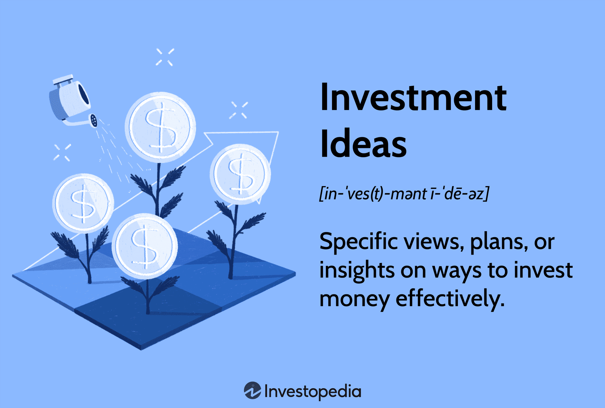

Investments are fundamental components of both personal and corporate finance, serving as tools to grow wealth and achieve financial objectives. For individuals, investments provide avenues to accumulate funds for future needs, such as education, retirement, or major purchases. Corporations, on the other hand, utilize investments to enhance capital, explore new ventures, and improve competitiveness. The primary goal of any investment is to generate favorable returns while managing associated risks.

Investment strategies are essential in optimizing these returns. They involve systematic plans tailored to an investor's financial goals, risk tolerance, and time horizon. Effective investment strategies integrate various asset types and investment ideas to maximize potential gains while mitigating risks. Common strategies include growth investing, focusing on companies with significant potential for stock price appreciation; income investing, prioritizing regular earnings such as dividends; and value investing, targeting undervalued stocks with room for growth.



The diversity in types of investments—ranging from traditional assets like stocks and bonds to alternatives such as cryptocurrencies and real estate—requires careful consideration and strategic allocation. Investment ideas, often derived from thorough market analysis and research, guide the construction of diversified portfolios that align with an investor's preferences and expectations.

Algorithmic trading represents a modern advancement designed to enhance these investment strategies. By employing automated processes driven by complex algorithms, investors can execute trades with increased precision and speed, reducing human error and emotional bias. This method leverages data analysis and machine learning to identify patterns and opportunities, facilitating more informed decision-making.

This article aims to explore the intricacies of investment strategies and types, highlighting how algorithmic trading can be seamlessly integrated to optimize financial outcomes. Through a comprehensive examination, readers will gain insight into building robust investment portfolios that effectively balance risk and return, utilizing innovative tools and techniques to navigate the complexities of modern finance.

## Table of Contents

## Understanding Investment Strategies

Investment strategies are systematic plans or approaches employed by individuals or organizations to allocate resources in order to achieve specific financial objectives. These strategies play an essential role in financial planning by guiding decisions about the selection and management of investment portfolios. The primary goal is to optimize returns while managing risk within acceptable bounds.

Developing an effective investment strategy involves a thorough understanding of various financial markets, economic indicators, and personal or corporate goals. Key principles include diversification, which reduces risk by spreading investments across different assets; risk tolerance evaluation, which aligns investments with the investor's capacity and willingness to endure market fluctuations; and asset allocation, which involves distributing investments among various categories like equities, fixed income, and cash, tailored to the investor's objectives and risk profile.

Aligning investment strategies with financial goals and risk tolerance is of utmost importance. Financial goals may include capital growth, income generation, or preservation of capital. Each goal demands a different strategic approach. For instance, a young investor seeking wealth accumulation might opt for a strategy focusing on high-growth assets, accepting higher [volatility](/wiki/volatility-trading-strategies). In contrast, a retiree prioritizing income preservation would favor stable, income-generating assets like bonds.

Common investment strategies include growth investing, income investing, and value investing. Growth investing focuses on capital appreciation by investing in companies expected to grow at an above-average rate compared to their industry or the overall market. This approach often involves investing in younger companies with potential for rapid expansion. Conversely, income investing prioritizes generating regular income through dividends or interest payments, typically investing in established companies or bonds. Value investing seeks to uncover undervalued stocks, buying them at a discount, with the expectation that the market will eventually recognize their true worth, leading to price appreciation. 

These investment strategies illustrate how tailored approaches can help investors meet diverse financial objectives, balancing risk and return in accordance with individual preferences and circumstances.

## Types of Investments

Investments can be broadly categorized into several types, each possessing unique risk and return characteristics. Understanding these differences is crucial for investors to make informed decisions that align with their financial goals and risk tolerance.

### Stocks

Stocks represent ownership in a company and are considered one of the most common types of investment. They offer potentially high returns, which are achieved through capital appreciation and dividends. However, stocks are typically associated with higher risk due to market volatility, economic fluctuations, and company-specific factors. The return on investment (ROI) for stocks can be described with the formula:

$$
\text{ROI} = \frac{\text{Current Price} - \text{Purchase Price} + \text{Dividends}}{\text{Purchase Price}}
$$

### Bonds

Bonds are debt instruments issued by corporations, municipalities, or governments to raise capital. They are generally considered lower-risk investments compared to stocks, providing steady income through interest payments. The risk associated with bonds varies based on the issuer's creditworthiness and the bond's duration. Longer-duration and lower-credit bonds typically offer higher yields to compensate for increased risk. The yield to maturity (YTM) is a common measure of bond returns, calculated using:

$$
\text{YTM} = \left( \frac{C + \frac{F - P}{n}}{\frac{F + P}{2}} \right)
$$

where $C$ is the annual coupon payment, $F$ is the face value of the bond, $P$ is the purchase price, and $n$ is the number of years to maturity.

### Cryptocurrencies

Cryptocurrencies, like Bitcoin and Ethereum, are digital or virtual currencies that use cryptography for secure transactions. They offer high potential returns but are characterized by significant price volatility and regulatory uncertainty. Investing in cryptocurrencies requires a high-risk tolerance and careful consideration of market trends and technology adoption.

### Real Estate

Real estate investment involves purchasing property to generate income or capital appreciation. It is considered a stable form of investment, often providing regular income through rent and capital gains via property value appreciation. Real estate investments [carry](/wiki/carry-trading) risks related to market conditions, property location, and management efficiency.

### Asset Allocation and Diversification

Asset allocation refers to the strategy of distributing investments across different asset categories, such as stocks, bonds, real estate, and cryptocurrencies, to balance risk and return. Diversification involves spreading investments within an asset category to reduce exposure to any single investment. 

Mathematically, diversification aims to minimize portfolio variance, calculated as:

$$
\sigma^2_p = \sum \left( w_i^2 \sigma_i^2 \right) + \sum \sum ( w_i w_j \sigma_i \sigma_j \rho_{ij} )
$$

where $w_i$ is the weight of the asset, $\sigma_i$ is the standard deviation of the asset's return, and $\rho_{ij}$ is the correlation coefficient between asset returns.

### Role of Investment Advisors

Investment advisors play a crucial role in helping investors select suitable types of investments that align with their financial objectives and risk tolerance. They provide expertise in asset allocation, market analysis, and the selection of individual securities. Advisors can help mitigate risks and enhance returns by tailoring investment strategies to individual needs and market conditions.

## Formulating Investment Ideas

Investment ideas are the foundation of building a successful portfolio, representing specific opportunities to allocate capital in a way that aims to optimize returns, balance risks, and achieve financial objectives. They arise from a combination of strategic planning, market research, analytical insights, and an understanding of the investor’s financial goals and risk appetite. An effective investment idea yields a decision on where to invest, how much to invest, and the expected duration of the investment.

### Modern Portfolio Theory and Investment Ideas

Modern Portfolio Theory (MPT), introduced by Harry Markowitz in 1952, provides a framework for generating investment ideas by emphasizing the importance of diversification to minimize risk while optimizing returns. The theory posits that a diversified portfolio, composed of multiple assets, can mitigate unsystematic risk. The efficient frontier, a core concept of MPT, represents a set of optimal portfolios offering the highest possible return for a given level of risk. An investor can use the efficient frontier to gauge potential investment ideas that align with their risk tolerance and expected returns.

To apply MPT in generating investment ideas, consider the following Python code snippet, which can help visualize the efficient frontier:

```python
import numpy as np
import matplotlib.pyplot as plt

def simulate_portfolios(num_portfolios, returns, cov_matrix):
    results = np.zeros((3, num_portfolios))
    for i in range(num_portfolios):
        weights = np.random.random(len(returns))
        weights /= np.sum(weights)
        portfolio_return = np.sum(weights * returns)
        portfolio_std_dev = np.sqrt(np.dot(weights.T, np.dot(cov_matrix, weights)))
        results[0,i] = portfolio_return
        results[1,i] = portfolio_std_dev
        results[2,i] = portfolio_return / portfolio_std_dev
    return results

# Example data
expected_returns = np.array([0.1, 0.12, 0.14])
covariance_matrix = np.array([[0.005, -0.010, 0.004],
                              [-0.010, 0.040, -0.002],
                              [0.004, -0.002, 0.023]])
num_portfolios = 5000

results = simulate_portfolios(num_portfolios, expected_returns, covariance_matrix)

plt.scatter(results[1,:], results[0,:], c=results[2,:], cmap='viridis')
plt.xlabel('Risk (Standard Deviation)')
plt.ylabel('Return')
plt.title('Efficient Frontier')
plt.colorbar(label='Sharpe Ratio')
plt.show()
```

### Role of Market Analysis and Research

Market analysis and research are crucial in formulating sound investment ideas. This process involves evaluating market trends, economic indicators, industry performance, and individual company metrics to identify favorable investment opportunities. Quantitative research, using statistical and mathematical models, often complements qualitative insights drawn from financial news, expert opinions, and geopolitical developments.

Market analysis helps in discerning patterns and trends that could influence an asset’s future performance. For instance, an upward trend in consumer spending may signal growth potential in retail stocks, while a regulatory change may impact industry-specific securities.

### Asset Class Risk and Style Investing

Investment ideas are also shaped by understanding asset class risk, which refers to the inherent risk associated with different classes of assets, such as stocks, bonds, or real estate. Each class has distinct risk-return profiles, with equities typically offering higher risk and potential returns compared to bonds. Stay informed about the risk of an asset class when developing investment ideas to ensure they align with the investor's risk tolerance.

Style investing involves selecting investments based on attributes like market capitalization (small-cap vs. large-cap), growth versus value metrics, or geographical regions. An investor and advisor need to consider style diversification to spread risk and seize opportunities across varying market conditions.

In summary, formulating investment ideas requires a strategic approach informed by theories like MPT, rigorous market analysis, and understanding of asset-related risks and styles. This careful synthesis aids in crafting a well-rounded portfolio that aligns with investor goals and risk preferences.

## Algorithmic Trading

Algorithmic trading is a method of executing orders using automated and pre-programmed trading instructions that account for variables such as time, price, and [volume](/wiki/volume-trading-strategy). This approach leverages powerful computing capabilities to facilitate the rapid execution of trades, often at speeds far beyond the capabilities of human traders. Unlike traditional trading methods, where decisions are made by individuals who may be influenced by emotions and subjective perceptions, [algorithmic trading](/wiki/algorithmic-trading) relies on quantitative analysis and algorithms to identify trading opportunities.

The benefits of algorithmic trading are substantial. It offers increased speed and accuracy, as computers can process vast amounts of data quickly and execute orders in milliseconds. This efficiency can lead to reduced transaction costs and improved [liquidity](/wiki/liquidity-risk-premium). Algorithmic trading also allows for precise timing of trades, which can be crucial in capturing profits in volatile markets.

However, there are challenges associated with algorithmic trading. The reliance on complex algorithms means there is potential for technical failures or errors in the logic, which can lead to significant financial losses. Additionally, the high-speed nature of algorithmic trading can contribute to market volatility, and there are risks related to algorithmic systems being exploited or manipulated.

Several popular algorithmic trading strategies have emerged, including [momentum](/wiki/momentum) trading and statistical [arbitrage](/wiki/arbitrage). Momentum trading strategies capitalize on the continuance of existing market trends. Algorithms are designed to identify stocks or other assets exhibiting strong upward or downward trends, executing trades accordingly. Statistical arbitrage, on the other hand, employs quantitative models to find pricing inefficiencies between related financial instruments and profit from the convergence of those inefficiencies.

Technologies such as [machine learning](/wiki/machine-learning) have become increasingly significant in enhancing algorithmic trading strategies. Machine learning algorithms can analyze historical data to predict future price movements and recognize patterns that are not immediately apparent to human traders. These algorithms can learn and adapt to new market conditions, continuously improving their predictive accuracy. For example, models such as neural networks and decision trees can process and analyze complex datasets, providing insights and trading signals that support more informed decision-making.

In Python, basic algorithmic trading strategies can be developed using libraries such as pandas for data manipulation and numpy for numerical analysis. Machine learning models can be implemented using libraries like scikit-learn or TensorFlow to predict market movements or optimize trading strategies. Here is a simple example of using a moving average strategy in Python:

```python
import pandas as pd
import numpy as np

# Load historical market data
data = pd.read_csv('market_data.csv')
data['MA10'] = data['Close'].rolling(window=10).mean()

# Generate trading signals
# Buy when the price crosses above the 10-day moving average
# Sell when it crosses below
data['Signal'] = 0
data['Signal'][10:] = np.where(data['Close'][10:] > data['MA10'][10:], 1, 0)
data['Position'] = data['Signal'].diff()

# Review the generated signals
print(data[['Close', 'MA10', 'Signal', 'Position']].head(15))
```

In conclusion, algorithmic trading represents a significant evolution in trading practices, offering improvements in efficiency, execution, and the potential for enhanced returns. However, the complexity and risks involved require careful design and oversight of the algorithms and related systems. As markets continue to evolve, the integration of advanced technologies like machine learning is likely to play an increasingly crucial role in shaping the future of trading strategies.

## Integrating Algorithmic Trading into Investment Strategies

Algorithmic trading, a method that uses automated processes based on mathematical models to execute trades, offers significant integration opportunities within existing investment strategies. By employing algorithmic trading, investors can achieve increased efficiency and reduced emotional bias in their trading activities. Automation ensures that trades are executed at high speeds and with precision, thereby minimizing human error and emotional decision-making, which often lead to suboptimal results. 

The integration of algorithmic trading can enhance risk management by allowing for real-time monitoring and adjustments of investment portfolios. Algorithms can be programmed to adhere to specific risk parameters and investment goals, ensuring consistent portfolio performance alignments. For instance, algorithms can automatically rebalance a portfolio when certain thresholds are surpassed, thereby maintaining the desired asset allocation and avoiding over-concentration in specific assets.

Algorithmic trading also has a profound impact on portfolio diversification. By rapidly assessing and analyzing market data, algorithms can identify correlations between different asset classes and optimize portfolio diversification strategies. For example, an algorithm can execute trades across various markets and asset classes simultaneously, thereby enhancing the potential for optimal diversification and minimizing exposure to isolated market events.

Several case studies highlight successful integrations of algorithmic trading with investment strategies. For instance, Renaissance Technologies, a prominent [hedge fund](/wiki/hedge-fund-trading-strategies), utilizes algorithmic trading to manage its Medallion Fund, which has consistently outperformed the market due to its sophisticated, data-driven trading models. Another example is the use of momentum-based algorithms by quantitative hedge funds, which leverage historical price data to predict future price movements, executing trades accordingly.

In conclusion, the integration of algorithmic trading into investment strategies not only boosts efficiency and reduces emotional biases but also fortifies risk management and diversification efforts. These advancements underscore the role of algorithmic trading as an influential component in contemporary investment strategy development.

## Conclusion

In summarizing the discussion on investments, it is evident that selecting the appropriate investment strategy and type is crucial for aligning with individual financial goals and risk tolerance. Investment strategies such as growth, income, and value investing serve as essential frameworks to guide decision-making, while diverse investment types like stocks, bonds, cryptocurrencies, and real estate each offer distinct risk and return profiles. The principles of asset allocation and diversification further emphasize the importance of a well-balanced portfolio tailored to personal objectives.

Algorithmic trading emerges as a transformative approach in modern investment planning, introducing automation and sophisticated data analysis to enhance the efficacy of trading strategies. With benefits such as increased efficiency, reduced emotional bias, and improved risk management, algorithmic trading represents a significant advancement in achieving optimized investment outcomes.

Given the complexities and dynamic nature of investments, seeking professional guidance is advisable. Financial advisors can provide valuable insights and tactical advice to navigate the multifaceted landscape of investment opportunities, ensuring that strategy and execution are aligned with one’s financial aspirations. As the investment environment continues to evolve, a comprehensive understanding of both traditional and innovative methodologies remains paramount to successful financial planning.

## References & Further Reading

[1]: Bergstra, J., Bardenet, R., Bengio, Y., & Kégl, B. (2011). ["Algorithms for Hyper-Parameter Optimization."](https://dl.acm.org/doi/10.5555/2986459.2986743) Advances in Neural Information Processing Systems 24.

[2]: ["Advances in Financial Machine Learning"](https://www.amazon.com/Advances-Financial-Machine-Learning-Marcos/dp/1119482089) by Marcos Lopez de Prado

[3]: ["Evidence-Based Technical Analysis: Applying the Scientific Method and Statistical Inference to Trading Signals"](https://www.amazon.com/Evidence-Based-Technical-Analysis-Scientific-Statistical/dp/0470008741) by David Aronson

[4]: ["Machine Learning for Algorithmic Trading"](https://github.com/stefan-jansen/machine-learning-for-trading) by Stefan Jansen

[5]: ["Quantitative Trading: How to Build Your Own Algorithmic Trading Business"](https://www.amazon.com/Quantitative-Trading-Build-Algorithmic-Business/dp/1119800064) by Ernest P. Chan