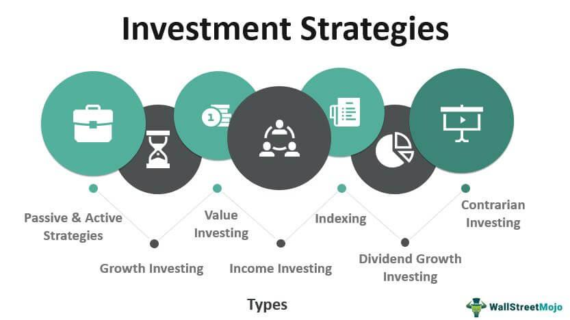

## Table of Contents

## What is an investment and why is it important?

An investment is when you use your money to buy something that you think will grow in value or give you more money in the future. This can be things like stocks, bonds, real estate, or even starting your own business. People invest because they want their money to work for them and grow over time, instead of just sitting in a bank account.

Investing is important because it helps you reach your financial goals, like saving for retirement, buying a house, or paying for your kids' education. By investing, you can make your money grow faster than if you just kept it in a savings account. This can help you build wealth over time and have more financial security. Of course, investing also comes with risks, so it's important to learn about it and make smart choices.

## What are the basic types of investments available to beginners?

For beginners, some of the most common types of investments are stocks, bonds, and mutual funds. Stocks are pieces of ownership in a company. When you buy a stock, you're betting that the company will do well and the stock price will go up. Bonds are like loans you give to a company or the government. They promise to pay you back with interest over time. Mutual funds are a way to invest in a bunch of stocks or bonds at once, which can be easier and less risky than picking individual ones.

Another good option for beginners is a savings account or a certificate of deposit (CD). These are very safe places to put your money, but they usually don't grow as fast as stocks or bonds. A savings account lets you take out your money whenever you want, while a CD makes you keep your money in for a set time, like six months or a year, in exchange for a bit more interest.

Starting with these basic types of investments can help you learn how to invest without taking on too much risk. As you get more comfortable, you can explore other options like real estate or starting your own business. The key is to start small, learn as you go, and keep your long-term goals in mind.

## How does the stock market work as an investment mechanism?

The stock market is where people buy and sell pieces of companies called stocks. When you buy a stock, you're buying a small part of that company. If the company does well, the price of the stock can go up, and you can sell it for more money than you paid. But if the company doesn't do well, the price can go down, and you might lose money. The stock market is like a big auction where lots of people are buying and selling stocks all the time, and the prices change based on what everyone thinks the stocks are worth.

Investing in the stock market can help your money grow over time. If you buy stocks and hold onto them for a long time, like many years, the overall value of your investments can go up a lot. This is because good companies usually keep growing and becoming more valuable. But the stock market can be risky, too. The prices can go up and down a lot in the short term, and sometimes they can drop suddenly. That's why it's important to do your homework, pick good companies, and be ready to wait for your investments to grow over time.

## What are bonds and how do they function as an investment?

Bonds are like loans that you give to a company or the government. When you buy a bond, you're lending them your money for a certain amount of time, like 10 years or 30 years. In return, they promise to pay you back the money you lent them, plus some extra money called interest. The interest is usually paid to you every year until the bond reaches its end date, and then you get your original money back.

Bonds can be a good investment because they're usually safer than stocks. The chance of losing your money is lower because the company or government has to pay you back. But because they're safer, bonds usually don't grow as fast as stocks. They can help you earn some steady money over time, which can be good if you want to balance out riskier investments like stocks. So, bonds can be a useful part of your investment plan, especially if you want to keep your money safe while still [earning](/wiki/earning-announcement) some interest.

## What is the difference between investing in mutual funds and ETFs?

Mutual funds and ETFs are both ways to invest in a bunch of stocks or bonds at once. They're like baskets that hold a mix of different investments. The main difference is how they're managed and traded. Mutual funds are usually managed by a professional who picks the stocks or bonds to put in the basket. They're bought and sold at the end of each trading day, based on the value of all the investments inside. ETFs, on the other hand, are usually designed to track an index, like the S&P 500. They're traded on the stock market all day long, just like individual stocks, so you can buy and sell them whenever the market is open.

Another difference is the cost. Mutual funds often have higher fees because they're actively managed by a professional. These fees can eat into your returns over time. ETFs usually have lower fees because they're passively managed, meaning they just follow an index without a lot of human intervention. This can make ETFs a more cost-effective choice for many investors. Both mutual funds and ETFs can be good ways to diversify your investments and spread out your risk, but it's important to think about the costs and how they fit into your overall investment strategy.

## How can real estate be used as an investment tool?

Real estate can be a good way to invest your money. When you buy a house, apartment, or land, you're hoping it will become more valuable over time. You can make money from real estate in two ways. First, if you buy a property and then sell it later for more money, that's called making a profit. Second, you can rent out the property to other people and collect rent money every month. This can give you a steady income and help pay for the property.

Investing in real estate can be a bit tricky, though. It takes a lot of money to buy a property, and there are other costs like taxes, repairs, and insurance. You also need to know the local real estate market well, so you can pick a good property that will go up in value. But if you do it right, real estate can be a great way to build wealth over time. It's a more hands-on investment than stocks or bonds, but it can pay off if you're willing to put in the work.

## What are alternative investments and what are some examples?

Alternative investments are things you can invest in that are different from the usual stocks, bonds, and real estate. They can be riskier and harder to understand, but they can also offer higher returns if you pick the right ones. These investments often need more money to start and can be harder to sell quickly, so they're usually for people who know a lot about investing and are willing to take bigger risks.

Some examples of alternative investments are art, wine, and collectibles like old coins or stamps. People buy these things hoping they'll become more valuable over time. Another example is investing in a private company that's not listed on the stock market. This can be exciting because you might get in early on a company that could grow a lot, but it's also risky because the company might fail. Lastly, there are things like commodities, which are things like gold, oil, or wheat. These can be good to invest in because they're different from stocks and bonds, and they can help balance out your other investments.

Alternative investments can be a good way to diversify your money and try to make more of it. But they're not for everyone. It's important to learn a lot about them and think about how much risk you're okay with before you jump in. If you're new to investing, it's usually better to start with simpler things like stocks and bonds before you try alternative investments.

## How do risk and return influence investment decisions?

Risk and return are important things to think about when you're deciding where to put your money. Risk is how likely it is that you might lose money. Return is how much money you might make. Usually, if an investment has a high risk, it also has the chance to give you a high return. But if it's low risk, the return is usually lower, too. For example, putting your money in a savings account is very safe, but you won't make much money. On the other hand, investing in a new company can be risky, but if it does well, you could make a lot more money.

When you're making investment choices, you need to think about how much risk you're okay with. Everyone is different. Some people are fine with taking big risks if it means they might get big returns. Other people want to be safer and are happy with smaller, steady returns. It's important to know yourself and what you're comfortable with. You should also think about your goals. If you're saving for something important like retirement, you might want to be a bit safer. But if you're young and have time to wait, you might be okay with taking more risks to try to make more money in the long run.

## What are the key strategies for diversifying an investment portfolio?

Diversifying your investment portfolio means spreading your money across different types of investments. This can help lower your risk because if one investment goes down, the others might go up and balance it out. A good way to diversify is to invest in different kinds of things, like stocks, bonds, and real estate. You can also diversify by investing in different industries, like technology, healthcare, and energy. This way, if one industry has a bad year, the others might do better and keep your portfolio stable.

Another strategy is to invest in different countries. This is called geographic diversification. By putting some of your money in investments from other countries, you're not relying on just one economy. If the economy in your country slows down, the economy in another country might be doing well, and your investments there could help keep your portfolio strong. You can also diversify over time by not putting all your money into the market at once. This is called dollar-cost averaging. By investing a little bit regularly, you can buy more when prices are low and less when prices are high, which can help you get a better average price over time.

## How do economic indicators affect investment choices?

Economic indicators are like signs that tell us how the economy is doing. Things like the unemployment rate, inflation, and how much people are spending can affect what investments you choose. For example, if the unemployment rate is low, it means more people have jobs and are making money. This can be good for companies because more people will buy their stuff, so their stock prices might go up. On the other hand, if inflation is high, it means prices are going up fast, and that can make people worried about the future. They might decide to put their money in safer investments like bonds instead of riskier ones like stocks.

Another important economic indicator is interest rates. When interest rates go up, borrowing money becomes more expensive. This can slow down the economy because people and businesses might borrow less. It can also make bonds more attractive because they pay more interest. But if interest rates go down, borrowing becomes cheaper, and people might spend more money, which can be good for stocks. Keeping an eye on these economic indicators can help you decide when to buy or sell investments and what kinds of investments might do well in the current economic situation.

## What advanced techniques can be used for analyzing investment opportunities?

Advanced techniques for analyzing investment opportunities include using technical analysis and [fundamental analysis](/wiki/fundamental-analysis). Technical analysis is when you look at charts and patterns to try to predict where the price of an investment might go next. It's like trying to read the future by looking at what the price has done in the past. People who use technical analysis might look at things like moving averages, which show the average price over time, or support and resistance levels, which are prices where the investment tends to stop going down or up. This can help them decide when to buy or sell, but it's not always right because the market can be unpredictable.

Fundamental analysis is another way to look at investments. It's about understanding the real value of a company or investment. You do this by looking at things like the company's earnings, how much debt it has, and how it's doing compared to other companies in the same industry. By digging into these details, you can figure out if a stock or bond is a good deal or if it's overpriced. This kind of analysis can take a lot of time and research, but it can help you make smarter choices about where to put your money. Both technical and fundamental analysis can be useful tools, but they work best when you use them together and keep learning as the market changes.

## How can one assess the performance of an investment over time?

To assess the performance of an investment over time, you need to look at how much money you've made or lost. One way to do this is by calculating the return on investment (ROI). ROI is a percentage that shows how much your investment has grown. For example, if you put $100 into a stock and it's now worth $120, your ROI is 20%. You can also compare your investment's performance to a benchmark, like the S&P 500 for stocks. If your investment did better than the benchmark, it's a good sign. If it did worse, you might want to think about changing your strategy.

Another way to assess performance is by looking at the risk you took to get that return. Some investments are riskier than others, and they might go up and down a lot. You can measure this risk by looking at the [volatility](/wiki/volatility-trading-strategies), which is how much the price of your investment changes over time. If your investment made a lot of money but was very volatile, you took on a lot of risk. You should also think about how long you held the investment. Some investments take a long time to grow, while others can grow quickly. By looking at both the return and the risk, you can get a better idea of how well your investment did over time.

## What are the types of investments?

Investments can be broadly categorized into several types, each possessing unique risk and return characteristics. Understanding these differences is crucial for investors to make informed decisions that align with their financial goals and risk tolerance.

### Stocks

Stocks represent ownership in a company and are considered one of the most common types of investment. They offer potentially high returns, which are achieved through capital appreciation and dividends. However, stocks are typically associated with higher risk due to market volatility, economic fluctuations, and company-specific factors. The return on investment (ROI) for stocks can be described with the formula:

$$
\text{ROI} = \frac{\text{Current Price} - \text{Purchase Price} + \text{Dividends}}{\text{Purchase Price}}
$$

### Bonds

Bonds are debt instruments issued by corporations, municipalities, or governments to raise capital. They are generally considered lower-risk investments compared to stocks, providing steady income through interest payments. The risk associated with bonds varies based on the issuer's creditworthiness and the bond's duration. Longer-duration and lower-credit bonds typically offer higher yields to compensate for increased risk. The yield to maturity (YTM) is a common measure of bond returns, calculated using:

$$
\text{YTM} = \left( \frac{C + \frac{F - P}{n}}{\frac{F + P}{2}} \right)
$$

where $C$ is the annual coupon payment, $F$ is the face value of the bond, $P$ is the purchase price, and $n$ is the number of years to maturity.

### Cryptocurrencies

Cryptocurrencies, like Bitcoin and Ethereum, are digital or virtual currencies that use cryptography for secure transactions. They offer high potential returns but are characterized by significant price volatility and regulatory uncertainty. Investing in cryptocurrencies requires a high-risk tolerance and careful consideration of market trends and technology adoption.

### Real Estate

Real estate investment involves purchasing property to generate income or capital appreciation. It is considered a stable form of investment, often providing regular income through rent and capital gains via property value appreciation. Real estate investments [carry](/wiki/carry-trading) risks related to market conditions, property location, and management efficiency.

### Asset Allocation and Diversification

Asset allocation refers to the strategy of distributing investments across different asset categories, such as stocks, bonds, real estate, and cryptocurrencies, to balance risk and return. Diversification involves spreading investments within an asset category to reduce exposure to any single investment. 

Mathematically, diversification aims to minimize portfolio variance, calculated as:

$$
\sigma^2_p = \sum \left( w_i^2 \sigma_i^2 \right) + \sum \sum ( w_i w_j \sigma_i \sigma_j \rho_{ij} )
$$

where $w_i$ is the weight of the asset, $\sigma_i$ is the standard deviation of the asset's return, and $\rho_{ij}$ is the correlation coefficient between asset returns.

### Role of Investment Advisors

Investment advisors play a crucial role in helping investors select suitable types of investments that align with their financial objectives and risk tolerance. They provide expertise in asset allocation, market analysis, and the selection of individual securities. Advisors can help mitigate risks and enhance returns by tailoring investment strategies to individual needs and market conditions.

## References & Further Reading

[1]: Bergstra, J., Bardenet, R., Bengio, Y., & Kégl, B. (2011). ["Algorithms for Hyper-Parameter Optimization."](https://dl.acm.org/doi/10.5555/2986459.2986743) Advances in Neural Information Processing Systems 24.

[2]: ["Advances in Financial Machine Learning"](https://www.amazon.com/Advances-Financial-Machine-Learning-Marcos/dp/1119482089) by Marcos Lopez de Prado

[3]: ["Evidence-Based Technical Analysis: Applying the Scientific Method and Statistical Inference to Trading Signals"](https://www.amazon.com/Evidence-Based-Technical-Analysis-Scientific-Statistical/dp/0470008741) by David Aronson

[4]: ["Machine Learning for Algorithmic Trading"](https://github.com/stefan-jansen/machine-learning-for-trading) by Stefan Jansen

[5]: ["Quantitative Trading: How to Build Your Own Algorithmic Trading Business"](https://www.amazon.com/Quantitative-Trading-Build-Algorithmic-Business/dp/1119800064) by Ernest P. Chan