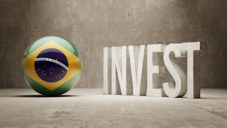

## Table of Contents

## What are the basic types of investments available in Brazil?

In Brazil, there are several basic types of investments that people can choose from. One common type is savings accounts, which are offered by banks and are a safe way to save money while earning a small amount of interest. Another popular option is fixed income investments, like government bonds or bank certificates of deposit (CDBs). These are considered low risk and provide a fixed return over a set period of time. People also invest in real estate, buying properties to rent out or sell later at a higher price.

Another type of investment available in Brazil is stocks. By buying shares in companies listed on the Brazilian stock exchange, investors can potentially earn higher returns, but this comes with higher risk. Mutual funds are also popular, where money from many investors is pooled together and managed by professionals to invest in a variety of assets like stocks, bonds, and real estate. Lastly, there are more complex investments like hedge funds and private equity, which are usually for more experienced investors looking for higher returns and willing to take on more risk.

## How does the Brazilian economy impact investment opportunities?

The Brazilian economy plays a big role in shaping investment opportunities. When the economy is doing well, there are more chances for people to make money from their investments. For example, if businesses are growing, the stock market might go up, making stocks a good investment. Also, when the economy is strong, more people can afford to buy homes, which can make real estate a good choice. On the other hand, if the economy is not doing well, it can be harder to make money from investments. Companies might struggle, causing stock prices to fall, and fewer people might want to buy homes, which can hurt real estate values.

Interest rates set by the Brazilian Central Bank also affect investment opportunities. When interest rates are high, people might prefer to put their money in savings accounts or fixed income investments because they can earn more interest. This can make other types of investments, like stocks, less attractive. But when interest rates are low, people might look for other ways to grow their money, like investing in stocks or real estate. So, understanding the state of the Brazilian economy and the direction of interest rates can help people make better investment choices.

## What are the key sectors in Brazil that are attractive for investment?

Brazil has many sectors that are good for investment. One of the biggest is agriculture. Brazil is a top producer of things like soybeans, beef, and sugar. The country has a lot of land and good weather for farming, so investing in agriculture can be a smart move. Another important sector is energy, especially renewable energy. Brazil has a lot of hydroelectric power and is growing in solar and wind energy. This makes the energy sector a good place to put money, especially if you care about the environment.

Another sector that attracts investors is technology. Brazil has a growing tech industry with many startups and big companies. People are using more technology for things like online shopping and banking, so there are lots of opportunities here. The financial sector is also strong in Brazil. With many banks and financial services companies, there are good chances to invest in this area. Overall, agriculture, energy, technology, and finance are key sectors in Brazil that offer good investment opportunities.

## What are the tax implications for investors in Brazil?

When you invest in Brazil, you need to know about the taxes you might have to pay. If you make money from your investments, like from stocks or real estate, you usually have to pay a tax called the Capital Gains Tax. The rate for this tax can be different depending on how much money you made. For example, if you sell stocks and make a profit, you might pay 15% on that profit. But if you invest in real estate, the tax rate could be different. It's important to keep track of your profits and losses because they affect how much tax you owe.

There are also other taxes to think about. If you get money from dividends, which are payments from companies to their shareholders, you don't have to pay tax on that money in Brazil. But if you invest in funds, like mutual funds, you might have to pay a tax called the Income Tax on the earnings from those funds. The rate for this tax can be up to 15%. Also, if you are a foreigner investing in Brazil, you might have to pay a tax called the IOF (Tax on Financial Operations) when you move money in and out of the country. Understanding these taxes can help you plan your investments better and avoid surprises when it's time to pay taxes.

## How can foreign investors enter the Brazilian market?

Foreign investors can enter the Brazilian market by setting up a business or buying shares in Brazilian companies. To start a business, they need to register with the Brazilian government and get the right permits. This can take some time, but it lets them control their investment directly. If they want to buy shares, they can use the Brazilian stock exchange, called B3. They need a brokerage account to do this. Buying shares is easier and quicker than starting a business, but it means they won't have as much control over the company.

Another way for foreign investors to enter the market is through investment funds. These funds pool money from many investors and use it to buy different assets in Brazil, like stocks, bonds, or real estate. This can be a good choice because it spreads the risk and is managed by professionals. Foreign investors can also look at private equity or venture capital, where they invest directly in Brazilian companies that are not on the stock exchange. This can be riskier but can also offer bigger rewards. No matter which way they choose, foreign investors need to understand the Brazilian economy and laws to make smart investment choices.

## What are the risks associated with investing in Brazil?

Investing in Brazil can be risky because of the country's economic ups and downs. Sometimes the economy grows a lot, but other times it can shrink. This can make it hard to predict how well your investments will do. Also, the value of the Brazilian real, the country's currency, can change a lot compared to other currencies like the US dollar. If the real gets weaker, it can hurt the value of your investments if you need to change them back to your home currency.

Another risk is the political situation in Brazil. Changes in government or new laws can affect businesses and the stock market. For example, if a new government makes it harder for companies to make money, stock prices might go down. There's also the risk of corruption, which can make it hard to trust that your investments are safe. Finally, there are risks from crime and safety issues, especially if you're investing in real estate or starting a business. These things can make it harder to do business in Brazil and can affect how much money you make from your investments.

## What are the regulatory requirements for investing in Brazil?

When you want to invest in Brazil, you need to follow some rules set by the government. If you're starting a business, you have to register it with the Brazilian government. This means getting a tax ID number and other permits. It can take some time, but it's important to do it right so your business is legal. If you're buying stocks, you need to use a broker who is allowed to work in Brazil. You also need to follow the rules of the Brazilian stock exchange, called B3. These rules help make sure that everyone is playing fair and that the market is safe for investors.

There are also rules about taxes. When you make money from your investments, you have to pay taxes on that money. The rules can be different depending on what you're investing in, like stocks or real estate. It's important to keep good records of your investments so you can report your earnings correctly and pay the right amount of tax. If you're a foreign investor, you might also have to pay a special tax called the IOF when you move money in and out of Brazil. Understanding these rules can help you avoid problems and make sure your investments are safe and legal.

## How does the political climate in Brazil affect investment decisions?

The political climate in Brazil can really change how people decide to invest their money. If the government changes or new laws are made, it can affect businesses and the stock market. For example, if a new government makes it harder for companies to make money, stock prices might go down. This can make investors worried about losing money, so they might choose not to invest or to take their money out of Brazil. Also, if there's a lot of corruption or political fighting, it can make investors feel like their money isn't safe. They might think twice before putting their money into Brazilian companies or real estate.

On the other hand, if the political situation is stable and the government is helping businesses grow, it can make Brazil a good place to invest. When the government makes good laws and fights corruption, it can make investors feel more confident. They might see Brazil as a safe place to put their money and expect to make more money from their investments. So, the political climate is really important for investors to think about when they're deciding where to put their money in Brazil.

## What are the best practices for portfolio diversification in the Brazilian market?

When you want to spread out your investments in Brazil, it's a good idea to put your money into different types of things. This way, if one type of investment doesn't do well, you won't lose all your money. For example, you can invest in stocks, bonds, real estate, and even some money in savings accounts. By doing this, you're not putting all your eggs in one basket. It's also smart to invest in different industries, like agriculture, technology, and energy. This helps because if one industry has problems, the others might still do well.

Another good practice is to think about investing in both big and small companies. Big companies can be safer because they have more money and resources, but small companies can grow a lot and make you more money. You can also look at investing in companies that are not just in Brazil but also in other countries. This is called international diversification, and it can help protect your money from problems in the Brazilian economy. By spreading your investments across different types of assets, industries, and even countries, you can make your portfolio stronger and safer.

## How have recent economic reforms in Brazil influenced the investment landscape?

Recent economic reforms in Brazil have made a big difference in how people invest their money. One important change was the labor reform in 2017, which made it easier for companies to hire and fire workers. This helped businesses save money and grow, which made the stock market more attractive for investors. Another big reform was the pension reform in 2019, which changed how people get money when they retire. This helped the government save money and made the economy more stable, which is good for investors because it means less risk.

Also, the government has been working on making it easier to do business in Brazil. They've simplified some rules and made it easier for foreign investors to come in. This has made Brazil a more welcoming place for investment. These changes have helped make the economy stronger and more predictable, which encourages more people to invest in things like stocks, real estate, and businesses. Overall, these reforms have made Brazil a better place for investors by reducing risks and creating more opportunities for growth.

## What advanced financial instruments are available for sophisticated investors in Brazil?

Sophisticated investors in Brazil can use advanced financial instruments like derivatives to manage their investments better. Derivatives are like contracts that let investors bet on how the price of something, like a stock or a commodity, will change in the future. For example, they can use futures contracts to agree on buying or selling an asset at a set price later on. Options are another type of derivative that gives investors the right, but not the obligation, to buy or sell an asset at a certain price. These tools can help investors protect their money from big price swings or make money if they guess the price changes correctly.

Another advanced instrument available in Brazil is hedge funds. Hedge funds are like special investment pools that use different strategies to make money. They can invest in all sorts of things, like stocks, bonds, and even other derivatives. Hedge funds often use strategies like short selling, where they bet that a stock's price will go down, or leverage, where they borrow money to invest more. These funds are usually for rich investors who can handle more risk because they aim for bigger returns. By using these advanced instruments, sophisticated investors in Brazil can try to make more money and manage their risks better.

## How can investors leverage technology and data analytics to optimize investments in Brazil?

Investors can use technology and data analytics to make better investment choices in Brazil. By using special computer programs and data tools, investors can look at a lot of information quickly. This helps them see patterns and trends that they might miss if they were just looking at numbers on paper. For example, they can use software to study how different stocks are doing and predict which ones might go up or down. They can also use data to understand how the Brazilian economy is doing and how it might affect their investments. This can help them make smarter decisions about where to put their money.

Another way technology helps is through online platforms and apps. These tools make it easier for investors to buy and sell investments quickly and from anywhere. They can also use these platforms to get real-time information about their investments and the market. Data analytics can help them find the best times to buy or sell and manage their portfolio more effectively. By using technology and data, investors can keep a close eye on their investments and make changes as needed to get the best results in the Brazilian market.

## References & Further Reading

[1]: Lopez de Prado, M. (2018). ["Advances in Financial Machine Learning."](https://www.amazon.com/Advances-Financial-Machine-Learning-Marcos/dp/1119482089) Wiley.

[2]: Chan, E. P. (2008). ["Quantitative Trading: How to Build Your Own Algorithmic Trading Business."](https://github.com/ftvision/quant_trading_echan_book) Wiley.

[3]: Jansen, S. (2020). ["Machine Learning for Algorithmic Trading."](https://github.com/stefan-jansen/machine-learning-for-trading) Packt Publishing.

[4]: Aronson, D. R. (2006). ["Evidence-Based Technical Analysis: Applying the Scientific Method and Statistical Inference to Trading Signals."](https://www.amazon.com/Evidence-Based-Technical-Analysis-Scientific-Statistical/dp/0470008741) Wiley.

[5]: Research on Brazil's economy and investments: ["Brazil Overview"](https://www.worldbank.org/en/country/brazil/overview) by The World Bank.