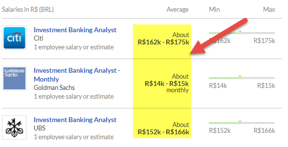

Brazil presents a unique landscape for financial opportunities and investments, characterized by its dynamic emerging economy. The nation boasts significant economic potential due to its diversified industrial base, natural resources, and gradual technological advances. Historically, Brazil's economy has experienced a cyclical pattern marked by episodes of volatility and robust growth. These fluctuations underscore the importance of strategic investment planning for foreign investors seeking to engage with the Brazilian market.

Strategically navigating this economic environment is of paramount importance for potential investors. Brazil's position as an emerging market offers a host of opportunities within its varied economic sectors. This is particularly true in its key areas of agriculture, mining, energy, and a burgeoning technology sector, which continue to attract global attention.



In recent years, algorithmic trading has emerged as a significant trend within the Brazilian financial markets. This modern trading strategy utilizes computational algorithms to execute trades with remarkable speed and precision, offering a competitive edge in navigating the complexities of Brazil's financial landscape. This article intends to comprehensively explore Brazil's diverse investment opportunities while highlighting the growing prominence of algorithmic trading as a tool for efficient market engagement.

## Table of Contents

## Understanding the Brazilian Economy

Brazil's economy is a complex powerhouse, distinguished by its scale and diversity. It ranks as the largest economy in Latin America and is positioned ninth globally in terms of nominal GDP. This expansive economic landscape is supported by a variety of key sectors, each contributing significantly to Brazil's overall economic performance.

Agriculture is a cornerstone of Brazil's economy, with the country being one of the world's leading producers of soybeans, coffee, and sugarcane. The agricultural sector not only supports domestic food supply but also plays a critical role in Brazil's export economy. Brazil is also rich in mineral resources, with a dominant mining sector that extracts and exports commodities such as iron ore, gold, and bauxite. The mining industry has historically drawn significant foreign investment, given Brazil's vast mineral reserves.

The energy sector in Brazil is another vital component, highlighted by substantial oil reserves and a large hydropower base. Brazil stands out as one of the leading producers of ethanol, an alternative energy source derived predominantly from sugarcane. The country’s commitment to renewable energy, particularly wind and solar, has been growing, signaling future avenues for investment in greener technologies.

In recent years, the technology and services sectors have been burgeoning, marking a shift from traditional industries to more modern, service-oriented economic activities. Brazil is experiencing a digital transformation supported by a growing number of tech startups and an expanding IT service sector. This [momentum](/wiki/momentum) is facilitated by a burgeoning middle class that increasingly demands digital services and online platforms.

Despite these robust sectors, Brazil faces notable challenges. Political and economic instability have been recurrent themes, often affecting investor confidence and economic performance. Corruption scandals and fluctuating governmental policies add layers of complexity to the economic environment. However, Brazil's rich natural resources and an increasingly affluent and diverse middle class continue to provide ample opportunity for economic growth and investment.

In sum, understanding the multifaceted nature of Brazil's economy involves recognizing both the promising sectors and the challenges they face. The potential for investment remains significant, especially in sectors poised for growth, such as technology and renewable energy, while traditional sectors like agriculture and mining continue to offer stable returns.

## Investment Opportunities in Brazil

International investors looking to explore Brazilian markets have multiple pathways to entry, both directly and indirectly. Direct access is available through local stocks and bonds, enabling investors to capitalize on Brazil's diverse economic sectors. For those preferring fewer complexities and potentially reduced risks, indirect routes are available through American Depositary Receipts (ADRs) and Exchange-Traded Funds (ETFs) that focus on Brazilian assets. These instruments provide opportunities for portfolio diversification and exposure to Brazil's dynamic market environment without necessitating direct market participation.

Brazil's natural resources are a key driver of its investment appeal. As one of the world's leading producers of soybeans and iron ore, Brazil presents substantial potential for returns in the commodities market. Soybean production is integral to Brazil's agricultural sector, supported by the country's favorable climate and vast arable land. Similarly, Brazil's rich deposits of iron ore contribute significantly to global supply, making mining an attractive sector for investors seeking stable, commodity-driven returns.

Beyond traditional sectors, Brazil's investment landscape is evolving, with emerging industries offering new growth avenues. Renewable energy stands out as a promising field; Brazil is recognized for its proactive approach to sustainable energy, especially in hydropower and biofuels. The government's commitment to expanding its renewable energy capacity aims to attract investments and reduce carbon emissions, aligning with global sustainability goals.

Another area ripe for investment is digital transformation. With increasing internet penetration and a burgeoning technology sector, Brazil is witnessing substantial growth in digital services and infrastructure. Investments in fintech, e-commerce, and digital startups are on the rise, driven by consumer demand for innovative solutions and the accelerating pace of technological advancement.

In conclusion, Brazil provides a spectrum of investment opportunities across a range of traditional and modern sectors. The country's rich natural resources, coupled with emerging industries like renewable energy and digital technologies, offer diverse and potentially lucrative avenues for international investors seeking to tap into Latin America's largest economy.

## Algorithmic Trading in Brazil

Algorithmic trading, a method employing automated systems to execute trades based on pre-defined rules, is gaining substantial traction in Brazil. This technology-driven approach enables traders to efficiently handle large volumes of trades with enhanced precision and speed. By automating trading processes, [algorithmic trading](/wiki/algorithmic-trading) reduces the possibility of human error and allows for more consistent execution of trades.

The popularity of algorithmic trading in Brazil can be attributed to its capacity to navigate the country's intricate market dynamics. Brazil's financial markets are characterized by [volatility](/wiki/volatility-trading-strategies) and complexity, factors that make algorithmic trading particularly advantageous. The ability of these systems to analyze vast amounts of data in real-time and make calculated decisions offers a strategic edge, enabling traders to respond swiftly to market fluctuations.

In the context of Brazil's foreign exchange market, algorithmic trading systems play a critical role in capitalizing on currency movements. The Brazilian Real (BRL), influenced by various economic indicators and often subject to abrupt changes, presents both challenges and opportunities for traders. By employing sophisticated algorithms, traders can exploit these fluctuations to optimize [forex](/wiki/forex-system) trades. 

For example, forex trading strategies might include deploying algorithms that react to [interest rate](/wiki/interest-rate-trading-strategies) changes announced by the Brazilian Central Bank. These strategies could incorporate predictive analytics to forecast currency trends based on macroeconomic factors. 

Here is a simple example of a moving average crossover strategy in Python: 

```python
import pandas as pd

# Assume 'data' is a DataFrame with historical forex data

# Calculate moving averages
data['SMA_50'] = data['Close'].rolling(window=50).mean()
data['SMA_200'] = data['Close'].rolling(window=200).mean()

# Generate signals
data['Signal'] = 0
data.loc[data['SMA_50'] > data['SMA_200'], 'Signal'] = 1
data.loc[data['SMA_50'] < data['SMA_200'], 'Signal'] = -1

# Determine positions
data['Position'] = data['Signal'].diff()

print(data[['Close', 'SMA_50', 'SMA_200', 'Signal', 'Position']])
```

This strategy uses simple moving averages to generate trading signals, where a crossover implies a buying or selling opportunity. While simplistic, such models can be scaled and integrated into larger, more complex algorithmic systems adaptable to the Brazilian forex market's specific challenges and opportunities.

Ultimately, algorithmic trading presents a significant advancement for investors looking to engage with Brazil's financial markets, offering tools to enhance decision-making and improve trading outcomes.

## Currency Conversion and the Brazilian Real

The Brazilian Real (BRL) is integral to the global foreign exchange (forex) market due to Brazil's significant role in international trade and its position as Latin America's largest economy. The currency's value is influenced by various economic indicators which investors must monitor to make informed decisions.

Interest rates are a critical [factor](/wiki/factor-investing) affecting the Real's value. When Brazil's central bank, the Banco Central do Brasil, alters interest rates, it can lead to fluctuations in the currency's strength. Higher interest rates tend to attract foreign investors seeking better returns on investments, increasing demand for the Real. Conversely, lower interest rates might lead to a capital outflow and depreciation of the currency.

Inflation is another essential factor. Inflation erodes purchasing power, typically leading to a weaker currency. Brazil's historically high inflation rates can result in volatility for the Real, affecting investor confidence and currency valuation. 

Trade balances also play a significant role in currency stability. Brazil is a major exporter of commodities such as soybeans, iron ore, and oil. A positive trade balance, where exports exceed imports, can strengthen the Real, while a trade deficit may weaken it. The dependency on commodity exports makes the Real vulnerable to global commodity price fluctuations.

Algorithmic trading systems provide advantages for investors dealing in the Brazilian Real. These systems can process vast amounts of market data to identify trends and execute trades faster than human capabilities. This is particularly beneficial in the forex market, where minute changes can significantly impact profitability. Algorithms can be designed to react to changes in interest rates, inflation data, and trade balance reports, optimizing currency conversion strategies.

Python can be used to simulate an algorithmic trading strategy focusing on currency conversion involving the Real. For instance, the `forex-python` library can access real-time forex rates, enabling the development of models that react to economic indicators and optimize trades.

```python
from forex_python.converter import CurrencyRates

# Initialize currency rate object
c = CurrencyRates()

# Retrieve BRL to USD rate
brl_to_usd_rate = c.get_rate('BRL', 'USD')

# Example function to simulate trading decision
def should_trade_brl_usd(rate, interest_rate_diff, inflation_diff):
    if rate < threshold and interest_rate_diff > 0 and inflation_diff < 0:
        return "Buy BRL"
    else:
        return "Hold/Sell BRL"

# Hypothetical usage
decision = should_trade_brl_usd(brl_to_usd_rate, 1.5, -0.2)
print(decision)
```

This code provides a simplified mechanism for deciding whether to trade the Brazilian Real based on input variables that could represent interest rate differentials or inflation differences. In practice, these models would be far more complex, integrating [machine learning](/wiki/machine-learning) algorithms and comprehensive economic datasets to enhance prediction accuracy and trading outcomes. By leveraging algorithmic trading, investors can strategically navigate the complexities of currency conversion in the Brazilian forex market.

## Challenges and Risks

Brazil's investment climate is markedly influenced by a variety of challenges and risks, chief among them being political instability and corruption. The country's political landscape has experienced significant turbulence over the years, with shifts in policy and administration affecting investor confidence. Persistent corruption scandals, such as those involving major corporations and government officials, can undermine regulatory frameworks and result in abrupt legislative changes, potentially destabilizing the investment environment.

Another critical issue is Brazil's economic dependency on commodity exports. Commodities such as soybeans, iron ore, and oil constitute a substantial portion of Brazil's export revenues. This dependence exposes the economy to fluctuations in global commodity prices, which can lead to volatile economic conditions and affect growth sustainability. For instance, a decline in demand from major trading partners like China can significantly impact Brazil's revenue streams and economic stability.

Investors must also consider regulatory and market developments that can further complicate the investment landscape. Navigating Brazil's complex regulatory environment requires a comprehensive understanding of local laws and policies, which can vary by region. Changes in trade policies, tax regulations, and foreign investment laws necessitate constant vigilance and adaptive strategies to mitigate potential risks.

To manage these challenges, investors should weigh the risks against potential returns meticulously. This involves conducting thorough due diligence, assessing political and economic forecasts, and understanding sector-specific dynamics. Staying informed about ongoing and potential developments through reliable sources, such as financial news outlets and government publications, is crucial for making informed investment decisions.

In summary, while Brazil offers rewarding investment opportunities, these are coupled with significant risks tied to its political and economic landscape. Strategic awareness and proactive management of these risks are essential for optimizing investment outcomes in Brazil's dynamic market environment.

## Conclusion

Brazil offers a diverse range of investment opportunities across its various sectors, underpinned by significant technological advancements in trading methodologies. With the integration of algorithmic trading, investors have access to more precise and efficient mechanisms to execute trades, making it possible to optimize their investment outcomes even in the face of market volatility. Although Brazil presents certain challenges, such as political instability and a dependency on commodity exports, these hurdles can be managed through strategic investments that leverage innovative trading techniques.

Algorithmic trading stands out as a transformative tool, enabling investors to capitalize on market movements with greater accuracy. By utilizing pre-defined criteria and complex algorithms, traders can navigate fluctuations in the Brazilian Real and other economic variables more effectively. This technological edge is particularly beneficial in a dynamic market environment, providing the potential for enhanced returns.

For investors with a tolerance for navigating risks, the Brazilian economy presents a compelling case for diversification and growth. Its rich natural resources, combined with a growing middle class and emerging sectors such as renewable energy and digital transformation, make Brazil a compelling destination for investment. The rewards of investing in Brazil can be substantial for those who are informed and strategic in their approach, making it a market worth considering for diversification and potential growth.

## References & Further Reading

[1]: Lopez de Prado, M. (2018). ["Advances in Financial Machine Learning."](https://www.amazon.com/Advances-Financial-Machine-Learning-Marcos/dp/1119482089) Wiley.

[2]: Chan, E. P. (2008). ["Quantitative Trading: How to Build Your Own Algorithmic Trading Business."](https://github.com/ftvision/quant_trading_echan_book) Wiley.

[3]: Jansen, S. (2020). ["Machine Learning for Algorithmic Trading."](https://github.com/stefan-jansen/machine-learning-for-trading) Packt Publishing.

[4]: Aronson, D. R. (2006). ["Evidence-Based Technical Analysis: Applying the Scientific Method and Statistical Inference to Trading Signals."](https://www.amazon.com/Evidence-Based-Technical-Analysis-Scientific-Statistical/dp/0470008741) Wiley.

[5]: Research on Brazil's economy and investments: ["Brazil Overview"](https://www.worldbank.org/en/country/brazil/overview) by The World Bank.