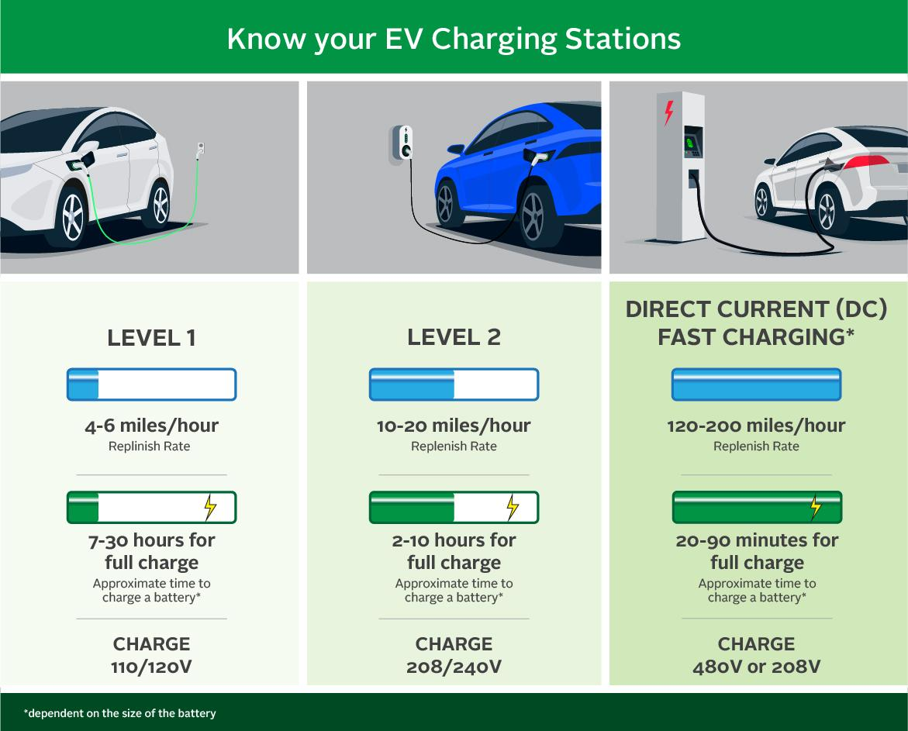

The world of investment is undergoing a rapid transformation as sustainability becomes a focal point for strategic decisions. The rising environmental consciousness and regulatory pressures are pushing investors to reconsider traditional portfolios, leading to an increased interest in sustainable avenues. Among these, electric vehicles (EVs) and green transportation stand out as pivotal areas. These sectors not only offer environmentally friendly alternatives to conventional transportation but also promise substantial financial returns due to their burgeoning market potential.

Electric vehicles are at the forefront of this transition. With zero-emission capabilities, they provide a means to significantly reduce the carbon footprint associated with transportation. Major advances in battery technology, coupled with a growing infrastructure for charging stations, have accelerated consumer adoption, thus creating robust investment opportunities. This shift has prompted both established automotive manufacturers and innovative startups to channel their resources into EV development, heralding a new era for the automotive industry.



Simultaneously, the dynamics of investment strategies are being reshaped by algorithmic trading, which introduces a sophisticated, tech-driven approach to managing assets in sustainable investments. Algorithmic trading utilizes advanced computational power and data analytics to enhance decision-making processes, allowing investors to efficiently navigate complex datasets and market conditions. By analyzing trends, managing risks, and executing trades with precision, algorithmic trading enhances the potential for optimizing investments in sectors like electric vehicles and green transportation.

This article investigates the convergence of green transportation, electric vehicles, and algorithmic trading, highlighting how these components interact to create a dynamic investment landscape. Understanding the synergies between these elements is crucial for investors aiming to capitalize on sustainable growth while managing risks in an ever-evolving market.

## Table of Contents

## The Rise of Green Transportation and Electric Vehicles

The global commitment to reducing carbon emissions has placed a significant emphasis on green transportation, with electric vehicles (EVs) at the forefront of this transformation. As concerns about climate change and air quality intensify, the transportation sector, which accounts for a substantial portion of global emissions, is undergoing a pivotal shift away from fossil fuel dependence towards more sustainable alternatives.

Electric vehicles are pivotal in this transition, providing zero-emission options that greatly reduce the carbon footprint compared to traditional internal combustion engine vehicles. EVs operate using electric motors powered by rechargeable battery packs, thereby emitting no tailpipe pollutants. This quality makes them not only environmentally friendly but also increasingly attractive to consumers and policy-makers dedicated to minimizing urban pollution.

Major automotive manufacturers, alongside innovative startups, are making significant investments in EV technology and the necessary infrastructure to support it. Established industry players like General Motors, Ford, and Volkswagen, have announced ambitious plans to electrify their vehicle line-ups. Simultaneously, newcomers such as Tesla and Rivian have positioned themselves as leaders through cutting-edge advancements and extensive charging networks.

The EV market is rapidly evolving, driven by notable advancements in battery technology, which is critical for extending vehicle range and reducing costs. From the development of lithium-ion batteries to exploring alternatives like solid-state batteries, these innovations are key in addressing the chief barriers to widespread EV adoption: range anxiety and affordability.

Consumer adoption of electric vehicles is steadily increasing, supported by various government incentives and mandates aimed at accelerating this shift. Initiatives such as tax credits, rebates, and stricter emission regulations across many countries enhance the attractiveness of EVs to a broader audience and underscore the global commitment to sustainable transportation.

In addition to regulatory support, the expanding network of charging stations and improvements in charging speed are further facilitating the transition. Companies and governments invest in fast-charging technologies and infrastructure development, ensuring that EV users have convenient and efficient access to charging facilities.

In conclusion, as the world intensifies its focus on reducing carbon emissions, electric vehicles stand as vital components of the future transportation paradigm. The combined efforts of technological advancement, substantial investments, and supportive policies are driving a remarkable transformation within the automotive industry, heralding a new era of environmentally sustainable mobility.

## Investment Opportunities in Electric Vehicles

Investment in the electric vehicle (EV) sector offers diverse opportunities across various components of the industry. With the increasing global emphasis on sustainability and reducing carbon emissions, the EV market is experiencing rapid growth, driven by both technological advancements and supportive government policies.

One primary investment avenue is directly investing in EV manufacturers. Companies like Tesla and Rivian are leading examples in this space, garnering significant attention for their innovation and strong market presence. These manufacturers are continuously enhancing their technological capabilities, producing vehicles that are not only environmentally friendly but also performance-driven. As the demand for EVs continues to rise, these companies are expected to expand their production capacities and explore new markets, potentially increasing their market share and profitability.

Beyond vehicle manufacturers, the EV sector comprises component manufacturers and infrastructure providers, which are integral to the industry’s growth. Battery production, in particular, represents a crucial segment, as efficient and affordable energy storage solutions are essential for the widespread adoption of electric vehicles. Companies that specialize in battery technology, such as Panasonic and CATL, have witnessed increased investor interest. Similarly, infrastructure providers, such as those developing charging stations, play a critical role in supporting the EV ecosystem. Investing in these companies offers exposure to the broader EV supply chain, potentially leading to substantial returns as the industry scales.

Exchange-Traded Funds (ETFs) focusing on electric vehicles provide another investment opportunity by offering diversified exposure to the sector. These ETFs typically consist of a basket of EV-related stocks, including vehicle manufacturers, battery producers, and charging infrastructure companies. Investing in ETFs can mitigate individual stock risks while taking advantage of the growth potential across the EV industry. Examples of such ETFs include the Global X Autonomous & Electric Vehicles [ETF](/wiki/etf-trading-strategies) (DRIV) and the iShares Self-Driving EV and Tech ETF (IDRV), which encompass a wide range of companies involved in the development and deployment of electric vehicles and related technologies.

The potential for growth in EV-related stocks is bolstered by ongoing technological innovations and favorable policy landscapes. Technological advancements, such as improvements in battery efficiency and autonomous driving capabilities, are poised to enhance the appeal and functionality of electric vehicles. Additionally, policies aimed at reducing carbon emissions, such as government incentives for EV purchases and investments in charging infrastructure, are expected to further catalyze market expansion. These supportive measures create a conducive environment for investors seeking to capitalize on the burgeoning EV market.

In conclusion, the electric vehicle sector presents a myriad of investment opportunities spanning manufacturers, component producers, and infrastructure developers. As the industry continues to evolve, driven by technological breakthroughs and regulatory incentives, investors can potentially achieve significant returns by strategically positioning themselves in this dynamic and rapidly expanding market.

## Algorithmic Trading and Its Impact on Green Investments

Algorithmic trading is increasingly influencing the landscape of green investments, particularly in the electric vehicles (EV) sector. This investment approach harnesses computational power and data analytics, enabling investors to optimize their decisions and navigate the complexities associated with sustainable investments.

One of the primary benefits of [algorithmic trading](/wiki/algorithmic-trading) in the EV sector is its capacity to manage the vast and complex datasets that inform sustainable investing. By leveraging advanced algorithms and [machine learning](/wiki/machine-learning) techniques, investors can process and analyze large volumes of financial and non-financial data, such as environmental, social, and governance ([ESG](/wiki/esg-investing)) metrics, consumer sentiment, and market trends. This data-driven approach aids in identifying potential investment opportunities and assessing the sustainability of various assets.

Algorithmic trading strategies can vary widely but generally include analyzing trends, managing risks, and efficiently executing orders in real-time. For instance, trend analysis algorithms evaluate historical price data and other relevant indicators to forecast future price movements. Such analysis can be particularly effective in the EV sector, where technology advancements and policy developments can lead to rapid and significant changes in market dynamics.

Risk management is another critical component of algorithmic trading, helping investors mitigate potential losses due to market [volatility](/wiki/volatility-trading-strategies) or unforeseen events. By employing sophisticated risk assessment models, algorithms can adjust investment portfolios dynamically, reallocating assets to maintain a desired risk level. This adaptability is crucial in the context of green transportation investments, where regulatory changes or technological breakthroughs can quickly impact asset values.

Moreover, algorithms excel in executing trades with speed and precision, a vital feature in volatile markets like that of green investments. High-frequency trading algorithms, for example, can execute a large number of orders in fractions of a second, allowing investors to capitalize on short-term market inefficiencies. This capability can be particularly advantageous in the EV sector, where news about technological innovations or policy changes can lead to rapid fluctuations in stock prices.

The use of algorithms ultimately enhances the ability to capitalize on the growth opportunities presented by the EV and green transportation sectors. As these industries continue to evolve, the integration of algorithmic trading can offer investors a competitive edge by improving decision-making processes and optimizing portfolio performance. By continuously analyzing market conditions and adapting strategies accordingly, investors can better position themselves to benefit from the ongoing transformation towards sustainable transportation solutions.

## Challenges and Considerations for Investors

Investors looking to capitalize on the burgeoning electric vehicle (EV) market must navigate a variety of challenges that can impact their investment returns. These hurdles include market volatility, regulatory uncertainties, supply chain issues, and a fiercely competitive landscape, all of which require strategic, informed decision-making, often leveraging modern tools such as algorithmic trading.

Market volatility and regulatory uncertainties are central concerns. The EV market, while promising, remains young and susceptible to fluctuations influenced by regulatory changes, including government incentives, environmental policies, and international trade agreements. Investors must vigilantly monitor these variables as they can substantially affect company valuations and market dynamics.

Supply chain considerations, particularly those associated with battery production and sourcing raw materials, pose significant challenges. Battery technology is the cornerstone of EV efficiency and range; thus, any supply interruptions can directly affect the production and profitability of EV manufacturers. Cobalt, lithium, and nickel, essential components of lithium-ion batteries, are often subject to supply constraints and geopolitical risks. These factors can lead to increased costs and impact investment returns. A sophisticated understanding of supply chain logistics and the global sourcing of these materials is crucial for investors looking to mitigate these risks.

The competitive landscape also demands investor attention. Established automotive giants like Ford, General Motors, and Volkswagen are increasingly committing resources to EV technology alongside startups like NIO and Lucid Motors. This influx of competitors necessitates a keen evaluation of each company's market position, technological advancements, and strategic partnerships.

Algorithmic trading can play a pivotal role in addressing these challenges. By leveraging algorithms to systematically analyze vast amounts of data, investors can optimize risk management and decision-making processes. Algorithmic strategies may include:

```python
import numpy as np
import pandas as pd
import matplotlib.pyplot as plt

# Sample algorithmic strategy for trend analysis
def calculate_moving_average(data, window_size):
    return data.rolling(window=window_size).mean()

def plot_moving_average(data, window_size):
    moving_average = calculate_moving_average(data['Close'], window_size)
    plt.figure(figsize=(12,6))
    plt.plot(data['Close'], label='Close Prices')
    plt.plot(moving_average, label=f'{window_size}-Day Moving Average', color='orange')
    plt.title('Stock Price and Moving Average')
    plt.legend()
    plt.show()

# Assuming df is a DataFrame with historical stock data
# plot_moving_average(df, 20)
```

Such tools facilitate trend analysis and enhance the precision of executing trades, even in highly volatile or competitive markets. By integrating algorithmic trading, investors can potentially improve their responsiveness to market shifts and better position themselves to capitalize on the opportunities within the EV sector.

Navigating the complexities of EV investments necessitates comprehensive risk management strategies and meticulous market analysis. As the industry evolves, maintaining adaptability and leveraging advanced technologies like algorithmic trading will be essential for maximizing returns and successfully confronting the challenges inherent to this dynamic market.

## Conclusion

Green transportation and electric vehicles (EVs) represent a significant opportunity for sustainable investment, driven by the urgent global need to reduce carbon emissions and transition to cleaner energy sources. As the emphasis on sustainability intensifies, the transportation sector stands at the forefront of this transformation, with electric vehicles leading the charge. These vehicles offer zero-emission alternatives to traditional combustion engines, benefiting both the environment and public health.

Algorithmic trading plays a pivotal role in enabling investors to manage the complexities associated with the EV sector. By leveraging computational power and data analytics, algorithmic trading facilitates the optimization of investment portfolios. This is particularly advantageous in the EV market, which is characterized by rapid technological advancements and evolving consumer preferences. Using algorithms, investors can efficiently analyze market trends, assess risks, and execute trades with precision, thus enhancing their ability to capitalize on emerging opportunities within the green transportation sector.

The potential for growth and returns in EV investments remains robust, thanks to ongoing technological advancements and supportive regulatory frameworks. Innovations in battery technology, such as increased energy density and reduced charging times, continue to improve EV performance and appeal. Furthermore, government incentives and regulations aimed at reducing carbon footprints foster an environment conducive to the adoption and proliferation of electric vehicles.

Investors should stay informed about the latest developments in the EV industry and consider integrating new technologies, such as algorithmic trading, into their investment strategies. By doing so, they can effectively navigate the ever-evolving landscape and maximize returns. As the global transition to sustainable transportation accelerates, informed and technologically adept investors are well-positioned to reap substantial rewards from their investments in electric vehicles and green transportation.

## References & Further Reading

[1]: ["Global EV Outlook 2022"](https://www.iea.org/reports/global-ev-outlook-2022) by the International Energy Agency

[2]: Castellanos, S., & Walker, J. (2020). ["Electric Vehicles: Literature Review of Technology Costs and Carbon Emissions."](https://www.researchgate.net/publication/305492926_Electric_vehicles_Literature_review_of_technology_costs_and_carbon_emissions) The International Council on Clean Transportation.

[3]: ["Advances in Financial Machine Learning"](https://www.amazon.com/Advances-Financial-Machine-Learning-Marcos/dp/1119482089) by Marcos Lopez de Prado

[4]: ["Machine Learning for Algorithmic Trading"](https://github.com/stefan-jansen/machine-learning-for-trading) by Stefan Jansen

[5]: ["BNEF Electric Vehicle Outlook 2023"](https://assets.bbhub.io/professional/sites/24/2431510_BNEFElectricVehicleOutlook2023_ExecSummary.pdf) by Bloomberg New Energy Finance

[6]: ["The Innovation and Adoption of Electric Vehicles: Insights from Patent Data Analysis"](https://www.sciencedirect.com/science/article/pii/S095965261934781X) by Xiaolan Fu, et al. Economic Research-Ekonomska Istraživanja, 2018.