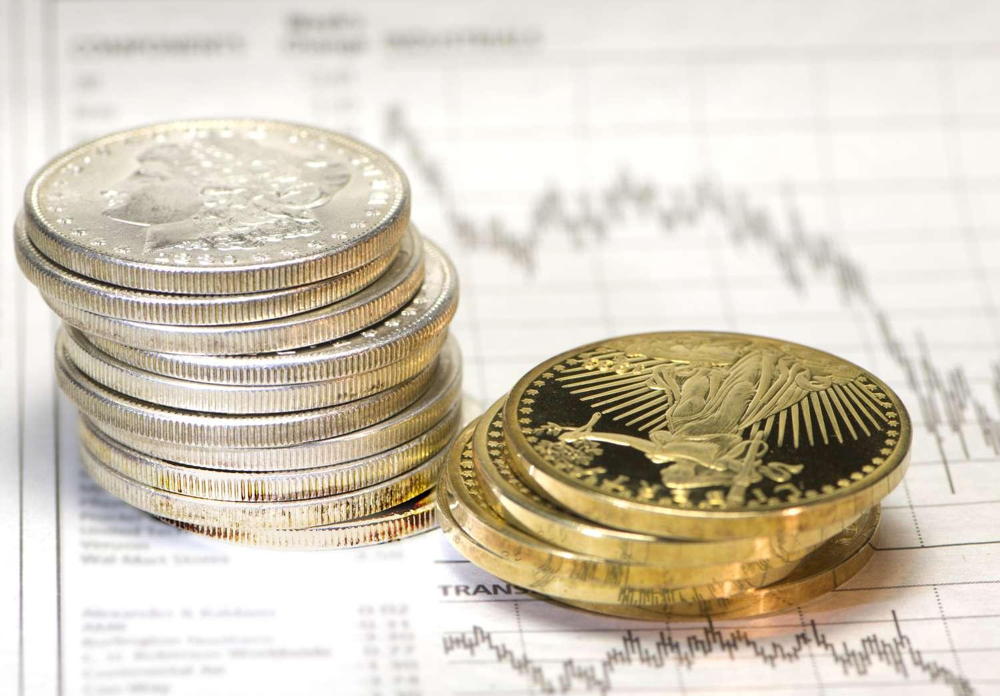

Precious metals, notably silver and gold, have served as foundational investment assets owing to their intrinsic properties and historical significance. These metals have been utilized as currency and symbols of wealth across various civilizations due to their intrinsic value, limited supply, and physical durability. Unlike fiat currencies, which can be subject to inflationary pressures and governmental policy changes, silver and gold possess inherent stability that appeals to investors seeking long-term security.

In the context of economic uncertainty, investors frequently turn to precious metals as a way to hedge against market fluctuations and inflation. Economic data demonstrates that during periods of heightened financial instability, metals such as gold often witness increased demand, driving their prices upward. This behavior underscores their role as a protective asset that offers diversification benefits and acts as a counterbalance to traditional investment vehicles like stocks and bonds, which can be more volatile.



The advent of technology has revolutionized the investment landscape with algorithmic trading gaining traction among traders in precious metals. Algorithmic trading involves the use of advanced computational methods to automatically evaluate and execute trades based on predefined market parameters and data patterns. This approach allows traders to capitalize on market opportunities with speed and precision that human interventions cannot match. Incorporating precious metals into algorithmic trading strategies can provide portfolio diversification benefits and risk mitigation in times of market stress.

This article will explore various investment options for silver and gold while analyzing how these assets can be integrated into sophisticated algorithmic trading strategies. It will further investigate how algorithmic systems leverage historical data and predictive analytics to optimize trading decisions in the precious metals markets. Through this exploration, we will outline the ever-evolving relationship between time-tested investment metals and cutting-edge trading technologies.

## Table of Contents

## Understanding Silver and Gold as Investments

Silver and gold have served as trusted mediums of exchange and stores of value for centuries, owing to their intrinsic properties and historical significance. Gold, prized for its rarity and malleability, was utilized in ancient coinage and remains a symbol of wealth and prosperity. Similarly, silver has been used extensively in coinage, jewelry, and industrial applications, further cementing its status as a dependable asset.

One of the key characteristics of precious metals like silver and gold is their low correlation with traditional financial markets. This unique trait renders them appealing to investors during periods of economic uncertainty and market volatility. For instance, when equities exhibit negative returns, precious metals often maintain or increase in value, thereby offering investors a measure of stability. This inverse relationship can be mathematically expressed through the concept of correlation coefficients, where a coefficient close to zero indicates little to no correlation with broad market indices.

Investors have various avenues to gain exposure to silver and gold. Physical ownership remains a profoundly personal and tangible form of investment, with many opting to purchase coins, bars, or bullion. However, physically holding these metals requires careful consideration of storage and security, as their physical possession presents logistical challenges and potential risks.

In response to these considerations, financial products have been developed to facilitate more accessible investment in precious metals. Exchange-traded funds (ETFs) and mutual funds provide indirect ownership without the need for physical storage. These funds often track the price movements of silver and gold, enabling investors to participate in the precious metals market with relative ease.

For those seeking more sophisticated investment strategies, futures contracts and options present viable alternatives. These derivatives offer leverage, allowing investors to speculate on the future price movements of silver and gold. However, such financial instruments require a nuanced understanding of market dynamics and can entail significant risk due to price [volatility](/wiki/volatility-trading-strategies) and the complex interplay of supply and demand factors.

In summary, silver and gold continue to be integral components of diversified investment portfolios. Their historical role as both currency and store of wealth, combined with their low market correlation, makes them valuable assets during economic downturns. Whether through physical ownership or financial derivatives, investors have an array of options to capitalize on the unique benefits of these precious metals.

## Investment Vehicles for Silver and Gold

Investment in silver and gold can be approached through several vehicles, each offering distinct advantages and risks. Physical ownership is the most direct method, involving the purchase of bullion, coins, or bars. This approach allows investors to hold tangible assets, providing a sense of security and ownership. However, it also necessitates considerations of storage and security, as physical metals require safe-keeping to prevent theft or loss.

For those seeking exposure to silver and gold without the need to manage physical holdings, Exchange-Traded Funds (ETFs) and mutual funds are popular options. ETFs like SPDR Gold Shares (GLD) or iShares Silver Trust (SLV) enable investors to buy shares that represent ownership in gold or silver assets held by the fund. This method offers convenience by eliminating the need for storage, while also providing [liquidity](/wiki/liquidity-risk-premium) as these shares can be traded on various stock exchanges. Mutual funds further diversify investments by pooling money from multiple investors to buy a portfolio of precious metals-related assets, including mining stocks and commodity-backed securities.

More sophisticated investors might explore futures and options, which are financial derivatives that offer leveraged exposure to silver and gold prices. Futures contracts obligate the buyer to purchase a specific quantity of gold or silver at a predetermined price on a set future date. This can provide substantial potential gains, as only a margin is required to enter the contract. However, the leverage involved also amplifies risk, necessitating a robust understanding of market dynamics. Options, on the other hand, grant the holder the right, but not the obligation, to buy or sell metal at a specified price before expiry. This flexibility can be advantageous in volatile markets, though it requires precise market predictions and a comprehension of options pricing models.

In summary, silver and gold investment vehicles range from tangible physical ownership to complex financial instruments. Each option presents unique features that cater to different investment strategies and risk appetites. Investors should carefully evaluate these vehicles to align their choices with individual goals and expertise levels.

## What is Algorithmic Trading?

Algorithmic trading, also known as automated trading or algo trading, employs computer algorithms to execute trades based on predefined rules and criteria. These algorithms enable traders to process a vast array of market data rapidly, making trading decisions that might be difficult for humans due to the sheer [volume](/wiki/volume-trading-strategy) of information and the speed at which market conditions change.

One of the critical advantages of [algorithmic trading](/wiki/algorithmic-trading) is its ability to analyze market conditions swiftly and efficiently, enabling traders to capitalize on market opportunities as they arise. This is achieved through the deployment of algorithms that can be programmed to identify patterns, predict price movements, and execute trades at the optimal time. The strategies can range from simple moving averages to complex [machine learning](/wiki/machine-learning) models that adapt to changing market dynamics.

In mathematical terms, algorithmic trading often involves optimization problems where the objective is to maximize returns while minimizing risk. For example, an algorithm might look to solve the problem:

$$
\max \left( \sum_{t=0}^{T} r_t x_t \right)
$$

Subject to:

$$
\sum_{t=0}^{T} \sigma_t^2 x_t^2 \leq R
$$

Where:
- $r_t$ is the return at time $t$,
- $x_t$ is the quantity of the asset to trade at time $t$,
- $\sigma_t^2$ is the variance of the asset's return,
- $R$ is the acceptable risk level.

Precious metals like gold and silver are becoming increasingly popular in algorithmic trading strategies due to their unique market characteristics, such as acting as safe havens in times of economic uncertainty. Their behavior is often less correlated with traditional equity markets, providing diversification benefits. This unique attribute makes them particularly attractive for algorithms designed to hedge against market volatility and inflation.

Algorithmic trading systems for precious metals can include various components like market data feeds, analytical engines, and execution systems. A typical setup might involve the following Python snippet to demonstrate a simple moving average crossover strategy for gold futures:

```python
import pandas as pd

# Load historical data for gold prices
data = pd.read_csv('gold_futures.csv')

# Calculate moving averages
data['SMA50'] = data['Close'].rolling(window=50).mean()
data['SMA200'] = data['Close'].rolling(window=200).mean()

# Generate buy/sell signals
data['Signal'] = 0
data.loc[data['SMA50'] > data['SMA200'], 'Signal'] = 1
data.loc[data['SMA50'] < data['SMA200'], 'Signal'] = -1

# Execute trades based on signals
for index, row in data.iterrows():
    if row['Signal'] == 1:  # Buy signal
        # Execute buy order
        pass
    elif row['Signal'] == -1:  # Sell signal
        # Execute sell order
        pass
```

The growth of algorithmic trading is supported by advances in technology, including high-frequency trading platforms and predictive analytics powered by machine learning. These innovations continue to refine how precious metals are traded, enhancing the potential for profit while offering robust risk management solutions. As with any investment strategy, traders must consider the inherent risks and ensure compliance with relevant regulations.

## Integrating Precious Metals into Algorithmic Trading

Algorithmic trading strategies often incorporate precious metals like gold and silver to diversify investment portfolios and hedge against market uncertainties. These metals are historically considered safe havens, particularly during periods of economic stress or market instability. This makes them attractive assets for algorithms seeking to minimize risk and optimize returns.

Gold and silver's low correlation with traditional equity and bond markets adds a stabilizing element to an algorithmic trading strategy. During times of market turbulence, these metals tend to retain or even increase in value, providing a hedge against losses in other asset classes. This characteristic is particularly important for algorithms designed to preserve capital while maximizing growth.

Advanced algorithmic trading systems utilize historical price data, predictive analytics, and current market sentiment to generate trading signals. These systems typically consist of multiple modules that analyze vast datasets to identify optimal entry and [exit](/wiki/exit-strategy) points for trades. Here, machine learning techniques can be employed to improve the accuracy of predictions by detecting complex patterns within the data.

For instance, a simple algorithmic strategy might employ a moving average crossover system. The algorithm could be programmed in Python to automatically buy or sell gold or silver based on short-term and long-term moving averages:

```python
import numpy as np
import pandas as pd

# Sample DataFrame for historical price data
data = pd.DataFrame({'Gold': [2000, 2050, 2100, ...],  # hypothetical prices
                     'Silver': [25, 26, 27, ...]})

short_window = 40
long_window = 100

signals = pd.DataFrame(index=data.index)
signals['signal'] = 0.0

signals['short_mavg'] = data['Gold'].rolling(window=short_window, min_periods=1, center=False).mean()
signals['long_mavg'] = data['Gold'].rolling(window=long_window, min_periods=1, center=False).mean()

signals['signal'][short_window:] = np.where(signals['short_mavg'][short_window:] > signals['long_mavg'][short_window:], 1.0, 0.0)
signals['positions'] = signals['signal'].diff()
```

In this example, the algorithm generates a 'buy' signal when the short-term moving average surpasses the long-term moving average, indicating upward [momentum](/wiki/momentum) in gold's price.

Predictive analytics play a crucial role by incorporating various indicators such as interest rates, inflation data, and geopolitical events, which can influence precious metals' prices. Furthermore, sentiment analysis derived from news articles, social media, and expert opinions can provide additional insights into market behavior, enabling algorithms to adapt dynamically.

While integrating precious metals into algorithmic trading offers advantages like diversification and risk mitigation, it also requires careful consideration of trading costs, market impact, and technical infrastructure. Traders must ensure that their systems are robust enough to handle the complexities of the precious metals markets and capable of executing trades with precision.

## Challenges and Considerations

Investing in precious metals such as silver and gold presents unique challenges and considerations, particularly in terms of liquidity, storage, security, and algorithmic trading complexities.

**Liquidity Concerns**

Liquidity in the context of precious metals refers to the ease with which these assets can be bought or sold without causing a significant impact on their price. Physical metals often have lower liquidity compared to stocks or bonds, as the transaction process involves additional steps such as finding a buyer, handling physical delivery, and verifying authenticity. Bullion coins and bars typically have higher liquidity than collectibles, due to standardized recognition and valuation.

**Storage and Security**

For those investing in physical metals, secure storage is a critical concern to prevent theft or loss. Options include private home safes, bank safety deposit boxes, or specialized vault services. Each storage option has its own trade-offs in terms of cost, insurance, and accessibility. Investors must balance the security of their holdings with the associated expenses, as secure storage tends to incur ongoing costs.

**Algorithmic Trading Systems**

Algorithmic trading in precious metals necessitates robust computational infrastructure capable of processing real-time market data and executing trades swiftly. Effective systems require advanced algorithms that can interpret complex market signals, historical data, and predictive analytics. A typical algorithm might consider price movement trends, volume changes, and global economic indicators to execute buy or sell decisions. Below is a simplified Python example to illustrate the logic behind an algorithm:

```python
def should_trade(price, volume, market_trend):
    threshold_price = 1000  # Hypothetical threshold
    threshold_volume = 500  # Hypothetical volume threshold

    if price < threshold_price and volume > threshold_volume and market_trend == "bullish":
        return "Buy"
    elif price > threshold_price and volume < threshold_volume and market_trend == "bearish":
        return "Sell"
    return "Hold"

price = 950
volume = 600
market_trend = "bullish"

decision = should_trade(price, volume, market_trend)
print("Trading Decision:", decision)
```

**Regulatory and Market Volatility**

Regulation significantly influences both physical investments and algorithmic trading strategies for precious metals. Compliance with financial regulations ensures market stability but can also impose constraints on trading practices and access to certain markets. Algorithmic traders must remain apprised of regulatory changes to avoid penalties and ensure strategic alignment with legal frameworks.

Market volatility adds another layer of complexity, affecting prices of metals and potentially leading to rapid algorithmic trading decisions. Sudden shifts in economic policies, geopolitical tensions, or changes in market sentiment can induce price fluctuations, necessitating adaptable and robust trading algorithms to mitigate risks.

Investors should be equipped with a comprehensive understanding of these challenges, balancing the benefits of investing in precious metals with the associated risks, and should consider seeking professional guidance to navigate the complexities effectively.

## Conclusion

Silver and gold have long been recognized as essential components in diversified investment portfolios due to their historical ability to preserve wealth and provide stability during times of economic uncertainty. Their low correlation with traditional financial markets has made them appealing to investors seeking a hedge against volatility and inflation. In light of technological advancements, algorithmic trading offers a modern approach to investing in these metals, enhancing both speed and efficiency.

Algorithmic trading, characterized by the use of computer algorithms to automate trade executions, allows for rapid response to market conditions. This capability can optimize investment strategies involving silver and gold, providing insights derived from historical data and market sentiment. The automation can efficiently handle large volumes of trades and minimize human error, thus appealing to investors looking to capitalize on market trends swiftly.

However, integrating precious metals into algorithmic trading strategies is not without challenges. Investors must carefully evaluate factors such as liquidity, storage, and security, especially in physical metal holdings. Moreover, trading algorithms require robust systems capable of processing real-time market data and executing trades with precision. Regulation and market volatility are additional factors that can impact the effectiveness of both physical investments and algorithmic trading strategies.

Investors contemplating the integration of silver and gold into algorithmic trading should weigh the inherent benefits and potential risks. It is prudent to seek professional guidance to navigate the complexities of algorithmic trading and ensure that investment strategies align with individual financial goals. By doing so, investors can harness the historical resilience of precious metals while leveraging the advantages of modern trading technologies.

## References & Further Reading

[1]: Baur, D. G., & McDermott, T. K. (2010). ["Is gold a safe haven? International evidence."](https://www.sciencedirect.com/science/article/pii/S0378426609003343) Journal of Banking & Finance, 34(8), 1886-1898.

[2]: Chan, E. P. (2009). ["Quantitative Trading: How to Build Your Own Algorithmic Trading Business."](https://github.com/ftvision/quant_trading_echan_book) Wiley.

[3]: Johnson, L. L. (2020). ["Algorithmic Trading & DMA: An Introduction to Direct Access Trading Strategies."](https://www.goodreads.com/book/show/7346602-algorithmic-trading-and-dma) 4th Edition,  Harriman House.

[4]: Jansen, S. (2020). ["Machine Learning for Algorithmic Trading."](https://github.com/stefan-jansen/machine-learning-for-trading) 2nd Edition, Packt Publishing.

[5]: Baur, D. G. (2013). ["The drachma since the crisis."](https://link.springer.com/content/pdf/10.1007/s00181-013-0787-1.pdf) The European Journal of Finance, 19(4), 327-337.

[6]: Aronson, D. R. (2007). ["Evidence-Based Technical Analysis: Applying the Scientific Method and Statistical Inference to Trading Signals."](https://www.amazon.com/Evidence-Based-Technical-Analysis-Scientific-Statistical/dp/0470008741) Wiley.

[7]: de Prado, M. L. (2018). ["Advances in Financial Machine Learning."](https://www.amazon.com/Advances-Financial-Machine-Learning-Marcos/dp/1119482089) Wiley.

[8]: Liang, B. (1999). ["On the performance of hedge funds."](https://www.tandfonline.com/doi/abs/10.2469/faj.v55.n4.2287) Financial Analysts Journal, 55(4), 72-85.