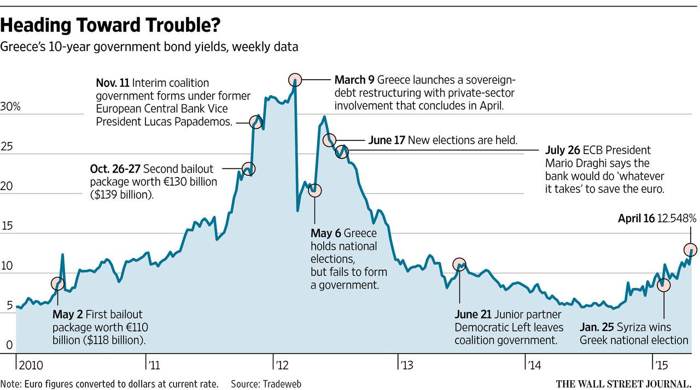

Investing in Greek bonds presents an intriguing avenue for diversifying a portfolio with fixed-income securities. These bonds offer a distinctive blend of opportunities and challenges that cater to investors seeking stable returns amidst Greece's evolving economic landscape. As the country's economy continues its recovery, potential opportunities in the Greek bond market may emerge, providing attractive options for investors.

This article aims to guide readers through the essentials of Greek bonds, examining both their benefits and inherent risks. It will explore how Greece's improving market conditions can impact bond investments, highlighting the potential for capital gains as the economic fortitude of the nation strengthens. Additionally, this guide will introduce the influence of algorithmic trading, an increasingly significant factor in modern financial markets, particularly within the bond sector. Algorithmic strategies promise enhancements in trading efficiency, speed, and accuracy, possibly offering new ways to manage risk and optimize returns for Greek bonds.



Whether Greek bonds should form part of an individual's investment strategy requires a comprehensive evaluation of market dynamics, risk tolerance, and investment goals. This guide aims to equip investors with crucial insights into the Greek bond market, allowing for informed decision-making in pursuit of potentially rewarding investments.

## Table of Contents

## Understanding Greek Bonds

Greek government bonds are debt securities issued by the Hellenic Republic to raise funds for government expenditure. These bonds are denominated in euros and have terms that define how interest is paid and principal is reimbursed at maturity. The issuance of Greek bonds is managed by the Public Debt Management Agency (PDMA). 

Following the severe economic crisis that peaked in the early 2010s, Greece underwent a series of financial reforms and restructuring, leading to a rebounding economy that has revitalized interest in its bonds. The improving economic conditions in Greece have enhanced the attractiveness of Greek bonds for investors seeking to diversify their portfolios. Stability in fiscal policy coupled with economic growth has resulted in better credit ratings over time, although these remain lower than those of many other European countries.

Greek bonds typically come in several forms, including Treasury bills, medium-term notes, and longer-term government bonds. Treasury bills have maturities of less than a year and are issued at a discount to their face value, paying no interest but delivering returns upon maturing equal to their nominal value. Medium-term and long-term bonds offer fixed or floating interest payments, known as coupon payments, distributed annually or semi-annually until maturity, at which point the bond's principal is repaid in full.

A crucial element in the investment strategy for Greek bonds involves understanding the diverse instruments available and their associated payout structures. Fixed-rate bonds offer predictable income streams, as their interest payments are not affected by fluctuations in market interest rates. Floating-rate bonds, however, have variable interest payments that adjust in relation to benchmark interest rates, which can provide a hedge against inflation and [interest rate](/wiki/interest-rate-trading-strategies) changes.

Considering investment in Greek bonds requires an understanding of the underlying economic indicators and fiscal policies influencing the Greek market. Investors should assess macroeconomic data such as GDP growth, budget deficits, and public debt levels to gauge the government's ability to meet its debt obligations. Enhanced investor confidence, due to Greece's improved fiscal prudence, has generally led to lower yields on Greek bonds compared to the yields observed during its crisis period. However, yields often remain higher than those of certain other European nations, reflecting the residual risk perceived by investors.

In summary, Greek government bonds provide a means for investors to engage with an economy that is recuperating from past crises, offering instruments with varying maturity lengths and interest payout methodologies. Fully understanding the types and structures of Greek bonds is fundamental for making informed investment decisions and assessing the potential risks and rewards these securities might offer.

## Why Invest in Greek Bonds?

Greek bonds have emerged as an attractive investment option for those seeking potentially stable returns, despite historical challenges. As Greece continues to strengthen its economic position, the prospects for capital gains have risen, making these bonds a compelling choice for investors looking to diversify their portfolios. Several factors contribute to the appeal of Greek bonds:

### Economic Recovery and Capital Gains

Greece has been recovering from past financial crises with substantial structural reforms and fiscal adjustments. This economic recuperation has positively influenced the Greek bond market. As the economy stabilizes and grows, bond prices may appreciate, providing investors with capital gains. The positive correlation between a country's economic health and its bond market underscores the potential benefits of investing in a recovering economy like Greece.

### Higher Yields

One of the most significant attractions of Greek bonds is their historically higher yields compared to many other European bonds. This yield differential makes Greek bonds an enticing option for yield-hungry investors. For instance, when European Central Bank policies lead to lower yields in other eurozone countries, Greek bonds often stand out for their lucrative interest payments.

### Strategic Geographic Location

Greece's strategic location at the crossroads of Europe, Asia, and Africa provides unique economic opportunities. This advantageous position facilitates trade, tourism, and other economic activities that can bolster the country's economic outlook and, by extension, its bond market. Investors can leverage these geographical advantages as part of a broader investment strategy focused on growth sectors linked to Greece's location.

### Impact of Credit Ratings

Credit ratings significantly influence bond market dynamics by affecting investor confidence and bond pricing. In recent years, Greece has experienced upgrades in its credit ratings by major agencies like Moody's, Fitch, and Standard & Poor's, reflecting its improving fiscal health and decreasing risk of default. Improved credit ratings reduce borrowing costs for the government and can lead to appreciation in bond prices as the perceived risk diminishes, making Greek bonds more attractive to a broader range of investors.

In summary, Greek bonds present a compelling investment proposition due to the potential for stable returns supported by stronger economic fundamentals, higher yields, Greece's strategic location, and improving credit ratings. While these factors increase the attractiveness of Greek bonds, investors should remain cognizant of associated risks and continue to monitor Greece's economic situation for informed decision-making.

## Risks Associated with Greek Bonds

Greek bonds, like any investment, come with inherent risks that investors need to carefully evaluate. One primary concern is the potential for default, which is the risk that the Greek government might not fulfill its debt obligations. This risk is more pronounced compared to some other European nations due to Greece's history of financial crises. Although Greece has shown signs of economic recovery, its sovereign credit rating remains lower than many of its European counterparts. This lower credit rating reflects the lingering skepticism of credit agencies and investors regarding Greece’s fiscal discipline and economic resilience.

Interest rate risk is another significant [factor](/wiki/factor-investing) for bond investors. Greek bond values are sensitive to fluctuations in interest rates. When interest rates rise, existing bonds with lower coupon rates become less attractive, leading to a decline in their market value. Conversely, if interest rates fall, these bonds may appreciate in value. Investors need to consider current and projected macroeconomic trends, which can influence interest rate trajectories and subsequently impact bond valuations and future yield predictions.

Political and economic instability also poses a risk to Greek bonds. Greece's political landscape can be volatile, and sudden changes in government or policy can adversely affect investor confidence. Economic instability, whether from domestic challenges or broader European dynamics, could lead to increased market [volatility](/wiki/volatility-trading-strategies), affecting the price and attractiveness of Greek bonds.

Investors must weigh these risks against their investment objectives and risk tolerance levels. It is crucial for potential investors to stay informed about Greece's political and economic developments, as these factors can have immediate and long-term impacts on bond market conditions. By aligning their investment strategy with a thorough understanding of these risks, investors can make more informed decisions and potentially mitigate adverse outcomes.

## Algorithmic Trading in Bonds

Algorithmic trading involves the use of complex mathematical and statistical models to automate trading decisions. This approach is revolutionizing the bond market by significantly enhancing efficiency, speed, and accuracy. In the context of Greek bonds, [algorithmic trading](/wiki/algorithmic-trading) can be particularly beneficial, given the evolving nature of Greece's financial landscape.

### Efficiency and Speed in Algo Trading

Incorporating algorithmic trading in the bond market facilitates rapid execution of trades, a critical advantage when dealing with large volumes of data and volatile market conditions. Algorithms can process information from multiple sources in real-time, allowing traders to capitalize on market opportunities that would be difficult to exploit manually. Efficient execution minimizes transaction costs and ensures favorable pricing.

### Main Strategies in Bond Trading

Several algorithmic trading strategies are applicable to the bond market, including Greek bonds:

1. **Mean Reversion**: This strategy assumes that bond prices will revert to their historical mean over time. By analyzing past price data, algorithms can predict when a bond is undervalued or overvalued, triggering buy or sell orders accordingly.

2. **Momentum Trading**: This approach capitalizes on existing market trends. Algorithms detect trends based on price movements and trading volumes, engaging in trades that follow the current momentum until indicators suggest a reversal.

3. **Arbitrage**: Bond arbitrage strategies involve exploiting price discrepancies between different bond markets or between bonds and their derivative instruments. Algorithms identify and execute arbitrage opportunities at speeds unattainable by human traders.

### Risk Management and Optimization

Algorithmic trading offers sophisticated tools for managing risk and optimizing returns on Greek bonds. Risk management models within algorithms factor in credit risk, interest rate changes, and Greece’s economic indicators to minimize potential losses. Moreover, algorithms can diversify bond portfolios based on risk assessments, enhancing stability of returns.

For example, algorithms can utilize the following Python code snippet to calculate and adjust a bond portfolio’s risk based on value-at-risk (VaR) metrics:

```python
import numpy as np

def calculate_var(portfolio_returns, confidence_level=0.95):
    sorted_returns = np.sort(portfolio_returns)
    index = int((1-confidence_level) * len(sorted_returns))
    return sorted_returns[index]

# Example portfolio returns
portfolio_returns = np.random.normal(0.001, 0.02, 1000)  # Sample returns

# Calculate Value-at-Risk
var_95 = calculate_var(portfolio_returns, 0.95)
print(f"Value-at-Risk (95% confidence): {var_95:.4f}")
```

### Data and Technology

Successful algorithmic trading hinges on the seamless integration of data and technology. The use of big data analytics and [machine learning](/wiki/machine-learning) models enables the processing of vast amounts of data, such as economic indicators, interest rates, and market sentiments. High-frequency trading platforms and advanced computational resources ensure that algorithms can function at optimal efficiency, crucial for maneuvering within the Greek bond market.

In conclusion, the deployment of algorithmic trading strategies in Greek bonds can lead to substantial gains in trading performance. By leveraging advanced technologies and data-driven insights, traders can better navigate market complexities, thus potentially achieving augmented returns while effectively managing risk.

## How to Invest in Greek Bonds

Investing in Greek bonds requires careful planning and execution, often necessitating the use of a reputable brokerage or bank. The process begins with establishing an investment account through which transactions can be facilitated. This involves selecting a brokerage or financial institution with expertise in bond markets to ensure access to the necessary market insights and advice.

The minimum investment in Greek bonds is generally substantial, underscoring the need for significant capital outlay. Consequently, potential investors must assess their financial capacity and risk tolerance before proceeding. Beyond the initial capital requirements, the process of purchasing Greek bonds includes several key steps. Firstly, extensive research is crucial to understand the available bond options, current market conditions, and the specific characteristics of each bond issue. This can be complemented by consulting financial advisors who have specialized knowledge about Greece’s economic landscape and debt securities.

One notable aspect of investing in Greek bonds is the absence of Greek bond exchange-traded funds (ETFs). This absence highlights the importance of direct purchases in the bond market. Direct investments in bonds allow investors to tailor their portfolios more closely to their risk and return preferences, though they also require more effort in terms of market analysis and financial commitment.

Alternative investment strategies may also be considered, particularly through hedge funds or capital markets, which can offer exposure to Greek bonds within a diversified portfolio. These strategies might provide mechanisms to access the Greek bond market indirectly, potentially offering the benefit of professional management and risk mitigation.

Overall, successful investment in Greek bonds demands thorough preparation, including account setup, detailed market research, professional consultation, and careful consideration of investment vehicles like direct purchases or alternative strategies. This approach will enable investors to navigate the complexities of the Greek bond market effectively.

## Conclusion

Greek bonds represent a unique opportunity for investors who are willing to accept higher risk in exchange for potentially higher returns. Historically, Greek bonds have shown the capacity for significant value appreciation as the country's economy has made strides toward stability and growth following its earlier financial crises. For investors, this suggests an alternative asset class that could enhance a diversified portfolio.

The possibility of integrating both traditional investment strategies with modern algorithmic trading methodologies can present exciting avenues for optimizing returns. Algorithmic trading, which utilizes advanced computational models and algorithms, can enhance decision-making by processing large datasets at high speeds, thereby improving trade execution in the bond market. With these capabilities, investors can effectively manage risk and potentially capitalize on market inefficiencies that might arise during Greece's economic recovery.

Successful investment in Greek bonds necessitates diligent research, thorough risk analysis, and professional advice. An investor's ability to navigate this market is greatly enhanced by a robust understanding of not only global market conditions but also Greece's specific economic indicators and fiscal policies. This knowledge aids in assessing both credit risk and potential interest rate impacts, which are crucial factors influencing bond yields and overall investment health.

Maintaining an informed outlook on Greece's economic status and corresponding bond market developments is crucial for investors seeking to manage their portfolios actively. As Greece continues to recover economically, it offers new investment opportunities that must be strategically approached to maximize returns while balancing associated risks. Investors should remain vigilant in monitoring changes in economic conditions, political stability, and international relations that might influence the dynamics of Greek bonds.

By staying attuned to these factors and employing a strategic approach, investors can potentially unlock new investment avenues as Greece's economy evolves, affirming Greek bonds as a potentially rewarding component of a diversified investment strategy.

## References & Further Reading

[1]: Nar, U., & Kucukkocaoglu, G. (2013). ["Sovereign Default Probability of Greece: A Financial and Macroeconomic Approach."](https://virtusinterpress.org/IMG/pdf/10-22495_rgcv6i1art6.pdf) Advances in Decision Sciences.

[2]: Boermans, M.A. (2018). ["Algorithmic Trading and Market Quality: Implications from the European Bond Markets."](https://www.cambridge.org/core/journals/journal-of-financial-and-quantitative-analysis/article/abs/algorithmic-trading-and-market-quality-international-evidence/4B96E916E3E13AFF1DF9B5FCC188F4E0) Research Gate.

[3]: Blommestein, H.J., & Keskinler, A. (2010). ["Public Debt Management and Bond Markets in the Post-Crisis Landscape."](https://papers.ssrn.com/sol3/cf_dev/AbsByAuth.cfm?per_id=584482) OECD Journal: Financial Market Trends.

[4]: Lopez de Prado, M. (2018). ["Advances in Financial Machine Learning."](https://www.amazon.com/Advances-Financial-Machine-Learning-Marcos/dp/1119482089) John Wiley & Sons.

[5]: Volz, U. (2013). ["Lessons of the European Crisis for Emerging Markets."](https://eprints.soas.ac.uk/16679/1/ASEAN%20Financial%20Integration%20in%20the%20Light%20of%20Recent%20European%20Experiences%2012May2013.pdf) European Financial Review.