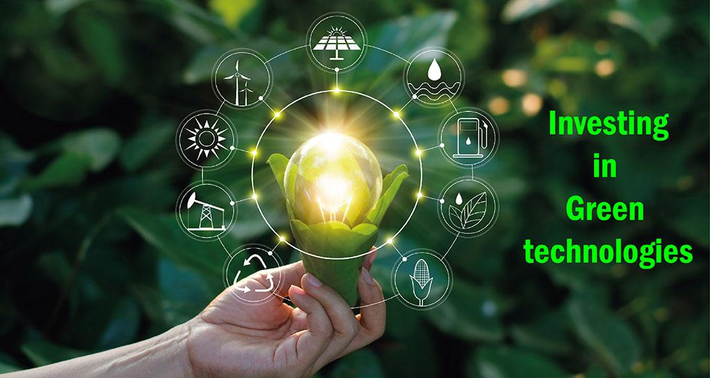

## Table of Contents

## What is green technology?

Green technology, also known as clean technology, is about using science and technology to help the environment. It includes things like using renewable energy sources, like wind or solar power, instead of fossil fuels that harm the environment. Green technology also focuses on reducing waste and pollution, and making products that are better for the planet.

One example of green technology is electric cars. Instead of using gasoline, which pollutes the air, electric cars run on electricity from batteries. These batteries can be charged using clean energy sources. Another example is energy-efficient appliances, like refrigerators or washing machines, that use less electricity and help save energy. By using green technology, we can help protect the environment and make our world a better place to live.

## Why is investing in green technology important?

Investing in green technology is important because it helps protect our planet. When we use green technology, we reduce pollution and waste. This means cleaner air and water for everyone. It also helps slow down climate change, which can cause big problems like melting ice caps and extreme weather. By investing in green technology, we are making sure that the Earth stays a nice place to live for us and for future generations.

Another reason to invest in green technology is that it can create new jobs and help the economy. When companies make green products, like solar panels or electric cars, they need workers to design, build, and sell them. This can lead to more jobs in communities. Also, using green technology can save money in the long run. For example, energy-efficient appliances use less electricity, so people pay less on their bills. This can help families and businesses save money over time.

Overall, investing in green technology is a smart choice. It's good for the environment, it creates jobs, and it can save money. By supporting green technology, we can make the world a better place for everyone.

## What are the different types of green technology investments?

Green technology investments can be divided into several types. One type is renewable energy, like solar, wind, and hydro power. These technologies use natural resources to create electricity without harming the environment. Another type is energy efficiency, which includes things like better insulation for buildings, energy-saving light bulbs, and smart thermostats. These help reduce the amount of energy we use, which is good for the planet and our wallets. A third type is waste management, which involves technologies that help us recycle more and produce less trash, like composting systems and recycling plants.

Another important type of green technology investment is in sustainable transportation. This includes electric cars, bikes, and public transit systems that run on clean energy. These options help reduce air pollution from traditional vehicles. Additionally, there are investments in green building materials and practices, which focus on using eco-friendly materials and designs that make buildings more energy-efficient and less harmful to the environment. For example, using bamboo instead of wood or installing green roofs that help with insulation and air quality.

Lastly, investments can also be made in clean water technology, which includes systems for purifying water and managing water resources more effectively. This is crucial for ensuring that we have enough clean water for everyone. There are also investments in sustainable agriculture, which involves farming methods that protect the soil and use fewer harmful chemicals. By investing in these different types of green technology, we can help make the world a better and more sustainable place to live.

## How can beginners start investing in green technology?

Beginners can start investing in green technology by first learning about the different types of green tech, like solar energy, electric cars, and energy-efficient appliances. You can find a lot of information online or in [books](/wiki/algo-trading-books) about these topics. Once you know more about green technology, you can start looking for companies that work in these areas. Many big companies have green technology divisions, and there are also smaller companies that focus only on green tech. You can buy stocks in these companies, which means you own a small part of them. This is a way to support green technology and maybe make some money if the companies do well.

Another way to invest in green technology is through green mutual funds or exchange-traded funds (ETFs). These are groups of stocks that are managed by professionals, and they focus on companies that are good for the environment. By buying into these funds, you can spread your money across many different green companies, which can be less risky than buying stocks in just one company. You can open an account with a broker or an online investment platform to buy these funds. It's a good idea to start with a small amount of money and learn as you go. Remember, investing always has some risk, so it's important to do your research and maybe talk to a financial advisor before you start.

## What are the risks associated with green technology investments?

Investing in green technology can be risky because it's a new and growing field. Sometimes, companies that make green products or use green energy can have a hard time making money. This can happen because the technology is new and expensive, or because people might not want to buy green products if they cost more than other options. Also, the government can change rules about green technology, which can affect how much money these companies make. If a company doesn't do well, the value of its stock can go down, and you could lose money.

Another risk is that green technology can be affected by changes in the economy. If the economy is not doing well, people and businesses might not want to spend money on new green technologies. This can make it hard for green companies to grow and make money. Also, some green technologies need a lot of money to get started, and if they don't get enough investment, they might fail. It's important to think about these risks and do a lot of research before you decide to invest in green technology.

## How do government policies affect green technology investments?

Government policies can have a big impact on green technology investments. When governments make rules that support green technology, like giving tax breaks or subsidies to companies that make solar panels or electric cars, it can make it easier for these companies to grow and make money. This can attract more investors because they see that the government is helping the green tech industry. On the other hand, if the government changes these rules or takes away support, it can make it harder for green tech companies to succeed. This can scare away investors who are worried about losing money.

Also, governments can set goals for reducing pollution or using more renewable energy. These goals can create a bigger demand for green technology, which is good for companies that make these products. For example, if a government says that all new cars have to be electric by a certain year, it can make more people want to buy electric cars. This can help green tech companies grow and make more money. But if the government doesn't set these goals or changes them a lot, it can make it hard for investors to know what will happen in the future, and they might not want to invest in green technology.

## What are some successful green technology companies to consider for investment?

One successful green technology company to consider for investment is Tesla. Tesla makes electric cars that don't use gasoline, which is good for the environment. They also make batteries and solar panels, which help people use clean energy at home. Tesla has been growing a lot and many people believe in their mission to help the planet. Another company to look at is NextEra Energy, which is a big company that makes a lot of its electricity from wind and solar power. They are a leader in renewable energy and have been doing well for a long time.

Another good green technology company is Vestas, which makes wind turbines. Wind turbines use the wind to make electricity, which is a clean way to make power. Vestas is one of the biggest companies in the world that makes wind turbines, and they are working on making them even better. Also, you might want to look at Orsted, a company that used to make energy from coal and gas but now focuses on wind power. They have been successful in changing their business to be more green, and they are doing well in the renewable energy market.

## How can investors assess the potential return on investment in green technology?

Investors can assess the potential return on investment in green technology by looking at how well the company is doing and how much money it is making. They can check the company's financial reports to see if it is growing and making profits. It's also important to look at how much the company is spending on research and development, because green technology companies often need to keep improving their products to stay competitive. Another thing to consider is how much demand there is for the company's products. If more people want to use green technology, like solar panels or electric cars, the company is likely to do well.

Investors should also think about government policies and how they might affect the company. If the government is helping green technology with tax breaks or subsidies, it can make the company more likely to succeed. On the other hand, if the government changes its rules, it could hurt the company. It's a good idea to look at what experts are saying about the future of green technology and the company's place in that future. By considering all these things, investors can get a better idea of whether their investment in green technology might pay off.

## What role does innovation play in the growth of green technology investments?

Innovation is really important for the growth of green technology investments. When companies come up with new and better ways to make green products, like more efficient solar panels or longer-lasting batteries for electric cars, it can make these products more popular. People are more likely to buy green technology if it works better and costs less. This can help companies make more money, which makes them a good choice for investors. Innovation can also lead to new types of green technology that we haven't thought of yet, which can create new opportunities for investment.

When companies keep innovating, it shows that they are trying to stay ahead in the green technology market. This can make investors feel more confident about putting their money into these companies. They see that the company is working hard to improve its products and is likely to keep growing. Innovation can also help green technology companies get support from the government, like grants or tax breaks, which can make them even more attractive to investors. Overall, innovation is a key part of making green technology investments successful.

## How does global climate change influence investment decisions in green technology?

Global climate change is making more people and companies want to invest in green technology. As the planet gets warmer, we see more problems like melting ice, bigger storms, and changing weather. This makes people realize that we need to do something to help the environment. Green technology, like solar panels and electric cars, can help reduce the pollution that makes climate change worse. So, more investors are putting their money into green technology companies because they see it as a way to help the planet and make money at the same time.

Also, governments around the world are making rules to fight climate change. They are setting goals to use more clean energy and less fossil fuels. This means there is more demand for green technology, which can make green tech companies grow and make more money. Investors see this and think that green technology is a good place to put their money. They believe that as the world tries to fix climate change, green technology companies will do well, so they want to invest in them now.

## What are the long-term benefits and challenges of investing in green technology?

Investing in green technology can have many long-term benefits. One big benefit is that it helps the environment. Green technology, like solar power and electric cars, reduces pollution and helps fight climate change. This can make the world a better place for everyone to live in. Another benefit is that it can create new jobs. As more people and companies use green technology, there will be more work for people who make and sell these products. This can help the economy grow. Also, green technology can save money in the long run. For example, energy-efficient appliances use less electricity, so people pay less on their bills over time.

There are also some challenges to investing in green technology. One challenge is that it can be risky. Green technology is still new, and sometimes companies have a hard time making money from it. The technology can be expensive to develop, and it might take a while for people to start buying green products. Another challenge is that government policies can change. If a government stops supporting green technology, it can make it harder for these companies to succeed. Also, the economy can affect green technology investments. If the economy is not doing well, people might not want to spend money on new green technologies, which can make it harder for these companies to grow.

## How can advanced investors diversify their portfolio with green technology investments?

Advanced investors can diversify their portfolio with green technology investments by spreading their money across different types of green tech. They can invest in companies that make renewable energy, like solar or wind power, as well as companies that focus on energy efficiency, like those making smart thermostats or energy-saving light bulbs. They might also want to look at companies involved in sustainable transportation, like electric car makers, and those working on waste management and recycling. By putting money into different areas of green technology, investors can reduce the risk of losing money if one type of green tech doesn't do well.

Another way advanced investors can diversify their green technology investments is by looking at different parts of the world. Green technology is growing everywhere, so investing in companies from different countries can help spread risk. For example, they might invest in a solar company in the United States, a wind power company in Europe, and a green building materials company in Asia. They can also consider investing in green mutual funds or exchange-traded funds (ETFs), which hold stocks in many different green tech companies. This way, they can have a broad exposure to the green technology market without having to pick individual stocks.

## What are the benefits and challenges?

Green technology provides several measurable benefits that contribute to both environmental preservation and economic growth. The foremost advantage is the significant reduction in pollution. Technologies such as solar panels, wind turbines, and energy-efficient systems help decrease greenhouse gas emissions by replacing or enhancing traditional, more polluting energy sources. For example, renewable energy systems like solar and wind have the potential to cut global carbon emissions extensively when adopted on a large scale. A formula representing the reduction in carbon emissions through renewable energy could be expressed as:

$$
\Delta CO_2 = (E_{conv} \times EF_{conv}) - (E_{renew} \times EF_{renew})
$$

where:
- $\Delta CO_2$ is the reduction in CO2 emissions.
- $E_{conv}$ is the energy produced from conventional sources.
- $EF_{conv}$ is the emission factor of conventional energy production.
- $E_{renew}$ is the energy produced from renewable sources.
- $EF_{renew}$ is the emission factor of renewable energy production.

Energy efficiency is another key benefit, resulting in reduced energy consumption and lower operational costs. Technologies like LED lighting, advanced insulation, and smart grids optimize energy use and reduce waste, leading to substantial savings for both consumers and businesses.

Green technology not only addresses environmental concerns but also opens new business avenues. Industries focused on renewable energy, electric vehicles, and sustainable agriculture are rapidly expanding, offering fresh commercial opportunities and driving job creation in sectors aligned with environmental sustainability.

Despite these advantages, several challenges persist. The high initial costs associated with developing and deploying green technologies frequently act as a barrier to adoption. Investments in research, development, and infrastructure can be substantial, although they often lead to cost savings and increased efficiency over time.

Technological uncertainties pose another significant challenge, as the rapid pace of innovation might render current technologies obsolete. This creates a risk for investors and businesses who must be agile in adapting to new advances to remain competitive and viable.

Greenwashing, where companies exaggerate their environmental efforts, presents yet another risk, potentially misleading investors and consumers and eroding trust in genuinely sustainable initiatives.

In sustainable investing, [algorithmic trading](/wiki/algorithmic-trading) offers increased speed and precision, facilitating the timely execution of trades that align with environmental, social, and governance ([ESG](/wiki/esg-investing)) criteria. However, this requires robust data and infrastructure. The quality and availability of ESG data are critical, as inaccuracies or incompleteness can skew investment decisions and impede progress toward sustainability goals. Building and maintaining an infrastructure capable of handling such complex data demands significant investment and ongoing adaptation to new technologies.

Ultimately, while green technology and algorithmic trading present promising opportunities, addressing these challenges is essential for maximizing their potential. Investors must carefully evaluate both the risks and benefits to make informed decisions that align with their financial and environmental objectives.

## References & Further Reading

[1]: Friede, G., Busch, T., & Bassen, A. (2015). ["ESG and financial performance: Aggregated evidence from more than 2000 empirical studies."](https://www.tandfonline.com/doi/full/10.1080/20430795.2015.1118917) Journal of Sustainable Finance & Investment, 5(4), 210-233.

[2]: Renneboog, L., Ter Horst, J., & Zhang, C. (2008). ["Socially responsible investments: Institutional aspects, performance, and investor behavior."](https://www.sciencedirect.com/science/article/pii/S0378426607004220) Journal of Banking & Finance, 32(9), 1723-1742.

[3]: Levinson, M. (2018). ["Guide to Sustainable Investing: How to Invest with a Conscience and Protect Your Portfolio."](https://www.clublexus.com/forums/es-1st-to-4th-gen-1990-2006/672713-speaker-replacement-in-2003-es300-w-mark-levinson-audio.html) Wiley Finance.

[4]: Bocken, N., Short, S., Rana, P., & Evans, S. (2014). ["A literature and practice review to develop sustainable business model archetypes."](https://www.sciencedirect.com/science/article/pii/S0959652613008032) Journal of Cleaner Production, 65, 42-56.

[5]: Clark, G.L., Feiner, A., & Viehs, M. (2015). ["From the Stockholder to the Stakeholder: How Sustainability Can Drive Financial Outperformance."](https://www.semanticscholar.org/paper/From-the-Stockholder-to-the-Stakeholder%3A-How-Can-Clark-Feiner/d37a738e5ea8df791487ff183deca5ee6b893afb) SSRN Electronic Journal.

[6]: DeGains, D. (2020). ["The Role of Green Financial Instruments and Financial Regulation in Mitigating Climate Change."](https://www.sciencedirect.com/science/article/pii/S0959378024001195) Journal of Environmental Management, 262, 110346.

[7]: Carhart, M. M. (1997). ["On Persistence in Mutual Fund Performance."](https://onlinelibrary.wiley.com/doi/full/10.1111/j.1540-6261.1997.tb03808.x) The Quarterly Journal of Economics, 52(1), 18-32.

[8]: Alessi, L., Battiston, S., Melo, G., & Roncoroni, A. (2021). ["The European ESG data landscape: Moving to better data alignment and disclosure."](https://ec.europa.eu/jrc/en/publication/eur-scientific-and-technical-research-reports/european-esg-data-landscape-moving-better-data-alignment-and-disclosure) European Commission Joint Research Centre.

[9]: Peters, G. & Panayi, E. (2016). ["Understanding modern banking ledgers through blockchain technologies: Future of transaction processing and smart contracts on the Internet of Money."](https://link.springer.com/chapter/10.1007/978-3-319-42448-4_13) Journal of Banking and Finance, 88, 455-466.