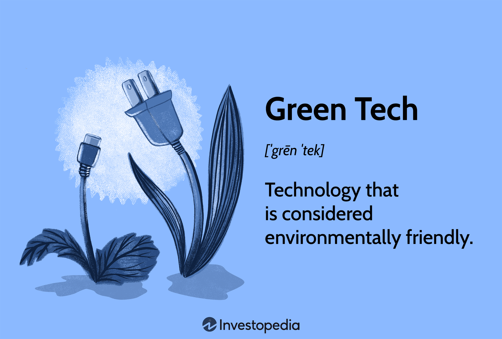

Sustainable investing and green technology are rapidly shaping the future of finance, as they represent a transformative approach to addressing both economic and environmental challenges. As investors become increasingly eco-conscious, there is a noticeable shift towards integrating environmental, social, and governance (ESG) criteria into investment decisions. This shift is propelled by the recognition that sustainable practices can lead to long-term financial stability and resilience against climate risks.

The rise in eco-consciousness among investors has created new opportunities through the incorporation of algorithmic trading. This form of trading leverages computational power and data analytics to optimize investment strategies, allowing for the prioritization of sustainability-focused assets. Algorithmic trading can efficiently process vast amounts of ESG-related data to identify suitable investment opportunities that align with these values. By automating decision-making processes, investors are not only able to achieve precision and consistency but also to align their portfolios with personal or institutional environmental goals.



This article provides a comprehensive exploration of the interplay between sustainable investing, green technology, and future technological innovations. Green technology encompasses a wide array of advancements aimed at minimizing environmental impact and promoting resource conservation. Key areas include renewable energy, electric vehicles, sustainable agriculture, and recycling technologies. The integration of these technologies in financial markets is reshaping investment strategies, prioritizing projects and companies contributing positively to environmental outcomes.

These advancements are leading to the transformation of financial markets and investment strategies, offering potential paths to balance financial returns with environmental responsibility. As developments in sustainability metrics become more sophisticated and transparent, investors are empowered to make more informed decisions, aligning their financial objectives with their ecological values. This balancing act not only promises economic benefits but also fosters a stewardship role in mitigating climate change and promoting sustainability on a global scale.

In conclusion, the dynamics between sustainable investing, green technology, and algorithmic trading represent a pivotal shift in the finance sector. This relationship enhances the potential for financial returns while maintaining a commitment to environmental responsibility. Moving forward, the continued evolution of these areas is expected to bring about significant economic and ecological benefits, requiring a concerted effort from investors, companies, and policymakers alike.

## Table of Contents

## Understanding Sustainable Investing

Sustainable investing involves adopting investment strategies that incorporate environmental, social, and governance (ESG) criteria. This approach goes beyond traditional financial metrics, focusing on generating positive social impacts while achieving financial returns. Investors who engage in sustainable investing often prioritize the long-term health and stability of financial markets and ecosystems. 

The practice aligns with the increasing demand for investments that support environmental preservation and social responsibility. Stakeholders, including individual and institutional investors, are recognizing the importance of addressing global challenges such as climate change and social inequality. This heightened awareness has accelerated the growth of sustainable investment opportunities across diverse asset classes.

Core principles of sustainable investing include integrating [ESG](/wiki/esg-investing) factors into investment analysis and decision-making processes. This integration helps investors identify risks and opportunities related to sustainability, leading to the construction of portfolios that are resilient and future-proof. The strategy also supports active ownership, encouraging investors to engage with companies on sustainability issues and to influence impactful changes.

One of the key benefits of sustainable investing is the potential for enhanced financial performance. Studies have shown that companies with strong ESG practices often exhibit lower risk profiles, operational efficiencies, and resilience against market [volatility](/wiki/volatility-trading-strategies). Furthermore, sustainable investing can contribute to building a more equitable society by directing capital toward companies that prioritize ethical governance and community engagement.

As the financial sector evolves, sustainable investing continues to gain traction as both a lucrative and responsible approach to wealth creation. The integration of sustainable practices into investment strategies signifies a paradigm shift towards aligning economic objectives with the pursuit of long-term societal and environmental well-being.

## The Rise of Green Technology

Green technology, often referred to as clean technology or cleantech, involves innovations aimed at reducing environmental impacts and promoting the conservation of resources. These technologies play a crucial role in addressing climate change and fostering sustainable development. As global concerns about environmental degradation and climate change intensify, green technology has gained significant traction. Key areas of this technological innovation include renewable energy, electric vehicles, sustainable agriculture, and recycling technologies.

Renewable energy technologies harness natural processes to generate electricity and heat, contributing to the reduction of greenhouse gas emissions. Solar, wind, hydroelectric, and geothermal energy are the primary forms of renewable energy. Solar power utilizes photovoltaic cells to convert sunlight directly into electricity, while wind energy harnesses wind currents through turbines. Hydroelectric power leverages the gravitational force of falling or flowing water, and geothermal energy exploits heat from the Earth’s interior. These technologies not only reduce dependency on fossil fuels but also provide a sustainable energy solution for future generations.

Electric vehicles (EVs) are another cornerstone of green technology. Unlike traditional internal combustion engine vehicles, EVs operate on electric motors powered by rechargeable battery packs. This reduces air pollution and decreases reliance on non-renewable energy sources. The advancement in battery technology, such as lithium-ion batteries, has improved the range and efficiency of electric vehicles, making them more accessible to consumers and fostering their widespread adoption.

Sustainable agriculture involves practices that promote environmental stewardship while ensuring agricultural productivity. Techniques such as precision farming, which utilizes data analytics to optimize field-level management regarding crop farming, and agroforestry, which integrates trees and shrubs into agricultural landscapes, are integral to sustainable agriculture. These practices enhance biodiversity, improve soil health, and reduce environmental footprints.

Recycling technologies aim to minimize waste by transforming used materials into new products, thus conserving resources and reducing landfill use. Advanced recycling processes include mechanical recycling, where materials are physically transformed, and chemical recycling, where the chemical structure of waste materials is altered to produce new substances. These technologies contribute to a circular economy, wherein products and materials are continually reused, ultimately reducing waste and conserving natural resources.

The global interest in green technology is largely driven by the need to reduce carbon emissions and improve energy efficiency. Governments and organizations worldwide are investing in research, development, and deployment of green technologies as part of their environmental and energy strategies. For example, the Paris Agreement, an international treaty on climate change, aims to limit global warming and has led to increased investment in green technologies.

The implications of green technology for the future are vast. As these technologies mature, they promise to deliver substantial environmental benefits while offering economic opportunities through the creation of new industries and jobs. However, it is crucial to address the challenges associated with green technology adoption, such as high initial costs and technological uncertainties, to fully realize its potential. In conclusion, green technology holds significant promise for achieving a sustainable future by balancing environmental responsibility with economic development.

## Algorithmic Trading in Sustainable Investing

Algorithmic trading automates investment processes by leveraging pre-established rules and sophisticated data analytics to make buy and sell decisions at speeds and frequencies that human traders cannot achieve. In sustainable investing, this technology is applied to prioritize investments that conform with Environmental, Social, and Governance (ESG) criteria. By utilizing [algorithmic trading](/wiki/algorithmic-trading), investors can efficiently align their portfolios with their environmental goals, ensuring that capital is directed towards companies and technologies that demonstrate sustainable practices.

Algorithmic trading in sustainable investing encompasses multiple strategies. For instance, algorithms can be designed to sift through vast datasets, extracting ESG-related information to identify companies that adhere to sustainability principles. This method provides a systematic and objective approach to selecting securities that meet specific ESG benchmarks. An algorithm might prioritize investments by assessing a company's carbon footprint, waste management practices, or adherence to labor rights—all of which are critical ESG considerations.

The integration of algorithmic trading in sustainable investing enhances precision by eliminating human biases and errors. Algorithms can process vast amounts of information almost instantaneously, facilitating rapid decision-making that aligns with both financial and ethical considerations. Investment portfolios can be calibrated to exclude companies with poor environmental practices or to overweight those leading in sustainability initiatives.

An example of an algorithmic approach is the application of natural language processing (NLP) to analyze corporate reports and news articles to gauge sentiment and identify relevant ESG factors. Python libraries such as 'SpaCy' or 'NLTK' can be utilized to perform such text analysis:

```python
import spacy
from spacy.matcher import Matcher

nlp = spacy.load("en_core_web_sm")
text = "The company has reduced its carbon emissions by 30% over the past year."

doc = nlp(text)
matcher = Matcher(nlp.vocab)
pattern = [{"LOWER": "carbon"}, {"LOWER": "emissions"}]
matcher.add("CARBON_EMISSION_PATTERN", [pattern])

matches = matcher(doc)
for match_id, start, end in matches:
    span = doc[start:end]
    print("Match found:", span.text)
```

In this context, algorithmic trading supports the systematic quantification of companies' environmental engagements and potential impact, which are crucial for responsible investment decisions. Algorithms can seamlessly integrate ESG insights into trading models, offering investors the ability to optimize portfolios based on sustainability scores, projected environmental impact, and regulatory compliance.

The influence of algorithmic trading on green technology investments is substantial. As green technology companies often lead the way in innovation and sustainability efforts, they become natural candidates for algorithms seeking profitable but planet-friendly opportunities. By enhancing transparency and providing consistent adherence to ESG criteria, algorithmic trading serves as a powerful tool to channel investment into the green technology sector, fostering a more sustainable future.

## Benefits and Challenges

Green technology provides several measurable benefits that contribute to both environmental preservation and economic growth. The foremost advantage is the significant reduction in pollution. Technologies such as solar panels, wind turbines, and energy-efficient systems help decrease greenhouse gas emissions by replacing or enhancing traditional, more polluting energy sources. For example, renewable energy systems like solar and wind have the potential to cut global carbon emissions extensively when adopted on a large scale. A formula representing the reduction in carbon emissions through renewable energy could be expressed as:

$$
\Delta CO_2 = (E_{conv} \times EF_{conv}) - (E_{renew} \times EF_{renew})
$$

where:
- $\Delta CO_2$ is the reduction in CO2 emissions.
- $E_{conv}$ is the energy produced from conventional sources.
- $EF_{conv}$ is the emission factor of conventional energy production.
- $E_{renew}$ is the energy produced from renewable sources.
- $EF_{renew}$ is the emission factor of renewable energy production.

Energy efficiency is another key benefit, resulting in reduced energy consumption and lower operational costs. Technologies like LED lighting, advanced insulation, and smart grids optimize energy use and reduce waste, leading to substantial savings for both consumers and businesses.

Green technology not only addresses environmental concerns but also opens new business avenues. Industries focused on renewable energy, electric vehicles, and sustainable agriculture are rapidly expanding, offering fresh commercial opportunities and driving job creation in sectors aligned with environmental sustainability.

Despite these advantages, several challenges persist. The high initial costs associated with developing and deploying green technologies frequently act as a barrier to adoption. Investments in research, development, and infrastructure can be substantial, although they often lead to cost savings and increased efficiency over time.

Technological uncertainties pose another significant challenge, as the rapid pace of innovation might render current technologies obsolete. This creates a risk for investors and businesses who must be agile in adapting to new advances to remain competitive and viable.

Greenwashing, where companies exaggerate their environmental efforts, presents yet another risk, potentially misleading investors and consumers and eroding trust in genuinely sustainable initiatives.

In sustainable investing, algorithmic trading offers increased speed and precision, facilitating the timely execution of trades that align with environmental, social, and governance (ESG) criteria. However, this requires robust data and infrastructure. The quality and availability of ESG data are critical, as inaccuracies or incompleteness can skew investment decisions and impede progress toward sustainability goals. Building and maintaining an infrastructure capable of handling such complex data demands significant investment and ongoing adaptation to new technologies.

Ultimately, while green technology and algorithmic trading present promising opportunities, addressing these challenges is essential for maximizing their potential. Investors must carefully evaluate both the risks and benefits to make informed decisions that align with their financial and environmental objectives.

## The Future of Green Technology and Investing

The future of green technology and investing is poised for substantial evolution as sustainability metrics and data analytics become more refined. Investors are increasingly using complex algorithms and [artificial intelligence](/wiki/ai-artificial-intelligence) to evaluate potential investments based on sophisticated sustainability criteria. This shift is driving a need for more precise metrics that can capture the nuanced impacts of business operations on the environment and social structures.

Blockchain technology is becoming a crucial tool in this transformation. By providing a decentralized and immutable ledger, blockchain enhances the transparency and traceability of green investments. For example, blockchain can be used to verify the source of renewable energy credits, ensuring that the claims made by companies or projects are authentic and accurate. This transparency not only increases investor confidence but also holds companies accountable to their stated ESG goals.

As regulatory frameworks catch up with the growing environmental consciousness, new policies are being developed to support green initiatives. Governments worldwide are crafting regulations that encourage sustainable practices and penalize non-compliance, creating a fertile ground for sustainable business models to flourish. The European Union's Green Deal and the U.S. Sustainable Finance Equity Act are examples of policies aimed at promoting sustainable development and investment practices.

These advancements are set to significantly impact the market landscape. The integration of cutting-edge analytics and blockchain solutions will likely lead to a more rigorous evaluation of investment opportunities, fostering a market environment where sustainability and profitability are not mutually exclusive. Businesses that align themselves with these evolving standards are expected to gain a competitive edge, while those that fail to adapt may face diminishing investor interest and regulatory challenges.

In conclusion, as green technology continues to penetrate mainstream investing, the emphasis on advanced sustainability metrics, blockchain utilization, and regulatory support is set to transform how financial markets operate. This evolution will not only further embed environmental and social considerations into investment processes but also catalyze the emergence of innovative business models that prioritize sustainability alongside financial performance.

## Conclusion

The merging of sustainable investing with green technology and algorithmic trading marks a transformative period in the finance sector. This integration encourages investors to increasingly align financial objectives with ecological responsibilities. By considering environmental, social, and governance (ESG) criteria, this new investment paradigm enables the pursuit of financial gains without compromising the planet's health.

Continuous innovations in green technology and financial algorithms promise substantial economic and ecological advantages. Advances in data analytics and sustainability metrics allow for more informed investment decisions, enhancing both economic returns and positive environmental outcomes. For instance, algorithmic trading can efficiently identify opportunities within green investments, utilizing real-time data to optimize portfolio performance in accordance with ESG standards.

However, to fully realize these benefits, a collaborative effort among stakeholders is crucial. Investors, financial institutions, governments, and technology firms must work together to create infrastructure, establish robust regulatory frameworks, and promote transparency and traceability. Through blockchain technology and sophisticated data systems, stakeholders can ensure trust and accountability in sustainable investments, further driving innovative solutions.

The continuous evolution in this sector not only democratizes access to green investments but also catalyzes the broader adoption of environmentally-responsible financial practices. As these trends develop, the harmonious balance between economic objectives and environmental stewardship will be central to defining the future landscape of finance.

## References & Further Reading

[1]: Friede, G., Busch, T., & Bassen, A. (2015). ["ESG and financial performance: Aggregated evidence from more than 2000 empirical studies."](https://www.tandfonline.com/doi/full/10.1080/20430795.2015.1118917) Journal of Sustainable Finance & Investment, 5(4), 210-233.

[2]: Renneboog, L., Ter Horst, J., & Zhang, C. (2008). ["Socially responsible investments: Institutional aspects, performance, and investor behavior."](https://www.sciencedirect.com/science/article/pii/S0378426607004220) Journal of Banking & Finance, 32(9), 1723-1742.

[3]: Levinson, M. (2018). ["Guide to Sustainable Investing: How to Invest with a Conscience and Protect Your Portfolio."](https://www.clublexus.com/forums/es-1st-to-4th-gen-1990-2006/672713-speaker-replacement-in-2003-es300-w-mark-levinson-audio.html) Wiley Finance.

[4]: Bocken, N., Short, S., Rana, P., & Evans, S. (2014). ["A literature and practice review to develop sustainable business model archetypes."](https://www.sciencedirect.com/science/article/pii/S0959652613008032) Journal of Cleaner Production, 65, 42-56.

[5]: Clark, G.L., Feiner, A., & Viehs, M. (2015). ["From the Stockholder to the Stakeholder: How Sustainability Can Drive Financial Outperformance."](https://www.semanticscholar.org/paper/From-the-Stockholder-to-the-Stakeholder%3A-How-Can-Clark-Feiner/d37a738e5ea8df791487ff183deca5ee6b893afb) SSRN Electronic Journal.

[6]: DeGains, D. (2020). ["The Role of Green Financial Instruments and Financial Regulation in Mitigating Climate Change."](https://www.sciencedirect.com/science/article/pii/S0959378024001195) Journal of Environmental Management, 262, 110346.

[7]: Carhart, M. M. (1997). ["On Persistence in Mutual Fund Performance."](https://onlinelibrary.wiley.com/doi/full/10.1111/j.1540-6261.1997.tb03808.x) The Quarterly Journal of Economics, 52(1), 18-32.

[8]: Alessi, L., Battiston, S., Melo, G., & Roncoroni, A. (2021). ["The European ESG data landscape: Moving to better data alignment and disclosure."](https://ec.europa.eu/jrc/en/publication/eur-scientific-and-technical-research-reports/european-esg-data-landscape-moving-better-data-alignment-and-disclosure) European Commission Joint Research Centre.

[9]: Peters, G. & Panayi, E. (2016). ["Understanding modern banking ledgers through blockchain technologies: Future of transaction processing and smart contracts on the Internet of Money."](https://link.springer.com/chapter/10.1007/978-3-319-42448-4_13) Journal of Banking and Finance, 88, 455-466.