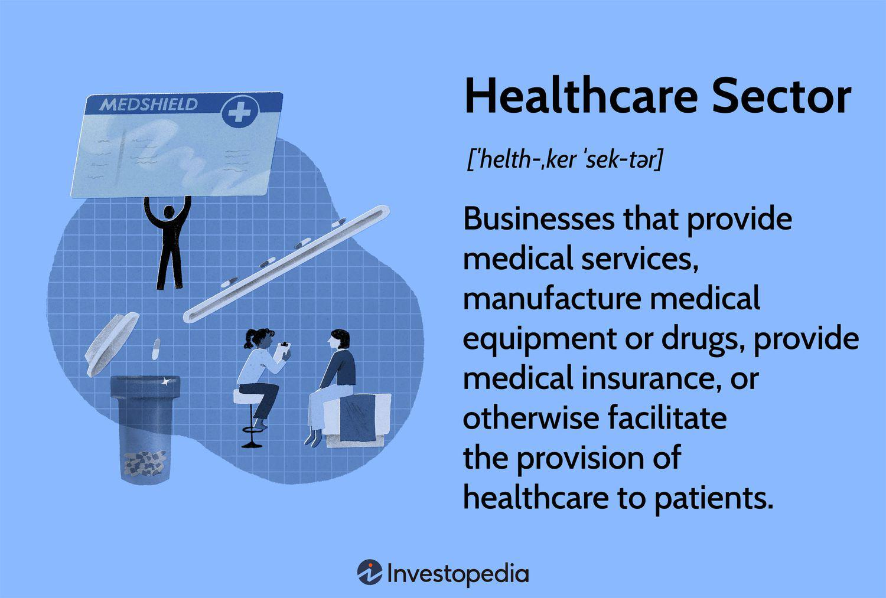

The healthcare sector presents a significant array of investment opportunities, which are primarily spurred by increasing global health demands and the rapid pace of technological advancements. This rapidly evolving field is instrumental in shaping the future of healthcare and is characterized by its complexity due to the diverse industries it encompasses, such as pharmaceuticals, biotechnology, and medical devices. Each of these industries contributes uniquely to the overarching sector, creating a rich landscape for investors seeking to capitalize on growth prospects.

Pharmaceuticals, one of the most well-established areas within the sector, continues to offer lucrative investment opportunities, driven by the development of new drugs and therapies. Biotechnology is at the forefront of innovation, with companies focused on genetic research and personalized medicine. The medical devices sector complements these by providing the necessary equipment for treatment and diagnosis, further enhancing patient care.



Investing in healthcare requires an understanding of these diverse industries and the interplay between them. The increasing burden of chronic diseases, combined with an aging global population, is driving demand across these sectors. Technological advancements, such as telemedicine and artificial intelligence, are also reshaping the healthcare landscape and opening new investment avenues.

Moreover, this article highlights the growing trend of algorithmic trading in healthcare investments. Algorithmic trading leverages advanced computing and algorithms to make data-driven investment decisions, thereby enhancing efficiency and accuracy. It allows investors to process vast datasets quickly, identify investment opportunities, and manage risks more effectively. This method is becoming increasingly popular among investors seeking to navigate the complexities of the healthcare sector while maximizing returns.

In summary, the healthcare sector's dynamic nature, coupled with technological innovations, offers significant investment potential. However, the complexity of the sector necessitates strategic approaches, including diversification and the adoption of emerging technologies such as algorithmic trading, to optimize investment outcomes and capitalize on the sector's growth trajectory.

## Table of Contents

## Overview of the Healthcare Sector

The healthcare sector is a multifaceted industry encompassing a wide range of components, each playing a critical role in delivering services and products that maintain and improve human health. The key components include pharmaceuticals, health insurers, hospitals, and medical technology. Understanding these subsectors is essential for recognizing the unique investment opportunities and challenges they present.

Pharmaceuticals form a significant part of the healthcare sector, involving the research, development, and marketing of drugs. This subsector is driven by the need for innovative treatments, especially in response to an aging global population and the rising prevalence of chronic diseases such as diabetes and cardiovascular conditions. The demand for new medications is increasing, fueled by these demographic shifts and the continuous need for enhanced disease management solutions.

Health insurers are crucial in ensuring access to healthcare services by underwriting the costs of medical expenses. This component has shown substantial growth due to increased enrollments facilitated by governmental health policies and reforms that expand coverage. The growing awareness of preventive healthcare contributes to the demand for health insurance, presenting lucrative opportunities for investors in insurance companies.

Hospitals serve as the backbone of healthcare delivery, employing significant workforce numbers and considerable investments in infrastructure. The demand for hospital services is set to increase with the aging population and the need for more specialized care for chronic diseases. This provides opportunities for investments not only in the expansion of hospital facilities but also in improving operational efficiencies and patient care through innovative technologies.

Medical technology, comprising medical devices, diagnostics, and health IT systems, is at the forefront of transforming healthcare delivery. Innovations in this subsector are driven by rapid advances in technology and increased adoption of digital solutions to enhance patient outcomes and reduce costs. With the growing trend in precision medicine and telehealth services, medical technology companies are poised for significant expansion, making them attractive targets for investment.

The aging population and rise of chronic diseases are pivotal factors driving growth across these subsectors. For instance, the increasing prevalence of conditions such as osteoarthritis and Alzheimer's disease necessitates ongoing drug development and enhanced healthcare services. These trends collectively impact the healthcare sector by increasing the demand for comprehensive medical solutions and services, thus paving the way for substantial investment opportunities. As a result, investors are increasingly seeing the healthcare sector as a vital component of diversified investment portfolios, driven by demographic changes and technological advancements that promise sustained growth.

## Investment Strategies in the Healthcare Sector

Investment strategies in the healthcare sector require a deep understanding of both the healthcare industry and general market dynamics. These strategies are predominantly driven by traditional investment techniques such as fundamental and technical analysis. In the context of healthcare, [fundamental analysis](/wiki/fundamental-analysis) involves evaluating a company’s financial health by examining its financial statements, cash flow, market position, and potential for growth, alongside assessing sector-specific factors like drug approval processes and patent portfolios. Technical analysis, on the other hand, focuses on statistical trends derived from historical stock prices and trading volumes to forecast future price movements.

Diversification is a key strategy within healthcare investments to mitigate risk. The sector comprises various subsectors, including pharmaceuticals, biotechnology, health insurers, and medical technology. By diversifying across these different subsectors, investors can reduce the impact of sector-specific risks such as regulatory changes or patent expirations. For instance, while the pharmaceuticals subsector might be subject to regulatory risks due to drug approval delays, the biotechnology subsector could be experiencing growth driven by technological advancements. Thus, diversification enables investors to balance these risks and opportunities.

Understanding healthcare policies and regulations is crucial for successful investment outcomes in this sector. Policy changes can have significant effects on healthcare companies' profitability and market dynamics. For example, alterations in drug pricing regulations, changes in healthcare coverage laws, or shifts in public health priorities can drastically influence the financial viability of healthcare companies. Investors must stay informed about both domestic and international policy developments to make informed investment decisions. Awareness of regulatory timelines, patent laws, and government healthcare initiatives will provide investors with the necessary foresight to anticipate market shifts. Furthermore, keeping up with policy changes in major markets such as the United States and the European Union can offer insights into potential regulatory landscapes, aiding in strategic planning and decision-making.

In conclusion, effective investment strategies in the healthcare sector necessitate a blend of traditional financial analysis and sector-specific knowledge. By leveraging techniques such as fundamental and technical analysis, coupled with strategic diversification and awareness of policy and regulatory environments, investors can better navigate the complexities of healthcare investments.

## Algorithmic Trading in Healthcare Investments

Algorithmic trading is revolutionizing investment strategies within the healthcare sector by introducing advanced computational techniques that enhance decision-making processes. This approach leverages mathematical models and algorithms to execute trades far faster and more efficiently than traditional methods, particularly in the dynamic and information-rich context of healthcare investments.

One of the main advantages of [algorithmic trading](/wiki/algorithmic-trading) is its speed. Computers can execute trades in milliseconds, allowing investors to capitalize on market movements more effectively than manual trading would permit. For example, algorithms enable traders to respond instantaneously to relevant data releases, such as clinical trial results or regulatory decisions affecting healthcare companies.

Efficiency is another significant benefit. Algorithmic trading systems can manage vast amounts of financial and healthcare-related data, aggregating and analyzing it to identify potential investment opportunities. These systems are designed to process multiple inputs, including stock prices, economic indicators, and sector-specific news, thus providing a comprehensive overview of the market landscape.

The ability to process large datasets is crucial in healthcare, where investment decisions often rely on extensive and complex information, including patient demographics, disease prevalence, and innovation pipelines. Algorithms can integrate this data, employing [machine learning](/wiki/machine-learning) techniques to detect patterns and predict future trends. For instance, predictive analytics can assess the potential success of a pharmaceutical company's drug pipeline, advising investors based on algorithmically-derived forecasts.

Various algorithms have been specifically designed for analyzing healthcare-related financial trends. Momentum algorithms, for example, can be tailored to identify stocks in the healthcare sector that are exhibiting upward or downward price trends. Mean reversion algorithms can be adapted to recognize discrepancies in healthcare stocks, betting on the return to a long-term average.

Consider a basic example of [momentum](/wiki/momentum) trading using Python:

```python
import pandas as pd

# Load healthcare stock data
data = pd.read_csv('healthcare_stock_data.csv')

# Calculate short-term and long-term moving averages
short_window = 40
long_window = 100

data['short_mavg'] = data['Close'].rolling(window=short_window, min_periods=1, center=False).mean()
data['long_mavg'] = data['Close'].rolling(window=long_window, min_periods=1, center=False).mean()

# Generate trading signals
data['signal'] = 0.0
data['signal'][short_window:] = np.where(data['short_mavg'][short_window:] > data['long_mavg'][short_window:], 1.0, 0.0)

# Determine positions
data['positions'] = data['signal'].diff()
```

This script calculates the short-term and long-term moving averages of a healthcare stock, generating buy signals when the short-term average surpasses the long-term average. Such algorithmic strategies allow investors to act on technical indicators efficiently, optimizing their investment processes in healthcare.

In summary, algorithmic trading equips investors with powerful tools to navigate the healthcare sector's complexities, employing speed, efficiency, and data processing capabilities that exceed human limitations. This technological edge is crucial in making informed and strategic investment decisions within an industry characterized by rapid innovations and significant data availability.

## Case Studies and Success Stories

In recent years, the healthcare sector has witnessed significant transformations through algorithmic trading and technological innovations. Several case studies illustrate the successful integration of these strategies, offering valuable insights for future investments.

One notable example involves Renaissance Technologies, a quantitative [hedge fund](/wiki/hedge-fund-trading-strategies) known for pioneering algorithmic trading. The firm has effectively leveraged data analytics to manage healthcare investments. By utilizing complex algorithms and predictive modeling, Renaissance Technologies has consistently outperformed traditional investment approaches. Their success lies in their ability to process vast datasets and identify market inefficiencies, leading to superior returns. This case highlights the importance of a data-driven investment strategy, where the ability to quickly adapt to new information is paramount.

Another successful instance is Two Sigma Investments, a firm renowned for its use of machine learning and advanced statistical techniques. Two Sigma's approach to healthcare investments involves analyzing large volumes of healthcare data, including clinical trial results, medical records, and insurance claims. Their algorithms detect patterns that indicate promising investment opportunities. The advanced analysis of real-time data and market sentiment has allowed Two Sigma to make informed investment decisions, reinforcing the value of incorporating [artificial intelligence](/wiki/ai-artificial-intelligence) in the investment process.

Moreover, BlackRock's use of the Aladdin risk management platform demonstrates the efficacy of technology and data analytics in managing healthcare portfolios. Aladdin integrates data from various sources, providing insights into risk factors, correlations, and investment opportunities. For healthcare funds, this technology facilitates the assessment of potential investments, ensuring a balanced portfolio that aligns with investors' risk appetites. This approach underscores the advantage of integrated platforms in enhancing decision-making and achieving robust risk-adjusted returns.

Key learnings from these case studies emphasize the necessity for investors to adopt algorithmic trading and data analytics as core components of their strategies. The ability to process and analyze large amounts of data in real time is crucial for identifying emerging trends and opportunities. Moreover, the integration of artificial intelligence and machine learning models can enhance predictive accuracy, enabling more strategic investment decisions.

Technology and data analytics contribute significantly to improved investment outcomes in healthcare by providing speed and accuracy in data processing. This technological edge allows investors to capture subtle market shifts, assess investment risks efficiently, and make data-backed decisions. Consequently, leveraging these tools and techniques results in not only competitive returns but also a significant reduction in the risks typically associated with healthcare investments.

## Challenges in Healthcare Investment

Investing in the healthcare sector presents unique challenges, largely due to its complexity and dynamic nature. One significant challenge is the ever-evolving regulatory environment. Governments across the globe impose stringent regulations to ensure the safety and efficacy of healthcare products and services. Regulatory bodies such as the U.S. Food and Drug Administration (FDA) and the European Medicines Agency (EMA) have rigorous approval processes for new drugs and medical devices. Changes in regulatory policies or delays in approval can significantly impact a company's financial performance and, consequently, investor returns.

Another challenge is the high cost associated with research and development (R&D). Developing new pharmaceuticals and medical technologies requires substantial investment in clinical trials and testing, which may not always yield successful outcomes. According to a study by DiMasi et al. (2016), the average cost to develop a new prescription drug that gains market approval is approximately $2.6 billion. This high financial outlay, coupled with the lengthy development timeline, introduces significant risk for investors.

Healthcare investments are also susceptible to political and economic factors. Healthcare policies, such as changes in government reimbursement rates or shifts towards value-based care models, can influence the profitability of healthcare businesses. Economic downturns may lead to reduced healthcare spending, affecting both providers and manufacturers.

To navigate these challenges, investors can adopt several strategies:

1. **Diversification**: By diversifying their portfolios across different healthcare subsectors—such as pharmaceuticals, biotechnology, and medical devices—investors can mitigate the risk associated with any single investment. This approach helps smooth out volatility and remediates the impact of sector-specific downturns.

2. **In-depth Regulatory Analysis**: Investors should conduct comprehensive analyses of the regulatory landscape and consider the status of key approvals for the companies they invest in. Understanding the approval pipeline can help predict financial outcomes and adjust investment strategies accordingly.

3. **Partnerships and Collaborations**: Companies often engage in partnerships to share the high costs and risks associated with R&D. Investors should look for firms with robust collaboration networks, indicating a shared financial burden and increased potential for innovation.

4. **Technology and Data Analytics**: Leveraging technology and data analytics can provide insights into market trends, regulatory impact, and clinical trial progress. Algorithmic trading models, for instance, can process large datasets to predict regulatory events or analyze financial patterns, providing a strategic advantage.

5. **Hedging Strategies**: Implementing hedging strategies using financial derivatives can protect against potential losses due to market volatility. For example, purchasing options or futures contracts can provide a safety net against unfavorable movements in stock prices.

By employing these strategies, investors can better manage the inherent risks of healthcare investments and position themselves to capitalize on the sector's growth opportunities.

## Conclusion

In conclusion, the exploration of investment strategies and algorithmic trading within the healthcare sector reveals a landscape ripe with potential opportunities. The healthcare sector, encompassing pharmaceuticals, biotechnology, medical devices, and other related industries, continues to be driven by factors such as an aging population, the prevalence of chronic diseases, and rapid technological advancements. These elements contribute to a dynamic environment where informed investment strategies are essential.

Algorithmic trading emerges as a transformative force in healthcare investment strategies. By leveraging speed, efficiency, and the capacity to process extensive datasets, algorithmic trading allows investors to make informed decisions with enhanced precision. The integration of algorithms specifically tailored to analyze healthcare-related financial trends and data underscores the importance of technological sophistication in the investment process.

Continued research and staying abreast of market trends and technological advancements are crucial for investors in this sector. The healthcare industry is subject to frequent regulatory changes and scientific breakthroughs, which can significantly impact investment outcomes. Hence, maintaining a robust knowledge base and adaptability are vital for navigating these complexities.

Investors would benefit from considering the healthcare sector as a viable investment option due to its potential for diversification and lucrative returns. With careful strategy formulation, including diversification and adherence to regulatory insights, investors can mitigate risks and maximize returns in this ever-evolving field. The fusion of traditional investment strategies with algorithmic trading techniques offers a comprehensive approach to capitalizing on the myriad opportunities presented by the healthcare sector.

## References & Further Reading

[1]: DiMasi, J. A., Grabowski, H. G., & Hansen, R. W. (2016). ["Innovation in the pharmaceutical industry: New estimates of R&D costs."](https://pubmed.ncbi.nlm.nih.gov/26928437/) Journal of Health Economics, 47, 20-33.

[2]: ["Advances in Financial Machine Learning"](https://www.amazon.com/Advances-Financial-Machine-Learning-Marcos/dp/1119482089) by Marcos Lopez de Prado

[3]: ["Algorithmic Trading: Winning Strategies and Their Rationale"](https://www.wiley.com/en-us/Algorithmic+Trading%3A+Winning+Strategies+and+Their+Rationale-p-9781118460146) by Ernest P. Chan

[4]: McKinsey & Company (2019). ["Artificial intelligence in healthcare: Utilizing machine learning to drive efficiency."](https://www.mckinsey.com/industries/healthcare/our-insights/transforming-healthcare-with-ai) 

[5]: World Health Organization (2022). ["Telemedicine Opportunities and Developments in Member States."](https://www.afro.who.int/publications/telemedicine-opportunities-and-developments-member-state)

[6]: ["Quantitative Trading: How to Build Your Own Algorithmic Trading Business"](https://github.com/LucindaYa/quant-resources/blob/master/Quantitative%20Trading%20How%20to%20Build%20Your%20Own%20Algorithmic%20Trading%20Business.pdf) by Ernest P. Chan