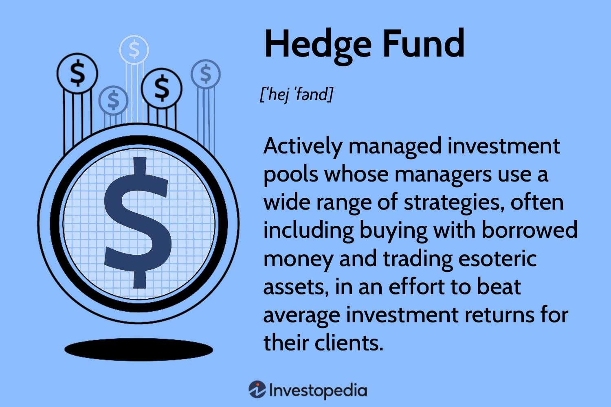

Investment hedge funds are private investment entities designed to generate high returns by utilizing sophisticated financial strategies. These funds differ significantly from traditional investment vehicles like mutual funds, primarily in their ability to deploy flexible strategies such as leverage, derivatives, and short selling. One of the most critical components of modern hedge funds is algorithmic trading, a process that employs complex mathematical models and algorithms to make and execute trading decisions with minimal human intervention. 

Algorithmic trading has become indispensable in hedge funds due to its precision, speed, and efficiency in handling transactions. By utilizing algorithms, these funds can process vast amounts of market data to identify patterns and opportunities, which enhances their ability to manage portfolios effectively. This technological approach allows hedge funds to swiftly adjust their positions and strategies in response to market fluctuations, a capability essential in managing market stress and optimizing overall performance.

The financial landscape in which hedge funds operate is characterized by rapid changes and high competition. Consequently, there is an increasing need to understand not only the hedge fund market but also the financial strategies and technologies that drive success within this domain. This article will explore how hedge funds integrate financial strategies with algorithmic trading to achieve optimal portfolio management, with a focus on the crucial role algorithmic trading plays in navigating market turbulence. The ongoing technological advancements further underscore the importance of staying informed about the trends and tools shaping the hedge fund industry.

## Table of Contents

## Understanding Hedge Funds

Hedge funds represent an integral component of the financial market, primarily characterized by their fluidity and strategic approach to investment. Hedge funds are privately pooled investment funds open to a limited number of accredited investors. They employ a diverse range of complex strategies—including leveraging, derivatives trading, and investing in alternative assets—with the aim of generating high returns.

The distinction between hedge funds and traditional investment vehicles, such as mutual funds, is multifaceted. While mutual funds are typically accessible to the general investing public and subject to strict regulatory oversight, hedge funds operate with more flexibility due to their exemption from many regulatory requirements. This flexibility allows hedge funds to use strategies such as short selling, leverage, and derivatives that mutual funds are generally restricted from utilizing. For instance, the use of leverage in hedge funds can amplify both potential gains and losses, providing opportunities for higher risk-adjusted returns.

Key strategies employed by hedge funds encompass a broad spectrum, tailored to capitalize on different market conditions. Leverage, for instance, involves borrowing capital to increase the potential return of an investment, but it simultaneously raises the risk of significant losses. Derivatives, such as options and futures, provide hedge funds with the ability to hedge against market volatility or speculate on future price movements. Additionally, alternative assets, which include commodities, real estate, and private equity, offer hedge funds the opportunity to diversify their portfolios and reduce correlation with traditional asset classes.

The regulatory landscape governing hedge funds is distinct from that of mutual funds, primarily due to the investor base they cater to. Hedge funds tend to operate with fewer constraints, as their client base is typically composed of accredited investors who meet specific financial criteria. According to U.S. Securities and Exchange Commission guidelines, an accredited investor is one who has a net worth exceeding $1 million, excluding the value of their primary residence, or an annual income of $200,000 ($300,000 for joint income) for the last two years with the expectation of [earning](/wiki/earning-announcement) the same or more in the current year.

Investors' access to hedge funds is often limited and requires meeting these accredited investor criteria, highlighting the barriers to entry that protect the funds from public scrutiny and allow them to engage in advanced investment strategies. This exclusivity underscores the need for potential investors to conduct thorough due diligence before committing capital, as hedge funds can embody higher risk profiles compared to traditional investment vehicles.

In summary, hedge funds occupy a niche within the financial markets, characterized by their flexibility in strategy, distinct regulatory environment, and exclusivity in investor access. These attributes enable hedge funds to pursue sophisticated strategies that, while potentially lucrative, require a comprehensive understanding of the financial and regulatory landscape.

## Financial Strategies in Hedge Funds

Hedge funds employ a diverse array of financial strategies to achieve superior returns, often focusing on aspects that are distinct from traditional investment vehicles such as mutual funds. A critical aspect of [hedge fund](/wiki/hedge-fund-trading-strategies) strategy is risk management, which involves balancing the potential for reward against corresponding risks. Risk management is crucial as hedge funds often engage in high-leverage investments and complex trading strategies that can be more volatile than those typically found in conventional investment funds. 

One prominent strategy used by hedge funds is long/short equity. This involves taking long positions in stocks expected to increase in value and short positions in those anticipated to decline. By doing so, hedge funds aim to capitalize on mispricings and market inefficiencies, potentially generating returns regardless of overall market conditions. Another strategy is market neutral investing, in which hedge funds seek to exploit relative price movements while minimizing exposure to broader market fluctuations. This is often achieved by maintaining balanced long and short positions, ensuring that overall market movements have limited impact on the fund's performance.

Global macro strategies are also frequently employed by hedge funds. These strategies are based on predictions and analyses of macroeconomic trends and are implemented through positions in interest rates, currencies, commodities, and equities. Fund managers using this approach might anticipate global economic or political events and adjust their portfolios accordingly to benefit from these macroeconomic shifts.

Quantitative analysis and financial modeling play a pivotal role in hedge fund decision-making. Sophisticated mathematical models and statistical techniques are used to analyze market data, identify trading opportunities, and construct portfolios. By applying quantitative methods, hedge funds can systematically evaluate potential trades and manage the associated risks more effectively. Python and other programming languages are often utilized to build these models, providing flexibility and scalability in their implementation.

The fee structure known as "Two and Twenty" is a hallmark of hedge fund investment. This structure consists of a 2% management fee on assets under management and a 20% performance fee on profits. While this aligns the interests of fund managers and investors to some extent, it has significant implications for investment returns, especially when compared to the lower fees typical of mutual funds. The performance fee, an incentive for managers to maximize returns, can also lead to increased risk-taking. Investors must therefore weigh the potential for higher returns against the costs incurred by this fee structure.

In sum, hedge funds leverage a variety of financial strategies, blending risk management, quantitative analysis, and a unique fee structure to optimize their investment portfolios. By employing methods such as long/short equity, market neutral, and [global macro](/wiki/global-macro-strategy) strategies, these funds strive to achieve returns that surpass those available through more conventional investment vehicles while carefully managing associated risks.

## Algorithmic Trading: A Key Component

Algorithmic trading has become an integral element in the strategic framework of hedge funds, revolutionizing the way these entities conduct their investment activities. It employs computer algorithms to analyze data, generate trading signals, and execute trades with minimal human intervention. This technology-driven approach enables trades to occur with unprecedented precision and speed, ensuring optimal execution while mitigating the potential for human error.

Algorithms can process vast amounts of market data, identify patterns, and perform quantitative analysis to make informed trading decisions. This capability is crucial in executing trades swiftly, capitalizing on market inefficiencies, and reducing the cost of transactions. For example, an [algorithmic trading](/wiki/algorithmic-trading) strategy might involve [arbitrage](/wiki/arbitrage), statistical analysis, or high-frequency trading, where algorithms execute trades within milliseconds.

An important aspect of algorithmic trading is its application in dark [liquidity](/wiki/liquidity-risk-premium) strategies. Dark pools are private financial forums for trading securities, invisible to the public and offering institutional investors a degree of anonymity. These pools enable hedge funds to execute large orders without impacting the market price, thereby minimizing market stress and enhancing trade execution. By utilizing algorithms, hedge funds can navigate and optimize their activities within these dark pools, maintaining market stability while achieving desired outcomes.

The adoption of algorithmic trading in hedge funds has shown significant growth over the years. Historically, hedge funds began integrating algorithmic solutions in the early 2000s, driven by the need for speed and efficiency in trading operations. Performance metrics from various studies demonstrate that funds employing algorithmic trading often experience improved liquidity management, higher efficiencies, and superior returns compared to those relying solely on manual trading methods.

Insights from industry surveys, such as those conducted by TRADE, highlight the widespread use of algorithmic trading among hedge funds. The TRADE’s Algorithmic Trading Survey provides valuable data on hedge fund strategies and their reliance on algorithms for trading operations. The survey indicates a growing preference for algorithmic solutions due to their ability to process real-time data and adapt to rapidly changing market conditions, enhancing traders’ ability to manage funds with agility and effectiveness.

Algorithmic trading continues to evolve with technological advancements, forming a cornerstone of modern hedge fund strategies. As these strategies become more sophisticated and markets grow increasingly complex, the reliance on algorithms is expected to increase, underscoring their critical role in achieving optimal performance in hedge fund operations.

## Technological Advances in Algo Trading

Advancements in technology have significantly bolstered algorithmic trading, making it an indispensable part of modern hedge fund strategies. A key driver in this transformation is the integration of [artificial intelligence](/wiki/ai-artificial-intelligence) (AI) and [machine learning](/wiki/machine-learning) (ML). These technologies facilitate the development of sophisticated trading algorithms that can identify patterns within vast datasets, optimize trading strategies, and make informed decisions with minimal human intervention. AI and ML algorithms can learn from historical data, adjust to new market conditions, and enhance the predictive accuracy of trading systems.

Another critical advancement is the use of big data analytics. The ability to process and analyze large volumes of diverse data—from traditional financial metrics to unconventional data sources like social media and news sentiment—enables hedge funds to gain insights into market trends and behaviors. This informs strategy execution and risk assessment, leading to more robust trading strategies.

Real-time trading systems have revolutionized the speed at which hedge funds can capitalize on market opportunities. These systems can execute trades within milliseconds, leveraging high-frequency trading techniques to exploit minuscule price movements with precision. The implementation of low-latency trading platforms ensures that order execution keeps pace with rapidly changing market conditions, providing a competitive edge in high [volatility](/wiki/volatility-trading-strategies) settings.

Despite these advancements, algorithmic trading faces several challenges and limitations. One significant issue is the susceptibility to algorithmic failures, which can stem from coding errors or unforeseen market events. Such failures can lead to substantial financial losses and market disruption. Moreover, the high reliance on technology introduces operational risks, including system outages and cybersecurity threats. As algorithms become more complex, so does the challenge of interpreting their decisions, leading to potential transparency issues.

Looking to the future, hedge funds are increasingly adopting cutting-edge technologies to stay competitive. The use of quantum computing, although still in its infancy, promises to further accelerate data processing speeds and enhance predictive modeling capabilities. Additionally, blockchain technology offers potential for improved trade settlement processes, enhancing efficiency and security.

As these technologies evolve, hedge funds must remain adaptive, investing in research and development to harness new tools and techniques. This continual evolution ensures they can navigate the ever-changing market landscape, optimizing performance and managing risks effectively.

## Risks and Considerations

Hedge fund investments, with their sophisticated and oftentimes highly leveraged strategies, [carry](/wiki/carry-trading) unique risks that investors must be aware of. A significant risk [factor](/wiki/factor-investing) is liquidity risk, which pertains to the possibility that the fund may not be able to sell assets quickly enough to meet redemption demands from investors, particularly during periods of market stress. Hedge funds engage in complex and sometimes illiquid investments, making the timely liquidation of assets a potential challenge. Algorithmic trading, while offering precision and speed, can exacerbate this risk if market conditions change rapidly and the liquidity profile of assets shifts.

Market risk is another critical consideration. It encompasses the potential financial loss due to movements in market prices. Hedge funds are exposed to fluctuations in interest rates, foreign exchange rates, commodity prices, and stock prices. Algorithms can rapidly adjust positions based on market data, but extreme market volatility can lead to significant losses if algorithms react unpredictably or excessively.

Operational risk in algorithmic trading involves the potential for failures stemming from internal processes, systems, human errors, or external events. Complex trading algorithms can malfunction, leading to incorrect trades or missed opportunities, thereby affecting the fund's performance. The infamous "Flash Crash" of 2010 highlighted how algorithmic trading can inadvertently contribute to market destabilization.

The potential for technology and algorithmic failures adds another layer of risk. Bugs in code, data feed errors, or hardware malfunctions can result in substantial financial repercussions. For instance, incorrect data inputs might lead an algorithm to execute erroneous trades, causing both financial loss and reputational damage. Hedge funds must therefore ensure robust back-testing, simulation, and implementation of algorithms with appropriate checkpoints.

Due diligence and risk assessment are crucial in the hedge fund domain. Investors must rigorously evaluate the fund's risk management processes, the integrity of its trading systems, and the expertise of its personnel in handling algorithmic strategies. Detailed due diligence should focus on the fund's historical performance, its management team's track record, and its approach to managing portfolio risk.

To mitigate risks and protect investment portfolios, hedge funds employ various strategies. Diversification, both across and within asset classes, is fundamental in reducing exposure to specific risks. Regular stress testing and scenario analysis help in assessing how different market conditions could impact the portfolio. Implementing advanced risk management tools and maintaining high levels of liquidity reserves are key strategies in managing potential drawdowns.

In sum, understanding and mitigating these risks require sophisticated tools and strategies, comprehensive knowledge, and experience in navigating complex financial ecosystems. Investors must remain vigilant and proactive to safeguard their investments against the multifaceted risks inherent in hedge fund and algorithmic trading activities.

## Conclusion

Hedge funds and algorithmic trading have emerged as a powerful combination in the investment landscape, leveraging sophisticated financial strategies and advanced technology to optimize portfolio performance. This symbiotic relationship enables hedge funds to navigate complex market environments with greater precision and efficiency. As technological advancements continue to reshape financial markets, hedge funds must evolve to harness these innovations effectively.

Technological innovation plays a crucial role in shaping the future of hedge fund strategies. With the advent of artificial intelligence and machine learning, hedge funds can analyze vast quantities of data at unprecedented speeds, uncovering patterns and insights that were previously inaccessible. This capability enhances decision-making processes and enables funds to devise strategies that are both adaptable and resilient. Algorithmic trading, powered by these technologies, facilitates rapid trade execution and minimizes human error, providing an edge in the highly competitive financial markets.

Market dynamics are continuously evolving, driven by globalization, macroeconomic shifts, and regulatory changes. In this context, hedge funds must adopt adaptive investment practices to remain agile and responsive. By integrating algorithmic trading into their strategic frameworks, funds can adjust their positions swiftly in response to market signals or emerging trends, thus managing risk and maintaining performance. Moreover, the ability to employ strategies such as quantitative analysis and financial modeling allows hedge funds to navigate market volatility with a balanced approach to risk and reward.

Looking ahead, the future of hedge funds and algorithmic trading is poised for continued innovation and evolution. As technology advances, we can expect more sophisticated algorithms capable of predicting market movements with greater accuracy. The focus will likely shift towards more sustainable and ethical investment practices, driven by both investor demand and regulatory requirements. Ultimately, hedge funds that successfully integrate cutting-edge technology with robust financial strategies will maintain a competitive advantage, securing their role as key players in the global financial landscape.

## Further Reading and Resources

For an enhanced comprehension of hedge fund strategies and performance benchmarks, several resources are available. Noteworthy among these are the "Eurekahedge Hedge Fund Index" and the "HFRI Fund Weighted Composite Index," which provide insights into industry standards and trends. These indices are pivotal for understanding benchmark performance and strategic variations within the hedge fund landscape.

For those seeking a more profound grasp of hedge funds and algorithmic trading, several [books](/wiki/algo-trading-books) and articles are noteworthy. “More Money Than God: Hedge Funds and the Making of a New Elite” by Sebastian Mallaby offers an engaging narrative on the history and evolution of hedge funds. Complementing this, “Quantitative Finance For Dummies” by Steve Bell presents fundamental concepts of quantitative finance, which underpin algorithmic trading strategies.

Surveys and studies such as the "TRADE’s Algorithmic Trading Survey" provide valuable insights into the adoption patterns and preferences within hedge funds regarding algorithmic trading. These surveys often highlight trends, satisfaction ratings, and performance metrics, aiding investors in understanding how hedge funds leverage technology for trading efficiency.

For comprehensive resources on risk management in hedge fund investments, the GARP (Global Association of Risk Professionals) offers extensive materials on risk management standards and practices in the financial sector. Additionally, “Financial Risk Manager Handbook” by Philippe Jorion is a fundamental resource that covers a wide range of risk management tools and techniques applicable to hedge fund investments.

For further information, visiting the websites of major financial institutions and regulatory bodies such as the SEC or FINRA can provide legal frameworks and guidelines pertinent to hedge fund operations and risk management. Consider online platforms like Coursera or edX for courses on financial modeling and risk assessment, which can supplement the understanding of theoretical applications in real-world hedge fund strategies.

## References & Further Reading

[1]: Marcos Lopez de Prado. (2018). ["Advances in Financial Machine Learning."](https://www.amazon.com/Advances-Financial-Machine-Learning-Marcos/dp/1119482089) Wiley.

[2]: David Aronson. (2006). ["Evidence-Based Technical Analysis: Applying the Scientific Method and Statistical Inference to Trading Signals."](https://www.amazon.com/Evidence-Based-Technical-Analysis-Scientific-Statistical/dp/0470008741) Wiley.

[3]: Stefan Jansen. (2020). ["Machine Learning for Algorithmic Trading: Second Edition."](https://github.com/stefan-jansen/machine-learning-for-trading) Packt Publishing.

[4]: Ernest P. Chan. (2009). ["Quantitative Trading: How to Build Your Own Algorithmic Trading Business."](https://onlinelibrary.wiley.com/doi/pdf/10.1002/9781119203377.fmatter) Wiley.

[5]: Sebastian Mallaby. (2010). ["More Money Than God: Hedge Funds and the Making of a New Elite."](https://www.amazon.com/More-Money-Than-God-Relations/dp/0143119419) Penguin Press.