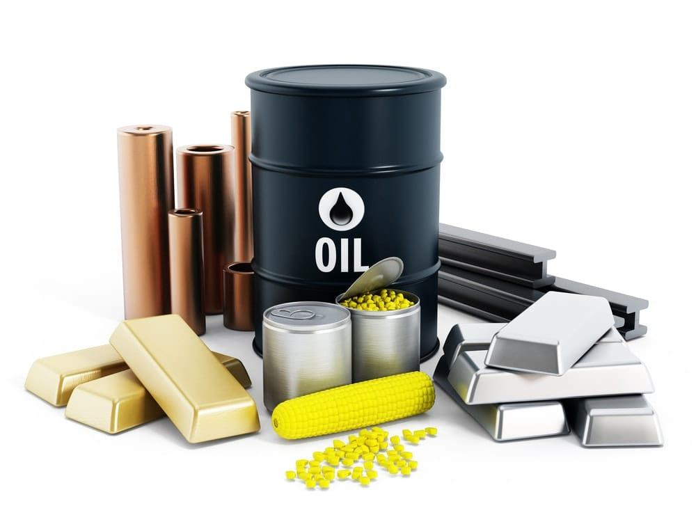

## Table of Contents

## What are key commodities and why are they important for investment?

Key commodities are basic goods that are used in many industries and are important for the economy. Some examples of key commodities are oil, natural gas, gold, silver, copper, and agricultural products like wheat and corn. These commodities are traded on special markets, and their prices can go up and down based on supply and demand.

These commodities are important for investment because they can help investors make money and protect their savings. When the prices of commodities go up, investors who own them can sell them for more than they paid. Also, commodities can help protect against inflation, which is when the prices of things go up over time. By investing in commodities, people can spread out their risk and not put all their money in one place, like stocks or bonds. This can make their investment portfolio stronger and more stable.

## How can beginners start investing in commodities?

Beginners can start investing in commodities by first learning about them. They should understand what commodities are, like oil, gold, or wheat, and how their prices can change. A good way to learn is by reading books, watching videos, or taking online courses about commodities. Once they feel comfortable with the basics, they can start investing.

One simple way for beginners to invest in commodities is by buying shares in companies that produce or use these commodities. For example, they can buy stock in an oil company or a mining company that digs for gold. Another way is to invest in commodity-focused exchange-traded funds (ETFs). These are like baskets of different commodities or commodity-related stocks that you can buy and sell easily. Both of these methods help beginners get started without needing to buy the actual commodities themselves, which can be more complicated and risky.

As beginners gain more experience, they might want to try other ways to invest in commodities, like futures contracts. Futures are agreements to buy or sell a commodity at a set price in the future. This can be more complex and risky, so it's important for beginners to do a lot of research and maybe talk to a financial advisor before trying it. Starting small and learning as they go can help beginners build confidence and make smarter investment choices over time.

## What are the different types of commodities available for investment?

Commodities are divided into two main types: hard commodities and soft commodities. Hard commodities are things that come from the earth, like metals and energy resources. Examples are gold, silver, copper, oil, and natural gas. These are often used in industries like construction, electronics, and transportation. Gold and silver are also popular because people see them as a safe place to keep their money when other investments are risky.

Soft commodities are things that are grown or raised, like crops and livestock. Examples are wheat, corn, soybeans, coffee, sugar, and cattle. These are important for food and other products we use every day. The prices of soft commodities can change a lot because they depend on the weather, how much farmers grow, and what people want to buy. Both hard and soft commodities are traded on special markets, and investors can buy them to make money or protect their savings.

## What are the risks associated with investing in commodities?

Investing in commodities can be risky because their prices can go up and down a lot. Things like the weather, how much is being produced, and what people want to buy can all change the price of commodities. For example, if there's a big storm that hurts crops, the price of those crops might go up because there's less of them to buy. But if people start wanting less of a commodity, like if they start using less oil, the price can go down. This means that if you buy a commodity and its price goes down, you might lose money.

Another risk is that commodities can be hard to understand and trade. For example, futures contracts, which are agreements to buy or sell a commodity at a set price in the future, can be complicated. If you don't know a lot about them, you might make a mistake and lose money. Also, some commodities need special places to be stored, like oil or grains, and that can cost extra money. If you're not ready for these extra costs, it can make your investment more risky. It's important to learn as much as you can and maybe talk to a financial advisor before you start investing in commodities.

## How do commodity prices affect the overall economy?

Commodity prices can have a big impact on the overall economy because they affect the cost of many things we use every day. When the price of oil goes up, it can make gas more expensive, which means people have to spend more money to drive their cars. This can make other things more expensive too, like food, because it costs more to transport it. If businesses have to pay more for the materials they need, like steel or wheat, they might have to charge more for their products. This can lead to inflation, which is when the prices of things go up over time, and it can make life harder for people who are trying to save money.

On the other hand, when commodity prices go down, it can help the economy by making things cheaper. If oil prices drop, it can make gas cheaper, which means people have more money to spend on other things. This can help businesses because they don't have to pay as much for the materials they need, and they might be able to lower their prices or make more profit. But if commodity prices stay low for a long time, it can hurt the people who produce those commodities, like farmers or miners, because they might not make enough money to keep going. So, commodity prices can affect the economy in many ways, and it's important for people to pay attention to them.

## What are the most common strategies for commodity investment?

One common strategy for commodity investment is buying shares in companies that produce or use commodities. For example, you can invest in oil companies or mining companies that dig for gold. This way, you don't have to buy the actual commodity, which can be complicated. Instead, you can buy stock in these companies and make money if their stock price goes up because the commodity they work with becomes more valuable. Another way is to invest in commodity-focused exchange-traded funds (ETFs). These are like baskets of different commodities or commodity-related stocks that you can buy and sell easily. ETFs can help you spread out your risk because you're not putting all your money into one commodity.

Another strategy is using futures contracts. Futures are agreements to buy or sell a commodity at a set price in the future. This can be more complex and risky, but it can also be a way to make money if you think the price of a commodity will go up or down. For example, if you think the price of oil will go up, you can buy a futures contract to buy oil at today's price and sell it later at a higher price. But if you're wrong and the price goes down, you could lose money. It's important to do a lot of research and maybe talk to a financial advisor before trying this strategy.

A third strategy is direct investment in physical commodities, like buying gold bars or silver coins. This can be a good way to protect your money from inflation because the value of these metals often goes up when the prices of other things go up. However, storing physical commodities can be costly and risky, so it's not for everyone. Each of these strategies has its own risks and rewards, so it's important to think about what you're comfortable with and what fits your investment goals.

## How can one use futures and options to invest in commodities?

Futures and options are ways to invest in commodities without actually buying the physical product. Futures are agreements to buy or sell a commodity at a set price on a specific date in the future. For example, if you think the price of oil will go up, you can buy a futures contract to buy oil at today's price and sell it later at a higher price. This can make you money if you're right about the price going up. But if the price goes down instead, you could lose money. Futures can be risky because they depend a lot on guessing what will happen in the future, so it's important to do a lot of research and maybe talk to a financial advisor before trying them.

Options are a bit different. They give you the right, but not the obligation, to buy or sell a commodity at a set price before a certain date. There are two types of options: calls and puts. A call option lets you buy a commodity at a set price, and a put option lets you sell it at a set price. For example, if you buy a call option on gold, you can buy gold at a set price if the market price goes up. If it doesn't, you can just let the option expire and you won't lose more than the money you paid for the option. Options can be less risky than futures because you don't have to go through with the deal if it doesn't work out, but they can still be complicated and it's important to understand them well before investing.

## What role do commodity ETFs and mutual funds play in an investment portfolio?

Commodity ETFs and mutual funds help people invest in commodities without having to buy the actual products like oil or gold. They are like baskets that hold different commodities or stocks of companies that work with commodities. When you buy shares in a commodity [ETF](/wiki/etf-trading-strategies) or mutual fund, you're spreading your money across many different commodities or companies. This can help lower your risk because if one commodity's price goes down, the others might go up and balance it out. It's a good way for people who want to invest in commodities but don't want to deal with the complexity of buying futures or physical commodities.

Adding commodity ETFs and mutual funds to your investment portfolio can also help protect your money from inflation. When the prices of things go up over time, commodities like gold often go up in value too. By having some of your money in commodities, you can keep up with inflation and maybe even make more money. It's important to think about how much of your portfolio you want to put into commodities because they can be riskier than other types of investments. But if you balance them well with other investments like stocks and bonds, they can make your portfolio stronger and more stable.

## How do geopolitical events influence commodity markets?

Geopolitical events can have a big impact on commodity markets because they can change how much of a commodity is available and how much people want to buy it. For example, if there's a war or a political problem in a country that produces a lot of oil, like Saudi Arabia or Russia, it might be harder to get oil from there. This can make the price of oil go up because there's less of it to buy. Also, if countries put up trade barriers or sanctions, it can stop commodities from moving around the world easily, which can make their prices go up or down.

Another way geopolitical events affect commodity markets is by changing what people think will happen in the future. If there's a lot of uncertainty because of political problems, people might start buying more of certain commodities, like gold, because they see them as a safe place to keep their money. On the other hand, if people think a geopolitical event will make the economy slow down, they might buy less of commodities like oil or copper because they think there won't be as much demand for them. So, keeping an eye on what's happening around the world can help investors understand how commodity prices might change.

## What advanced analysis techniques can be used to predict commodity price movements?

One advanced technique to predict commodity price movements is using technical analysis. This involves looking at past price data and using charts to find patterns. People who use technical analysis believe that these patterns can help them guess what will happen next. They use tools like moving averages, which smooth out price data over time, and the Relative Strength Index (RSI), which shows if a commodity is being bought or sold too much. By studying these patterns and indicators, investors can make better guesses about when to buy or sell a commodity.

Another technique is [fundamental analysis](/wiki/fundamental-analysis), which looks at the basic factors that affect commodity prices. This includes things like how much of a commodity is being produced, how much people want to buy it, and what's happening in the world that could change these things. For example, if there's a drought that hurts crops, fundamental analysis would look at how this might make the price of those crops go up. By understanding these factors, investors can make smarter decisions about which commodities to invest in and when.

A third technique is using quantitative models, which use math and computers to predict commodity prices. These models can look at a lot of data at once, like weather reports, economic indicators, and past price movements. They use this data to find patterns and make predictions. While these models can be very accurate, they also need a lot of data and can be hard to understand. But for people who know how to use them, quantitative models can be a powerful tool to help predict commodity price movements.

## How does the integration of commodities into a diversified portfolio impact risk and return?

Adding commodities to a diversified portfolio can help lower risk and change how much money you might make. Commodities like oil, gold, and wheat can move in different ways than stocks and bonds. This means that when stocks go down, commodities might go up or stay the same, which can help balance out your losses. By spreading your money across different types of investments, you're not putting all your eggs in one basket. This can make your portfolio more stable and less likely to lose a lot of money all at once.

At the same time, commodities can also affect how much money you make. They can go up in value when other things like stocks are not doing well, which can help you make money even when the stock market is down. But commodities can be risky too because their prices can change a lot because of things like the weather, political problems, or changes in what people want to buy. So, while adding commodities can help protect your money and maybe make more of it, it's important to think about how much risk you're okay with and to keep an eye on how your whole portfolio is doing.

## What are the long-term trends and future outlook for key commodity investments?

Over the long term, key commodities like oil, gold, and agricultural products have shown different trends that can affect their future outlook. Oil prices have been up and down a lot because of things like new ways to get oil, like fracking, and changes in how much people want to use oil, like more people driving electric cars. But oil will still be important for a long time because it's used in so many things, like making plastics and running factories. Gold has been seen as a safe place to keep money, especially when other investments are risky. People might keep buying gold to protect their savings, but its price can also go up and down because of things like interest rates and what's happening in the world.

The future outlook for commodities depends on a lot of things, like new technology, what people want to buy, and what's happening with the environment. For example, if more people start using renewable energy like solar and wind power, the demand for oil and coal might go down. But if new technology makes it easier to grow more food, the prices of agricultural commodities like wheat and corn might go down too. Also, if the world's population keeps growing, there will be more people who need food and other things, which could make the prices of some commodities go up. So, it's important for investors to keep learning about these trends and think about how they might affect their investments in the future.

## References & Further Reading

[1]: ["Commodity Trading Advisors: Risk, Performance Analysis, and Selection" by Greg N. Gregoriou and Vassilios N. Karavas](https://www.amazon.com/Commodity-Trading-Advisors-Performance-Selection/dp/0471681946)

[2]: Goswami, R., & Srivastava, J. (2010). ["Algorithmic Trading and Strategies for Commodities"](https://www.sciencedirect.com/science/article/abs/pii/S138614252401463X). In: Commodity Markets and Derivatives.

[3]: ["The Economics of Commodity Markets"](https://onlinelibrary.wiley.com/doi/book/10.1002/9781118710098?elqTrackId=ee0ce572e10b46b6a07760f9a3c405de&elqaid=7825&elqat=2) by Julien Chevallier and Florian Ielpo

[4]: Geman, H. (2005). ["Commodities and Commodity Derivatives: Modelling and Pricing for Agriculturals, Metals and Energy"](https://www.amazon.com/Commodities-Commodity-Derivatives-Modelling-Agriculturals/dp/0470012188).

[5]: Fabozzi, F. J., Füss, R., & Kaiser, D. G. (2008). ["The Handbook of Commodity Investments"](https://onlinelibrary.wiley.com/doi/pdf/10.1002/9781118267004.index).

[6]: Kaminski, V. (2012). ["Energy Markets" by Tom James](https://riskbooks.com/energy-markets).

[7]: Elder, A. (2006). ["Entries and Exits: Visits to Sixteen Trading Rooms"](https://archive.org/details/entriesexitsvisi0000elde).