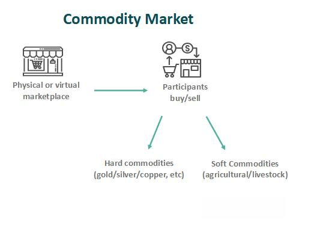

Commodities are fundamental goods used in commerce that are interchangeable with other goods of the same type. These include items such as crude oil, gold, and agricultural products. Commodities play a crucial role in financial markets as they serve as essential components for sectoral development and economic growth, acting as a hedge against inflation and enabling price discovery and risk management. The importance of commodities as an investment class is illustrated by their capacity to provide diversification benefits, reduce portfolio volatility, and enhance risk-adjusted returns, particularly during turbulent economic times when traditional assets such as stocks and bonds may underperform.

In recent years, the commodity market has witnessed the integration of algorithmic trading, a process in which computer algorithms execute trades at high speed based on pre-defined criteria. Algorithmic trading aims to optimize trading performance by reducing transaction costs, enhancing market liquidity, and improving the precision of trade executions. This progression has been transformative, bringing about increased efficiency and transparency within the commodity markets.

The purpose of this article is to explore the intricate dynamics of commodities and their role in financial markets, emphasizing their significance as an investment class and the evolving landscape of algorithmic trading. This article will cover a range of topics, including an overview of commodities and their classifications, the investment benefits they offer, the structure of commodity markets, and the specific advantages and challenges posed by algorithmic trading in these markets. Additionally, we will discuss strategies for investing in commodities and employing algorithmic trading effectively. The conclusion will provide insights into future trends and innovations in commodity markets, with a focus on the impact of artificial intelligence and machine learning in shaping these developments.

## Table of Contents

## Understanding Commodities and Their Types

Commodities are fundamental assets used in the production of goods and services. They are broadly categorized into hard and soft commodities. Hard commodities include natural resources like metals and energy products, while soft commodities encompass agricultural products and livestock. This classification framework helps in understanding the diverse nature of commodities and their trading mechanisms.

The primary categories of commodities are energy, metals, agriculture, and livestock. In the energy category, commodities such as crude oil, natural gas, and coal are significant, with crude oil being one of the most traded due to its vital role in global energy supply. Metals include precious metals like gold and silver, and industrial metals such as copper and aluminum. Gold is particularly notable for its dual role as both a commodity and a financial asset. Agricultural commodities cover a wide range, including grains like wheat and corn, along with softs such as coffee, cotton, and sugar. Livestock includes commodities such as live cattle and pork bellies.

Economic factors significantly influence commodity prices. Supply and demand dynamics are fundamental, where supply disruptions, geopolitical tensions, and changes in consumer preferences can lead to price volatility. For instance, natural disasters or trade policies might affect agricultural output, causing price fluctuations. Additionally, macroeconomic variables such as interest rates, inflation, and currency exchange rates impact commodities' cost structure and profitability.

The seasonal nature of commodities, especially in agriculture, plays a crucial role in price determination. Agricultural commodities are subject to planting and harvest cycles, which create predictable patterns of supply. The global demand for commodities is also shaped by industrial activities and technological advancements. For example, the rise in electric vehicle production has increased the demand for metals like lithium and cobalt, reflecting the broader impact of global megatrends on commodity markets.

The complexity of commodities is seen in their diverse types, classification, and the myriad factors influencing their markets. Whether through their inherent physical properties or the external economic forces at play, commodities remain integral components of the financial markets and global economy.

## The Benefits of Investing in Commodities

Commodities play a significant role in diversifying investment portfolios, particularly during periods of market [volatility](/wiki/volatility-trading-strategies). Unlike traditional securities such as stocks and bonds, commodities often exhibit low correlation with these assets. This characteristic makes them an effective tool for diversification, as they can potentially cushion the impact of market downturns on an investment portfolio. For instance, while equities might decline due to economic uncertainty, commodities like gold typically maintain or even increase in value, offering a stabilizing effect.

Additionally, commodities serve as a hedge against inflation. Inflation erodes the purchasing power of currency, but the prices of commodities tend to rise with inflation, preserving their intrinsic value. As tangible assets, commodities like oil, metals, and agricultural products typically see price increases when inflationary pressures mount, thus safeguarding investments from the detrimental impacts of inflation.

Investing in commodities also presents the potential for high returns. Commodity prices can be highly volatile, influenced by factors such as geopolitical events, natural disasters, and supply and demand dynamics. This volatility can lead to substantial price swings and, consequently, significant investment gains. However, this volatility also introduces substantial risk, making the commodities market inherently risky.

When comparing commodity investments to stocks and bonds, the contrast lies in their behaviors and the inherent features of each asset class. Stocks represent ownership in companies and can offer dividends, whereas bonds are debt instruments providing fixed income. Commodities, however, are physical assets with values driven by supply and demand dynamics. They do not provide dividends or interest, but they offer price appreciation potential and serve as a protective measure against economic variables such as inflation.

In a balanced investment portfolio, commodities play a critical role by providing not only diversification benefits but also protection against inflationary environments and financial upheavals. Including commodities in a portfolio can potentially enhance returns and reduce overall portfolio risk, particularly when aligned with a strategic asset allocation plan. For example, a portfolio strategy might involve a mix of equities, fixed income, and a certain percentage of commodities to achieve a desired risk-return profile, demonstrating the valuable role commodities play in portfolio management.

## An In-depth Look at the Commodity Markets

Commodity markets play a crucial role in the global economy, providing a platform for the exchange of raw materials and primary goods. The structure of these markets is built around commodity exchanges, which are centralized locations where commodities are traded through standardized contracts. Prominent exchanges include the Chicago Mercantile Exchange (CME), Intercontinental Exchange (ICE), and London Metal Exchange (LME). These platforms represent hubs for trading various commodity types, ranging from agricultural products to metals and energy resources.

Futures contracts are fundamental to commodity trading, serving as agreements to buy or sell a specific quantity of a commodity at a predetermined price on a future date. This mechanism allows traders to hedge against price volatility, ensuring stability in financial planning and inventory management. Futures contracts provide crucial insights into market sentiment, as their prices reflect collective expectations of future supply and demand dynamics.

Liquidity, defined as the ease with which assets can be bought or sold in the market without affecting their price, is vital in commodity markets. High [liquidity](/wiki/liquidity-risk-premium) implies robust market activity, facilitating smoother entry and [exit](/wiki/exit-strategy) for traders. Market depth, which refers to the market's ability to sustain large orders without significant impact on price, is essential for executing sizable trades. Both liquidity and market depth are pivotal in shaping trading decisions, influencing market participants' strategies and risk management practices.

Institutional investors, such as hedge funds, pension funds, and banks, play a significant role in commodity markets. Their participation enhances market liquidity, brings sophisticated trading strategies, and introduces substantial capital, aiding in price discovery and market efficiency. These investors often employ complex models and algorithms to gain an edge in predicting price movements and managing risk.

Recent trends have significantly influenced the commodity markets. The rise of environmental, social, and governance ([ESG](/wiki/esg-investing)) considerations has shifted investment preferences towards more sustainable commodities, impacting market dynamics. Technological advancements have facilitated increased use of data analytics and AI in trading, providing enhanced predictive capabilities. Moreover, geopolitical tensions and global trade policies continuously reshape supply chains, impacting commodity prices and availability.

Understanding these elements is essential for participants aiming to navigate the complexities of commodity markets effectively. As these markets evolve, continual adaptation and strategic insight remain critical for maximizing investment outcomes and managing inherent risks.

## Algorithmic Trading in the Commodity Markets

Algorithmic trading is the use of complex algorithms and mathematical models to make trading decisions in financial markets, including commodities. Being a crucial component of modern trading, [algorithmic trading](/wiki/algorithmic-trading) enables the efficient execution of large orders by breaking them down into smaller, manageable parts. This leads to lower transaction costs and enhances the speed and accuracy of trades, providing significant competitive advantages.

In commodity markets, various types of algorithms are employed to optimize trading strategies. These include trend-following algorithms, which identify and capitalize on existing market trends; mean reversion algorithms, which assume that prices will revert to their historical mean; and [arbitrage](/wiki/arbitrage) algorithms, which exploit price differentials between markets. Machine learning algorithms are increasingly being used to improve decision-making through data-driven insights.

The advantages of algorithmic trading in commodities are manifold. It allows for the automation of trading strategies, reducing human errors and emotional biases. The capability to analyze vast datasets at high speeds enables traders to identify opportunities and execute trades with precision. Furthermore, algo trading facilitates [backtesting](/wiki/backtesting), allowing traders to simulate how a strategy would have performed in past market conditions.

However, there are challenges associated with algorithmic trading in commodities. Market conditions can change rapidly, and algorithms might not be able to adapt quickly enough, potentially leading to losses. Moreover, the complexity of algorithms requires significant computational resources and expertise. Model risk is another concern, where incorrect assumptions in model design can lead to suboptimal performance.

High-frequency trading ([HFT](/wiki/high-frequency-trading-strategies)), a subset of algorithmic trading, has a pronounced impact on commodity markets. Through executing large volumes of trades in milliseconds, HFT contributes to increased liquidity and tighter bid-ask spreads. Nonetheless, it can also lead to heightened volatility, as swift movements can trigger rapid price fluctuations. Critics argue that HFT may lead to unfair trading advantages and systemic risks within the market.

Regulatory considerations for algorithmic trading focus on ensuring market stability and fairness. Regulations typically require algorithms to undergo rigorous testing and approval before deployment to prevent market disruption. Additionally, traders are mandated to maintain transparency in their trading activities and comply with risk management protocols, such as implementing kill switches to halt trading in case of system malfunctions.

Overall, algorithmic trading is indispensable in today's commodity markets, enhancing trading efficiency and providing strategic advantages. Future advancements in technology, coupled with evolving regulatory landscapes, will continue to shape its development and integration in the commodities sector.

## Strategies for Commodity Investment and Algo Trading

Commodity trading requires a comprehensive understanding of both fundamental and technical analysis to make informed investment decisions. Fundamental analysis evaluates the intrinsic value of a commodity by examining supply and demand factors, geopolitical developments, and macroeconomic indicators. Key variables include production levels, weather conditions for agricultural commodities, extraction costs for energy resources, and geopolitical tensions affecting availability, such as oil embargoes. For example, fluctuations in [crude oil](/wiki/crude-oil) prices are often influenced by OPEC's production quotas and geopolitical instability in oil-producing regions.

Technical analysis, on the other hand, involves the study of price charts and historical data to identify patterns and predict future price movements. Analysts employ various indicators, such as moving averages, relative strength index (RSI), and Bollinger Bands, to assess market sentiment and potential price trends. For instance, a moving average crossover—where a short-term moving average crosses above a long-term moving average—might indicate a bullish trend.

In commodity trading, common strategies include [trend following](/wiki/trend-following) and mean reversion. Trend following leverages the [momentum](/wiki/momentum) of market movements, where traders buy commodities that are statistically likely to continue an upward trajectory and sell those on a downward spiral. Mean reversion assumes that prices will revert to their historical average over time, thus traders might sell an overbought commodity or buy an oversold one. These strategies require careful monitoring and swift execution, often aided by algorithmic trading systems to capitalize on market movements efficiently.

Effective risk management is vital in commodity trading due to the inherent volatility and unpredictable nature of commodity prices. Techniques such as stop-loss orders, which automatically sell a commodity when it falls below a certain price, and position sizing, which limits the amount of capital allocated to a single trade, are essential for mitigating potential losses. Diversification across different commodities, such as metals, agriculture, and energy, further reduces risk exposure and cushions against sector-specific downturns.

Backtesting plays a crucial role in optimizing trading algorithms. By running simulations on historical data, traders can evaluate the effectiveness of their strategies and identify potential flaws. This process allows for fine-tuning parameters and improving accuracy before applying the algorithms in live markets. Python, a preferred language for algorithm development, offers packages like `[backtrader](/wiki/backtrader)` and `pyalgotrade`, facilitating detailed backtesting and analysis.

Creating a diversified and resilient commodity portfolio involves a balanced approach, combining various commodities with differing risk profiles and correlations. This reduces overall portfolio volatility and enhances potential returns. Commodities can serve as a hedge against inflation and a counterbalance to equities, providing stability during economic fluctuations.

In conclusion, a strategic approach to commodity investment, bolstered by algorithmic trading, encompasses an amalgamation of analysis, risk management, backtesting, and diversification. This methodology increases the likelihood of achieving consistent returns while managing potential risks in the volatile commodity markets.

## Conclusion and Future Outlook

Commodities play an integral role in financial markets, offering diversification benefits and acting as a hedge against inflation. They present potential opportunities for high returns despite inherent risk factors. Historically, commodities have shown to perform differently compared to traditional asset classes, making them a valuable component in a balanced investment portfolio. Commodity markets are structured around exchanges that facilitate trading through futures contracts, where liquidity and market depth significantly influence trading decisions.

The advent of algorithmic trading has revolutionized commodity markets, enhancing efficiency and liquidity while introducing new complexities. Algorithms, often based on fundamental and technical analysis, are deployed for strategies such as trend following and mean reversion, offering systematic approaches to trading. The future of commodity trading lies in the ongoing developments in [artificial intelligence](/wiki/ai-artificial-intelligence) (AI) and [machine learning](/wiki/machine-learning), which are expected to further refine algorithms and improve predictive accuracy.

Challenges in commodity investing include geopolitical risks, regulatory changes, and market volatility. However, these challenges also present opportunities for astute investors to capitalize on market inefficiencies. The continuous development of AI and machine learning is poised to transform trading practices, offering sophisticated tools for analysis and strategy optimization. Traders and investors are increasingly leveraging these technologies to build diversified and resilient portfolios, aimed at maximizing returns while mitigating risks.

Looking ahead, the commodity market is likely to see increased integration of advanced technologies, which will enhance decision-making processes and trading capabilities. Innovations such as real-time data analytics and blockchain technology for transaction transparency are expected to drive the market towards greater efficiency. As commodity markets evolve, they offer promising opportunities for investors willing to navigate the complexities and embrace the dynamics of modern trading environments.

In conclusion, commodities remain a viable and attractive investment option, especially for those seeking diversification and protection against inflation. As the market continues to innovate, the strategic use of technology will be pivotal in unlocking further potential within commodity investments. Investors who adapt to these changes and harness the power of AI and machine learning will be well-positioned to thrive in the future landscape of commodity trading.

## References & Further Reading

[1]: ["Commodity Trading Advisors: Risk, Performance Analysis, and Selection" by Greg N. Gregoriou and Vassilios N. Karavas](https://www.amazon.com/Commodity-Trading-Advisors-Performance-Selection/dp/0471681946)

[2]: Goswami, R., & Srivastava, J. (2010). ["Algorithmic Trading and Strategies for Commodities"](https://www.sciencedirect.com/science/article/abs/pii/S138614252401463X). In: Commodity Markets and Derivatives.

[3]: ["The Economics of Commodity Markets"](https://onlinelibrary.wiley.com/doi/book/10.1002/9781118710098?elqTrackId=ee0ce572e10b46b6a07760f9a3c405de&elqaid=7825&elqat=2) by Julien Chevallier and Florian Ielpo

[4]: Geman, H. (2005). ["Commodities and Commodity Derivatives: Modelling and Pricing for Agriculturals, Metals and Energy"](https://www.amazon.com/Commodities-Commodity-Derivatives-Modelling-Agriculturals/dp/0470012188).

[5]: Fabozzi, F. J., Füss, R., & Kaiser, D. G. (2008). ["The Handbook of Commodity Investments"](https://onlinelibrary.wiley.com/doi/pdf/10.1002/9781118267004.index).

[6]: Kaminski, V. (2012). ["Energy Markets" by Tom James](https://riskbooks.com/energy-markets).

[7]: Elder, A. (2006). ["Entries and Exits: Visits to Sixteen Trading Rooms"](https://archive.org/details/entriesexitsvisi0000elde).