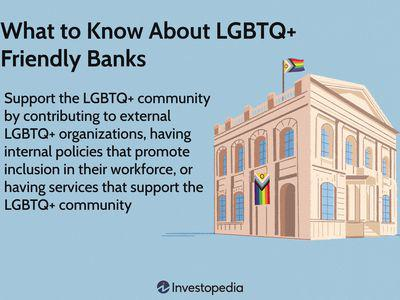

Ethical investing, also known as socially responsible investing (SRI), is an investment strategy that seeks to generate both financial return and social good. It focuses on companies and assets that contribute positively to society and the environment, aligning investment choices with the moral values of the investor. In recent years, ethical investing has gained prominence in financial markets, driven by increasing awareness of social and environmental issues. This trend reflects a broader investor demand for transparency and accountability, promoting practices that address societal challenges such as climate change, human rights, and equality.

Among the various areas within ethical investing, LGBTQ+ investments represent a critical facet for fostering diversity and inclusivity. These investments prioritize companies that support lesbian, gay, bisexual, transgender, and queer (LGBTQ+) rights and demonstrate commitment to equality through inclusive policies and practices. By focusing capital on LGBTQ+ inclusive businesses, these investments not only aim for financial returns but also contribute to reducing discrimination and promoting equal rights within the workplace and broader society.

Inclusive companies play a pivotal role in supporting LGBTQ+ communities. They implement policies that ensure equal opportunities, create safe and welcoming environments, and actively engage in advocacy for LGBTQ+ rights. Such companies frequently rate higher on equality indices and are often seen as more progressive and attractive to diverse talent pools. Their impact extends beyond their workforce, as they influence industry norms and contribute to societal change through corporate social responsibility initiatives.

In modern investing, algorithmic trading—a method of executing large orders using automated, pre-programmed trading instructions—emerges as a powerful tool. Its significance lies in its ability to process vast amounts of financial data rapidly, enabling investors to make informed decisions. When integrated with ethical investment strategies, algorithmic trading can enhance the efficacy and scalability of ethical investments, including those that prioritize LGBTQ+ inclusivity. Algorithms can be designed to consider a company's inclusivity metrics or ESG scores, weaving ethical considerations into automated trading decisions.

This article explores the intersection of ethical investing, LGBTQ+ inclusive companies, and algorithmic trading technologies. It investigates how these elements interrelate and the potential they hold to transform the investment landscape, making it more aligned with ethical and inclusive principles. Through understanding the roles of each component, investors can better navigate the complexities of modern financial markets and champion causes that reflect their values.

## Table of Contents

## Understanding Ethical Investing

Ethical investing, also known as socially responsible investing (SRI), involves selecting investments based on ethical considerations as part of a broader investment strategy seeking both financial return and social good. Unlike traditional investment strategies, which prioritize financial returns as the primary objective, ethical investing incorporates a set of criteria related to environmental, social, and governance (ESG) factors. The intention is to invest in companies and projects that align with the investor's values and contribute positively to society and the environment.

When investors choose ethical investments, they often consider several critical factors. These include the environmental impact of a company's operations, such as carbon footprint and resource use; social aspects, such as labor practices, community relations, and human rights; and governance issues, including corporate ethics, executive compensation, and shareholder rights. By evaluating these aspects, investors can determine if a company adheres to principles of social responsibility and sustainability.

Social responsibility and sustainability are central tenets of ethical investing as they signify a commitment to long-term societal benefits over short-term financial gains. Companies that demonstrate responsible practices tend to build stronger brands and more sustainable business models, which can translate to increased trust among consumers and investors alike. This focus on sustainability is increasingly crucial as global concerns about climate change, inequality, and governance practices grow.

Recent trends in the ethical investing space showcase significant growth and impact. According to a report by the Global Sustainable Investment Alliance, sustainable investing assets in major global markets reached $35.3 trillion in 2020, marking a 15% increase from 2018. The uptick in [ESG](/wiki/esg-investing)-focused funds and indices further highlights this trend. Additionally, a rising number of investors, particularly millennials, express interest in aligning their investment choices with their social and environmental values, driving further demand for ethical investment products.

In conclusion, ethical investing offers a compelling alternative to traditional investment strategies by integrating financial and ethical considerations. It empowers investors to support the values they believe in and contribute to positive societal change while seeking financial returns. As awareness and demand for responsible investing continue to grow, the landscape of ethical investing will likely evolve, offering new opportunities for both individual and institutional investors.

## The Importance of LGBTQ+ Investments

LGBTQ+ investments represent financial commitments to companies, funds, or initiatives that actively support and promote the rights and inclusion of LGBTQ+ communities. These investments play a crucial role in fostering equality and diversity by directing capital towards entities that uphold and champion non-discriminatory practices, equal opportunity, and inclusive policies.

One of the primary benefits of investing in LGBTQ+ focused companies is the promotion of workplace diversity, which has been shown to enhance creativity and problem-solving within organizations. Firms that embrace LGBTQ+ inclusivity often report higher levels of employee satisfaction and engagement, which can lead to improved company performance and profitability. In addition to enhancing workplace culture, these investments can also attract a broader customer base that values corporate social responsibility (CSR). By supporting businesses that prioritize inclusivity, investors can signal their own commitment to ethical principles, potentially attracting like-minded stakeholders.

Several companies exemplify strong commitments to LGBTQ+ inclusivity. For instance, Salesforce, a leader in customer relationship management (CRM) software, has consistently been recognized for its efforts to create an inclusive environment through policies such as equal benefits for same-sex partners and implementing anti-discrimination practices. Similarly, IBM has a history of supporting LGBTQ+ rights, having introduced diversity training programs and advocated for equitable legislative policies.

Financial products and funds that prioritize LGBTQ+ inclusivity include the Workplace Equality Index Funds, which invest in companies demonstrating strong performances in the Human Rights Campaign's Corporate Equality Index. These funds provide investors with the opportunity to support businesses that align with their values regarding equality and human rights.

Investing in LGBTQ+ focused companies not only promotes positive social change but also encourages a shift in corporate policies towards inclusivity. By supporting these investments, investors can help drive systemic changes that advance equal rights and representation, contributing to a more equitable society. This shift can lead to broader societal acceptance and legal reforms, enhancing the quality of life for LGBTQ+ individuals globally.

In conclusion, LGBTQ+ investments are pivotal for fostering diversity and equality. They enable investors to align their portfolios with their ethical values while also supporting businesses that actively promote inclusion, ultimately leading to positive social outcomes and enhanced rights for the LGBTQ+ community.

## Identifying Inclusive Companies

An inclusive company, particularly in supporting LGBTQ+ communities, positions itself as an advocate for diversity, equality, and belonging within its workforce and business practices. Inclusivity in a corporate context often means recognizing and valuing diverse backgrounds, identities, and perspectives, and implementing structures and policies that protect and promote equal opportunities for all employees.

Several indicators and criteria are used to evaluate a company's inclusivity. Important metrics include the existence of non-discrimination policies that explicitly mention sexual orientation and gender identity, the provision of equal benefits for all employees and their partners, the presence of Employee Resource Groups (ERGs) for LGBTQ+ employees, and active efforts in LGBTQ+ community engagement and support. Companies are also evaluated on their internal training programs aimed at promoting diversity and inclusion, and their participation in external benchmarks and indices, such as the Human Rights Campaign's Corporate Equality Index.

Examples of companies recognized for their inclusivity include Salesforce, IBM, and Microsoft. Salesforce offers comprehensive health benefits covering gender-affirming medical procedures and provides training focused on diversity and unconscious bias. IBM has a long history of promoting LGBTQ+ inclusion, with policies in place since the 1980s, and Microsoft is noted for its active LGBTQ+ employee network and participation in pride events globally. Each of these companies consistently scores highly in indices assessing their commitment to diversity and equality.

In the market, inclusive companies are often perceived positively, not only by employees seeking equitable workplaces but also by investors who prioritize environmental, social, and governance (ESG) criteria in their investment decisions. The positive perception is translated into enhanced brand reputation, which can lead to increased customer loyalty and potentially higher profitability. Moreover, ethical investors view these companies as lower-risk investments due to their commitment to fostering a respectful and supportive work environment.

Incorporate inclusivity as a core component of ethical investing to support sustainable and socially responsible business models that benefit both LGBTQ+ individuals and society as a whole. This alignment can contribute to a company's long-term success and resilience in an ever-evolving market environment.

## The Role of Algorithmic Trading in Ethical Investing

Algorithmic trading refers to the use of computer algorithms to automate trading decisions, executing orders with speed and precision that surpasses human traders. It functions by analyzing vast amounts of market data in real time and applying complex mathematical models and formulas to determine the optimal timing, price, and quantity for trade execution. In the current investment landscape, [algorithmic trading](/wiki/algorithmic-trading) dominates markets due to its efficiency and ability to operate on millisecond timescales, reducing the cost and slippage associated with manual trading. 

Incorporating ethical considerations into algorithmic trading begins with the design of the algorithm itself. Programmers can integrate criteria based on Environmental, Social, and Governance (ESG) factors, which are used to evaluate the ethical and societal impact of investment decisions. For instance, an algorithm could prioritize trades in companies with high ESG scores while avoiding those that fail to meet specified ethical standards. This can be implemented by including constraints or objectives in the algorithm that target sustainability metrics or corporate responsibility indices. 

The benefits of utilizing algorithmic trading for ethical investments include increased [liquidity](/wiki/liquidity-risk-premium) in ethical markets, reduced human bias in decision-making, and enhanced ability to balance financial returns with ethical values. Algorithms can systematically screen thousands of companies against chosen ethical criteria, allowing investors to maintain a robust ethical portfolio. Moreover, by employing advanced data analytics, algorithms can identify emerging trends and opportunities in ethical markets, potentially offering competitive financial returns.

However, challenges exist in integrating ethical principles into algorithmic trading. The primary difficulty lies in the quantification of ethical values, which are inherently qualitative and subjective. Achieving a balance between financial performance and ethical considerations requires careful calibration of algorithms and ongoing monitoring to ensure alignment with investor values. Ethical investing also faces the broader challenge of defining and standardizing what constitutes "ethical" behavior across diverse contexts and cultures.

Several trading platforms and tools now support ethical and inclusive investing strategies through algorithms. For instance, platforms like Betterment and Wealthfront offer socially responsible investment options that align with clients' ethical preferences by algorithmically adjusting portfolio compositions. Tools like the Nasdaq ESG Data Hub provide datasets that algorithms can use to evaluate companies based on ESG criteria, facilitating informed and ethically driven investment decisions.

In conclusion, algorithmic trading plays a pivotal role in ethical investing by enabling investors to systematically incorporate ethical standards into their trading strategies, thus making ethical investing more accessible and scalable. While challenges remain, particularly in translating subjective ethical considerations into algorithmic frameworks, continued advancements in data analytics and [machine learning](/wiki/machine-learning) hold promise for overcoming these obstacles. As such, algorithmic trading not only enhances the efficiency of ethical investing but also supports the broader movement towards investing with a conscience.

## Integrating LGBTQ+ Strategies with Algorithmic Trading

Integrating LGBTQ+ investment strategies with algorithmic trading holds significant potential for optimizing investment outcomes while promoting inclusivity. By leveraging the precision and speed of algorithms, investors can efficiently incorporate LGBTQ+ inclusivity data into decision-making processes, thereby enhancing both financial returns and social impact.

To illustrate, consider a scenario where an algorithm is programmed to prioritize investments in companies with high LGBTQ+ inclusivity scores. These scores can be derived from various data sources, such as corporate equality indices, diversity policies, and employee feedback. The algorithm can analyze this data alongside financial performance metrics to identify companies that not only perform well financially but also demonstrate a commitment to inclusivity. This dual analysis ensures that investment portfolios are aligned with both ethical standards and financial goals.

The integration of LGBTQ+ inclusivity data into algorithmic trading can be realized through the use of machine learning models. These models can process vast amounts of structured and unstructured data, identifying patterns that might not be immediately apparent to human analysts. For example, a machine learning model could use natural language processing to evaluate corporate reports and news articles, assessing a company's stance and actions regarding LGBTQ+ issues.

However, incorporating LGBTQ+ strategies into algorithmic trading is not without challenges. One potential pitfall is the availability and reliability of inclusivity data. Misleading or scarce data can skew results, leading to suboptimal investment decisions. Moreover, ethical considerations arise when relying heavily on algorithmic processes. Algorithms may unintentionally perpetuate biases found in the data they are trained on, necessitating rigorous oversight and continuous evaluation.

There are also ethical considerations when designing algorithms for inclusive investing. It's crucial to ensure that algorithms do not merely exploit LGBTQ+ inclusivity for profit but genuinely contribute to promoting diversity and equality. Ethical frameworks and transparent criteria should be established to guide the integration process, ensuring that social impact remains a primary objective.

In conclusion, the integration of LGBTQ+ investment strategies with algorithmic trading offers promising opportunities for enhancing investment portfolios while promoting social good. By leveraging data-driven decision-making, investors can align their portfolios with ethical values, although care must be taken to address data reliability and ethical concerns proactively.

## Future Trends and Considerations

Ethical investing and LGBTQ+ strategies are at a pivotal point, poised for significant evolution driven by technological advancements and societal changes. These developments promise to refine, expand, and challenge existing frameworks within the investment landscape.

### Emerging Technologies

Emerging technologies, including [artificial intelligence](/wiki/ai-artificial-intelligence) (AI) and blockchain, hold the potential to reshape ethical investing. AI can enhance decision-making processes by analyzing vast datasets to uncover trends in corporate inclusivity and ethical performance. For instance, machine learning algorithms could be employed to assess a company's LGBTQ+ policies and initiatives, providing a more granular and unbiased evaluation of its inclusivity practices. Additionally, blockchain technology can offer transparency and traceability, ensuring that investments advertised as ethical genuinely adhere to their stated principles.

AI's role in natural language processing (NLP) might further enable investors to gauge public sentiment and detect biases or shifts in public opinion about inclusivity measures through social media analysis or financial news coverage. These technological tools can empower investors to create more responsive and adaptive strategies that align closely with ethical and inclusive standards.

### Ongoing Challenges and Criticisms

Despite technological progress, ethical investing faces inherent challenges, including the risk of "greenwashing" or "rainbow-washing," where companies exaggerate or misrepresent their commitment to ethical practices. This skepticism necessitates robust due diligence and enhanced regulatory frameworks to scrutinize the authenticity of claimed inclusivity measures.

There is also a persistent debate over the financial performance of ethical investments. Critics argue that prioritizing ethical components may detract from profit maximization. To address this, further empirical research and historical data analysis can elucidate the long-term performance implications of ethical investments, providing a clearer picture of their viability as competitive options.

### Advocacy and Education

Education and advocacy are crucial in sustaining [momentum](/wiki/momentum) for inclusive investment practices. Continuous efforts to raise awareness about the benefits and methodologies of ethical investing can cultivate a more informed investor base. Educational initiatives could focus on integrating inclusive practices into standard investment education and corporate training, emphasizing the intersection of profitability and social responsibility.

Furthermore, the development and dissemination of standardized metrics for evaluating LGBTQ+ inclusivity in the business environment will enable investors to make more informed comparisons and choices. Programs that certify or rank companies based on inclusivity can serve as valuable resources for investors seeking to align their portfolios with their values.

In conclusion, the future of ethical investing and LGBTQ+ strategies promises both exciting opportunities and notable challenges. As technology evolves and societal expectations shift, these investment strategies are likely to become more sophisticated and prevalent. Through continued advocacy, education, and technological innovation, the investment community can progress toward a more inclusive and responsible future.

## Conclusion

The exploration of ethical investing, LGBTQ+ inclusive strategies, and algorithmic trading highlights a transformative approach in the financial sector that seeks to blend financial performance with social responsibility. Ethical investing stands as a critical strategy that challenges the traditional barriers of investment practices by prioritizing social, environmental, and governance factors. This integration provides a holistic framework where investments are not solely driven by profit but also by the positive impact they can generate.

LGBTQ+ investments demonstrate the power of finance to effect social change by supporting companies and funds committed to diversity and equality. Companies that prioritize LGBTQ+ inclusivity are not only enhancing their social footprint but are also redefining market perceptions and driving broader social change. Their policies and initiatives often serve as benchmarks for inclusivity, leading the way for others in the industry.

The advent of algorithmic trading offers an innovative dimension to ethical investing. By designing algorithms that incorporate ethical considerations, investors can automate decisions that align with their values, optimizing both ethical and financial outcomes. The synergy between algorithmic trading and LGBTQ+ strategies provides a compelling avenue for enhancing investment portfolios, enabling data-driven decisions that are both inclusive and strategic.

Investors are encouraged to consider these multifaceted factors in their investment decisions to tap into the potential of social change as well as financial returns. There is a call to action for further research and engagement in ethical investing practices. By increasing awareness and education around these integrative strategies, financial markets can serve as a powerful platform for fostering inclusivity and sustainability while achieving substantial economic growth.

## References & Further Reading

[1]: Global Sustainable Investment Alliance. (2020). ["Global Sustainable Investment Review 2020."](http://www.gsi-alliance.org/wp-content/uploads/2021/08/GSIR-20201.pdf) 

[2]: Human Rights Campaign. ["Corporate Equality Index."](https://www.hrc.org/resources/corporate-equality-index) 

[3]: Burke, M.E., & Gay, R. (2020). ["The ESG Investing Handbook: Insights and How-to Advice for Your Journey into Responsible Investing."](https://en.wikipedia.org/wiki/Isaiah_Washington) Harriman House.

[4]: Moyer, J. (2012). ["Profit and Principle: A Call to Action for Responsible Investment."](https://link.springer.com/referenceworkentry/10.1007/978-3-319-95885-9_19) Environmental Policy and Law.

[5]: Theodoridis, T., & Manthos, D. (2016). ["A Survey of Algorithmic Trading Strategies."](https://books.google.com/books/about/Machine_Learning.html?id=l-nEDwAAQBAJ) 

[6]: Sarbah, A., & Wen, X. (2012). ["Corporate Social Responsibility: An Overview and New Research Areas."](https://journals.aom.org/doi/10.5465/amj.2016.5001)