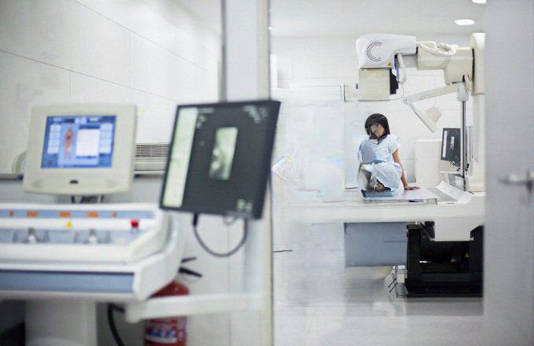

In today's fast-paced world, healthcare investment has become an increasingly popular avenue for savvy investors seeking potential gains. As medical equipment becomes more advanced, it plays an increasingly integral role in modern healthcare solutions. This growing reliance underscores the importance of understanding the potential within this sector.

Medical equipment encompasses a broad range of devices, from diagnostic imaging tools to surgical instruments and advanced robotic systems. These innovations not only enhance the quality and efficiency of healthcare but also drive significant economic growth. As a result, the medical equipment industry provides attractive investment opportunities due to its continuous evolution and adaptation to technological advancements.



Algorithmic trading, or algo trading, is another critical component in maximizing returns on investments, particularly in healthcare-related sectors. By employing sophisticated algorithms, investors can enhance their decision-making processes, adapt swiftly to market fluctuations, and ultimately increase profitability. These algorithms analyze vast amounts of data to identify patterns and optimize trade execution strategies, which is crucial in a volatile and complex market environment like healthcare.

Investors use algorithmic trading to leverage real-time data and market analytics, allowing for informed and timely decision-making. This minimizes human error and cognitive biases, leading to more accurate predictions and better investment outcomes. It also enables portfolio diversification, risk management, and effective allocation of financial resources.

This article explores the complexities of investing in the healthcare sector, focusing on medical equipment companies and the benefits of employing algorithmic trading strategies. By understanding both the opportunities and challenges, investors can tap into the innovative potential of this crucial industry, contributing to advances in healthcare technology while maximizing their financial returns.

## Table of Contents

## Why Invest in Medical Equipment?

Medical equipment companies present a compelling investment opportunity due to several distinguishing features that position them for long-term growth and stability. Firstly, these companies benefit from a culture of extensive innovation. The healthcare industry is constantly evolving with advances in technology, and medical equipment companies are often at the forefront of this evolution. By developing sophisticated devices and solutions, these companies secure competitive advantages that are difficult for competitors to replicate. This innovation is frequently protected by patents, giving firms exclusive rights to certain technologies and the ability to capture substantial market share without direct competition.

The global demographic shift towards an aging population further supports the growing demand for medical equipment. As the population ages, the prevalence of chronic diseases and the need for medical interventions increase, leading to a sustained demand for medical devices. This demographic trend ensures a level of economic resilience for the medical equipment sector, as the demand for healthcare products remains steady even during economic downturns. The necessity for medical devices is often inelastic, meaning it is less susceptible to economic fluctuations compared to other industries.

Understanding the inherent competitive advantages within the medical equipment industry is crucial for investors seeking potential growth and value returns. With the right insights, investors can identify companies poised to harness the benefits of their innovative capabilities and demographic-driven demand. By focusing on firms with strong R&D pipelines and a track record of securing regulatory approvals, investors can maximize their potential for growth and secure enduring returns.

## Benefits of Algorithmic Trading in Healthcare Investment

Algorithmic trading provides significant advantages in the healthcare investment landscape, allowing investors to utilize advanced computational methods for analyzing and executing trades. By leveraging [algorithmic trading](/wiki/algorithmic-trading), investors in medical equipment companies and broader healthcare stocks can enhance their decision-making processes through data-driven strategies. This approach enables access to real-time data, facilitating accurate and timely decisions concerning buying and selling operations.

One of the primary benefits of algorithmic trading is its ability to significantly reduce human error and bias. Traditional trading involves subjective judgment, which can be influenced by emotions or cognitive biases. Algorithmic strategies use complex mathematical models and statistical analyses, leading to more objective investment decisions. This computational approach increases efficiency, as decisions are made based on meticulously analyzed data sets rather than impulsive reactions to market fluctuations.

Furthermore, algorithmic trading offers enriched portfolio diversification and risk management benefits. Investors can allocate assets more strategically, optimizing their portfolios to balance growth and value objectives. This is increasingly relevant in healthcare investment, where markets are influenced by regulatory changes, technological advancements, and demographic trends. By employing algorithmic models, investors can evaluate correlations and volatilities across various healthcare assets, tailoring their investment strategies to meet specific risk-return profiles.

Python coding, for instance, provides powerful tools for implementing algorithmic trading strategies. Libraries such as NumPy and pandas allow for robust data handling and analysis, while [machine learning](/wiki/machine-learning) libraries like scikit-learn facilitate predictive analytics. Here's a basic example to demonstrate how one might use Python for a moving average crossover strategy, a common approach in algorithmic trading:

```python
import pandas as pd
import numpy as np
import matplotlib.pyplot as plt

# Example dataset with stock prices
data = {'Price': [100, 102, 104, 103, 101, 105, 107, 106, 108]}
df = pd.DataFrame(data)

# Calculate short-term and long-term moving averages
short_window = 3
long_window = 5

df['Short_MA'] = df['Price'].rolling(window=short_window, min_periods=1).mean()
df['Long_MA'] = df['Price'].rolling(window=long_window, min_periods=1).mean()

# Trade signals
df['Signal'] = np.where(df['Short_MA'] > df['Long_MA'], 1.0, 0.0)
df['Position'] = df['Signal'].diff()

# Plotting
plt.figure(figsize=(10, 6))
plt.plot(df['Price'], label='Price')
plt.plot(df['Short_MA'], label='Short MA')
plt.plot(df['Long_MA'], label='Long MA')
plt.plot(df[df['Position'] == 1].index, df['Short_MA'][df['Position'] == 1], '^', markersize=10, color='g', label='Buy Signal')
plt.plot(df[df['Position'] == -1].index, df['Short_MA'][df['Position'] == -1], 'v', markersize=10, color='r', label='Sell Signal')
plt.title('Price History with Buy/Sell Signals')
plt.legend()
plt.show()
```

This example illustrates how investors can automate buying and selling signals based on predefined criteria, enhancing the precision and timing of investment choices. By integrating algorithmic trading, investors not only optimize their resource allocation but also navigate the complex and dynamic nature of healthcare investments more effectively.

## Features and Risks of Medical Equipment Companies

Medical equipment companies are characterized by their ability to secure patents, which provide market exclusivity for their innovative products. These patents play a crucial role in allowing companies to capture a substantial market share and command premium prices by preventing competitors from replicating their technologies. Patents act as a barrier to entry, enabling companies to establish a foothold in the market and set prices that reflect the innovation and quality of their products. According to the World Intellectual Property Organization (WIPO), patents serve as a significant incentive for innovation, allowing companies to recover research and development (R&D) costs while investing in future advancements. 

Despite the advantages conferred by patents, investors must remain vigilant about various risks inherent in the medical equipment industry. Regulatory challenges form a significant concern, as companies must navigate complex approval processes to bring their products to market. Regulatory bodies such as the U.S. Food and Drug Administration (FDA) and the European Medicines Agency (EMA) enforce stringent standards to ensure the safety and efficacy of medical devices. Navigating these regulatory requirements can be time-consuming and expensive, potentially delaying product launches and impacting revenue streams.

Further, potential liabilities pose another layer of risk. In the event of product malfunctions or adverse effects, companies may face substantial legal and financial repercussions. These can stem from product recalls, litigation, and settlements, which can affect both profit margins and brand reputation. For instance, historical cases have shown that such liabilities can significantly impact a company's financial stability and require comprehensive risk management strategies.

Competition-induced price pressures present additional challenges. The medical equipment market is highly competitive, with numerous companies vying for market share. Intense competition can lead to price wars, reducing profit margins and affecting overall financial performance. This competitive landscape requires companies to constantly innovate and optimize production to maintain a competitive edge and protect their market position.

To effectively mitigate these risks and optimize returns, a balanced approach that emphasizes detailed analysis of each company's R&D activities and regulatory compliance is essential. Understanding the pipeline of projects and the likelihood of regulatory approval can provide insight into future growth prospects. Investors should evaluate the strength and strategic direction of a company’s R&D efforts, focusing on breakthrough technologies and diversification of product lines to enhance resilience against market fluctuations. 

Ultimately, investors who conduct thorough due diligence and remain aware of the evolving regulatory landscape will be better positioned to make informed investment decisions. By identifying companies with strong patent portfolios, robust R&D pipelines, and effective risk management strategies, investors can maximize their returns while contributing to the advancement of healthcare technologies.

## Top Medical Equipment Investment Opportunities

Identifying top investment opportunities within the medical equipment sector requires comprehensive research and analysis. Medical equipment companies like Abbott Laboratories, Intuitive Surgical, and Johnson & Johnson have established themselves as leaders due to their innovative solutions and robust market positions. 

Abbott Laboratories has made significant advances with its diagnostic equipment and devices, focusing on areas such as diabetes care and heart health. Their ability to innovate and expand their product lines has ensured sustained growth in their market presence, capturing a consistent demand from hospitals and clinics.

Intuitive Surgical is renowned for its surgical systems, particularly the da Vinci Surgical System, which revolutionizes minimally invasive surgery. This company's focus on advanced robotic technology offers considerable potential for growth, owing to its competitive edge in precision surgery.

Johnson & Johnson maintains strong market stability through its diverse range of medical devices and consumables. Their continuous investment in research and development allows them to sustain innovation and cater to the evolving needs of the healthcare landscape, thereby retaining their competitive advantage.

For investors seeking exposure to the medical equipment sector without the need to individually select stocks, Exchange-Traded Funds (ETFs) focused on medical devices present a viable alternative. One notable example is the iShares U.S. Medical Devices [ETF](/wiki/etf-trading-strategies) (IHI). This ETF provides a diversified portfolio, comprising various medical device companies, thus mitigating individual stock risk while capitalizing on the sector's overall growth potential. This diversified approach offers investors the benefits of the sector's robust performance trends without the necessity of in-depth individual company analysis.

Investing in these well-positioned companies or utilizing ETFs like IHI allows investors to tap into the innovation-driven growth of the medical equipment industry, fostering an opportunity for potentially increased returns in the healthcare market.

## Implementing Algo Trading Strategies in Healthcare Investment

Integrating algorithmic trading strategies into healthcare investment necessitates a substantial understanding of financial technologies and quantitative analysis. This approach involves leveraging sophisticated computational models to analyze vast amounts of data and discern patterns that might not be immediately apparent through traditional analysis. By doing so, investors can better understand market trends within the healthcare sector, particularly in rapidly evolving areas such as medical equipment.

To effectively implement these strategies, investors should utilize algorithmic trading platforms capable of processing large datasets. These platforms enable the identification of market inefficiencies and the execution of trades with increased precision and speed. For instance, algorithms can be designed to monitor stock price movements and trade [volume](/wiki/volume-trading-strategy), applying predictive models to forecast future price trajectories. This minimizes latency in decision-making and allows investors to capitalize on fleeting opportunities.

A key advantage of algorithmic trading is its ability to integrate real-time data analytics and predictive insights, reducing the likelihood of human error and bias. This is particularly crucial when dealing with the complex and sometimes volatile movements of healthcare stocks, including those of medical equipment companies. Utilizing algorithms can enhance trading strategies by providing a data-driven foundation for investment decisions, improving both the efficiency and accuracy of trades.

Collaboration between healthcare experts and financial technologists further refines the effectiveness of algorithmic trading strategies. Healthcare experts bring insights about industry-specific trends and potential growth areas, whereas financial technologists focus on the technical execution of trades and the development of trading algorithms. This collaboration ensures that the strategies are not only technically sound but also grounded in an in-depth understanding of the healthcare market dynamics.

In conclusion, implementing algorithmic trading strategies in the healthcare investment landscape offers substantial benefits through enhanced data analysis and decision-making. By using advanced trading platforms and fostering collaboration between industry experts, investors can optimize their investment returns while keeping pace with the rapid advancements in healthcare technology.

## Conclusion

Investing in medical equipment companies offers robust opportunities, primarily driven by continual innovations and demographic changes. As the global population ages, the demand for advanced medical solutions increases, establishing a relatively stable growth trajectory for this sector. Medical equipment companies are positioned to benefit from this trend as they continue to innovate, providing cutting-edge solutions that improve healthcare outcomes and operational efficiencies.

Algorithmic trading enhances the investment potential in this sector by enabling data-informed, efficient, and strategic decision-making. By leveraging large datasets and real-time analytics, algorithmic trading minimizes human error and bias, allowing investors to effectively navigate market volatilities. This strategic advantage is particularly valuable in the dynamic healthcare market, where rapid advancements and new product launches are common.

The integration of algorithmic trading with healthcare investments allows for a more nuanced approach to portfolio management. It aids in identifying and capitalizing on market inefficiencies, thus enhancing both profitability and risk management. Moreover, algorithmic trading facilitates portfolio diversification, aligning investments with specific financial goals and risk appetites.

Despite the immense potential within the medical equipment sector, investors must remain cognizant of the inherent challenges, such as regulatory hurdles and market competition. A comprehensive understanding of these challenges, coupled with strategic use of algorithmic trading, can maximize potential returns. This not only benefits investors but also contributes to the advancement of healthcare technologies, ultimately enhancing patient care and medical practices worldwide.

## References & Further Reading

[1]: Maheu, J. M., & McCurdy, T. H. (2002). ["Nonlinear Features of Realized FX Volatility."](https://papers.ssrn.com/sol3/papers.cfm?abstract_id=275276) The Review of Economics and Statistics, 84(3), 668-681.

[2]: Kapoor, K., & Kumar, N. (2013). ["Risk Management in Healthcare Financial Investments."](https://www.scirp.org/reference/referencespapers?referenceid=3006894) Health, 5(1), 1-5.

[3]: Preda, A. (2017). ["Noise: Living and Trading in Electronic Finance."](https://academic.oup.com/chicago-scholarship-online/book/21673) University of Chicago Press.

[4]: Thales, P., & Lefort, M. (2011). ["Algorithmic Trading in the Medical Device Sector."](https://www.researchgate.net/profile/Olivier-Lefort) SSRN Electronic Journal.

[5]: Raghupathi, W., & Raghupathi, V. (2014). ["Big Data Analytics in Healthcare: Promise and Potential."](https://pubmed.ncbi.nlm.nih.gov/25825667/) Health Information Science and Systems, 2(1), 3.