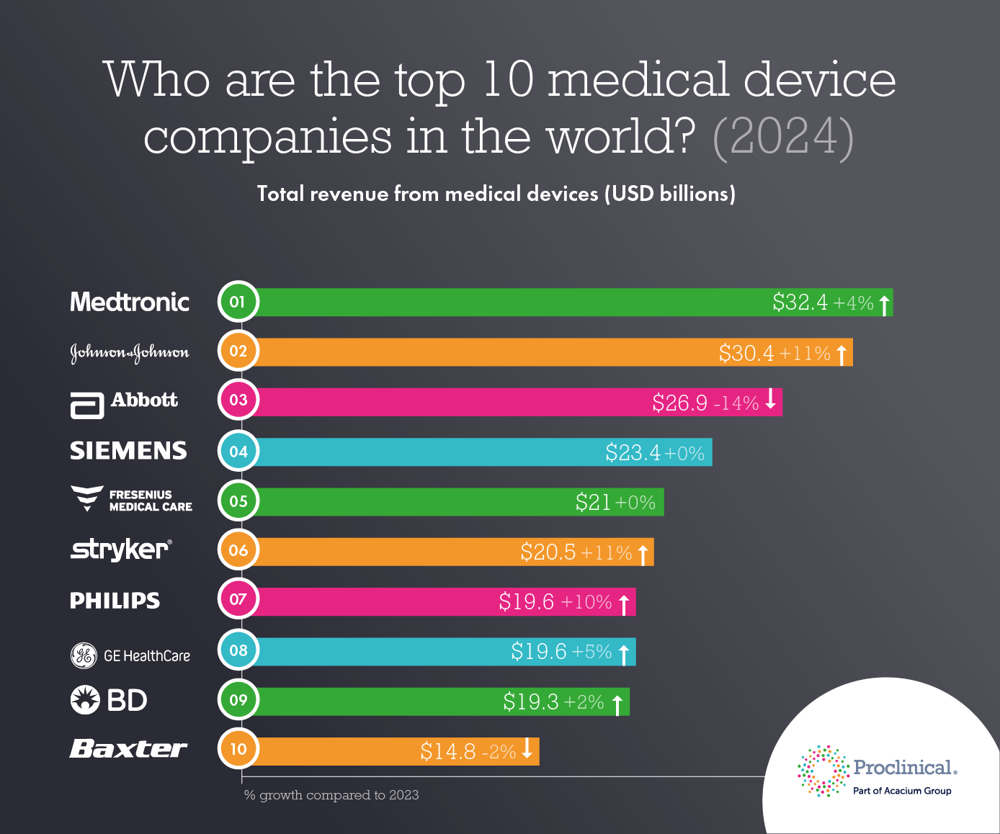

## Table of Contents

## What is medical equipment and why is it important?

Medical equipment includes all the tools and machines that doctors and nurses use to help people who are sick or injured. This can be things like stethoscopes to listen to your heart, X-ray machines to see inside your body, or even simple things like bandages and thermometers. These tools help healthcare workers figure out what is wrong with a patient and how to treat them.

Medical equipment is very important because it helps doctors and nurses do their jobs better. Without these tools, it would be much harder to find out what is making someone sick or how to make them better. For example, if someone breaks a bone, an X-ray machine can show exactly where the break is, so the doctor knows how to fix it. This equipment can also help save lives by quickly finding problems and treating them before they get worse.

## What are the different types of medical equipment companies?

Medical equipment companies can be divided into a few main types. First, there are companies that make the equipment. These manufacturers design and build everything from simple tools like bandages to complex machines like MRI scanners. They work with doctors and engineers to create new products that can help patients. Some big companies like this are Johnson & Johnson and Siemens.

Then, there are companies that sell and distribute medical equipment. These companies buy equipment from manufacturers and then sell it to hospitals, clinics, and other places where it's needed. They might also offer services like setting up the equipment and teaching people how to use it. Examples of these companies include McKesson and Cardinal Health.

Lastly, there are companies that focus on repairing and maintaining medical equipment. When machines break down or need regular check-ups, these companies step in to fix them. They make sure that the equipment keeps working well so that doctors and nurses can keep helping their patients. Companies like GE Healthcare and Philips provide these kinds of services.

## How does investing in medical equipment companies benefit the healthcare industry?

Investing in medical equipment companies helps the healthcare industry in many ways. When investors put money into these companies, it helps them create new and better tools for doctors and nurses. This means that healthcare workers can find out what's wrong with patients faster and treat them more effectively. For example, new machines might help doctors see inside the body more clearly or help them do surgery with less risk. This can make a big difference in how well patients get better.

Also, when medical equipment companies get more money, they can make more equipment and sell it at lower prices. This means that hospitals and clinics can afford to buy the latest tools, which can help more people get the care they need. When more people can get good healthcare, it makes the whole community healthier. So, investing in these companies not only helps the companies grow but also helps improve healthcare for everyone.

## What are the key factors to consider before investing in medical equipment companies?

Before you put money into medical equipment companies, you should think about a few important things. First, look at how the company is doing right now. Are they making money? Are they growing? It's a good sign if they are making new products and selling more of them. Also, check if the company is spending money on research and development. This means they are trying to make new and better tools for doctors, which can help them grow even more in the future.

Another thing to consider is the competition. There are a lot of companies making medical equipment, so you want to pick one that stands out. Maybe they have a special product that no one else has, or they might be really good at selling their equipment to hospitals. It's also important to think about the rules and laws that affect these companies. Governments can change rules about how medical equipment is made and sold, and that can make things harder or easier for the company.

Lastly, think about the bigger picture. The world's population is getting older, and more people will need healthcare. This means there will be more demand for medical equipment. But also think about how the economy is doing. If people and hospitals don't have much money, they might not buy new equipment. So, you need to weigh all these things to decide if it's a good time to invest in a medical equipment company.

## How do government regulations affect investments in medical equipment companies?

Government rules can have a big impact on how well medical equipment companies do, which in turn affects whether they are a good investment. These rules can control everything from how the equipment is made to how it is sold. For example, before a new piece of equipment can be used, it has to be checked and approved by government agencies like the FDA in the United States. This process can take a long time and cost a lot of money. If a company can't get its products approved, it might lose money and be a riskier investment.

On the other hand, if a company can meet all the rules and get its products approved, it can be a good sign for investors. It means the company is doing things the right way and can sell its equipment to hospitals and clinics. Also, sometimes governments change the rules to make it easier for new medical equipment to be approved, which can help companies grow faster. But investors need to keep an eye on these rules because they can change, and that can make a company's future more uncertain.

## What are the financial metrics to look at when evaluating medical equipment companies for investment?

When you want to invest in medical equipment companies, you should look at some important numbers to see how they are doing. One key number is revenue growth. This tells you if the company is selling more equipment over time. If revenue is going up, it's a good sign that the company is doing well. Another important number is profit margin. This shows how much money the company keeps after paying for everything it needs to make and sell its equipment. A high profit margin means the company is good at making money.

You should also look at the company's debt. If a company has a lot of debt, it might have trouble paying it back, which can be risky for investors. Another useful number is the return on equity (ROE). This tells you how well the company is using the money that shareholders have put into it. A high ROE means the company is making good use of that money. Finally, look at the price-to-earnings (P/E) ratio. This compares the company's stock price to how much money it makes. A lower P/E ratio might mean the stock is a good deal, but you need to compare it to other companies in the same industry.

These numbers can help you understand if a medical equipment company is a good investment. But remember, you should look at all these numbers together, not just one or two. Also, think about the bigger picture, like how the economy is doing and what the government rules are. All these things can affect how well a company does and whether it's a smart choice for your money.

## How does technological advancement influence the investment potential of medical equipment companies?

Technological advancement can really change how good an investment in medical equipment companies might be. When a company comes up with new technology, it can make their equipment better and more useful for doctors and patients. This can help the company sell more products and make more money. For example, if a company makes a new kind of scanner that can see inside the body better than before, hospitals will want to buy it. This can make the company's stock price go up, which is good for investors.

But, new technology can also be risky. It costs a lot of money to research and develop new equipment, and there's no guarantee it will work out. If a company spends a lot on a new technology that doesn't end up being popular or useful, it can lose money. Also, other companies might come up with even better technology, making the first company's products less valuable. So, investors need to think about how likely it is that a company's new technology will be successful and how it might affect the company's future.

## What are the risks associated with investing in medical equipment companies?

Investing in medical equipment companies can be risky because of the high costs involved in making new equipment. It takes a lot of money to research and develop new tools, and there's no guarantee that the new equipment will be successful. If a company spends a lot of money on something that doesn't work out, it can lose money and its stock price might go down. Also, the process of getting new equipment approved by government agencies like the FDA can take a long time and cost even more money. If the equipment doesn't get approved, the company could be in big trouble.

Another risk is competition. There are many companies making medical equipment, and they are always trying to come up with better products. If another company makes something better or cheaper, it can take away customers from the company you invested in. This can hurt the company's profits and make its stock price drop. Also, changes in government rules can affect how well a company does. If the rules change and make it harder for a company to sell its equipment, it can lose money. So, investors need to think about all these risks before putting their money into a medical equipment company.

## How can one diversify their investment portfolio with medical equipment companies?

To diversify your investment portfolio with medical equipment companies, you can start by choosing a mix of different types of companies in the industry. This means you could invest in companies that make equipment, companies that sell and distribute it, and companies that repair and maintain it. By spreading your money across these different types of businesses, you reduce the risk that comes with putting all your money into just one kind of company. For example, if one part of the industry has a tough time, like if new rules make it hard for manufacturers, your investments in distributors or service companies might still do well.

Another way to diversify is by [picking](/wiki/asset-class-picking) companies of different sizes. You could invest in big, well-known companies that have been around for a long time, as well as smaller, newer companies that might grow a lot in the future. Big companies are often more stable and less risky, but smaller companies can offer bigger rewards if they do well. By having a mix of both, you can balance the safety of big companies with the growth potential of smaller ones. This way, you're not putting all your eggs in one basket, and you can still benefit from the growth in the medical equipment industry.

## What are some successful case studies of investments in medical equipment companies?

One successful case study is the investment in Medtronic, a big company that makes medical equipment. Medtronic has been around for a long time and makes things like pacemakers and insulin pumps. Investors who put money into Medtronic have seen good returns because the company keeps coming up with new products and growing. For example, in the last few years, Medtronic has been working on new technology for less invasive surgeries, which has helped them sell more equipment and make more money. This shows that investing in a well-established company with a focus on innovation can be a smart move.

Another good example is Intuitive Surgical, a company known for its da Vinci surgical system. This system helps doctors do surgery with tiny cuts instead of big ones, which is better for patients. When Intuitive Surgical first came out with the da Vinci system, it was a big hit, and the company's stock price went up a lot. Investors who got in early made a lot of money as the company grew. Even though the stock can go up and down, Intuitive Surgical has kept making new versions of the da Vinci system and selling more of them, which has helped keep the company strong. This shows that investing in a company with a unique and successful product can lead to big rewards.

## How do global market trends impact the investment in medical equipment companies?

Global market trends can really affect how well medical equipment companies do, which in turn impacts whether they are a good investment. One big trend is that the world's population is getting older. As more people get older, they need more healthcare, which means more demand for medical equipment. This can be good for companies that make things like heart monitors or machines that help with breathing. But, it also means that these companies need to keep up with the growing need and come up with new products that help older people. If they can do this well, their stock prices might go up, making them a good investment.

Another trend is how fast technology is changing. New technology can make medical equipment better and more useful, but it can also be risky. If a company comes up with a new piece of equipment that's better than what's out there, it can sell a lot and make more money. But, it costs a lot to research and develop new technology, and there's no guarantee it will work out. Also, if other countries have different rules about medical equipment, it can be hard for a company to sell its products everywhere. So, investors need to think about these global trends and how they might affect a company's future before deciding to invest.

## What are the future prospects and emerging opportunities in the medical equipment industry for investors?

The future of the medical equipment industry looks bright for investors. One big reason is that the world's population is getting older. As more people get older, they need more healthcare, which means more demand for medical equipment. This can be good for companies that make things like heart monitors or machines that help with breathing. Also, new technology is always coming out, which can make medical equipment better and more useful. If a company can come up with a new piece of equipment that's better than what's out there, it can sell a lot and make more money. This means that investing in companies that are good at making new technology can be a smart move.

Another opportunity for investors is in the area of less invasive surgeries. These are surgeries that use tiny cuts instead of big ones, which is better for patients because they heal faster and have less pain. Companies like Intuitive Surgical, which makes the da Vinci surgical system, have done well with this kind of technology. If more companies can come up with new ways to do less invasive surgeries, it could be a big opportunity for investors. Also, the rise of telemedicine, where doctors can see patients over the internet, means there might be more demand for equipment that helps with this. So, investors should keep an eye on companies that are working on new technology for telemedicine and less invasive surgeries.

## References & Further Reading

[1]: Maheu, J. M., & McCurdy, T. H. (2002). ["Nonlinear Features of Realized FX Volatility."](https://papers.ssrn.com/sol3/papers.cfm?abstract_id=275276) The Review of Economics and Statistics, 84(3), 668-681.

[2]: Kapoor, K., & Kumar, N. (2013). ["Risk Management in Healthcare Financial Investments."](https://www.scirp.org/reference/referencespapers?referenceid=3006894) Health, 5(1), 1-5.

[3]: Preda, A. (2017). ["Noise: Living and Trading in Electronic Finance."](https://academic.oup.com/chicago-scholarship-online/book/21673) University of Chicago Press.

[4]: Thales, P., & Lefort, M. (2011). ["Algorithmic Trading in the Medical Device Sector."](https://www.researchgate.net/profile/Olivier-Lefort) SSRN Electronic Journal.

[5]: Raghupathi, W., & Raghupathi, V. (2014). ["Big Data Analytics in Healthcare: Promise and Potential."](https://pubmed.ncbi.nlm.nih.gov/25825667/) Health Information Science and Systems, 2(1), 3.