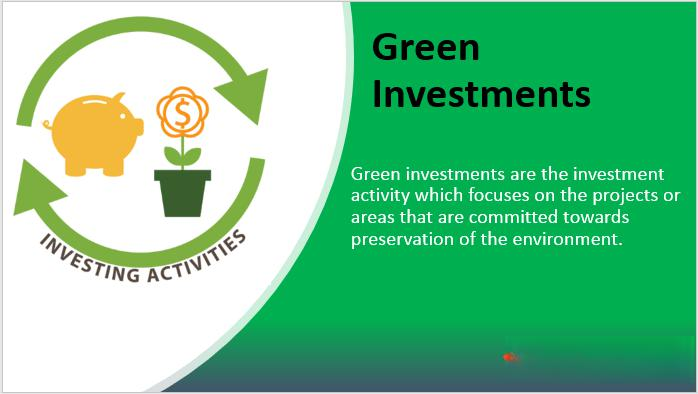

In recent years, there has been a growing focus on aligning investments with sustainable practices. This article explores the synergy between environmental investment, waste reduction, pollution control, and the innovative domain of algorithmic trading. These elements together form a multifaceted approach to modern investing. By integrating technology with sustainability efforts, investors can play a crucial role in fostering a cleaner and more sustainable future while simultaneously seeking attractive financial returns.

The importance of sustainable investing has become more pronounced as environmental challenges and global climate concerns continue to rise. Investors today are increasingly aware of the ethical and financial implications of their decisions, realizing that embracing sustainability can lead not only to positive environmental outcomes but also to profitable investment avenues. The combination of environmental awareness and technological innovation opens up new strategies for optimizing returns.



Environmental investment has evolved to encompass a wide array of financial vehicles and strategies. From green bonds to eco-conscious mutual funds, the investment landscape is rapidly transforming. Technologies like algorithmic trading add a layer of precision and efficiency, allowing traders to factor in environmental, social, and governance (ESG) metrics into their investment strategies. By processing large datasets in real-time, these advanced systems can swiftly identify and act upon sustainable investment opportunities.

This blend of sustainability and technology not only addresses critical environmental issues but also provides novel pathways for investors. As the world increasingly prioritizes green practices, understanding the interconnections between sustainable investment, waste reduction, pollution control, and technology-driven trading becomes imperative. This introduction sets the stage for a detailed examination of these intertwined components and the promising opportunities they present in today's investment landscape.

## Table of Contents

## The Role of Environmental Investment

Environmental investment focuses on directing capital towards projects and companies that adhere to sustainable practices, aiming to mitigate environmental impact. The core objective is to reduce carbon emissions, conserve resources, and promote ecological sustainability. This strategy encompasses several initiatives, including green bonds and green funds, which have become increasingly popular among investors.

Green bonds are financial instruments specifically earmarked for projects that have positive environmental benefits. These projects often include renewable energy, energy efficiency, clean transportation, and sustainable water management. For instance, the World Bank has been a pioneer in issuing green bonds, using the capital raised to fund projects worldwide that contribute to reducing greenhouse gas emissions [1].

Similarly, green funds are investment vehicles geared towards companies and projects with strong environmental, social, and governance ([ESG](/wiki/esg-investing)) performance. These funds evaluate potential investments based on factors like carbon footprint, resource usage, and pollution control measures. Investors are drawn to these funds as they not only promise potential financial returns but also contribute to long-term sustainability goals.

There is mounting evidence that aligning investments with sustainable objectives can provide significant financial benefits. A study by Morgan Stanley Institute for Sustainable Investing found that sustainable investments often perform as well or better than traditional investments [2]. This is partly because companies with sustainable practices are generally better equipped to navigate environmental regulations and are more resilient to global challenges such as climate change. 

The societal impact of environmental investments is equally significant. By channeling funds into sustainable projects, investors help foster innovations in green technologies, which in turn lead to job creation and economic development in emerging sectors. Companies leading in these areas often exhibit superior risk management capabilities and robust operational strategies. As the awareness and necessity for climate action intensify globally, the role of environmental investment becomes even more critical, influencing not only the financial industry but also broader societal structures.

Investment strategies incorporating sustainable practices are thus not faced with a trade-off between returns and ethics. They demonstrate that committing to eco-conscious objectives can yield substantial economic and societal rewards, paving the way for a sustainable future.

References:
1. World Bank Green Bonds - Making a Difference. The World Bank. Retrieved from https://www.worldbank.org/en/topic/climatechange/brief/green-bonds-climate-finance
2. Morgan Stanley. (2019). Sustainable Reality: Analyzing Risk and Return of Sustainable Funds. Retrieved from https://www.morganstanley.com/ideas/sustainable-investing-performance-risks-and-returns

## Reducing Waste and Pollution: A Key Investment Theme

Waste reduction and pollution control are crucial components of sustainable investing, emphasizing the minimization of ecological footprints while fostering economic growth. Companies that develop innovative waste management strategies and pollution reduction technologies are capturing increased attention and investments due to their potential to address environmental challenges effectively. These enterprises not only contribute to ecological sustainability but also offer attractive investment opportunities by tapping into the growing demand for eco-friendly solutions.

Regulatory policies worldwide are shaping the business landscape by encouraging and, in some cases, mandating sustainable practices. Governments are implementing policies that incentivize waste reduction, efficient resource utilization, and lowered emissions, which in turn drive companies to innovate and adopt sustainable technologies. These regulatory frameworks create a supportive environment for businesses pursuing waste and pollution reduction, making them more appealing to investors looking for sustainable investment options.

Investing in recycling, reusable materials, and clean technologies is pivotal for reducing ecological impacts. Companies that focus on these sectors are essential to building a circular economy, which aims to maintain resources in use for as long as possible, extract the maximum value, and recover and regenerate products at the end of their life cycle. By supporting these companies, investors not only contribute to environmental conservation but also capitalize on the economic benefits of resource efficiency and reduced waste.

Savvy investors are increasingly identifying and exploiting opportunities in sectors such as electric vehicles (EVs) and renewable energy, both of which play a significant role in reducing pollution and conserving resources. The production and adoption of electric vehicles help to lower greenhouse gas emissions, a major contributor to climate change. Meanwhile, investments in renewable energy sources, like solar and wind power, reduce reliance on fossil fuels, thereby diminishing pollution and promoting a sustainable energy future.

In conclusion, reducing waste and pollution remains a key theme in sustainable investing. With growing market and regulatory pressures, companies are increasingly innovating to decrease their environmental impact. Investors who recognize and act upon these trends are positioned to benefit from both financial returns and the broader societal impact of their investments.

## Pollution Control: Tackling Challenges at the Source

Pollution control investments target the reduction and eventual elimination of pollution from its origins. This approach emphasizes key sectors such as transportation, energy, and industrial processes, which are significant contributors to pollution worldwide. The transportation sector, for instance, is a primary source of carbon dioxide (CO2), nitrogen oxides (NOx), and particulate matter emissions. Investment in electric vehicle technology and infrastructure, such as charging stations and battery innovations, plays a crucial role in diminishing these pollutants.

In the energy sector, transitioning from fossil fuels to renewable energy sources is imperative. Solar, wind, and hydropower technologies significantly lessen greenhouse gas emissions, thus attracting substantial investment. Moreover, innovations like carbon capture and storage (CCS) systems are integral, as they provide methods to capture CO2 emissions directly from industrial processes before they reach the atmosphere. The mathematical modeling and optimization involved in designing efficient CCS systems can lead to more effective solutions in large-scale industrial applications.

Government initiatives and international treaties further catalyze investments in pollution control technologies. The Paris Agreement, for instance, sets global standards and commitments that drive national policies towards reducing emissions. These policies, in turn, create an economic environment conducive to investing in pollution reduction. In countries with strict environmental regulations, businesses are incentivized through tax credits and subsidies to adopt clean technologies, thus aligning economic benefits with environmental goals.

Companies excelling in reducing greenhouse gas emissions are gaining traction in global funds and investment portfolios. Firms that demonstrate tangible progress in adopting sustainable practices often see increased investment from environmentally-conscious funds. These companies not only contribute to global environmental goals but also represent long-term value in a market that increasingly prioritizes sustainability.

In summary, pollution control investments focus on early-stage intervention across major pollutive sectors, propelled by technological innovations and international regulatory frameworks. Such investments not only mitigate environmental damage but also position companies as leaders in sustainable development, offering opportunities for both economic and ecological advancement.

## Algorithmic Trading: Revolutionizing Sustainable Investments

Algorithmic trading is increasingly becoming a cornerstone in the pursuit of sustainable investments, primarily due to its efficiency and accuracy. At its core, [algorithmic trading](/wiki/algorithmic-trading) uses complex mathematical models and computational algorithms to buy and sell financial instruments. This technology enables traders to make data-driven decisions rapidly, reducing latency and transaction costs. 

By leveraging data and algorithms, traders can optimize investment decisions that align closely with Environmental, Social, and Governance (ESG) metrics. ESG metrics serve as crucial markers for sustainable investment, as they evaluate a company's commitment to environmental conservation, social responsibility, and ethical governance. Through the integration of algorithmic trading with ESG criteria, investors can swiftly navigate the financial terrain to identify viable, sustainable opportunities.

In addition, algorithmic trading is effective in identifying emerging trends within environmental sectors. The use of [machine learning](/wiki/machine-learning) and advanced analytics allows for the prediction and identification of market patterns that are indicative of sustainability-focused shifts. For instance, algorithms can analyze vast datasets including market reports, news articles, and social media feeds to anticipate shifts towards cleaner energy sources or eco-friendly practices. 

Moreover, this technology diminishes human biases and enhances decision-making based on real-time environmental data. Traditional trading is susceptible to emotional and cognitive biases that can skew decision-making; algorithmic trading mitigates this by relying on objective data and predefined criteria. For example, an algorithm can utilize time-series analysis to track the historical performance of green bonds and forecast future returns without subjective interference.

The combination of algorithmic trading with green investments accords a technology-driven approach to sustainability. Python, a widely-used programming language in algorithmic trading, provides libraries such as Pandas for data manipulation, NumPy for numerical computations, and TensorFlow or PyTorch for machine learning implementations. These tools can construct models that not only maximize financial returns but also adhere to sustainability objectives. For instance:

```python
import pandas as pd
import numpy as np

# Example of a simple moving average crossover strategy with an ESG filter
def moving_average_strategy(prices, long_window=40, short_window=10):
    signals = pd.DataFrame(index=prices.index)
    signals['price'] = prices
    signals['short_mavg'] = prices.rolling(window=short_window, min_periods=1).mean()
    signals['long_mavg'] = prices.rolling(window=long_window, min_periods=1).mean()
    signals['signal'] = 0.0

    # Buy signal - short moving average exceeds long moving average
    signals['signal'][short_window:] = np.where(signals['short_mavg'][short_window:] > signals['long_mavg'][short_window:], 1.0, 0.0)   
    signals['positions'] = signals['signal'].diff()

    # Assume ESG scores are available, apply a filter
    signals = signals[signals['esg_score'] > thresh]

    return signals

# prices: DataFrame containing stock prices over time
# signals: resulting signals after applying moving average strategy with ESG consideration
thresh = 50  # threshold for ESG score
prices = pd.Series([your_data])  # your_data represents stock prices
signals = moving_average_strategy(prices)
```

Through these methodologies, algorithmic trading not only meets the demands of a data-driven, fast-paced market but also supports the overarching goal of achieving sustainability in investment. This dual advantage positions investors to participate actively in fostering a cleaner, more sustainable planet while ensuring robust financial performance.

## Case Studies and Success Stories

Examining successful environmental investment stories highlights the practical impacts of integrating sustainability into financial strategies. A prime example is Waste Management Inc., a leading company in the waste and environmental services industry. This company has significantly advanced recycling and renewable energy projects, boasting its commitment to environmental stewardship. Waste Management Inc. has invested heavily in landfill gas-to-energy projects and single-stream recycling systems. These initiatives not only minimize waste but also convert it into valuable resources, demonstrating a profitable approach to sustainability.

Prominent investors like Bill Gates have also profoundly influenced the sustainability landscape by supporting eco-friendly ventures. Through Breakthrough Energy Ventures, Gates has funded a range of startups focused on clean energy innovations. This fund targets companies that offer groundbreaking solutions for reducing greenhouse gas emissions and promoting energy efficiency. Gates' investments underscore the potential of private capital in driving large-scale environmental change and aligning financial returns with sustainable goals.

Exchange-Traded Funds (ETFs) focused on clean energy have shown impressive performance, attracting investors interested in environmental sustainability. For instance, the iShares Global Clean Energy [ETF](/wiki/etf-trading-strategies) (ICLN) tracks the performance of companies involved in renewable energy technologies. These funds have experienced substantial growth, driven by increasing global emphasis on sustainable energy solutions. The performance of clean energy ETFs illustrates the financial viability and growing popularity of environmentally focused investments in the broader market.

Tech companies are leveraging algorithmic trading to enhance returns on green investments. By employing algorithms that analyze environmental, social, and governance (ESG) metrics, these firms can identify promising opportunities in the sustainable investment space. Algorithmic trading systems can swiftly process vast amounts of data to uncover trends and optimize asset allocation in green sectors. This approach minimizes biases and allows for quick adaptation to shifting market dynamics, contributing to more precise and effective investment strategies.

These case studies demonstrate the successful integration of environmental considerations into investment practices, showcasing the tangible benefits of sustainability-focused strategies. By backing innovative companies and technologies, investors can play a vital role in fostering a cleaner and more sustainable future while ensuring robust financial performance.

## Conclusion

Environmental investment, waste reduction, and pollution control are essential components of a modern investment landscape, providing both challenges and opportunities for contemporary investors. Aligning investment strategies with sustainable practices not only benefits the planet but also offers tangible financial returns. The integration of algorithmic trading into sustainable investing further enhances these outcomes by leveraging cutting-edge technology to improve decision-making efficiency and precision. Using algorithms to navigate the complexities of environmental, social, and governance (ESG) metrics, investors can optimize their portfolios to achieve both ethical and financial objectives.

As global awareness of environmental issues continues to rise, aligning investment portfolios with green goals becomes increasingly crucial. Climate change, resource scarcity, and ecological degradation necessitate urgent action, and investors have a pivotal role to play in addressing these challenges. By supporting initiatives that focus on waste reduction and pollution control, investors contribute to the development of sustainable solutions that benefit both the economy and the environment.

The commitment to sustainable investing is not merely an ethical necessity; it is also strategically advantageous. As regulatory standards tighten and consumer preferences shift towards sustainability, businesses that prioritize environmentally-friendly practices will likely outperform their counterparts in the long term. Investors who recognize this trend and allocate capital accordingly stand to gain from both an ethical and a profitability standpoint.

Ultimately, investors are at the forefront of driving change towards a more sustainable future, demonstrating that financial returns and environmental responsibility are not mutually exclusive. By embedding sustainable practices into their investment strategies, they ensure that their portfolios not only deliver financial performance but also contribute positively to society.

## References & Further Reading

[1]: World Bank. ["Green Bonds - Making a Difference."](https://treasury.worldbank.org/en/about/unit/treasury/ibrd/ibrd-green-bonds) The World Bank.

[2]: Morgan Stanley. (2019). ["Sustainable Reality: Analyzing Risk and Return of Sustainable Funds."](https://www.morganstanley.com/content/dam/msdotcom/ideas/sustainable-investing-offers-financial-performance-lowered-risk/Sustainable_Reality_Analyzing_Risk_and_Returns_of_Sustainable_Funds.pdf)

[3]: Bergstra, J., Bardenet, R., Bengio, Y., & Kégl, B. (2011). ["Algorithms for Hyper-Parameter Optimization."](https://dl.acm.org/doi/10.5555/2986459.2986743) Advances in Neural Information Processing Systems 24.

[4]: Lopez de Prado, M. (2018). ["Advances in Financial Machine Learning."](https://www.amazon.com/Advances-Financial-Machine-Learning-Marcos/dp/1119482089)

[5]: Aronson, D. R. (2006). ["Evidence-Based Technical Analysis: Applying the Scientific Method and Statistical Inference to Trading Signals."](https://onlinelibrary.wiley.com/doi/book/10.1002/9781118268315)

[6]: Jansen, S. (2020). ["Machine Learning for Algorithmic Trading."](https://github.com/stefan-jansen/machine-learning-for-trading)

[7]: Chan, E. P. (2009). ["Quantitative Trading: How to Build Your Own Algorithmic Trading Business."](https://github.com/ftvision/quant_trading_echan_book)