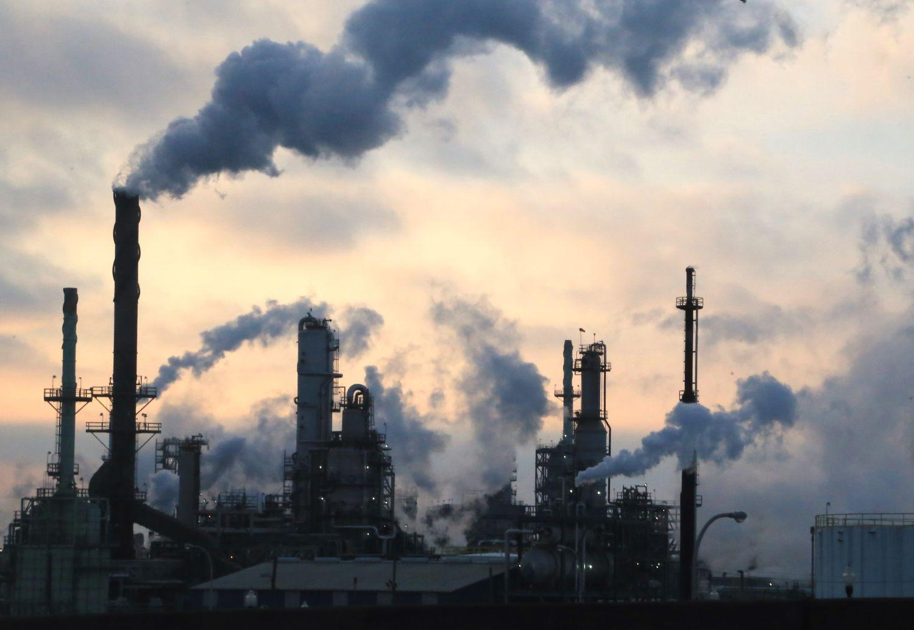

## Table of Contents

## What is pollution control and why is it important?

Pollution control is the way we try to stop or reduce pollution. Pollution is when harmful things get into the air, water, or land. We use different methods and rules to make sure these harmful things don't hurt people, animals, or the environment. This can include using special equipment to clean the air or water, making laws about what factories can do, and teaching people how to live in a way that makes less pollution.

It's important because pollution can make people and animals sick. It can also harm plants and make it hard for them to grow. If we don't control pollution, it can change the weather and make the Earth a harder place to live. By controlling pollution, we help keep the air clean to breathe, the water safe to drink, and the land healthy for plants and animals. This makes our world a better place for everyone.

## How does waste reduction contribute to environmental sustainability?

Waste reduction helps keep our environment healthy by cutting down on the amount of trash we produce. When we make less waste, we don't need as many landfills, which are big holes in the ground where trash goes. Landfills can hurt the environment because they can leak harmful chemicals into the soil and water. By reducing waste, we also use fewer resources, like trees for paper or oil for plastic. This means we save these resources for the future and help protect nature.

Another way waste reduction helps is by lowering pollution. When waste breaks down in landfills, it can release gases that are bad for the air we breathe. These gases can make the air dirty and contribute to climate change. By reducing waste, we make less of these harmful gases. Also, when we recycle and reuse things instead of throwing them away, we save energy that would be used to make new products. This all adds up to a cleaner, healthier planet for everyone.

## What are the basic types of pollution and waste that investments can target?

Investments can target different kinds of pollution and waste to help the environment. Air pollution is one big problem that investments can help with. This is when dirty gases and particles get into the air from things like cars, factories, and burning trash. Water pollution is another type, where harmful stuff gets into rivers, lakes, and oceans. This can come from factories, farms, and even our homes when we use too many chemicals. Soil pollution happens when the ground gets filled with harmful chemicals and waste, making it hard for plants to grow and safe for animals to live.

Waste is another area where investments can make a big difference. There's solid waste, which is the stuff we throw away every day, like plastic bags, food scraps, and old clothes. This waste can fill up landfills and hurt the environment if it's not managed well. Hazardous waste is even more dangerous because it can be poisonous or catch fire easily. This comes from things like batteries, old paint, and chemicals from factories. By investing in ways to reduce, recycle, and safely get rid of these types of waste, we can help keep our planet clean and healthy.

## What are the initial steps a company should take to invest in pollution control?

When a company wants to start investing in pollution control, the first thing they should do is figure out what kind of pollution they are causing. This means looking at their operations to see if they are putting harmful things into the air, water, or soil. They might need to do some tests or hire experts to help them understand their impact on the environment. Once they know where the pollution is coming from, they can start thinking about how to fix it.

The next step is to make a plan. This plan should include what they want to achieve, like reducing air pollution by a certain amount or cleaning up a nearby river. They should also decide how much money they are willing to spend and what kind of technology or methods they will use. It's important to set clear goals and timelines so they can track their progress. By taking these initial steps, a company can start making a positive difference in the environment.

## How can small businesses start implementing waste reduction strategies?

Small businesses can start implementing waste reduction strategies by first looking at what kind of waste they produce every day. They should check their trash bins and see what they throw away the most. It could be paper, plastic, food scraps, or other things. Once they know what they're dealing with, they can start thinking about ways to reduce it. For example, they might switch to using reusable containers instead of disposable ones, or they could start a recycling program to handle paper and plastic waste better.

Another good step is to talk to their employees about waste reduction. They can teach them how to be more careful with resources and encourage them to come up with ideas on how to cut down on waste. Small changes, like printing on both sides of the paper or using less packaging, can make a big difference. By working together, the whole team can help the business become more sustainable and save money in the long run.

## What are the financial benefits of investing in pollution control and waste reduction?

Investing in pollution control and waste reduction can save businesses a lot of money. When companies use less energy and resources, they don't have to spend as much on things like electricity, water, and raw materials. For example, if a business starts recycling paper, they'll need to buy less new paper. This can add up to big savings over time. Also, by reducing waste, companies can avoid paying fees for getting rid of trash, which can be expensive, especially for hazardous waste.

Another financial benefit is that businesses that care about the environment can attract more customers. Many people want to buy from companies that are trying to help the planet. This can lead to more sales and a better reputation. Plus, some governments offer tax breaks or other incentives to businesses that invest in pollution control and waste reduction. These financial perks can make it easier for companies to afford the initial costs and see a good return on their investment.

## What technologies are currently available for pollution control and how effective are they?

There are many technologies that help control pollution. One popular way to clean the air is using scrubbers. Scrubbers are like big filters that catch harmful stuff from factory smoke before it goes into the air. Another technology is catalytic converters, which are found in cars. They help turn bad gases from the engine into less harmful ones. For water pollution, there are treatment plants that use chemicals and filters to clean dirty water. These technologies are pretty good at reducing pollution, but they can be expensive to set up and maintain.

Other technologies focus on waste. Incinerators burn trash at very high temperatures to get rid of it and make energy. This can be good, but it needs to be done carefully to avoid creating more air pollution. Recycling machines help turn old materials into new ones, which cuts down on waste. Composting is another way to deal with waste, especially food scraps. It turns them into good soil for plants. These technologies are effective at managing waste, but they work best when people and businesses also try to make less waste in the first place.

## How can advanced waste management systems be integrated into existing business operations?

To integrate advanced waste management systems into existing business operations, a company should start by looking at their current waste handling methods. They need to figure out what kind of waste they produce and how much. Once they know this, they can choose the right technologies to help manage it better. For example, if they have a lot of food waste, they might set up a composting system. If they use a lot of paper and plastic, they could install recycling machines. It's important to train employees on how to use these new systems so everyone knows what to do with different kinds of waste.

After setting up the new systems, the business needs to keep an eye on how well they are working. They can do this by tracking how much waste they produce and how much they recycle or compost. If the new systems are doing a good job, they should see less waste going to landfills. The business can also look for ways to make even more improvements, like finding new ways to reduce waste at the source. By regularly checking and updating their waste management practices, the company can keep making their operations more sustainable and save money in the long run.

## What are the regulatory requirements and incentives for companies investing in pollution control?

Companies that want to invest in pollution control need to follow certain rules set by the government. These rules can vary depending on where the company is located and what kind of pollution they are dealing with. For example, there might be laws about how much pollution a factory can release into the air or water. Companies need to make sure they are following these rules or they could get in trouble and have to pay fines. It's a good idea for businesses to talk to environmental experts or lawyers to make sure they understand all the rules they need to follow.

There are also incentives for companies that invest in pollution control. Governments sometimes offer tax breaks or grants to businesses that are trying to reduce their pollution. This can help companies afford the cost of new technology or equipment. For example, a business might get money back for installing a new water treatment system. These incentives are meant to encourage companies to take action and help the environment. By taking advantage of these incentives, businesses can save money while also doing something good for the planet.

## How do you measure the success and ROI of pollution control and waste reduction initiatives?

To measure the success of pollution control and waste reduction initiatives, companies look at how much less pollution they are causing and how much less waste they are producing. They can do this by tracking numbers before and after they start their new programs. For example, they might measure the amount of harmful gases released into the air or the amount of trash sent to landfills. If these numbers go down, it means the initiatives are working. Companies also check if they are using fewer resources, like water and energy, because this can show that they are being more efficient and sustainable.

The return on investment (ROI) for these initiatives can be figured out by comparing the money spent on them to the money saved or earned. Businesses can save money by using less energy, water, and raw materials, and by paying less for waste disposal. They might also earn more money if customers like their efforts to help the environment and buy more from them. Sometimes, governments give tax breaks or grants to companies that reduce pollution, which can help with the costs. By looking at all these things, a company can see if their investment in pollution control and waste reduction is paying off.

## What are the latest trends and innovations in pollution control and waste reduction?

One of the latest trends in pollution control is the use of smart technology. This includes sensors that can detect pollution in the air and water in real time. These sensors send data to computers that can then tell us where pollution is coming from and how bad it is. This helps companies and governments take quick action to stop pollution before it gets worse. Another innovation is the development of better filters and scrubbers. These new technologies can catch more harmful stuff from factory smoke and car exhausts, making the air cleaner for everyone to breathe.

In waste reduction, a big trend is the move towards a circular economy. This means we try to use things over and over instead of throwing them away. For example, companies are finding new ways to recycle plastics into new products, which helps cut down on waste. Another innovation is the use of biodegradable materials. These are things that break down naturally over time, like compostable packaging. This helps reduce the amount of trash that ends up in landfills. By using these new ideas, we can help make the world a cleaner and healthier place.

## How can companies develop a long-term strategy for continuous improvement in pollution control and waste reduction?

To develop a long-term strategy for continuous improvement in pollution control and waste reduction, companies need to start by setting clear goals. They should decide what they want to achieve, like reducing air pollution by a certain amount or cutting down on the waste they send to landfills. It's important to make these goals specific and measurable so they can track their progress over time. Companies should also involve their employees in this process, asking for their ideas and feedback. By working together, everyone can help find new ways to reduce pollution and waste. Regularly reviewing these goals and making adjustments as needed will keep the company moving in the right direction.

Another key part of a long-term strategy is staying up-to-date with new technologies and trends. Companies should keep an eye on what's happening in the world of pollution control and waste reduction, like new types of filters or recycling methods. They can also learn from other businesses that are doing well in these areas. By adopting new technologies and ideas, companies can keep improving their efforts. It's also important to keep looking for ways to save money while helping the environment. For example, using less energy or getting tax breaks for pollution control can make these efforts more affordable. By staying committed and always looking for ways to do better, companies can make a big difference in the long run.

## References & Further Reading

[1]: World Bank. ["Green Bonds - Making a Difference."](https://treasury.worldbank.org/en/about/unit/treasury/ibrd/ibrd-green-bonds) The World Bank.

[2]: Morgan Stanley. (2019). ["Sustainable Reality: Analyzing Risk and Return of Sustainable Funds."](https://www.morganstanley.com/content/dam/msdotcom/ideas/sustainable-investing-offers-financial-performance-lowered-risk/Sustainable_Reality_Analyzing_Risk_and_Returns_of_Sustainable_Funds.pdf)

[3]: Bergstra, J., Bardenet, R., Bengio, Y., & Kégl, B. (2011). ["Algorithms for Hyper-Parameter Optimization."](https://dl.acm.org/doi/10.5555/2986459.2986743) Advances in Neural Information Processing Systems 24.

[4]: Lopez de Prado, M. (2018). ["Advances in Financial Machine Learning."](https://www.amazon.com/Advances-Financial-Machine-Learning-Marcos/dp/1119482089)

[5]: Aronson, D. R. (2006). ["Evidence-Based Technical Analysis: Applying the Scientific Method and Statistical Inference to Trading Signals."](https://onlinelibrary.wiley.com/doi/book/10.1002/9781118268315)

[6]: Jansen, S. (2020). ["Machine Learning for Algorithmic Trading."](https://github.com/stefan-jansen/machine-learning-for-trading)

[7]: Chan, E. P. (2009). ["Quantitative Trading: How to Build Your Own Algorithmic Trading Business."](https://github.com/ftvision/quant_trading_echan_book)