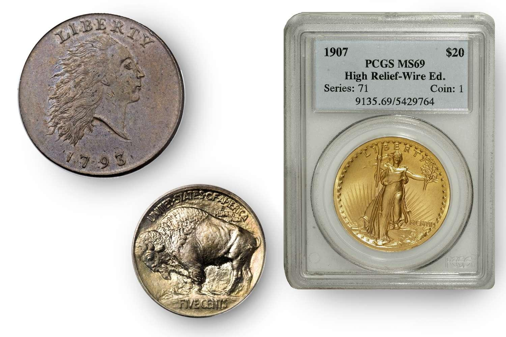

The world of rare coin investment is a captivating convergence of history, artistry, and finance. Rare coins, classified under the study of numismatics, represent a distinctive asset class that entices enthusiasts with both aesthetic beauty and financial potential. These coins are often valued for their historical significance, rarity, and unique characteristics, making them sought-after collectibles for both historians and investors.

Recently, the emergence of algorithmic trading within the investment landscape has introduced a novel aspect to coin trading, effectively merging traditional collecting practices with advanced technological methodologies. This incorporation has the potential to redefine how transactions are conducted in the coin market, offering improved liquidity and pricing efficiency.



This article seeks to investigate the prospects of rare coins as sound investments, the integral role of numismatics, and the prospective influence of algorithmic trading on the coin market. By examining these components, we aim to provide a comprehensive understanding of how the rarity and historical value of coins can be leveraged within the context of modern investment strategies.

## Table of Contents

## Understanding Rare Coins and Numismatics

Numismatics, the study or collection of currency, encapsulates the rich history and cultural significance of coins, tokens, paper money, and other related objects. This field not only preserves a tangible narrative of human civilization but also attracts diverse individuals with interests in history, art, and finance. Among these numismatic objects, rare coins hold a special place due to their historical significance, limited mintage, and unique features.

Rare coins offer a window into the past, each telling a story of its time. Their value often extends beyond mere monetary worth, rooted in their historical context and the craftsmanship involved in their creation. For instance, coins minted during significant historical events or those featuring notable figures can serve as valuable educational resources and cherished collectibles. Additionally, limited mintage adds to their rarity, making these coins desirable to collectors and investors seeking to own something distinctive.

The American Numismatic Association (ANA) is a prominent organization dedicated to providing resources and support for individuals interested in coin collecting and investment. The ANA offers educational programs, conventions, and publications that cater to both novice and experienced numismatists. Through its vast array of resources, the ANA fosters a deeper understanding of numismatics and promotes ethical practices within the community.

For collectors and investors in rare coins, quality and authenticity are paramount. The condition of a coin, often referred to as its grade, plays a crucial role in determining its value. Professional grading services such as the Professional Coin Grading Service (PCGS) and the Numismatic Guaranty Corporation (NGC) are widely recognized for their expertise in this area. These services meticulously evaluate coins, assigning grades based on factors such as wear, strike quality, and aesthetic appeal. A coin's grade provides a reliable indicator of its condition and can significantly influence its market value.

Authenticity is another critical [factor](/wiki/factor-investing) in numismatics. Counterfeit coins can pose significant risks to collectors and investors. To mitigate these risks, PCGS and NGC employ advanced techniques and technologies to certify the authenticity of the coins they grade. This certification assures buyers of the coin's legitimacy, fostering trust in transactions and enhancing market stability.

In summary, numismatics is a multifaceted field that encompasses the study and collection of currency, with rare coins standing as valuable historical artifacts. The American Numismatic Association supports collectors and investors through resources and education, while professional grading services like PCGS and NGC ensure the quality and authenticity of these treasured items. As numismatics continues to evolve, the appreciation for rare coins as both cultural artifacts and investment opportunities is likely to grow.

## Investing in Rare Coins: Benefits and Risks

Investing in rare coins offers an appealing option for diversification in an investment portfolio frequently dominated by conventional financial instruments such as stocks and bonds. Rare coins, under the broader category of collectibles, have historically demonstrated significant potential for value appreciation. In some instances, select coins have witnessed value increases exceeding 1,000% over several decades. This remarkable appreciation is often driven by factors such as historical significance, scarcity, and the unique artistry of these coins.

Despite the potentially lucrative gains, rare coin investment is accompanied by several risks that investors should consider. Market [volatility](/wiki/volatility-trading-strategies) can impact coin values, influenced by factors including economic conditions, changes in collector demand, and fluctuations in precious metals prices. Moreover, the rare coin market is susceptible to the threat of counterfeit coins, necessitating caution and due diligence from investors. Counterfeiting can severely affect the perceived value of a collection.

Assessing the true value of rare coins remains a crucial challenge for investors. Unlike traditional financial assets with more transparent pricing, the valuation of rare coins can be subjective, influenced by the coin's condition, rarity, and historical importance. Therefore, conducting thorough research is imperative. This may include understanding market trends, historical sales data, and being aware of counterfeit detection. Consulting experienced numismatists or professionals who can provide expert opinions on coin condition and market value is invaluable. They can offer insights that enhance an investor's ability to make informed decisions.

In summary, while rare coins present both a fascinating and potentially profitable investment opportunity, they require careful consideration of the attendant risks. A balanced approach, combining passion for collecting with meticulous research and expert advice, can help navigate this complex market effectively.

## Algorithmic Trading in Coin Investment

Algorithmic trading, or algo trading, refers to the use of computer algorithms to execute trades in financial markets at speeds and frequencies beyond human capability. In traditional financial markets, this technique is employed to enhance trading efficiency, increase market [liquidity](/wiki/liquidity-risk-premium), and optimize price discovery. While algo trading is predominantly utilized in stock, [forex](/wiki/forex-system), and commodity markets, its application in the realm of rare coin investment is an emerging concept with promising potential.

Incorporating algo trading into the rare-coin market involves leveraging sophisticated algorithms to analyze vast amounts of data, identify market trends, and execute trades with precision. Such integration could lead to increased liquidity, as the algorithms enable more frequent and consistent trades. This, in turn, enhances the efficiency of price discovery, allowing for a more accurate assessment of a coin's market value. By reducing the bid-ask spread, [algorithmic trading](/wiki/algorithmic-trading) could also facilitate smoother transactions between buyers and sellers.

Currently, the application of algo trading to the rare-coin market is limited, primarily due to the market's niche nature and the relatively lower trading volumes compared to more conventional financial assets. However, the future holds potential for significant advancements. As technology continues to evolve and the availability of historical pricing data concerning rare coins improves, algorithmic models can be developed to analyze this data efficiently. By recognizing patterns and correlations that escape human detection, these models can identify lucrative investment opportunities.

For instance, [machine learning](/wiki/machine-learning) algorithms can be employed to predict price movements based on historical trends and market behavior. Through the use of time series analysis and pattern recognition, such algorithms can evaluate factors influencing coin values, like collector demand, economic indicators, and historical significance. Here is a simplified example using Python and machine learning for analyzing historical pricing data:

```python
import pandas as pd
from sklearn.ensemble import RandomForestRegressor
from sklearn.model_selection import train_test_split
from sklearn.metrics import mean_squared_error

# Load historical pricing data
data = pd.read_csv('coin_pricing_data.csv')

# Prepare features and target
X = data.drop('price', axis=1)
y = data['price']

# Split data for training and testing
X_train, X_test, y_train, y_test = train_test_split(X, y, test_size=0.2, random_state=42)

# Initialize and train the model
model = RandomForestRegressor(n_estimators=100, random_state=42)
model.fit(X_train, y_train)

# Make predictions and evaluate
predictions = model.predict(X_test)
mse = mean_squared_error(y_test, predictions)

print(f"Mean Squared Error: {mse}")
```

This code snippet illustrates how a Random Forest Regressor could be utilized to predict coin prices based on historical data features. By refining such algorithms and incorporating more diverse datasets, investors could harness the power of algo trading to make informed decisions in the rare-coin market, ultimately balancing the traditional art of numismatics with cutting-edge technology.

## Building a Robust Coin Portfolio

A well-balanced coin portfolio is an essential strategy for those interested in maximizing the potential benefits of rare coin investments. A diversified portfolio not only reduces exposure to the inherent risks of market volatility but also increases the opportunity for long-term appreciation. One of the key components of a robust coin collection includes a mix of U.S. coins, which are highly prized due to their historical significance and steady demand among collectors and investors globally. These may include iconic pieces such as the Morgan Silver Dollar or the Saint-Gaudens Double Eagle.

Investors should also consider precious metal coins as a crucial element of their portfolio. These coins, such as gold sovereigns or silver eagles, offer intrinsic value due to their metal content in addition to numismatic value. They provide a hedge against inflation and economic downturns, appealing to conservative investors seeking stability.

Furthermore, internationally recognized coins add a global dimension, enabling diversification across different markets. Popular international coins like the Canadian Maple Leaf or the Australian Kangaroo provide opportunities to tap into the numismatics of other cultures and economies. This international aspect not only spreads risk but also capitalizes on numismatic enthusiasm beyond national borders.

Despite these benefits, it is important to approach rare coin investment with a strategy focused on the long term. Coin flipping—buying and selling coins in short-term spans for quick profits—often falls prey to market fluctuations and speculative bubbles, leading to potential financial losses. Instead, the enduring value of rare coins often lies in holding them over extended periods, allowing their numismatic and cultural value to appreciate alongside market demand.

Investors should exercise patience and diligence by conducting thorough research and seeking guidance from experienced numismatists. This measured approach helps navigate the complexities of the rare coin market and build a portfolio that not only aligns with personal financial goals but also fosters a deeper appreciation of the historical and cultural significance embedded in each coin.

## The Role of Coin Grading and Certification

Coin grading services are essential for accurately assessing the value and authenticity of rare coins, playing a significant role in the numismatic market. These services establish a standardized process for evaluating coin quality, ensuring that collectors and investors receive reliable information about their purchases. Coin grading involves examining a coin’s condition, including its luster, surface preservation, strike, and overall eye appeal, and assigning it a grade based on predetermined criteria. Grades generally range from Poor (P-1) to Mint State (MS-70) in the Sheldon Coin Grading Scale, which provides a consistent framework for valuation.

Top-tier grading services, such as the Professional Coin Grading Service (PCGS) and the Numismatic Guaranty Corporation (NGC), have set industry standards for reliability and trust. PCGS and NGC employ experts who use rigorous methods to evaluate coins, and their assessments are widely accepted in the market. These organizations encapsulate graded coins in tamper-evident holders, known as slabs, which feature a label indicating the coin's grade and additional identifying information. This encapsulation process is crucial as it helps maintain the coin’s condition and ensures the integrity of the grading result.

Certification by reputable services provides several key benefits to collectors and investors. Firstly, graded and certified coins have a more transparent and identifiable market value. With an established grade, buyers and sellers can confidently negotiate based on the true condition of the coin, reducing ambiguities associated with subjective assessments. Secondly, certification offers a significant layer of security against counterfeiting, a persistent issue in the coin market. Grading services authenticate coins, which helps in identifying and excluding counterfeit or altered specimens. This authentication protects both buyers and long-term market confidence.

In summary, grading and certification by recognized organizations such as PCGS and NGC ensure the accuracy and security of coin transactions. Their standardized processes are instrumental in maintaining an effective marketplace, offering assurance to both experienced and novice coin investors.

## Common Mistakes to Avoid in Coin Investment

Investing in rare coins can be a rewarding endeavor, yet it is not without potential pitfalls. One of the most common errors is making impulse purchases driven by the temporary popularity of "hot" coins. Such impulsive buying decisions can lead to poor investment choices if not backed by thorough research and an understanding of the coin's historical and cultural significance.

Neglecting market research is another significant mistake. Without adequate analysis, investors may overpay for coins that are currently overvalued and thus prone to depreciation. Conducting comprehensive market research involves evaluating the historical price trends of coins, assessing overall market demand, and identifying coins with genuine long-term value. This necessitates a systematic approach to data collection and analysis.

In Python, for instance, investors can use libraries such as `pandas` and `matplotlib` to analyze historical pricing data:

```python
import pandas as pd
import matplotlib.pyplot as plt

# Load historical price data
data = pd.read_csv('coin_prices.csv')

# Plotting the trend
plt.figure(figsize=(10, 5))
plt.plot(data['Date'], data['Price'])
plt.title('Historical Coin Price Trend')
plt.xlabel('Date')
plt.ylabel('Price')
plt.show()
```

Avoiding price bubbles is crucial. A price bubble occurs when market prices become significantly inflated beyond the coin's true value due to excessive speculation. Investors should focus on coins that retain intrinsic value through historical or cultural importance, rather than those riding the wave of temporary market hype. This conservative strategy helps safeguard investments against market volatility, ensuring that the coins held in a portfolio have enduring significance beyond mere market trends.

By prioritizing comprehensive research and historical value over impulsive buying, investors can mitigate risks and make informed decisions in the numismatic market.

## Conclusion

Rare coin investment combines the excitement of historical exploration with the potential for significant monetary returns. The market for rare coins, while steeped in tradition and history, is being slowly reshaped by technological advancements like algorithmic trading, which holds promise for enhancing market efficiency, liquidity, and data-driven decision-making. However, the core of successful coin investment still hinges on a deep understanding of numismatics, meticulous research, and prudent judgment.

Prospective investors are encouraged to approach rare coin investment with a balance of passion and practicality. Passion fuels the pursuit of the most intriguing and historically rich pieces, while practicality ensures one conducts thorough research and seeks advice from seasoned numismatists. The guidance from experienced professionals is indispensable, offering insights into evaluating coin authenticity, historical significance, and market trends.

In a dynamic investment landscape increasingly influenced by technology, rare coins provide a rare opportunity to engage with tangible assets that connect us with our past while offering future financial benefits. Aspiring investors should recognize the value of patience in this field, appreciating that the true worth of rare coins often unfolds over time. Embracing comprehensive strategies combining traditional knowledge with the potential of modern technologies can pave the way for successful endeavours in rare coin investment.

## References & Further Reading

[1]: Yeoman, R. S. (2022). ["A Guide Book of United States Coins 2023"](https://www.barnesandnoble.com/w/a-guide-book-of-united-states-coins-2022-rs-yeoman/1139455067). Whitman Publishing.

[2]: Kolb, R. W., & Overdahl, J. A. (2007). ["Futures, Options, and Swaps"](https://www.blackwellpublishing.com/KOLB/). Blackwell Publishing.

[3]: Lopez de Prado, M. (2018). ["Advances in Financial Machine Learning"](https://www.amazon.com/Advances-Financial-Machine-Learning-Marcos/dp/1119482089). Wiley.

[4]: Mackay, C. (1841). ["Extraordinary Popular Delusions and the Madness of Crowds"](https://en.wikipedia.org/wiki/Extraordinary_Popular_Delusions_and_the_Madness_of_Crowds). Richard Bentley.

[5]: Aronson, D. R. (2006). ["Evidence-Based Technical Analysis: Applying the Scientific Method and Statistical Inference to Trading Signals"](https://www.amazon.com/Evidence-Based-Technical-Analysis-Scientific-Statistical/dp/0470008741). Wiley.

[6]: Jansen, S. (2020). ["Machine Learning for Algorithmic Trading"](https://github.com/stefan-jansen/machine-learning-for-trading). Packt Publishing.

[7]: Chan, E. (2008). ["Quantitative Trading: How to Build Your Own Algorithmic Trading Business"](https://github.com/ftvision/quant_trading_echan_book). Wiley.

[8]: Bowers, Q. D. (2022). ["The Expert's Guide to Collecting & Investing in Rare Coins"](https://archive.org/details/expertsguidetoco0000bowe). Whitman Publishing.